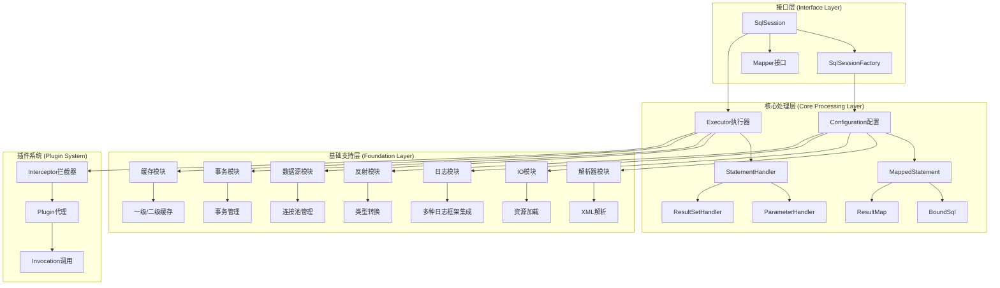
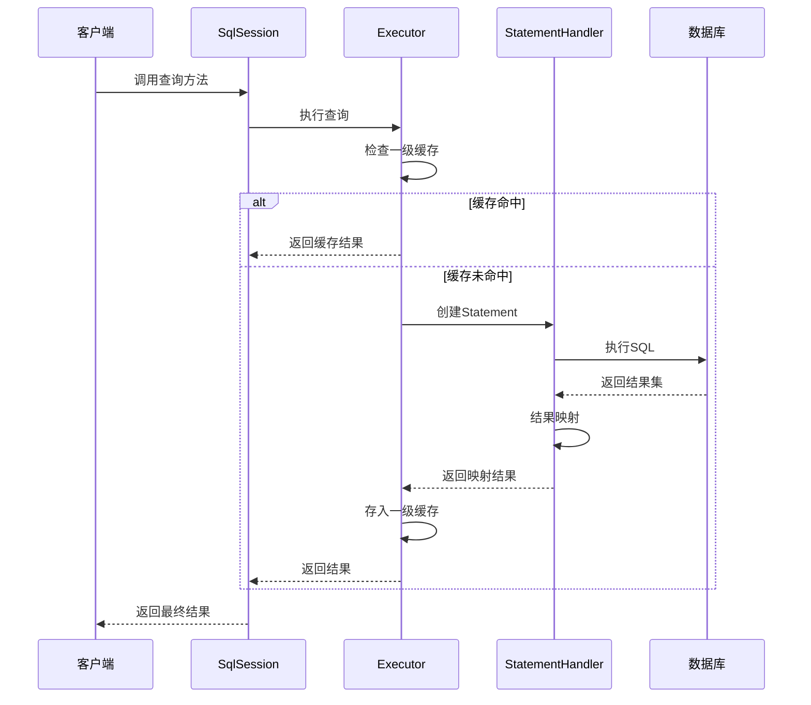
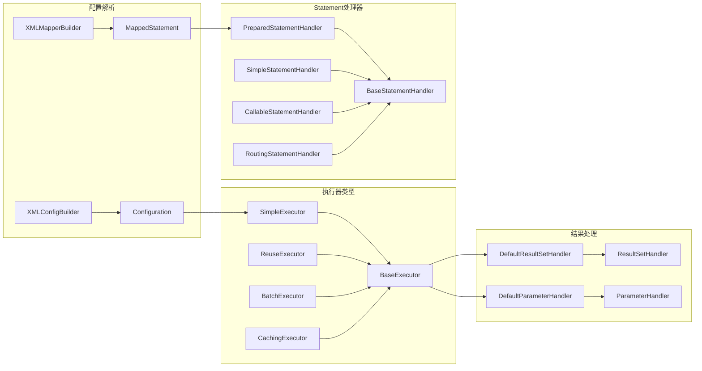
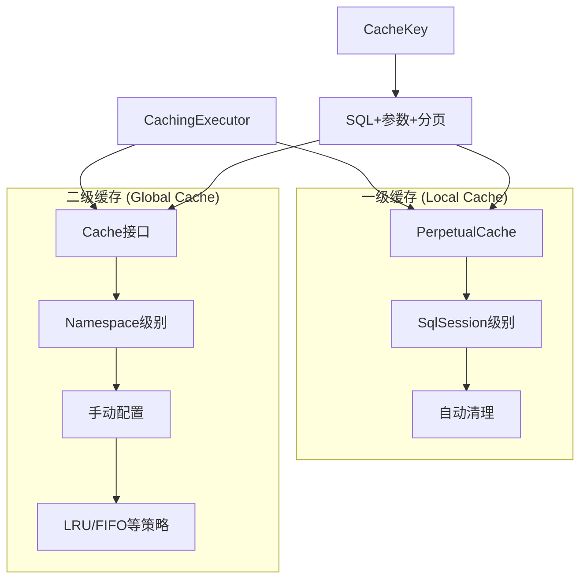
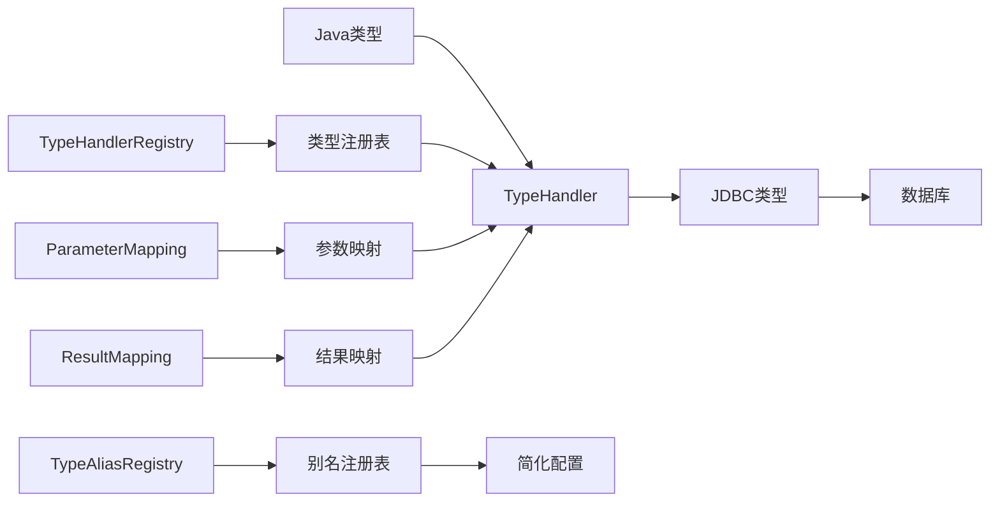

# MyBatis-3 架构图

## 整体架构分层



## SQL执行流程



## 核心组件关系



## 插件系统工作原理

```mermaid
graph TD
    A[Interceptor接口] --> B[plugin方法]
    B --> C[Plugin.wrap]
    C --> D[动态代理]
    D --> E[InvocationHandler]
    E --> F[intercept方法]
    F --> G[invocation.proceed]
    G --> H[原始方法执行]
    
    I[@Intercepts注解] --> J[Signature签名]
    J --> K[指定拦截目标]
    K --> A
    
    L[InterceptorChain] --> M[pluginAll方法]
    M --> N[遍历所有拦截器]
    N --> B
```

## 缓存机制



## 类型转换系统



