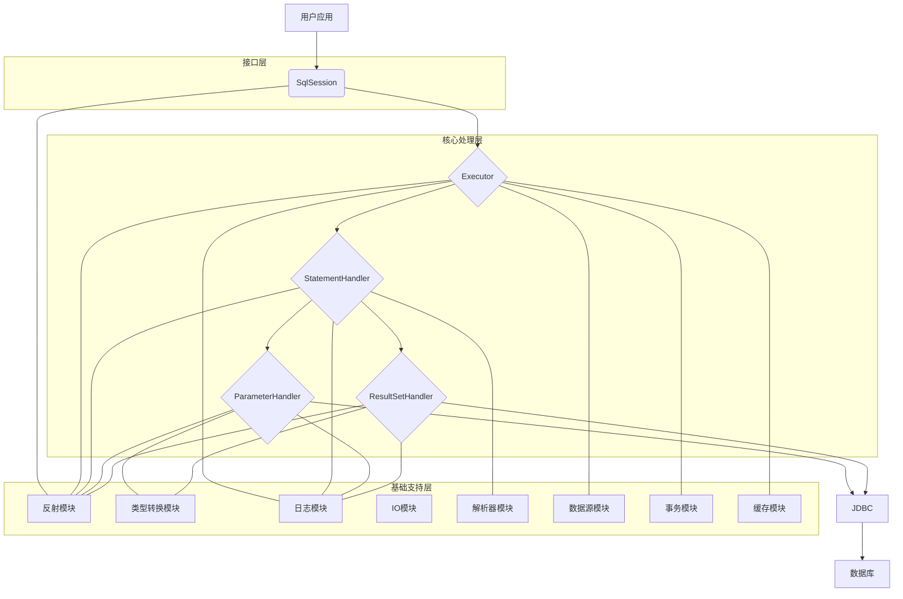

# 第1篇实践任务指导

## 🎯 实践任务说明

在第1篇文章中，有两个重要的实践任务需要你亲自完成：

1. **绘制架构图**（第5.2节）
2. **分析组件职责**（第5.3节）

这些实践任务的目的：

- 加深对 MyBatis 架构的理解
- 培养架构思维和绘图能力
- 为后续源码学习奠定基础
- 检验学习效果

## 📊 任务1：绘制 MyBatis 整体架构图

### 任务要求

根据文章内容，绘制 MyBatis 的整体架构图，包括：

1. **三层架构的划分**
2. **核心组件的位置**
3. **组件间的依赖关系**
4. **数据流转的方向**

### 绘制指导

#### 1. 三层架构划分

```
┌─────────────────────────────────────────┐
│              接口层 (Interface Layer)    │
│  SqlSession, SqlSessionFactory, Mapper  │
└─────────────────────────────────────────┘
                    ↓
┌─────────────────────────────────────────┐
│           核心处理层 (Core Layer)        │
│  Executor, StatementHandler, Parameter  │
│  Handler, ResultSetHandler              │
└─────────────────────────────────────────┘
                    ↓
┌─────────────────────────────────────────┐
│          基础支持层 (Foundation Layer)   │
│  反射, 类型转换, 日志, IO, 解析器, 数据源 │
│  事务, 缓存等模块                       │
└─────────────────────────────────────────┘
```

#### 2. 核心组件位置

- **接口层**：SqlSession、SqlSessionFactory、Mapper接口
- **核心处理层**：Executor、StatementHandler、ParameterHandler、ResultSetHandler
- **基础支持层**：Configuration、各种Registry、工具类

#### 3. 组件依赖关系

- SqlSession → Executor
- Executor → StatementHandler
- StatementHandler → ParameterHandler + ResultSetHandler
- 所有组件 → Configuration

#### 4. 数据流转方向

```
用户请求 → SqlSession → Executor → StatementHandler → JDBC → 数据库
         ↑                                                    ↓
         ← ResultSetHandler ← StatementHandler ← Executor ← 结果集
```

### 绘制工具推荐

1. **在线工具**：

   - Draw.io (https://app.diagrams.net/)
   - ProcessOn (https://www.processon.com/)
   - Lucidchart
2. **本地工具**：

   - Visio
   - XMind
   - 手绘（拍照上传）
3. **代码工具**：

   - Mermaid（可以在Markdown中使用）

### 绘制步骤

1. **确定整体布局**：三层架构的垂直布局
2. **添加核心组件**：在每层中添加主要组件
3. **绘制依赖关系**：用箭头表示组件间的依赖
4. **标注数据流**：标明数据流转的方向
5. **美化图表**：使用颜色、图标等美化图表

### 参考模板

我已经为你创建了一个参考模板，你可以基于此进行修改：



## 🔍 任务2：分析组件职责

### 任务要求

分析以下组件的职责：

1. **SqlSession**：会话管理
2. **Executor**：SQL 执行
3. **StatementHandler**：语句处理
4. **Configuration**：配置管理

### 分析指导

#### 1. SqlSession 职责分析

**主要职责**：

- 提供 CRUD 操作接口
- 管理事务（commit、rollback）
- 获取 Mapper 接口
- 管理会话生命周期

**具体方法**：

- `selectOne()`, `selectList()` - 查询操作
- `insert()`, `update()`, `delete()` - 修改操作
- `commit()`, `rollback()` - 事务管理
- `getMapper()` - 获取 Mapper 接口
- `close()` - 关闭会话

**设计思想**：

- 作为 MyBatis 的主要入口
- 封装了复杂的数据库操作
- 提供简洁的 API 接口

#### 2. Executor 职责分析

**主要职责**：

- 执行 SQL 语句
- 管理一级缓存
- 处理事务
- 管理 Statement 生命周期

**具体方法**：

- `query()` - 执行查询
- `update()` - 执行更新
- `commit()`, `rollback()` - 事务管理
- `createCacheKey()` - 创建缓存键
- `isCached()` - 检查缓存

**设计思想**：

- 作为 SQL 执行的核心
- 支持不同的执行策略
- 提供缓存管理功能

#### 3. StatementHandler 职责分析

**主要职责**：

- 处理 SQL 语句
- 参数绑定
- 结果集处理
- Statement 管理

**具体方法**：

- `prepare()` - 准备 Statement
- `parameterize()` - 参数绑定
- `query()` - 执行查询
- `update()` - 执行更新
- `getBoundSql()` - 获取绑定 SQL

**设计思想**：

- 封装 JDBC Statement 操作
- 支持不同类型的 Statement
- 提供参数和结果处理

#### 4. Configuration 职责分析

**主要职责**：

- 存储所有配置信息
- 管理 MappedStatement
- 管理类型处理器
- 提供配置访问接口

**具体方法**：

- `addMappedStatement()` - 添加映射语句
- `getMappedStatement()` - 获取映射语句
- `addMapper()` - 添加 Mapper
- `getMapper()` - 获取 Mapper
- `validate()` - 验证配置

**设计思想**：

- 作为配置中心
- 统一管理所有配置
- 提供配置验证功能

### 分析模板

你可以使用以下模板来分析组件职责：

```markdown
## 组件职责分析

### 1. SqlSession 职责分析

**主要职责**：
- [你的分析]

**核心方法**：
- [方法1]：[作用]
- [方法2]：[作用]

**设计思想**：
- [你的理解]

**与其他组件的关系**：
- [关系描述]

### 2. Executor 职责分析

[按照相同格式分析]

### 3. StatementHandler 职责分析

[按照相同格式分析]

### 4. Configuration 职责分析

[按照相同格式分析]
```

## 📝 实践任务提交

### 提交内容

1. **架构图**：

   - 图片文件（PNG、JPG等）
   - 或者 Mermaid 代码
   - 或者在线链接
2. **组件职责分析**：

   - Markdown 文档
   - 包含详细的分析内容

### 提交方式

1. **创建文件**：在专栏目录下创建实践任务文件
2. **命名规范**：
   - 架构图：`第1篇-MyBatis架构图-我的绘制.md`
   - 组件分析：`第1篇-组件职责分析-我的分析.md`

### 评价标准

#### 架构图评价标准

- **完整性**（40%）：是否包含所有核心组件
- **准确性**（30%）：组件关系是否正确
- **清晰性**（20%）：图表是否清晰易懂
- **美观性**（10%）：图表是否美观

#### 组件分析评价标准

- **深度**（40%）：分析是否深入
- **准确性**（30%）：理解是否正确
- **完整性**（20%）：是否覆盖所有要点
- **逻辑性**（10%）：分析是否逻辑清晰

## 🎯 实践建议

### 1. 绘制架构图建议

1. **先理解再绘制**：确保理解架构后再开始绘制
2. **参考现有资源**：可以参考我提供的模板
3. **多次迭代**：不断完善和优化图表
4. **注重细节**：注意组件间的依赖关系

### 2. 组件分析建议

1. **深入源码**：查看相关类的源码
2. **理解设计思想**：思考为什么这样设计
3. **联系实际**：结合使用经验分析
4. **对比学习**：与其他框架对比

### 3. 学习技巧

1. **先整体后局部**：先理解整体架构，再深入细节
2. **理论与实践结合**：结合代码实践理解
3. **多角度思考**：从不同角度分析组件
4. **持续改进**：不断完善理解

## 🚀 开始实践

现在你可以开始完成这两个实践任务了！

1. **绘制架构图**：使用你喜欢的工具绘制 MyBatis 架构图
2. **分析组件职责**：深入分析四个核心组件的职责

完成后，请将结果保存到专栏目录中，这样你就可以：

- 检验学习效果
- 为后续学习奠定基础
- 建立自己的知识体系

**加油！相信你一定能完成这些实践任务！** 🎉

