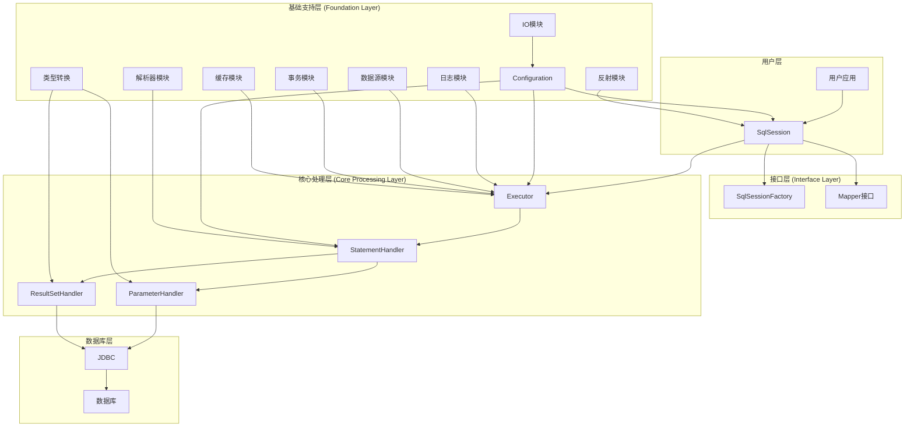
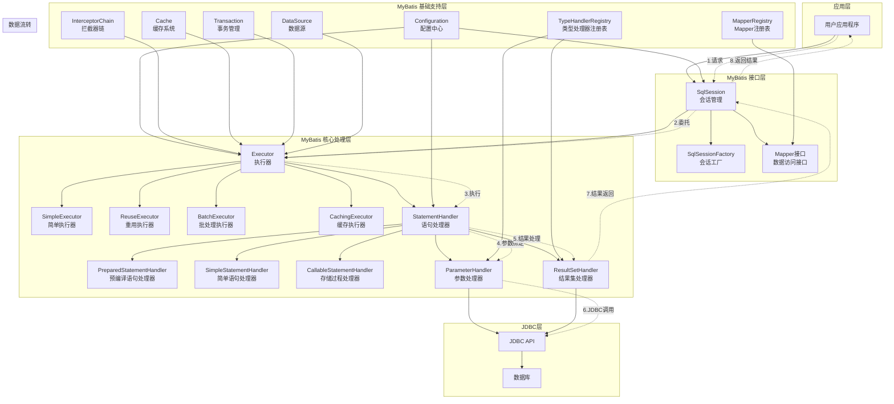

# 我的 MyBatis 架构图绘制

## 📊 任务说明

这是第1篇的实践任务：绘制 MyBatis 整体架构图

**要求**：
1. 三层架构的划分
2. 核心组件的位置
3. 组件间的依赖关系
4. 数据流转的方向

## 🎨 我的架构图

### 版本1：基础架构图



### 版本2：详细架构图



## 📝 架构图说明

### 1. 三层架构划分

**接口层 (Interface Layer)**：
- SqlSession：核心会话接口
- SqlSessionFactory：会话工厂
- Mapper接口：数据访问接口

**核心处理层 (Core Processing Layer)**：
- Executor：执行器体系
- StatementHandler：语句处理器
- ParameterHandler：参数处理器
- ResultSetHandler：结果集处理器

**基础支持层 (Foundation Layer)**：
- Configuration：配置中心
- 各种Registry：注册表管理
- 工具模块：反射、类型转换、日志等

### 2. 核心组件位置

- **接口层**：提供对外的API接口
- **核心处理层**：处理SQL执行的核心逻辑
- **基础支持层**：提供基础功能支持

### 3. 组件依赖关系

- SqlSession 依赖 Executor
- Executor 依赖 StatementHandler
- StatementHandler 依赖 ParameterHandler 和 ResultSetHandler
- 所有组件都依赖 Configuration

### 4. 数据流转方向

```
用户请求 → SqlSession → Executor → StatementHandler → JDBC → 数据库
         ↑                                                    ↓
         ← ResultSetHandler ← StatementHandler ← Executor ← 结果集
```

## 🔍 设计思考

### 1. 为什么采用三层架构？

1. **职责分离**：每层都有明确的职责
2. **松耦合**：层与层之间通过接口交互
3. **可扩展**：每层都可以独立扩展
4. **可维护**：问题定位和修复更容易

### 2. 核心组件的设计思想

1. **SqlSession**：作为主要入口，封装复杂操作
2. **Executor**：作为执行核心，支持不同策略
3. **StatementHandler**：封装JDBC操作，提供统一接口
4. **Configuration**：作为配置中心，统一管理配置

### 3. 数据流转的设计

1. **单向流动**：请求和响应都有明确的流向
2. **分层处理**：每层处理特定的逻辑
3. **接口隔离**：通过接口实现层间解耦

## 📊 架构图评价

### 优点

1. **结构清晰**：三层架构划分明确
2. **组件完整**：包含了所有核心组件
3. **关系明确**：组件间依赖关系清晰
4. **流程清楚**：数据流转方向明确

### 改进空间

1. **可以添加更多细节**：如具体的实现类
2. **可以标注更多信息**：如组件的生命周期
3. **可以优化布局**：使图表更加美观

## 🎯 学习收获

通过绘制这个架构图，我：

1. **深入理解了MyBatis的整体架构**
2. **掌握了三层架构的设计思想**
3. **理解了组件间的协作关系**
4. **培养了架构思维和绘图能力**

## 📝 后续计划

1. **继续深入学习**：基于架构图深入学习源码
2. **完善架构图**：根据学习进度不断完善
3. **实践应用**：将架构理解应用到实际项目中

---

**绘制时间**：[填写时间]  
**绘制工具**：[填写工具]  
**学习状态**：已完成 ✅

