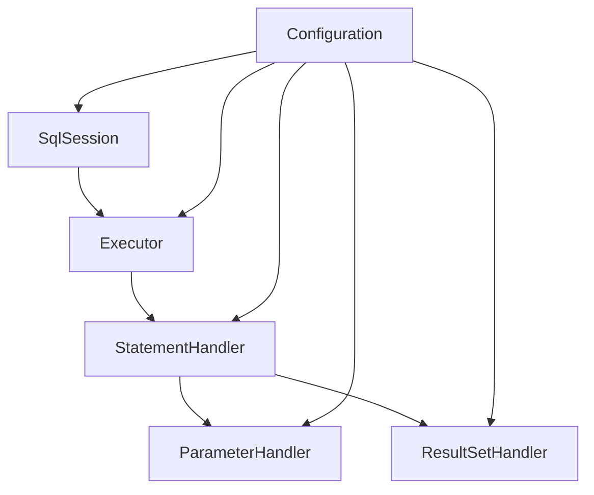

# 第1篇：MyBatis 整体架构设计

## 1. MyBatis 简介

### 什么是 MyBatis

MyBatis 是一个优秀的持久层框架，它支持自定义 SQL、存储过程以及高级映射。MyBatis 消除了几乎所有的 JDBC 代码和参数的手动设置以及结果集的检索。MyBatis 使用简单的 XML 或注解来配置和映射原生信息，将接口和 Java 的 POJOs（Plain Old Java Objects，普通的 Java 对象）映射成数据库中的记录。

**版本说明**：本系列文章基于 **MyBatis 3.x** 版本进行源码分析，所有架构设计和源码解读都基于此版本。

### 学习目标

通过本文的学习，我们将：
1. **理解 MyBatis 3.x 的整体架构设计**
2. **掌握核心组件的职责分工和协作关系**
3. **建立源码阅读的入口和路径**
4. **为后续深入源码分析奠定基础**

**重要提示**：本文是源码学习的起点，后续文章将基于此架构深入剖析关键类的源码实现。

### MyBatis 的设计理念

MyBatis 的设计理念可以概括为：

1. **简单易用**：提供简洁的 API，减少样板代码
2. **灵活可控**：支持自定义 SQL，不强制使用特定的查询语言
3. **性能优化**：提供缓存机制和连接池管理
4. **易于扩展**：提供插件系统，支持功能扩展

### 与其他 ORM 框架的对比

| 特性 | MyBatis | Hibernate | JPA |
|------|---------|-----------|-----|
| SQL 控制 | 完全控制 | 自动生成 | 部分控制 |
| 学习曲线 | 平缓 | 陡峭 | 中等 |
| 性能 | 优秀 | 良好 | 良好 |
| 灵活性 | 高 | 中等 | 中等 |

## 1.1 源码环境搭建

### 环境准备

在开始源码学习之前，我们需要搭建 MyBatis 3.x 的源码环境：

#### 1. 克隆源码仓库

```bash
# 克隆 MyBatis 3.x 源码
git clone https://github.com/mybatis/mybatis-3.git
cd mybatis-3

# 查看当前版本
git tag | grep -E "^3\." | tail -5
# 输出示例：
# 3.5.13
# 3.5.14
# 3.5.15
# 3.5.16
# 3.5.17

# 切换到最新稳定版本（以 3.5.17 为例）
git checkout 3.5.17
```

#### 2. IDE 导入配置

**IntelliJ IDEA 导入步骤**：

1. **打开项目**：File → Open → 选择 mybatis-3 目录
2. **等待索引**：等待 IDEA 完成项目索引和依赖下载
3. **配置 JDK**：确保使用 JDK 8 或更高版本
4. **Maven 配置**：确保 Maven 配置正确

**重要配置**：
```xml
<!-- 在 pom.xml 中确保 Java 版本配置 -->
<properties>
    <java.version>11</java.version>
    <java.release.version>11</java.release.version>
</properties>
```

#### 3. 源码结构概览

```
mybatis-3/
├── src/main/java/org/apache/ibatis/    # 核心源码目录
│   ├── session/                        # 会话管理（SqlSession 相关）
│   ├── executor/                       # 执行器（Executor 相关）
│   ├── mapping/                        # 映射管理（MappedStatement 相关）
│   ├── builder/                        # 构建器（Configuration 构建）
│   ├── cache/                          # 缓存模块
│   ├── transaction/                    # 事务管理
│   ├── datasource/                     # 数据源管理
│   ├── plugin/                         # 插件系统
│   ├── reflection/                     # 反射模块
│   ├── type/                           # 类型处理
│   ├── logging/                        # 日志模块
│   ├── io/                             # IO 模块
│   ├── parsing/                        # 解析器模块
│   └── scripting/                      # 脚本模块
├── src/test/java/                      # 测试代码
└── src/test/resources/                 # 测试资源
```

#### 4. 调试环境配置

**创建测试项目**：

1. **新建 Module**：在 mybatis-3 项目中新建一个测试 Module
2. **添加依赖**：在测试 Module 的 pom.xml 中添加 MyBatis 依赖
3. **配置数据库**：准备测试数据库和配置文件

**测试配置示例**：
```xml
<!-- 测试 Module 的 pom.xml -->
<dependencies>
    <dependency>
        <groupId>org.mybatis</groupId>
        <artifactId>mybatis</artifactId>
        <version>3.5.17</version>
    </dependency>
    <dependency>
        <groupId>mysql</groupId>
        <artifactId>mysql-connector-java</artifactId>
        <version>8.0.33</version>
    </dependency>
</dependencies>
```

#### 5. 源码阅读技巧

**推荐阅读顺序**：
1. **从接口开始**：先阅读接口定义，理解设计意图
2. **跟踪实现**：从接口跟踪到具体实现类
3. **理解协作**：理解各个组件之间的协作关系
4. **实践验证**：通过调试和测试验证理解

**调试技巧**：
```java
// 在关键方法设置断点
public class MyBatisDebugExample {
    public static void main(String[] args) {
        // 在以下位置设置断点进行调试
        SqlSessionFactory sqlSessionFactory = new SqlSessionFactoryBuilder().build(inputStream);
        SqlSession session = sqlSessionFactory.openSession();
        User user = session.selectOne("selectUser", 1);
    }
}
```

### 环境验证

完成环境搭建后，请验证以下功能：

1. **源码编译**：能够成功编译 MyBatis 源码
2. **测试运行**：能够运行 MyBatis 的单元测试
3. **调试功能**：能够在源码中设置断点并调试
4. **代码导航**：能够使用 IDE 的代码导航功能

**验证命令**：
```bash
# 编译源码
mvn clean compile

# 运行测试
mvn test

# 打包
mvn clean package
```

**重要提示**：源码环境搭建完成后，我们就可以开始深入分析 MyBatis 的架构设计了。后续的源码分析都将基于这个环境进行。

## 2. 三层架构解析

MyBatis 采用了经典的三层架构设计，每一层都有明确的职责分工：

### 2.1 接口层（Interface Layer）

接口层是 MyBatis 对外提供的 API，主要包括：

- **SqlSession**：核心接口，提供 CRUD 操作
- **SqlSessionFactory**：工厂类，负责创建 SqlSession
- **Mapper 接口**：通过动态代理实现数据访问

```java
// 接口层使用示例
SqlSession session = sqlSessionFactory.openSession();
UserMapper mapper = session.getMapper(UserMapper.class);
User user = mapper.selectById(1);
```

### 2.2 核心处理层（Core Processing Layer）

核心处理层是 MyBatis 的核心，负责 SQL 的执行和结果处理：

- **Executor**：执行器，负责 SQL 执行和缓存管理
- **StatementHandler**：语句处理器，处理 SQL 语句
- **ParameterHandler**：参数处理器，处理 SQL 参数
- **ResultSetHandler**：结果集处理器，处理查询结果

### 2.3 基础支持层（Foundation Layer）

基础支持层为上层提供基础功能支持：

- **反射模块**：优化 Java 反射操作
- **类型转换**：JDBC 类型与 Java 类型转换
- **日志模块**：集成多种日志框架
- **IO 模块**：资源加载和类加载器封装
- **解析器模块**：XML 配置解析和动态 SQL 处理
- **数据源模块**：连接池管理和数据源抽象
- **事务模块**：事务管理和抽象
- **缓存模块**：一级和二级缓存实现

## 3. 核心组件分析

### 3.1 SqlSession 会话管理

SqlSession 是 MyBatis 的核心接口，代表与数据库的一次会话：

```java
public interface SqlSession extends Closeable {
    <T> T selectOne(String statement);
    <T> T selectOne(String statement, Object parameter);
    <E> List<E> selectList(String statement);
    <E> List<E> selectList(String statement, Object parameter);
    int insert(String statement);
    int insert(String statement, Object parameter);
    int update(String statement);
    int update(String statement, Object parameter);
    int delete(String statement);
    int delete(String statement, Object parameter);
    void commit();
    void rollback();
    <T> T getMapper(Class<T> type);
}
```

**主要职责**：
- 提供 CRUD 操作接口
- 管理事务
- 获取 Mapper 接口
- 管理会话生命周期

### 3.2 Executor 执行器体系

Executor 是 MyBatis 的执行器，负责 SQL 的执行：

```java
public interface Executor {
    int update(MappedStatement ms, Object parameter) throws SQLException;
    <E> List<E> query(MappedStatement ms, Object parameter, RowBounds rowBounds, 
                     ResultHandler resultHandler) throws SQLException;
    void commit(boolean required) throws SQLException;
    void rollback(boolean required) throws SQLException;
    CacheKey createCacheKey(MappedStatement ms, Object parameterObject, 
                           RowBounds rowBounds, BoundSql boundSql);
    boolean isCached(MappedStatement ms, CacheKey key);
    void clearLocalCache();
}
```

**执行器类型**：
- **SimpleExecutor**：简单执行器，每次执行都创建新的 Statement
- **ReuseExecutor**：重用执行器，重用 Statement
- **BatchExecutor**：批处理执行器，支持批量操作
- **CachingExecutor**：缓存执行器，提供缓存功能

### 3.3 StatementHandler 语句处理器

StatementHandler 负责处理 SQL 语句：

```java
public interface StatementHandler {
    Statement prepare(Connection connection, Integer transactionTimeout) throws SQLException;
    void parameterize(Statement statement) throws SQLException;
    void batch(Statement statement) throws SQLException;
    int update(Statement statement) throws SQLException;
    <E> List<E> query(Statement statement, ResultHandler resultHandler) throws SQLException;
    BoundSql getBoundSql();
    ParameterHandler getParameterHandler();
}
```

**处理器类型**：
- **PreparedStatementHandler**：预编译语句处理器
- **SimpleStatementHandler**：简单语句处理器
- **CallableStatementHandler**：存储过程语句处理器
- **RoutingStatementHandler**：路由语句处理器

### 3.4 Configuration 配置管理

Configuration 是 MyBatis 的配置中心：

```java
public class Configuration {
    protected Environment environment;
    protected boolean safeRowBoundsEnabled;
    protected boolean safeResultHandlerEnabled;
    protected boolean mapUnderscoreToCamelCase;
    protected boolean aggressiveLazyLoading;
    protected boolean multipleResultSetsEnabled;
    protected boolean useGeneratedKeys;
    protected boolean useColumnLabel;
    protected boolean cacheEnabled;
    protected boolean callSettersOnNulls;
    protected boolean useActualParamName;
    protected boolean returnInstanceForEmptyRow;
    
    protected String logPrefix;
    protected Class<? extends Log> logImpl;
    protected Class<? extends VFS> vfsImpl;
    protected LocalCacheScope localCacheScope;
    protected JdbcType jdbcTypeForNull;
    protected Set<String> lazyLoadTriggerMethods;
    protected Integer defaultStatementTimeout;
    protected Integer defaultFetchSize;
    protected ResultSetType defaultResultSetType;
    protected ExecutorType defaultExecutorType;
    protected AutoMappingBehavior autoMappingBehavior;
    protected AutoMappingUnknownColumnBehavior autoMappingUnknownColumnBehavior;
    
    protected Properties variables;
    protected ReflectorFactory reflectorFactory;
    protected ObjectFactory objectFactory;
    protected ObjectWrapperFactory objectWrapperFactory;
    protected MapperRegistry mapperRegistry;
    protected InterceptorChain interceptorChain;
    protected TypeHandlerRegistry typeHandlerRegistry;
    protected TypeAliasRegistry typeAliasRegistry;
    protected LanguageDriverRegistry languageRegistry;
    protected Map<String, MappedStatement> mappedStatements;
    protected Map<String, Cache> caches;
    protected Map<String, ResultMap> resultMaps;
    protected Map<String, ParameterMap> parameterMaps;
    protected Map<String, KeyGenerator> keyGenerators;
    protected Set<String> loadedResources;
    protected String databaseId;
    protected Class<?> configurationFactory;
    protected Map<String, String> cacheRefMap;
}
```

## 4. 组件协作关系

### 4.1 组件间的依赖关系



### 4.2 数据流转过程

1. **请求接收**：SqlSession 接收用户请求
2. **执行器选择**：根据配置选择相应的执行器
3. **语句处理**：StatementHandler 处理 SQL 语句
4. **参数绑定**：ParameterHandler 绑定参数
5. **SQL 执行**：执行 SQL 语句
6. **结果处理**：ResultSetHandler 处理结果集
7. **结果返回**：将处理后的结果返回给用户

### 4.3 生命周期管理

- **Configuration**：应用启动时创建，全局唯一
- **SqlSessionFactory**：应用启动时创建，全局唯一
- **SqlSession**：每次数据库操作时创建，操作完成后关闭
- **Executor**：SqlSession 创建时创建，SqlSession 关闭时销毁
- **StatementHandler**：每次 SQL 执行时创建，执行完成后销毁

## 5. 实践案例

### 5.1 跟踪一个简单查询的执行流程

让我们通过一个简单的查询来跟踪 MyBatis 的执行流程：

```java
// 1. 创建 SqlSessionFactory
String resource = "mybatis-config.xml";
InputStream inputStream = Resources.getResourceAsStream(resource);
SqlSessionFactory sqlSessionFactory = new SqlSessionFactoryBuilder().build(inputStream);

// 2. 创建 SqlSession
SqlSession session = sqlSessionFactory.openSession();

// 3. 获取 Mapper
UserMapper mapper = session.getMapper(UserMapper.class);

// 4. 执行查询
User user = mapper.selectById(1);
```

**执行流程分析**：

1. **SqlSessionFactory 创建**：
   - 解析配置文件
   - 构建 Configuration 对象
   - 创建 SqlSessionFactory 实例

2. **SqlSession 创建**：
   - 创建 Executor 实例
   - 创建 SqlSession 实例

3. **Mapper 获取**：
   - 创建 MapperProxy 代理对象
   - 返回代理对象

4. **查询执行**：
   - MapperProxy.invoke() 被调用
   - 解析方法名和参数
   - 调用 SqlSession.selectOne()
   - Executor.query() 执行查询
   - StatementHandler 处理 SQL
   - ResultSetHandler 处理结果
   - 返回查询结果

### 5.2 绘制架构图

请根据本文内容，绘制 MyBatis 的整体架构图，包括：

1. 三层架构的划分
2. 核心组件的位置
3. 组件间的依赖关系
4. 数据流转的方向

### 5.3 分析组件职责

请分析以下组件的职责：

1. **SqlSession**：会话管理
2. **Executor**：SQL 执行
3. **StatementHandler**：语句处理
4. **Configuration**：配置管理

## 总结

通过本文的学习，我们全面了解了 **MyBatis 3.x** 的整体架构设计：

1. **三层架构**：接口层、核心处理层、基础支持层，每层都有明确的职责分工
2. **核心组件**：SqlSession、Executor、StatementHandler、Configuration 等，各司其职
3. **组件协作**：各组件通过明确的接口进行协作，降低耦合度
4. **生命周期**：不同组件有不同的生命周期管理
5. **源码环境**：搭建了完整的源码阅读和调试环境

这种架构设计使得 MyBatis 既保持了简单易用的特性，又具备了良好的扩展性和性能。

### 源码学习路径

基于本文的架构理解，后续我们将深入源码分析：

1. **第2篇**：深入分析 `Configuration` 类的源码实现，理解配置系统的构建过程
2. **第3篇**：剖析 `SqlSession` 和 `SqlSessionFactory` 的源码，掌握会话管理机制
3. **第4篇**：研究 `MapperProxy` 动态代理的源码实现，理解接口代理机制
4. **第5篇**：深入 `Executor` 执行器体系的源码，掌握 SQL 执行流程

**重要提示**：本文建立的架构认知是源码学习的基础，后续每篇文章都会基于此架构深入剖析关键类的源码实现。通过源码分析，我们将更深入地理解 MyBatis 的设计思想和实现细节。

### 实践建议

1. **环境搭建**：确保完成源码环境搭建，能够调试和运行 MyBatis 源码
2. **架构理解**：深入理解三层架构和组件职责，为源码阅读奠定基础
3. **实践验证**：通过调试和测试验证对架构的理解
4. **持续学习**：按照学习路径，循序渐进地深入源码分析

在下一篇文章中，我们将深入分析 MyBatis 的配置系统，了解 `Configuration` 类是如何构建和管理的。

---

**思考题**：
1. 为什么 MyBatis 要采用三层架构设计？这种设计有什么优势？
2. 各个核心组件的职责分工有什么优势？如何保证组件间的协作？
3. 如何理解 MyBatis 的"半自动化"特性？这种特性有什么好处？
4. 基于本文的架构理解，你认为应该从哪个组件开始深入源码分析？为什么？
