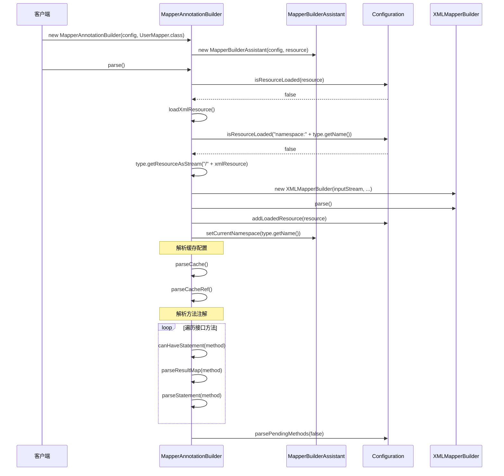

# MapperAnnotationBuilder 源码深度解析

## 1. 概述

MapperAnnotationBuilder 是 MyBatis 配置系统中负责解析 Mapper 接口注解的核心组件。它专门处理 Mapper 接口上的各种注解（如 @Select、@Insert、@Update、@Delete 等），将注解配置转换为 MyBatis 内部的数据结构，实现注解驱动的 Mapper 配置。

### 1.1 核心职责

1. **注解解析**：解析 Mapper 接口上的各种注解
2. **SQL 语句解析**：解析 @Select、@Insert、@Update、@Delete 等注解中的 SQL
3. **结果映射解析**：解析 @Results、@Result 等结果映射注解
4. **参数映射解析**：解析 @Param 等参数映射注解
5. **缓存配置解析**：解析 @CacheNamespace、@CacheNamespaceRef 等缓存注解
6. **XML 资源加载**：加载对应的 XML 资源文件（如果存在）
7. **混合配置支持**：支持注解和 XML 的混合配置

### 1.2 设计特点

- **注解驱动**：完全基于注解进行配置
- **反射机制**：大量使用 Java 反射进行注解解析
- **混合支持**：支持注解和 XML 的混合使用
- **延迟解析**：支持跨方法的依赖解析
- **类型安全**：提供编译时的类型检查

## 2. 类结构分析

### 2.1 类声明和核心字段

```java
public class MapperAnnotationBuilder {
    // 支持的语句注解类型
    private static final Set<Class<? extends Annotation>> statementAnnotationTypes = Stream
        .of(Select.class, Update.class, Insert.class, Delete.class, SelectProvider.class, 
            UpdateProvider.class, InsertProvider.class, DeleteProvider.class)
        .collect(Collectors.toSet());

    private final Configuration configuration;    // 配置对象
    private final MapperBuilderAssistant assistant; // 构建助手
    private final Class<?> type;                  // Mapper 接口类型
}
```

### 2.2 核心字段分析

#### 2.2.1 statementAnnotationTypes 字段
```java
private static final Set<Class<? extends Annotation>> statementAnnotationTypes = Stream
    .of(Select.class, Update.class, Insert.class, Delete.class, SelectProvider.class, 
        UpdateProvider.class, InsertProvider.class, DeleteProvider.class)
    .collect(Collectors.toSet());
```
**作用**：定义支持的语句注解类型
**特点**：使用 Java 8 Stream API 创建不可变的注解类型集合

#### 2.2.2 configuration 字段
```java
private final Configuration configuration;
```
**作用**：MyBatis 配置对象，存储解析后的配置信息
**特点**：作为配置信息的统一存储中心

#### 2.2.3 assistant 字段
```java
private final MapperBuilderAssistant assistant;
```
**作用**：构建助手，提供构建 Mapper 相关对象的辅助方法
**特点**：封装了复杂的构建逻辑，简化解析过程

#### 2.2.4 type 字段
```java
private final Class<?> type;
```
**作用**：当前解析的 Mapper 接口类型
**特点**：通过反射获取接口上的注解信息

## 3. 构造函数分析

### 3.1 构造函数实现

```java
public MapperAnnotationBuilder(Configuration configuration, Class<?> type) {
    String resource = type.getName().replace('.', '/') + ".java (best guess)";
    this.assistant = new MapperBuilderAssistant(configuration, resource);
    this.configuration = configuration;
    this.type = type;
}
```

**关键步骤**：
1. **资源路径生成**：将类名转换为资源路径格式
2. **构建助手创建**：创建 MapperBuilderAssistant 实例
3. **字段初始化**：设置 configuration 和 type 字段

### 3.2 资源路径生成逻辑

```java
String resource = type.getName().replace('.', '/') + ".java (best guess)";
```

**转换示例**：
- `com.example.UserMapper` → `com/example/UserMapper.java (best guess)`
- 用于错误追踪和资源标识

## 4. 核心解析方法

### 4.1 parse() 方法

这是 MapperAnnotationBuilder 的核心方法，定义了注解解析的完整流程：

```java
public void parse() {
    String resource = type.toString();
    if (!configuration.isResourceLoaded(resource)) {
        loadXmlResource();
        configuration.addLoadedResource(resource);
        assistant.setCurrentNamespace(type.getName());
        parseCache();
        parseCacheRef();
        for (Method method : type.getMethods()) {
            if (!canHaveStatement(method)) {
                continue;
            }
            if (getAnnotationWrapper(method, false, Select.class, SelectProvider.class).isPresent()
                && method.getAnnotation(ResultMap.class) == null) {
                parseResultMap(method);
            }
            try {
                parseStatement(method);
            } catch (IncompleteElementException e) {
                configuration.addIncompleteMethod(new MethodResolver(this, method));
            }
        }
    }
    configuration.parsePendingMethods(false);
}
```

**执行流程**：
1. **重复加载检查**：`!configuration.isResourceLoaded(resource)`
2. **XML 资源加载**：`loadXmlResource()`
3. **标记已加载**：`configuration.addLoadedResource(resource)`
4. **设置命名空间**：`assistant.setCurrentNamespace(type.getName())`
5. **解析缓存配置**：`parseCache()` 和 `parseCacheRef()`
6. **解析方法注解**：遍历接口方法，解析注解
7. **结果映射解析**：为 Select 方法解析结果映射
8. **语句解析**：解析每个方法的语句注解
9. **延迟解析**：处理延迟解析的方法

### 4.2 canHaveStatement() 方法

```java
private static boolean canHaveStatement(Method method) {
    // issue #237
    return !method.isBridge() && !method.isDefault();
}
```

**功能分析**：
1. **桥接方法过滤**：过滤掉编译器生成的桥接方法
2. **默认方法过滤**：过滤掉 Java 8 的默认方法
3. **返回条件**：只有普通方法才能有语句注解

### 4.3 loadXmlResource() 方法

```java
private void loadXmlResource() {
    // Spring may not know the real resource name so we check a flag
    // to prevent loading again a resource twice
    // this flag is set at XMLMapperBuilder#bindMapperForNamespace
    if (!configuration.isResourceLoaded("namespace:" + type.getName())) {
        String xmlResource = type.getName().replace('.', '/') + ".xml";
        // #1347
        InputStream inputStream = type.getResourceAsStream("/" + xmlResource);
        if (inputStream == null) {
            // Search XML mapper that is not in the module but in the classpath.
            try {
                inputStream = Resources.getResourceAsStream(type.getClassLoader(), xmlResource);
            } catch (IOException e2) {
                // ignore, resource is not required
            }
        }
        if (inputStream != null) {
            XMLMapperBuilder xmlParser = new XMLMapperBuilder(inputStream, assistant.getConfiguration(), xmlResource,
                configuration.getSqlFragments(), type.getName());
            xmlParser.parse();
        }
    }
}
```

**功能分析**：
1. **重复加载检查**：检查是否已经加载过对应的 XML 资源
2. **XML 路径生成**：将类名转换为 XML 文件路径
3. **资源查找**：先在模块中查找，再在类路径中查找
4. **XML 解析**：如果找到 XML 文件，使用 XMLMapperBuilder 解析
5. **混合配置支持**：支持注解和 XML 的混合使用

## 5. 具体解析方法分析

### 5.1 parseCache() 方法

```java
private void parseCache() {
    CacheNamespace cacheDomain = type.getAnnotation(CacheNamespace.class);
    if (cacheDomain != null) {
        Integer size = cacheDomain.size() == 0 ? null : cacheDomain.size();
        Long flushInterval = cacheDomain.flushInterval() == 0 ? null : cacheDomain.flushInterval();
        Properties props = convertToProperties(cacheDomain.properties());
        assistant.useNewCache(cacheDomain.implementation(), cacheDomain.eviction(), flushInterval, size,
            cacheDomain.readWrite(), cacheDomain.blocking(), props);
    }
}
```

**功能分析**：
1. **缓存注解解析**：解析 @CacheNamespace 注解
2. **属性转换**：将注解属性转换为内部数据结构
3. **默认值处理**：处理注解的默认值
4. **缓存创建**：使用 assistant 创建缓存对象

### 5.2 parseCacheRef() 方法

```java
private void parseCacheRef() {
    CacheNamespaceRef cacheDomainRef = type.getAnnotation(CacheNamespaceRef.class);
    if (cacheDomainRef != null) {
        Class<?> refType = cacheDomainRef.value();
        String refName = cacheDomainRef.name();
        if (refType == void.class && refName.isEmpty()) {
            throw new BuilderException("Should be specified either value() or name() attribute in the @CacheNamespaceRef");
        }
        if (refType != void.class && !refName.isEmpty()) {
            throw new BuilderException("Cannot use both value() and name() attribute in the @CacheNamespaceRef");
        }
        String namespace = refType != void.class ? refType.getName() : refName;
        assistant.useCacheRef(namespace);
    }
}
```

**功能分析**：
1. **缓存引用解析**：解析 @CacheNamespaceRef 注解
2. **参数验证**：验证 value() 和 name() 属性的使用
3. **命名空间处理**：确定引用的缓存命名空间
4. **缓存引用创建**：使用 assistant 创建缓存引用

### 5.3 parseStatement() 方法

```java
private void parseStatement(Method method) {
    Class<?> parameterTypeClass = getParameterType(method);
    LanguageDriver languageDriver = getLanguageDriver(method);
    SqlSource sqlSource = getSqlSourceFromAnnotations(method, parameterTypeClass, languageDriver);
    
    if (sqlSource != null) {
        Options options = method.getAnnotation(Options.class);
        final String mappedStatementId = type.getName() + "." + method.getName();
        final SqlCommandType sqlCommandType = getSqlCommandType(method);
        final boolean isSelect = sqlCommandType == SqlCommandType.SELECT;
        final boolean flushCache = !isSelect;
        final boolean useCache = isSelect;
        
        KeyGenerator keyGenerator;
        String keyProperty = null;
        String keyColumn = null;
        if (options != null) {
            if (SqlCommandType.INSERT.equals(sqlCommandType) || SqlCommandType.UPDATE.equals(sqlCommandType)) {
                keyGenerator = options.useGeneratedKeys() ? Jdbc3KeyGenerator.INSTANCE : NoKeyGenerator.INSTANCE;
                keyProperty = options.keyProperty();
                keyColumn = options.keyColumn();
            } else {
                keyGenerator = NoKeyGenerator.INSTANCE;
            }
        } else {
            keyGenerator = NoKeyGenerator.INSTANCE;
        }
        
        Integer fetchSize = null;
        Integer timeout = null;
        StatementType statementType = StatementType.PREPARED;
        ResultSetType resultSetType = configuration.getDefaultResultSetType();
        boolean isSelect = sqlCommandType == SqlCommandType.SELECT;
        boolean flushCache = !isSelect;
        boolean useCache = isSelect;
        
        if (options != null) {
            if (options.useCache() != null) {
                useCache = options.useCache();
            }
            if (options.flushCache() != null) {
                flushCache = options.flushCache();
            }
            if (options.fetchSize() > -1) {
                fetchSize = options.fetchSize();
            }
            if (options.timeout() > -1) {
                timeout = options.timeout();
            }
            if (options.statementType() != StatementType.DEFAULT) {
                statementType = options.statementType();
            }
            if (options.resultSetType() != ResultSetType.DEFAULT) {
                resultSetType = options.resultSetType();
            }
        }
        
        String resultMapId = null;
        if (method.getAnnotation(Results.class) != null) {
            resultMapId = parseResults(method);
        } else if (isSelect) {
            resultMapId = parseResultMap(method);
        }
        
        assistant.addMappedStatement(mappedStatementId, sqlSource, statementType, sqlCommandType, fetchSize, timeout, null, parameterTypeClass, resultMapId, getReturnType(method), resultSetType, flushCache, useCache, false, keyGenerator, keyProperty, keyColumn, null, languageDriver, null);
    }
}
```

**功能分析**：
1. **参数类型解析**：获取方法的参数类型
2. **语言驱动获取**：获取语言驱动（支持自定义脚本语言）
3. **SQL 源解析**：从注解中解析 SQL 源
4. **选项解析**：解析 @Options 注解
5. **键生成器配置**：配置主键生成策略
6. **结果映射解析**：解析结果映射配置
7. **映射语句创建**：使用 assistant 创建 MappedStatement

### 5.4 getSqlSourceFromAnnotations() 方法

```java
private SqlSource getSqlSourceFromAnnotations(Method method, Class<?> parameterTypeClass, LanguageDriver languageDriver) {
    try {
        Class<? extends Annotation> sqlAnnotationType = getSqlAnnotationType(method);
        Class<? extends Annotation> sqlProviderAnnotationType = getSqlProviderAnnotationType(method);
        if (sqlAnnotationType != null) {
            if (sqlProviderAnnotationType != null) {
                throw new BuilderException("You cannot supply both a static SQL and SqlProvider to method named " + method.getName());
            }
            Annotation sqlAnnotation = method.getAnnotation(sqlAnnotationType);
            final String[] strings = (String[]) sqlAnnotation.getClass().getMethod("value").invoke(sqlAnnotation);
            return buildSqlSourceFromStrings(strings, parameterTypeClass, languageDriver);
        } else if (sqlProviderAnnotationType != null) {
            Annotation sqlProviderAnnotation = method.getAnnotation(sqlProviderAnnotationType);
            return new ProviderSqlSource(configuration, sqlProviderAnnotation, type, method);
        }
        return null;
    } catch (Exception e) {
        throw new BuilderException("Could not find value method on SQL annotation.  Cause: " + e, e);
    }
}
```

**功能分析**：
1. **注解类型检测**：检测方法上的 SQL 注解类型
2. **冲突检查**：检查静态 SQL 和 Provider SQL 的冲突
3. **静态 SQL 解析**：解析 @Select、@Insert 等注解中的静态 SQL
4. **Provider SQL 解析**：解析 @SelectProvider 等注解中的动态 SQL
5. **SQL 源构建**：构建相应的 SqlSource 对象

### 5.5 parseResultMap() 方法

```java
private String parseResultMap(Method method) {
    Class<?> returnType = getReturnType(method);
    ConstructorArg[] constructArgs = method.getAnnotationsByType(ConstructorArg.class);
    Arg[] args = method.getAnnotationsByType(Arg.class);
    if (constructArgs.length > 0 && args.length > 0) {
        throw new BuilderException("Cannot use both @ConstructorArg and @Arg annotations on method '" + method.getName() + "'");
    }
    List<ResultMapping> resultMappings = new ArrayList<>();
    applyConstructorArgs(constructArgs, returnType, resultMappings);
    applyConstructorArgs(args, returnType, resultMappings);
    
    Type[] returnTypes = getReturnTypes(method);
    if (returnTypes.length > 0) {
        Type returnType2 = returnTypes[0];
        if (returnType2 instanceof Class) {
            Class<?> returnTypeClass = (Class<?>) returnType2;
            if (returnTypeClass != void.class && returnTypeClass != Object.class) {
                if (returnTypeClass.isArray()) {
                    returnType = returnTypeClass.getComponentType();
                } else if (returnTypeClass.isInterface() && Collection.class.isAssignableFrom(returnTypeClass)) {
                    returnType = getGenericReturnType(method);
                }
            }
        }
    }
    
    if (returnType == null) {
        returnType = Object.class;
    }
    
    String resultMapId = type.getName() + "." + method.getName() + "-Inline";
    Discriminator discriminator = null;
    List<ResultMapping> resultMappings2 = new ArrayList<>();
    applyResults(resultMappings2, returnType, method.getAnnotationsByType(Result.class));
    discriminator = applyResults(resultMappings2, returnType, method.getAnnotationsByType(TypeDiscriminator.class));
    assistant.addResultMap(resultMapId, returnType, null, discriminator, resultMappings2, null);
    return resultMapId;
}
```

**功能分析**：
1. **返回类型解析**：获取方法的返回类型
2. **构造函数参数解析**：解析 @ConstructorArg 和 @Arg 注解
3. **泛型处理**：处理泛型返回类型
4. **结果映射构建**：构建 ResultMapping 列表
5. **鉴别器解析**：解析 @TypeDiscriminator 注解
6. **结果映射注册**：将结果映射注册到 Configuration 中

## 6. 注解类型支持

### 6.1 语句注解类型

```java
private static final Set<Class<? extends Annotation>> statementAnnotationTypes = Stream
    .of(Select.class, Update.class, Insert.class, Delete.class, SelectProvider.class, 
        UpdateProvider.class, InsertProvider.class, DeleteProvider.class)
    .collect(Collectors.toSet());
```

**支持的注解**：
- **@Select**：查询语句注解
- **@Insert**：插入语句注解
- **@Update**：更新语句注解
- **@Delete**：删除语句注解
- **@SelectProvider**：动态查询语句注解
- **@UpdateProvider**：动态更新语句注解
- **@InsertProvider**：动态插入语句注解
- **@DeleteProvider**：动态删除语句注解

### 6.2 结果映射注解类型

**支持的注解**：
- **@Results**：结果映射集合注解
- **@Result**：单个结果映射注解
- **@ResultMap**：引用结果映射注解
- **@ConstructorArg**：构造函数参数注解
- **@Arg**：构造函数参数注解（简化版）
- **@TypeDiscriminator**：类型鉴别器注解

### 6.3 缓存注解类型

**支持的注解**：
- **@CacheNamespace**：缓存命名空间注解
- **@CacheNamespaceRef**：缓存命名空间引用注解

### 6.4 选项注解类型

**支持的注解**：
- **@Options**：选项配置注解
- **@SelectKey**：主键选择注解
- **@Lang**：语言驱动注解
- **@Param**：参数映射注解

## 7. 解析流程时序图



## 8. 关键设计特点

### 8.1 注解驱动设计

MapperAnnotationBuilder 完全基于注解进行配置，无需 XML 文件即可完成 Mapper 配置。

### 8.2 混合配置支持

```java
private void loadXmlResource() {
    // 加载对应的 XML 资源文件
    if (inputStream != null) {
        XMLMapperBuilder xmlParser = new XMLMapperBuilder(...);
        xmlParser.parse();
    }
}
```

**特点**：
- **注解优先**：注解配置优先于 XML 配置
- **XML 补充**：XML 配置作为注解配置的补充
- **冲突处理**：相同配置项冲突时，注解配置覆盖 XML 配置

### 8.3 延迟解析机制

```java
try {
    parseStatement(method);
} catch (IncompleteElementException e) {
    configuration.addIncompleteMethod(new MethodResolver(this, method));
}
```

**特点**：
- **跨方法依赖**：支持方法之间的相互依赖
- **延迟解析**：将未完成的方法添加到待处理列表
- **批量处理**：在最后统一处理延迟解析的方法

### 8.4 类型安全

通过 Java 反射和泛型机制，提供编译时的类型检查，减少运行时错误。

### 8.5 错误处理机制

```java
} catch (Exception e) {
    throw new BuilderException("Could not find value method on SQL annotation. Cause: " + e, e);
}
```

**特点**：
- **统一异常处理**：将所有异常包装为 BuilderException
- **详细错误信息**：提供详细的错误信息和上下文
- **异常链**：保留原始异常信息

## 9. 性能优化策略

### 9.1 重复加载检查

```java
if (!configuration.isResourceLoaded(resource)) {
    // 解析逻辑
}
```

避免重复解析同一个 Mapper 接口。

### 9.2 注解缓存

通过 Java 反射缓存注解信息，避免重复解析。

### 9.3 懒加载

某些配置项采用懒加载策略，只有在实际使用时才进行解析。

## 10. 扩展点分析

### 10.1 自定义注解支持

可以扩展 MapperAnnotationBuilder 支持自定义注解：

```java
// 自定义注解
@Target(ElementType.METHOD)
@Retention(RetentionPolicy.RUNTIME)
public @interface CustomSelect {
    String value();
}

// 扩展解析逻辑
private void parseCustomAnnotation(Method method) {
    CustomSelect customSelect = method.getAnnotation(CustomSelect.class);
    if (customSelect != null) {
        // 处理自定义注解
    }
}
```

### 10.2 自定义语言驱动

通过 @Lang 注解支持自定义脚本语言：

```java
@Select("SELECT * FROM users WHERE id = #{id}")
@Lang(CustomLanguageDriver.class)
User selectById(@Param("id") Long id);
```

### 10.3 自定义类型处理器

支持通过注解配置自定义类型处理器：

```java
@Result(property = "createTime", column = "create_time", 
        typeHandler = CustomDateTypeHandler.class)
User selectById(@Param("id") Long id);
```

## 11. 实践应用

### 11.1 基本注解使用

```java
@Mapper
public interface UserMapper {
    @Select("SELECT * FROM users WHERE id = #{id}")
    User selectById(@Param("id") Long id);
    
    @Insert("INSERT INTO users(name, email) VALUES(#{name}, #{email})")
    @Options(useGeneratedKeys = true, keyProperty = "id")
    int insert(User user);
    
    @Update("UPDATE users SET name = #{name}, email = #{email} WHERE id = #{id}")
    int update(User user);
    
    @Delete("DELETE FROM users WHERE id = #{id}")
    int deleteById(@Param("id") Long id);
}
```

### 11.2 结果映射注解使用

```java
@Results({
    @Result(property = "id", column = "user_id"),
    @Result(property = "name", column = "user_name"),
    @Result(property = "email", column = "user_email"),
    @Result(property = "createTime", column = "create_time", 
            typeHandler = DateTypeHandler.class)
})
@Select("SELECT * FROM users WHERE id = #{id}")
User selectById(@Param("id") Long id);
```

### 11.3 动态 SQL 注解使用

```java
@SelectProvider(type = UserSqlProvider.class, method = "selectByCondition")
List<User> selectByCondition(UserCondition condition);

// UserSqlProvider 类
public class UserSqlProvider {
    public String selectByCondition(UserCondition condition) {
        return new SQL() {{
            SELECT("*");
            FROM("users");
            if (condition.getName() != null) {
                WHERE("name = #{name}");
            }
            if (condition.getEmail() != null) {
                WHERE("email = #{email}");
            }
        }}.toString();
    }
}
```

### 11.4 缓存注解使用

```java
@CacheNamespace(implementation = CustomCache.class, eviction = LRUCache.class, size = 512)
@Mapper
public interface UserMapper {
    @Select("SELECT * FROM users WHERE id = #{id}")
    User selectById(@Param("id") Long id);
}
```

## 12. 常见问题和解决方案

### 12.1 注解冲突问题

**问题**：同时使用 @Select 和 @SelectProvider 注解
**解决方案**：一个方法只能使用一种 SQL 注解类型

### 12.2 参数映射问题

**问题**：方法参数没有使用 @Param 注解
**解决方案**：为方法参数添加 @Param 注解，或者使用 arg0、arg1 等默认参数名

### 12.3 结果映射问题

**问题**：复杂对象的结果映射配置错误
**解决方案**：使用 @Results 和 @Result 注解正确配置结果映射

### 12.4 泛型类型问题

**问题**：泛型返回类型解析错误
**解决方案**：使用 @ResultType 注解明确指定返回类型

## 13. 总结

MapperAnnotationBuilder 是 MyBatis 配置系统中处理 Mapper 接口注解的核心组件，它采用注解驱动设计，提供了完整的注解解析功能。通过深入分析其源码实现，我们可以更好地理解：

1. **注解解析的完整流程**
2. **反射机制的应用**
3. **混合配置的支持**
4. **延迟解析机制的设计**
5. **类型安全的保证**

理解 MapperAnnotationBuilder 的实现原理，对于深入掌握 MyBatis 的注解配置、解决复杂的注解配置问题以及进行自定义扩展都具有重要意义。注解配置相比 XML 配置更加简洁，但理解其底层实现原理对于正确使用和扩展功能至关重要。
