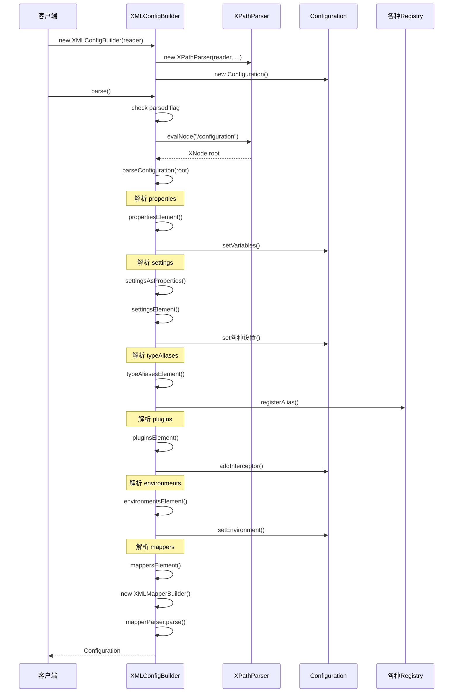

# XMLConfigBuilder 源码深度解析

## 1. 概述

XMLConfigBuilder 是 MyBatis 配置系统的核心组件之一，负责解析 MyBatis 主配置文件（通常是 mybatis-config.xml）。它继承自 BaseBuilder，采用建造者模式设计，将 XML 配置转换为 Configuration 对象。

### 1.1 核心职责

1. **XML 解析**：解析 mybatis-config.xml 配置文件
2. **配置转换**：将 XML 配置转换为 Configuration 对象
3. **配置验证**：验证配置的正确性和完整性
4. **组件创建**：创建各种配置组件（数据源、事务工厂等）

### 1.2 设计模式

- **建造者模式**：逐步构建 Configuration 对象
- **模板方法模式**：定义解析流程，子类实现具体解析逻辑
- **策略模式**：支持不同的解析策略

## 2. 类结构分析

### 2.1 类声明和继承关系

```java
public class XMLConfigBuilder extends BaseBuilder {
    private boolean parsed;                    // 解析状态标记
    private final XPathParser parser;         // XPath 解析器
    private String environment;               // 环境标识
    private final ReflectorFactory localReflectorFactory; // 反射工厂
}
```

### 2.2 核心字段分析

#### 2.2.1 parsed 字段
```java
private boolean parsed;
```
**作用**：确保 XMLConfigBuilder 只能被使用一次，防止重复解析
**使用场景**：在 parse() 方法中进行检查

#### 2.2.2 parser 字段
```java
private final XPathParser parser;
```
**作用**：XPath 解析器，负责解析 XML 文档
**特点**：使用 XPath 表达式定位 XML 元素

#### 2.2.3 environment 字段
```java
private String environment;
```
**作用**：指定要使用的环境配置
**使用场景**：在解析 environments 元素时使用

#### 2.2.4 localReflectorFactory 字段
```java
private final ReflectorFactory localReflectorFactory = new DefaultReflectorFactory();
```
**作用**：用于反射操作的工厂
**使用场景**：在验证 settings 配置时使用

## 3. 构造函数分析

### 3.1 构造函数重载

XMLConfigBuilder 提供了多个构造函数重载，支持不同的输入源：

```java
// 基于 Reader 的构造函数
public XMLConfigBuilder(Reader reader) {
    this(reader, null, null);
}

public XMLConfigBuilder(Reader reader, String environment) {
    this(reader, environment, null);
}

public XMLConfigBuilder(Reader reader, String environment, Properties props) {
    this(Configuration.class, reader, environment, props);
}

// 基于 InputStream 的构造函数
public XMLConfigBuilder(InputStream inputStream) {
    this(inputStream, null, null);
}

public XMLConfigBuilder(InputStream inputStream, String environment) {
    this(inputStream, environment, null);
}

public XMLConfigBuilder(InputStream inputStream, String environment, Properties props) {
    this(Configuration.class, inputStream, environment, props);
}
```

### 3.2 核心构造函数

```java
private XMLConfigBuilder(Class<? extends Configuration> configClass, XPathParser parser, 
                        String environment, Properties props) {
    super(newConfig(configClass));
    ErrorContext.instance().resource("SQL Mapper Configuration");
    this.configuration.setVariables(props);
    this.parsed = false;
    this.environment = environment;
    this.parser = parser;
}
```

**关键步骤**：
1. **调用父类构造函数**：`super(newConfig(configClass))`
2. **设置错误上下文**：`ErrorContext.instance().resource("SQL Mapper Configuration")`
3. **设置变量属性**：`this.configuration.setVariables(props)`
4. **初始化状态**：`this.parsed = false`

### 3.3 XPathParser 创建

```java
this(configClass, new XPathParser(reader, true, props, new XMLMapperEntityResolver()), 
     environment, props);
```

**XPathParser 参数说明**：
- **reader/inputStream**：输入源
- **true**：验证 XML 格式
- **props**：属性变量
- **XMLMapperEntityResolver**：XML 实体解析器

## 4. 核心解析方法

### 4.1 parse() 方法

```java
public Configuration parse() {
    if (parsed) {
        throw new BuilderException("Each XMLConfigBuilder can only be used once.");
    }
    parsed = true;
    parseConfiguration(parser.evalNode("/configuration"));
    return configuration;
}
```

**执行流程**：
1. **重复使用检查**：确保只能使用一次
2. **标记已解析**：设置 parsed = true
3. **获取根节点**：`parser.evalNode("/configuration")`
4. **解析配置**：调用 `parseConfiguration()` 方法
5. **返回配置**：返回构建好的 Configuration 对象

### 4.2 parseConfiguration() 方法

这是 XMLConfigBuilder 的核心方法，定义了配置解析的完整流程：

```java
private void parseConfiguration(XNode root) {
    try {
        // issue #117 read properties first
        propertiesElement(root.evalNode("properties"));
        Properties settings = settingsAsProperties(root.evalNode("settings"));
        loadCustomVfsImpl(settings);
        loadCustomLogImpl(settings);
        typeAliasesElement(root.evalNode("typeAliases"));
        pluginsElement(root.evalNode("plugins"));
        objectFactoryElement(root.evalNode("objectFactory"));
        objectWrapperFactoryElement(root.evalNode("objectWrapperFactory"));
        reflectorFactoryElement(root.evalNode("reflectorFactory"));
        settingsElement(settings);
        // read it after objectFactory and objectWrapperFactory issue #631
        environmentsElement(root.evalNode("environments"));
        databaseIdProviderElement(root.evalNode("databaseIdProvider"));
        typeHandlersElement(root.evalNode("typeHandlers"));
        mappersElement(root.evalNode("mappers"));
    } catch (Exception e) {
        throw new BuilderException("Error parsing SQL Mapper Configuration. Cause: " + e, e);
    }
}
```

**解析顺序的重要性**：
1. **properties**：最先解析，为后续解析提供变量支持
2. **settings**：解析设置，但不立即应用
3. **typeAliases**：解析类型别名
4. **plugins**：解析插件配置
5. **objectFactory**：解析对象工厂
6. **objectWrapperFactory**：解析对象包装工厂
7. **reflectorFactory**：解析反射工厂
8. **settings**：应用设置（在工厂创建后）
9. **environments**：解析环境配置
10. **databaseIdProvider**：解析数据库ID提供者
11. **typeHandlers**：解析类型处理器
12. **mappers**：解析Mapper配置

## 5. 具体解析方法分析

### 5.1 propertiesElement() 方法

```java
private void propertiesElement(XNode context) throws Exception {
    if (context != null) {
        Properties defaults = context.getChildrenAsProperties();
        String resource = context.getStringAttribute("resource");
        String url = context.getStringAttribute("url");
        if (resource != null && url != null) {
            throw new BuilderException("The properties element cannot specify both a URL and a resource based property file reference. Please specify one or the other.");
        }
        if (resource != null) {
            defaults.putAll(Resources.getResourceAsProperties(resource));
        } else if (url != null) {
            defaults.putAll(Resources.getUrlAsProperties(url));
        }
        Properties vars = configuration.getVariables();
        if (vars != null) {
            defaults.putAll(vars);
        }
        parser.setVariables(defaults);
        configuration.setVariables(defaults);
    }
}
```

**功能分析**：
1. **获取子属性**：`context.getChildrenAsProperties()`
2. **外部资源加载**：支持 resource 和 url 两种方式
3. **冲突检查**：resource 和 url 不能同时指定
4. **属性合并**：合并构造函数传入的属性
5. **设置变量**：为解析器和配置对象设置变量

### 5.2 settingsAsProperties() 方法

```java
private Properties settingsAsProperties(XNode context) {
    if (context == null) {
        return new Properties();
    }
    Properties props = context.getChildrenAsProperties();
    // Check that all settings are known to the configuration class
    MetaClass metaConfig = MetaClass.forClass(Configuration.class, localReflectorFactory);
    for (Object key : props.keySet()) {
        if (!metaConfig.hasSetter(String.valueOf(key))) {
            throw new BuilderException(
                "The setting " + key + " is not known. Make sure you spelled it correctly (case sensitive).");
        }
    }
    return props;
}
```

**功能分析**：
1. **获取设置属性**：`context.getChildrenAsProperties()`
2. **配置验证**：使用 MetaClass 验证设置项是否有效
3. **错误提示**：提供详细的错误信息

### 5.3 settingsElement() 方法

```java
private void settingsElement(Properties props) throws Exception {
    configuration.setAutoMappingBehavior(AutoMappingBehavior.valueOf(props.getProperty("autoMappingBehavior", "PARTIAL")));
    configuration.setAutoMappingUnknownColumnBehavior(AutoMappingUnknownColumnBehavior.valueOf(props.getProperty("autoMappingUnknownColumnBehavior", "NONE")));
    configuration.setCacheEnabled(booleanValueOf(props.getProperty("cacheEnabled"), true));
    configuration.setProxyFactory((ProxyFactory) createInstance(props.getProperty("proxyFactory")));
    configuration.setLazyLoadingEnabled(booleanValueOf(props.getProperty("lazyLoadingEnabled"), false));
    configuration.setAggressiveLazyLoading(booleanValueOf(props.getProperty("aggressiveLazyLoading"), false));
    configuration.setMultipleResultSetsEnabled(booleanValueOf(props.getProperty("multipleResultSetsEnabled"), true));
    configuration.setUseColumnLabel(booleanValueOf(props.getProperty("useColumnLabel"), true));
    configuration.setUseGeneratedKeys(booleanValueOf(props.getProperty("useGeneratedKeys"), false));
    configuration.setDefaultExecutorType(ExecutorType.valueOf(props.getProperty("defaultExecutorType", "SIMPLE")));
    configuration.setDefaultStatementTimeout(integerValueOf(props.getProperty("defaultStatementTimeout"), null));
    configuration.setDefaultFetchSize(integerValueOf(props.getProperty("defaultFetchSize"), null));
    configuration.setDefaultResultSetType(resolveResultSetType(props.getProperty("defaultResultSetType")));
    configuration.setMapUnderscoreToCamelCase(booleanValueOf(props.getProperty("mapUnderscoreToCamelCase"), false));
    configuration.setSafeRowBoundsEnabled(booleanValueOf(props.getProperty("safeRowBoundsEnabled"), false));
    configuration.setSafeResultHandlerEnabled(booleanValueOf(props.getProperty("safeResultHandlerEnabled"), true));
    configuration.setLocalCacheScope(LocalCacheScope.valueOf(props.getProperty("localCacheScope", "SESSION")));
    configuration.setJdbcTypeForNull(JdbcType.valueOf(props.getProperty("jdbcTypeForNull", "OTHER")));
    configuration.setLazyLoadTriggerMethods(stringSetValueOf(props.getProperty("lazyLoadTriggerMethods"), "equals,clone,hashCode,toString"));
    configuration.setDefaultScriptingLanguage(resolveClass(props.getProperty("defaultScriptingLanguage")));
    configuration.setDefaultEnumTypeHandler(resolveClass(props.getProperty("defaultEnumTypeHandler")));
    configuration.setCallSettersOnNulls(booleanValueOf(props.getProperty("callSettersOnNulls"), false));
    configuration.setReturnInstanceForEmptyRow(booleanValueOf(props.getProperty("returnInstanceForEmptyRow"), false));
    configuration.setLogPrefix(props.getProperty("logPrefix"));
    configuration.setConfigurationFactory(resolveClass(props.getProperty("configurationFactory")));
}
```

**功能分析**：
1. **类型转换**：将字符串配置转换为相应的类型
2. **默认值处理**：为未配置的项提供默认值
3. **枚举处理**：使用 `valueOf()` 方法处理枚举类型
4. **布尔值处理**：使用 `booleanValueOf()` 方法处理布尔值
5. **类解析**：使用 `resolveClass()` 方法解析类名

### 5.4 typeAliasesElement() 方法

```java
private void typeAliasesElement(XNode context) {
    if (context == null) {
        return;
    }
    for (XNode child : context.getChildren()) {
        if ("package".equals(child.getName())) {
            String typeAliasPackage = child.getStringAttribute("name");
            configuration.getTypeAliasRegistry().registerAliases(typeAliasPackage);
        } else {
            String alias = child.getStringAttribute("alias");
            String type = child.getStringAttribute("type");
            try {
                Class<?> clazz = Resources.classForName(type);
                if (alias == null) {
                    typeAliasRegistry.registerAlias(clazz);
                } else {
                    typeAliasRegistry.registerAlias(alias, clazz);
                }
            } catch (ClassNotFoundException e) {
                throw new BuilderException("Error registering typeAlias for '" + alias + "'. Cause: " + e, e);
            }
        }
    }
}
```

**功能分析**：
1. **包扫描**：支持通过 package 元素批量注册别名
2. **单个注册**：支持通过 type 元素单个注册别名
3. **别名处理**：如果没有指定别名，使用类名作为别名
4. **异常处理**：处理类加载异常

### 5.5 pluginsElement() 方法

```java
private void pluginsElement(XNode context) throws Exception {
    if (context != null) {
        for (XNode child : context.getChildren()) {
            String interceptor = child.getStringAttribute("interceptor");
            Properties properties = child.getChildrenAsProperties();
            Interceptor interceptorInstance = (Interceptor) resolveClass(interceptor).getDeclaredConstructor().newInstance();
            interceptorInstance.setProperties(properties);
            configuration.addInterceptor(interceptorInstance);
        }
    }
}
```

**功能分析**：
1. **插件实例化**：使用反射创建插件实例
2. **属性设置**：为插件设置配置属性
3. **插件注册**：将插件添加到配置中

### 5.6 environmentsElement() 方法

```java
private void environmentsElement(XNode context) throws Exception {
    if (context != null) {
        if (environment == null) {
            environment = context.getStringAttribute("default");
        }
        for (XNode child : context.getChildren()) {
            String id = child.getStringAttribute("id");
            if (isSpecifiedEnvironment(id)) {
                TransactionFactory txFactory = transactionManagerElement(child.evalNode("transactionManager"));
                DataSourceFactory dsFactory = dataSourceElement(child.evalNode("dataSource"));
                DataSource dataSource = dsFactory.getDataSource();
                Environment.Builder environmentBuilder = new Environment.Builder(id)
                    .transactionFactory(txFactory)
                    .dataSource(dataSource);
                configuration.setEnvironment(environmentBuilder.build());
                break;
            }
        }
    }
}
```

**功能分析**：
1. **环境选择**：根据 environment 参数选择环境
2. **事务工厂创建**：解析并创建事务工厂
3. **数据源创建**：解析并创建数据源
4. **环境构建**：使用建造者模式构建环境对象

### 5.7 mappersElement() 方法

```java
private void mappersElement(XNode context) throws Exception {
    if (context != null) {
        for (XNode child : context.getChildren()) {
            if ("package".equals(child.getName())) {
                String mapperPackage = child.getStringAttribute("name");
                configuration.addMappers(mapperPackage);
            } else {
                String resource = child.getStringAttribute("resource");
                String url = child.getStringAttribute("url");
                String mapperClass = child.getStringAttribute("class");
                if (resource != null && url == null && mapperClass == null) {
                    ErrorContext.instance().resource(resource);
                    InputStream inputStream = Resources.getResourceAsStream(resource);
                    XMLMapperBuilder mapperParser = new XMLMapperBuilder(inputStream, configuration, resource, configuration.getSqlFragments());
                    mapperParser.parse();
                } else if (resource == null && url != null && mapperClass == null) {
                    ErrorContext.instance().resource(url);
                    InputStream inputStream = Resources.getUrlAsStream(url);
                    XMLMapperBuilder mapperParser = new XMLMapperBuilder(inputStream, configuration, url, configuration.getSqlFragments());
                    mapperParser.parse();
                } else if (resource == null && url == null && mapperClass != null) {
                    Class<?> mapperInterface = Resources.classForName(mapperClass);
                    configuration.addMapper(mapperInterface);
                } else {
                    throw new BuilderException("A mapper element may only specify a url, resource or class, but not more than one.");
                }
            }
        }
    }
}
```

**功能分析**：
1. **包扫描**：支持通过 package 元素批量注册 Mapper
2. **资源加载**：支持通过 resource 属性加载 XML 文件
3. **URL 加载**：支持通过 url 属性加载远程 XML 文件
4. **类注册**：支持通过 class 属性注册 Mapper 接口
5. **冲突检查**：确保只指定一种加载方式

## 6. 解析流程时序图



## 7. 关键设计特点

### 7.1 解析顺序的重要性

XMLConfigBuilder 的解析顺序是经过精心设计的：

1. **properties 优先**：为后续解析提供变量支持
2. **settings 延迟应用**：在工厂创建后再应用设置
3. **environments 靠后**：需要前面的配置支持

### 7.2 错误处理机制

```java
try {
    // 解析逻辑
} catch (Exception e) {
    throw new BuilderException("Error parsing SQL Mapper Configuration. Cause: " + e, e);
}
```

**特点**：
- **统一异常处理**：将所有异常包装为 BuilderException
- **错误上下文**：提供详细的错误信息
- **异常链**：保留原始异常信息

### 7.3 配置验证机制

```java
MetaClass metaConfig = MetaClass.forClass(Configuration.class, localReflectorFactory);
for (Object key : props.keySet()) {
    if (!metaConfig.hasSetter(String.valueOf(key))) {
        throw new BuilderException("The setting " + key + " is not known...");
    }
}
```

**特点**：
- **动态验证**：使用反射验证配置项
- **类型安全**：确保配置项类型正确
- **友好错误**：提供清晰的错误提示

### 7.4 资源管理

```java
ErrorContext.instance().resource("SQL Mapper Configuration");
```

**特点**：
- **错误上下文**：跟踪当前处理的资源
- **资源清理**：在解析完成后清理错误上下文
- **调试支持**：便于问题定位

## 8. 性能优化策略

### 8.1 懒加载机制

某些配置项采用懒加载策略，只有在实际使用时才进行解析和创建。

### 8.2 缓存机制

- **XPath 缓存**：XPathParser 内部缓存解析结果
- **类加载缓存**：Resources.classForName() 缓存类加载结果

### 8.3 解析优化

- **单次解析**：通过 parsed 标志确保只解析一次
- **批量处理**：批量处理相同类型的配置项

## 9. 扩展点分析

### 9.1 自定义 Configuration 类

```java
public XMLConfigBuilder(Class<? extends Configuration> configClass, Reader reader, String environment, Properties props)
```

支持传入自定义的 Configuration 类，实现配置的扩展。

### 9.2 插件系统集成

通过 pluginsElement() 方法支持插件系统，可以在配置解析过程中插入自定义逻辑。

### 9.3 自定义解析器

可以继承 XMLConfigBuilder 并重写相关方法，实现自定义的解析逻辑。

## 10. 实践应用

### 10.1 基本使用

```java
// 从文件创建
String resource = "mybatis-config.xml";
InputStream inputStream = Resources.getResourceAsStream(resource);
XMLConfigBuilder parser = new XMLConfigBuilder(inputStream);
Configuration configuration = parser.parse();

// 从 Reader 创建
Reader reader = new FileReader("mybatis-config.xml");
XMLConfigBuilder parser = new XMLConfigBuilder(reader);
Configuration configuration = parser.parse();
```

### 10.2 带环境参数使用

```java
XMLConfigBuilder parser = new XMLConfigBuilder(inputStream, "development");
Configuration configuration = parser.parse();
```

### 10.3 带属性参数使用

```java
Properties props = new Properties();
props.setProperty("driver", "com.mysql.jdbc.Driver");
XMLConfigBuilder parser = new XMLConfigBuilder(inputStream, "development", props);
Configuration configuration = parser.parse();
```

## 11. 常见问题和解决方案

### 11.1 重复解析问题

**问题**：XMLConfigBuilder 被多次使用
**解决方案**：确保每个 XMLConfigBuilder 实例只调用一次 parse() 方法

### 11.2 配置项不存在问题

**问题**：settings 中配置了不存在的配置项
**解决方案**：检查配置项名称是否正确，注意大小写敏感

### 11.3 类加载问题

**问题**：typeAliases 中指定的类无法加载
**解决方案**：确保类路径正确，类名拼写无误

## 12. 总结

XMLConfigBuilder 是 MyBatis 配置系统的核心组件，它采用建造者模式设计，提供了完整的 XML 配置解析功能。通过深入分析其源码实现，我们可以更好地理解：

1. **配置解析的完整流程**
2. **各种设计模式的应用**
3. **错误处理和验证机制**
4. **性能优化策略**
5. **扩展点的设计**

理解 XMLConfigBuilder 的实现原理，对于深入掌握 MyBatis 的配置系统和进行自定义扩展都具有重要意义。
