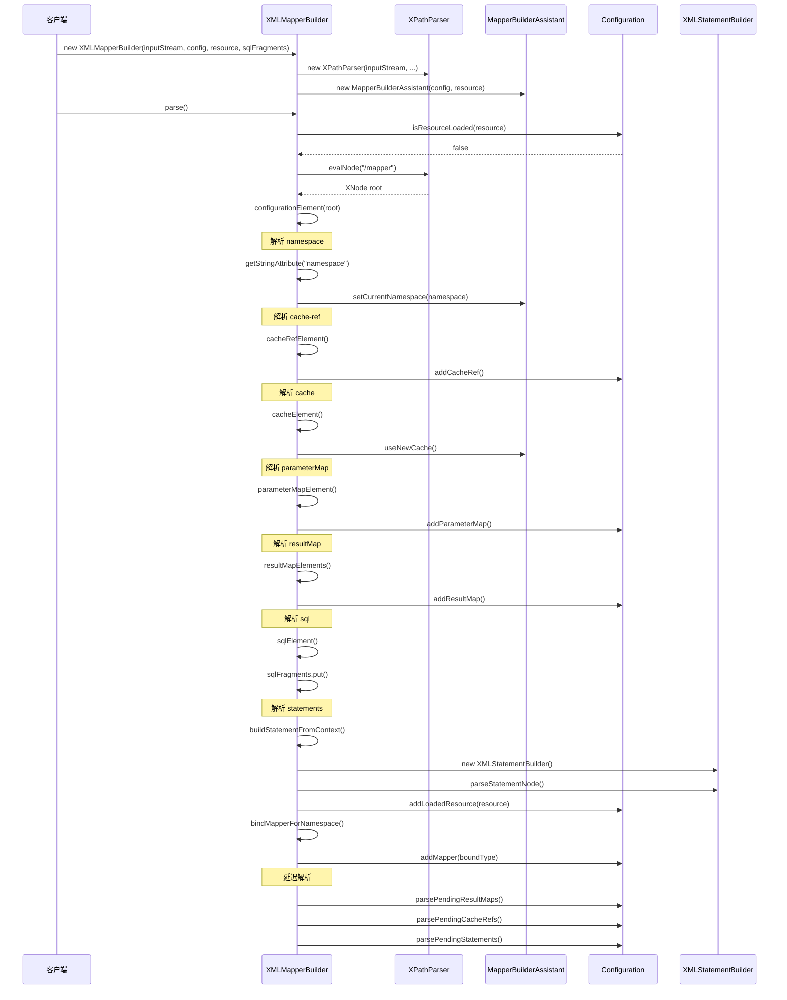

# XMLMapperBuilder 源码深度解析

## 1. 概述

XMLMapperBuilder 是 MyBatis 配置系统中负责解析 Mapper XML 文件的核心组件。它继承自 BaseBuilder，专门处理 Mapper XML 配置文件，将 XML 中定义的 SQL 语句、结果映射、参数映射等转换为 MyBatis 内部的数据结构。

### 1.1 核心职责

1. **Mapper XML 解析**：解析 Mapper XML 配置文件
2. **SQL 语句解析**：解析 select、insert、update、delete 语句
3. **结果映射解析**：解析 resultMap 元素
4. **参数映射解析**：解析 parameterMap 元素
5. **缓存配置解析**：解析 cache 和 cache-ref 元素
6. **SQL 片段解析**：解析 sql 元素
7. **命名空间绑定**：将 Mapper XML 与 Mapper 接口绑定

### 1.2 设计特点

- **单一职责**：专门处理 Mapper XML 文件解析
- **延迟解析**：支持跨文件的依赖解析
- **错误处理**：完善的异常处理机制
- **扩展性**：支持自定义解析逻辑

## 2. 类结构分析

### 2.1 类声明和继承关系

```java
public class XMLMapperBuilder extends BaseBuilder {
    private final XPathParser parser;              // XPath 解析器
    private final MapperBuilderAssistant builderAssistant; // 构建助手
    private final Map<String, XNode> sqlFragments; // SQL 片段缓存
    private final String resource;                 // 资源路径
}
```

### 2.2 核心字段分析

#### 2.2.1 parser 字段
```java
private final XPathParser parser;
```
**作用**：XPath 解析器，负责解析 XML 文档
**特点**：使用 XPath 表达式定位 XML 元素

#### 2.2.2 builderAssistant 字段
```java
private final MapperBuilderAssistant builderAssistant;
```
**作用**：构建助手，提供构建 Mapper 相关对象的辅助方法
**特点**：封装了复杂的构建逻辑，简化解析过程

#### 2.2.3 sqlFragments 字段
```java
private final Map<String, XNode> sqlFragments;
```
**作用**：SQL 片段缓存，存储可重用的 SQL 片段
**特点**：支持 SQL 片段的跨文件引用

#### 2.2.4 resource 字段
```java
private final String resource;
```
**作用**：资源路径，标识当前解析的 Mapper XML 文件
**特点**：用于错误追踪和重复加载检查

## 3. 构造函数分析

### 3.1 构造函数重载

XMLMapperBuilder 提供了多个构造函数重载：

```java
// 基于 InputStream 的构造函数（推荐）
public XMLMapperBuilder(InputStream inputStream, Configuration configuration, String resource, 
                       Map<String, XNode> sqlFragments, String namespace)

public XMLMapperBuilder(InputStream inputStream, Configuration configuration, String resource, 
                       Map<String, XNode> sqlFragments)

// 基于 Reader 的构造函数（已废弃）
@Deprecated
public XMLMapperBuilder(Reader reader, Configuration configuration, String resource, 
                       Map<String, XNode> sqlFragments, String namespace)

@Deprecated
public XMLMapperBuilder(Reader reader, Configuration configuration, String resource, 
                       Map<String, XNode> sqlFragments)
```

### 3.2 核心构造函数

```java
private XMLMapperBuilder(XPathParser parser, Configuration configuration, String resource, 
                        Map<String, XNode> sqlFragments) {
    super(configuration);
    this.builderAssistant = new MapperBuilderAssistant(configuration, resource);
    this.parser = parser;
    this.sqlFragments = sqlFragments;
    this.resource = resource;
}
```

**关键步骤**：
1. **调用父类构造函数**：`super(configuration)`
2. **创建构建助手**：`new MapperBuilderAssistant(configuration, resource)`
3. **初始化字段**：设置 parser、sqlFragments、resource

### 3.3 MapperBuilderAssistant 创建

```java
this.builderAssistant = new MapperBuilderAssistant(configuration, resource);
```

**MapperBuilderAssistant 的作用**：
- 提供构建 MappedStatement 的辅助方法
- 管理当前命名空间
- 处理结果映射和参数映射的构建
- 提供缓存相关的构建方法

## 4. 核心解析方法

### 4.1 parse() 方法

```java
public void parse() {
    if (!configuration.isResourceLoaded(resource)) {
        configurationElement(parser.evalNode("/mapper"));
        configuration.addLoadedResource(resource);
        bindMapperForNamespace();
    }
    configuration.parsePendingResultMaps(false);
    configuration.parsePendingCacheRefs(false);
    configuration.parsePendingStatements(false);
}
```

**执行流程**：
1. **重复加载检查**：`!configuration.isResourceLoaded(resource)`
2. **获取根节点**：`parser.evalNode("/mapper")`
3. **解析配置元素**：`configurationElement()`
4. **标记已加载**：`configuration.addLoadedResource(resource)`
5. **绑定命名空间**：`bindMapperForNamespace()`
6. **解析待处理元素**：解析延迟加载的 ResultMap、CacheRef、Statement

### 4.2 configurationElement() 方法

这是 XMLMapperBuilder 的核心方法，定义了 Mapper XML 解析的完整流程：

```java
private void configurationElement(XNode context) {
    try {
        String namespace = context.getStringAttribute("namespace");
        if (namespace == null || namespace.isEmpty()) {
            throw new BuilderException("Mapper's namespace cannot be empty");
        }
        builderAssistant.setCurrentNamespace(namespace);
        cacheRefElement(context.evalNode("cache-ref"));
        cacheElement(context.evalNode("cache"));
        parameterMapElement(context.evalNodes("/mapper/parameterMap"));
        resultMapElements(context.evalNodes("/mapper/resultMap"));
        sqlElement(context.evalNodes("/mapper/sql"));
        buildStatementFromContext(context.evalNodes("select|insert|update|delete"));
    } catch (Exception e) {
        throw new BuilderException("Error parsing Mapper XML. The XML location is '" + resource + "'. Cause: " + e, e);
    }
}
```

**解析顺序**：
1. **namespace 解析**：获取并验证命名空间
2. **cache-ref 解析**：解析缓存引用
3. **cache 解析**：解析缓存配置
4. **parameterMap 解析**：解析参数映射
5. **resultMap 解析**：解析结果映射
6. **sql 解析**：解析 SQL 片段
7. **statement 解析**：解析 SQL 语句

### 4.3 buildStatementFromContext() 方法

```java
private void buildStatementFromContext(List<XNode> list) {
    if (configuration.getDatabaseId() != null) {
        buildStatementFromContext(list, configuration.getDatabaseId());
    }
    buildStatementFromContext(list, null);
}

private void buildStatementFromContext(List<XNode> list, String requiredDatabaseId) {
    for (XNode context : list) {
        final XMLStatementBuilder statementParser = new XMLStatementBuilder(configuration, builderAssistant, context, requiredDatabaseId);
        try {
            statementParser.parseStatementNode();
        } catch (IncompleteElementException e) {
            configuration.addIncompleteStatement(statementParser);
        }
    }
}
```

**功能分析**：
1. **数据库ID处理**：如果配置了数据库ID，先解析匹配的语句
2. **通用解析**：解析所有语句（databaseId为null）
3. **异常处理**：捕获 IncompleteElementException，延迟解析
4. **委托解析**：委托给 XMLStatementBuilder 进行具体解析

## 5. 具体解析方法分析

### 5.1 cacheRefElement() 方法

```java
private void cacheRefElement(XNode context) {
    if (context != null) {
        configuration.addCacheRef(builderAssistant.getCurrentNamespace(), context.getStringAttribute("namespace"));
    }
}
```

**功能分析**：
1. **缓存引用解析**：解析 cache-ref 元素
2. **命名空间绑定**：将当前命名空间与引用的缓存命名空间绑定
3. **配置存储**：将缓存引用关系存储到 Configuration 中

### 5.2 cacheElement() 方法

```java
private void cacheElement(XNode context) {
    if (context != null) {
        String type = context.getStringAttribute("type", "PERPETUAL");
        Class<? extends Cache> typeClass = typeAliasRegistry.resolveAlias(type);
        String eviction = context.getStringAttribute("eviction", "LRU");
        Class<? extends Cache> evictionClass = typeAliasRegistry.resolveAlias(eviction);
        Long flushInterval = context.getLongAttribute("flushInterval");
        Integer size = context.getIntAttribute("size");
        boolean readWrite = !context.getBooleanAttribute("readOnly", false);
        boolean blocking = context.getBooleanAttribute("blocking", false);
        Properties props = context.getChildrenAsProperties();
        builderAssistant.useNewCache(typeClass, evictionClass, flushInterval, size, readWrite, blocking, props);
    }
}
```

**功能分析**：
1. **缓存类型解析**：解析缓存类型，默认为 PERPETUAL
2. **淘汰策略解析**：解析淘汰策略，默认为 LRU
3. **缓存属性解析**：解析 flushInterval、size、readOnly、blocking 等属性
4. **子属性解析**：解析缓存的自定义属性
5. **缓存创建**：使用 builderAssistant 创建缓存对象

### 5.3 parameterMapElement() 方法

```java
private void parameterMapElement(List<XNode> list) throws Exception {
    for (XNode parameterMapNode : list) {
        String id = parameterMapNode.getStringAttribute("id");
        String type = parameterMapNode.getStringAttribute("type");
        Class<?> parameterClass = resolveClass(type);
        List<XNode> parameterNodes = parameterMapNode.evalNodes("parameter");
        List<ParameterMapping> parameterMappings = new ArrayList<>();
        for (XNode parameterNode : parameterNodes) {
            String property = parameterNode.getStringAttribute("property");
            String javaType = parameterNode.getStringAttribute("javaType");
            String jdbcType = parameterNode.getStringAttribute("jdbcType");
            String resultMap = parameterNode.getStringAttribute("resultMap");
            String mode = parameterNode.getStringAttribute("mode");
            String typeHandler = parameterNode.getStringAttribute("typeHandler");
            Integer numericScale = parameterNode.getIntAttribute("numericScale");
            ParameterMode modeEnum = resolveParameterMode(mode);
            Class<?> javaTypeClass = resolveClass(javaType);
            JdbcType jdbcTypeEnum = resolveJdbcType(jdbcType);
            @SuppressWarnings("unchecked")
            Class<? extends TypeHandler<?>> typeHandlerClass = (Class<? extends TypeHandler<?>>) resolveClass(typeHandler);
            ParameterMapping parameterMapping = new ParameterMapping.Builder(configuration, property, javaTypeClass)
                .jdbcType(jdbcTypeEnum)
                .mode(modeEnum)
                .numericScale(numericScale)
                .resultMapId(resultMap)
                .typeHandler(typeHandlerClass)
                .build();
            parameterMappings.add(parameterMapping);
        }
        ParameterMap parameterMap = new ParameterMap.Builder(configuration, id, parameterClass, parameterMappings).build();
        configuration.addParameterMap(parameterMap);
    }
}
```

**功能分析**：
1. **参数映射解析**：解析 parameterMap 元素
2. **参数类解析**：解析 parameterType 属性
3. **参数映射列表**：解析 parameter 子元素
4. **参数映射构建**：为每个参数创建 ParameterMapping 对象
5. **参数映射注册**：将 ParameterMap 注册到 Configuration 中

### 5.4 resultMapElements() 方法

```java
private void resultMapElements(List<XNode> list) throws Exception {
    for (XNode resultMapNode : list) {
        try {
            resultMapElement(resultMapNode);
        } catch (IncompleteElementException e) {
            // ignore, it will be retried
        }
    }
}

private ResultMap resultMapElement(XNode resultMapNode) throws Exception {
    return resultMapElement(resultMapNode, Collections.emptyList(), null);
}

private ResultMap resultMapElement(XNode resultMapNode, List<ResultMapping> additionalResultMappings, 
                                  Class<?> enclosingType) throws Exception {
    ErrorContext.instance().activity("processing " + resultMapNode.getValueBasedIdentifier());
    String id = resultMapNode.getStringAttribute("id", resultMapNode.getValueBasedIdentifier());
    String type = resultMapNode.getStringAttribute("type");
    String extend = resultMapNode.getStringAttribute("extends");
    Boolean autoMapping = resultMapNode.getBooleanAttribute("autoMapping");
    Class<?> typeClass = resolveClass(type);
    Discriminator discriminator = null;
    List<ResultMapping> resultMappings = new ArrayList<>(additionalResultMappings);
    List<XNode> resultChildren = resultMapNode.getChildren();
    for (XNode resultChild : resultChildren) {
        if ("constructor".equals(resultChild.getName())) {
            processConstructorElement(resultChild, typeClass, resultMappings);
        } else if ("discriminator".equals(resultChild.getName())) {
            discriminator = processDiscriminatorElement(resultChild, typeClass, resultMappings);
        } else {
            List<ResultFlag> flags = new ArrayList<>();
            if ("id".equals(resultChild.getName())) {
                flags.add(ResultFlag.ID);
            }
            resultMappings.add(buildResultMappingFromContext(resultChild, typeClass, flags));
        }
    }
    ResultMapResolver resultMapResolver = new ResultMapResolver(builderAssistant, id, typeClass, extend, discriminator, resultMappings, autoMapping);
    try {
        return resultMapResolver.resolve();
    } catch (IncompleteElementException e) {
        configuration.addIncompleteResultMap(resultMapResolver);
        throw e;
    }
}
```

**功能分析**：
1. **结果映射解析**：解析 resultMap 元素
2. **继承处理**：处理 extends 属性的继承关系
3. **构造函数解析**：解析 constructor 子元素
4. **鉴别器解析**：解析 discriminator 子元素
5. **结果映射构建**：构建 ResultMapping 对象
6. **延迟解析**：处理跨文件的依赖关系

### 5.5 sqlElement() 方法

```java
private void sqlElement(List<XNode> list) throws Exception {
    if (configuration.getDatabaseId() != null) {
        sqlElement(list, configuration.getDatabaseId());
    }
    sqlElement(list, null);
}

private void sqlElement(List<XNode> list, String requiredDatabaseId) throws Exception {
    for (XNode context : list) {
        String databaseId = context.getStringAttribute("databaseId");
        String id = context.getStringAttribute("id");
        id = builderAssistant.applyCurrentNamespace(id, false);
        if (databaseIdMatchesCurrent(requiredDatabaseId, databaseId)) {
            sqlFragments.put(id, context);
        }
    }
}
```

**功能分析**：
1. **SQL 片段解析**：解析 sql 元素
2. **数据库ID处理**：处理数据库特定的 SQL 片段
3. **命名空间处理**：应用当前命名空间到 SQL 片段 ID
4. **片段存储**：将 SQL 片段存储到 sqlFragments 中

### 5.6 bindMapperForNamespace() 方法

```java
private void bindMapperForNamespace() {
    String namespace = builderAssistant.getCurrentNamespace();
    if (namespace != null) {
        Class<?> boundType = null;
        try {
            boundType = Resources.classForName(namespace);
        } catch (ClassNotFoundException e) {
            // ignore, bound type is not required
        }
        if (boundType != null) {
            if (!configuration.hasMapper(boundType)) {
                configuration.addLoadedResource("namespace:" + namespace);
                configuration.addMapper(boundType);
            }
        }
    }
}
```

**功能分析**：
1. **命名空间获取**：获取当前 Mapper 的命名空间
2. **类加载**：尝试加载对应的 Mapper 接口类
3. **重复检查**：检查 Mapper 接口是否已经注册
4. **接口注册**：将 Mapper 接口注册到 Configuration 中

## 6. 延迟解析机制

### 6.1 IncompleteElementException 处理

XMLMapperBuilder 支持延迟解析机制，当解析过程中遇到跨文件的依赖关系时，会抛出 IncompleteElementException，将未完成的元素添加到 Configuration 的待处理列表中：

```java
try {
    statementParser.parseStatementNode();
} catch (IncompleteElementException e) {
    configuration.addIncompleteStatement(statementParser);
}
```

### 6.2 延迟解析的触发

在 parse() 方法的最后，会触发延迟解析：

```java
configuration.parsePendingResultMaps(false);
configuration.parsePendingCacheRefs(false);
configuration.parsePendingStatements(false);
```

### 6.3 延迟解析的优势

1. **跨文件依赖**：支持 Mapper XML 文件之间的相互引用
2. **循环依赖处理**：能够处理复杂的循环依赖关系
3. **解析顺序无关**：不依赖文件的加载顺序

## 7. 解析流程时序图



## 8. 关键设计特点

### 8.1 解析顺序的重要性

XMLMapperBuilder 的解析顺序是经过精心设计的：

1. **namespace 优先**：首先解析命名空间，为后续解析提供上下文
2. **cache 靠前**：缓存配置需要在使用前解析完成
3. **parameterMap 和 resultMap**：在 statement 之前解析，因为 statement 可能引用它们
4. **sql 片段**：在 statement 之前解析，因为 statement 可能引用 SQL 片段
5. **statement 最后**：最后解析 SQL 语句，确保所有依赖都已解析

### 8.2 错误处理机制

```java
try {
    // 解析逻辑
} catch (Exception e) {
    throw new BuilderException("Error parsing Mapper XML. The XML location is '" + resource + "'. Cause: " + e, e);
}
```

**特点**：
- **统一异常处理**：将所有异常包装为 BuilderException
- **错误上下文**：提供详细的错误信息和资源位置
- **异常链**：保留原始异常信息

### 8.3 资源管理

```java
ErrorContext.instance().activity("processing " + resultMapNode.getValueBasedIdentifier());
```

**特点**：
- **错误上下文**：跟踪当前处理的元素
- **资源清理**：在解析完成后清理错误上下文
- **调试支持**：便于问题定位

### 8.4 重复加载检查

```java
if (!configuration.isResourceLoaded(resource)) {
    // 解析逻辑
    configuration.addLoadedResource(resource);
}
```

**特点**：
- **避免重复解析**：防止同一个 Mapper XML 文件被重复解析
- **资源跟踪**：跟踪已加载的资源
- **性能优化**：避免不必要的重复解析

## 9. 扩展点分析

### 9.1 自定义解析器

可以继承 XMLMapperBuilder 并重写相关方法，实现自定义的解析逻辑。

### 9.2 插件系统集成

通过 XMLStatementBuilder 支持插件系统，可以在 SQL 语句解析过程中插入自定义逻辑。

### 9.3 自定义类型处理器

支持通过 typeHandlers 配置自定义类型处理器，扩展类型转换功能。

## 10. 性能优化策略

### 10.1 重复加载检查

通过 `configuration.isResourceLoaded(resource)` 避免重复解析同一个文件。

### 10.2 SQL 片段缓存

通过 `sqlFragments` 缓存 SQL 片段，支持跨文件引用。

### 10.3 延迟解析

通过 IncompleteElementException 机制实现延迟解析，避免循环依赖问题。

### 10.4 命名空间缓存

通过 MapperBuilderAssistant 管理命名空间，避免重复解析。

## 11. 实践应用

### 11.1 基本使用

```java
// 创建 XMLMapperBuilder
InputStream inputStream = Resources.getResourceAsStream("UserMapper.xml");
XMLMapperBuilder mapperParser = new XMLMapperBuilder(inputStream, configuration, "UserMapper.xml", configuration.getSqlFragments());

// 解析 Mapper XML
mapperParser.parse();
```

### 11.2 带命名空间使用

```java
XMLMapperBuilder mapperParser = new XMLMapperBuilder(inputStream, configuration, "UserMapper.xml", configuration.getSqlFragments(), "com.example.UserMapper");
mapperParser.parse();
```

### 11.3 跨文件引用

```java
// 先解析包含 SQL 片段的文件
XMLMapperBuilder fragmentParser = new XMLMapperBuilder(fragmentInputStream, configuration, "SqlFragments.xml", sqlFragments);
fragmentParser.parse();

// 再解析引用 SQL 片段的文件
XMLMapperBuilder mapperParser = new XMLMapperBuilder(mapperInputStream, configuration, "UserMapper.xml", sqlFragments);
mapperParser.parse();
```

## 12. 常见问题和解决方案

### 12.1 命名空间为空问题

**问题**：Mapper XML 文件中没有指定 namespace 属性
**解决方案**：确保 Mapper XML 文件的根元素有正确的 namespace 属性

### 12.2 循环依赖问题

**问题**：Mapper XML 文件之间存在循环依赖
**解决方案**：使用延迟解析机制，或者重新设计文件结构

### 12.3 类型处理器问题

**问题**：自定义类型处理器无法正确解析
**解决方案**：确保类型处理器已正确注册到 Configuration 中

## 13. 总结

XMLMapperBuilder 是 MyBatis 配置系统中处理 Mapper XML 文件的核心组件，它采用建造者模式设计，提供了完整的 Mapper XML 解析功能。通过深入分析其源码实现，我们可以更好地理解：

1. **Mapper XML 解析的完整流程**
2. **延迟解析机制的设计**
3. **跨文件依赖的处理**
4. **错误处理和验证机制**
5. **性能优化策略**

理解 XMLMapperBuilder 的实现原理，对于深入掌握 MyBatis 的配置系统、解决复杂的配置问题以及进行自定义扩展都具有重要意义。
