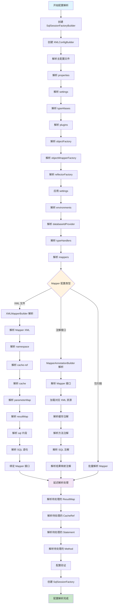
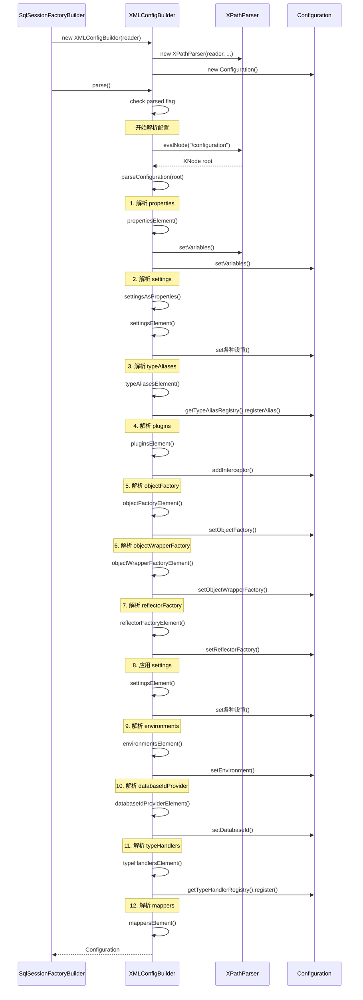
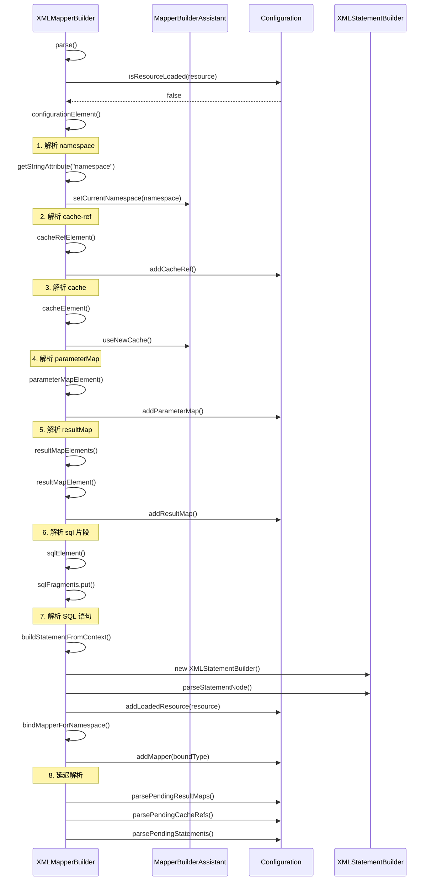
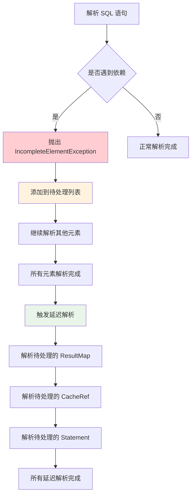
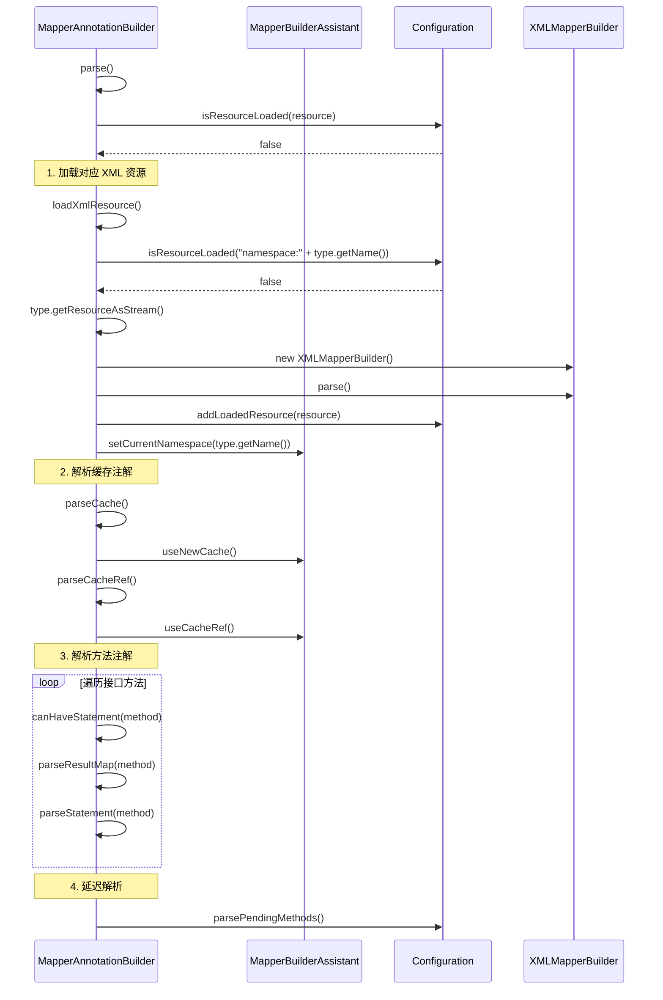
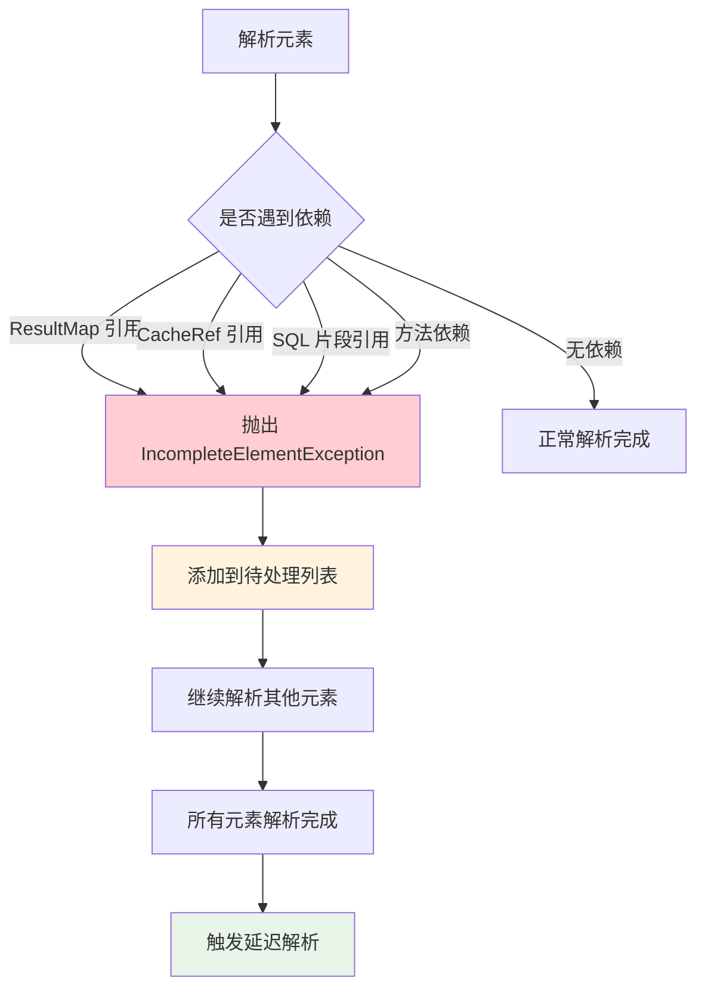
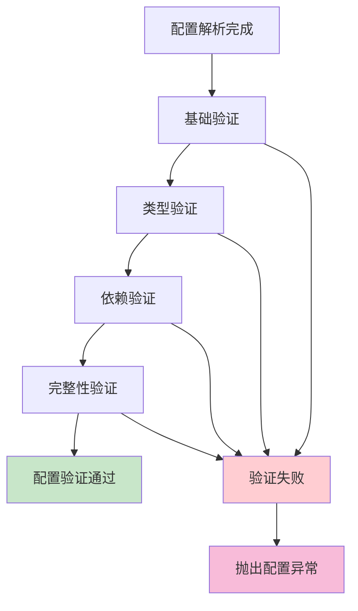
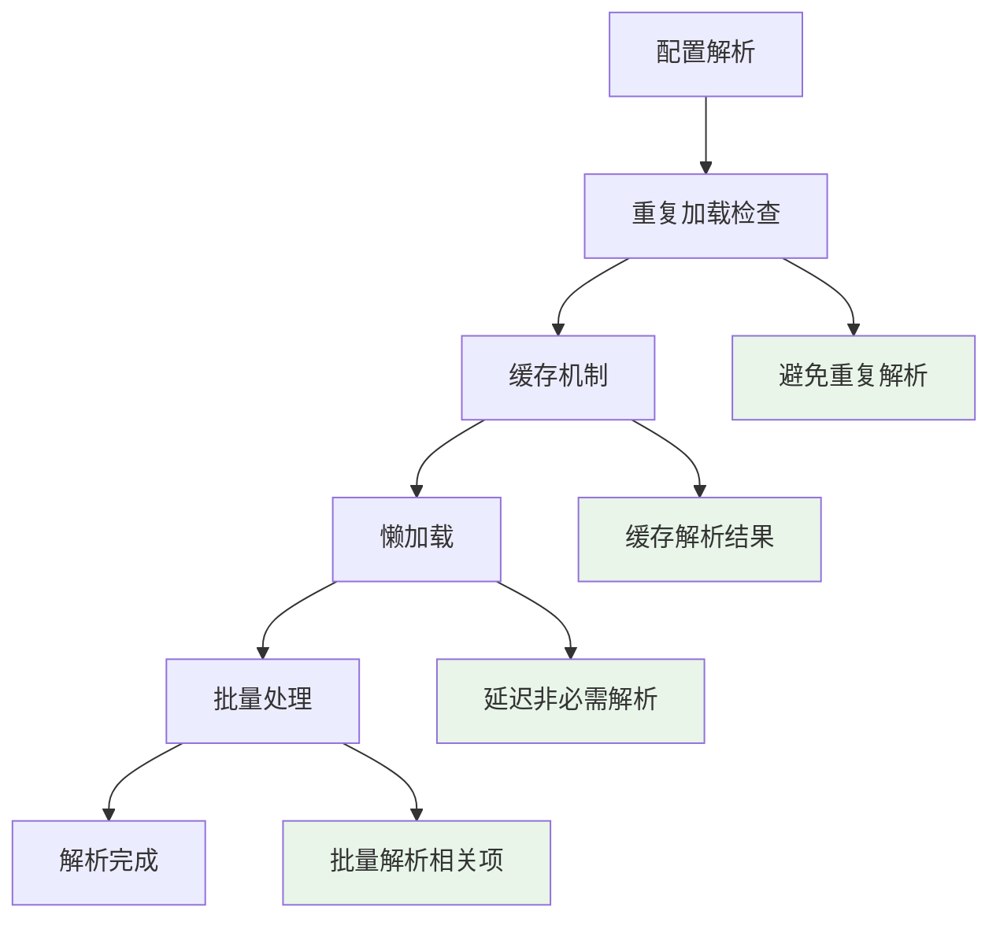
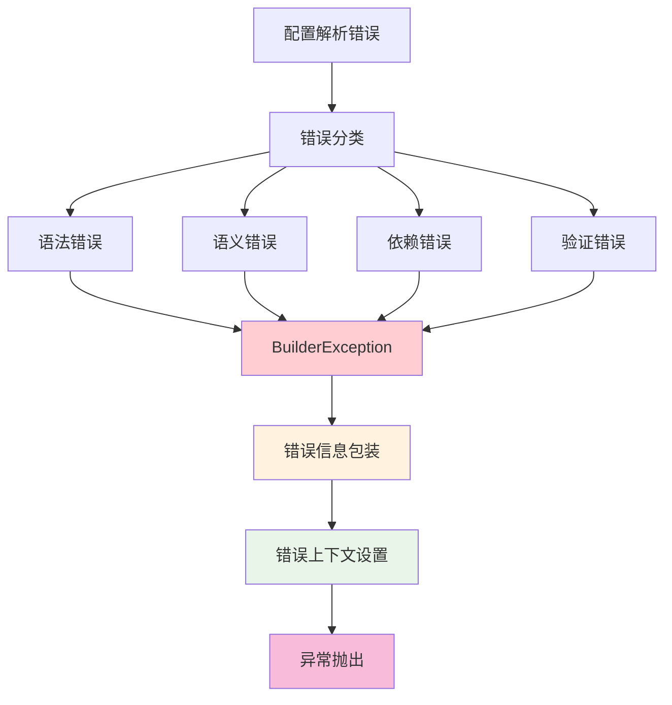

# MyBatis 配置解析流程图和详细步骤分析

## 1. 概述

MyBatis 配置系统是一个复杂的解析系统，涉及多个组件的协作。本文档通过流程图和详细步骤分析，帮助读者深入理解 MyBatis 配置解析的完整流程。

### 1.1 配置解析的层次结构

```
配置解析系统
├── 主配置文件解析 (mybatis-config.xml)
│   ├── XMLConfigBuilder
│   ├── 全局配置项解析
│   └── Mapper 配置解析
├── Mapper XML 文件解析
│   ├── XMLMapperBuilder
│   ├── SQL 语句解析
│   └── 结果映射解析
└── Mapper 接口注解解析
    ├── MapperAnnotationBuilder
    ├── 注解解析
    └── 混合配置处理
```

## 2. 整体配置解析流程图



## 3. 主配置文件解析详细流程

### 3.1 XMLConfigBuilder 解析流程



### 3.2 解析顺序的重要性

MyBatis 配置解析的顺序是经过精心设计的，每个步骤都有其特定的原因：

1. **properties 优先**：为后续解析提供变量支持
2. **settings 延迟应用**：在工厂创建后再应用设置
3. **typeAliases 靠前**：为后续解析提供类型别名支持
4. **plugins 靠前**：插件可能影响其他组件的创建
5. **environments 靠后**：需要前面的配置支持

## 4. Mapper XML 解析详细流程

### 4.1 XMLMapperBuilder 解析流程



### 4.2 延迟解析机制



## 5. Mapper 注解解析详细流程

### 5.1 MapperAnnotationBuilder 解析流程



### 5.2 注解解析的详细步骤

```mermaid
flowchart TD
    A[解析方法注解] --> B[获取方法参数类型]
    B --> C[获取语言驱动]
    C --> D[解析 SQL 注解]
    
    D --> E{注解类型}
    E -->|@Select| F[解析静态 SQL]
    E -->|@Insert| F
    E -->|@Update| F
    E -->|@Delete| F
    E -->|@SelectProvider| G[解析动态 SQL]
    E -->|@InsertProvider| G
    E -->|@UpdateProvider| G
    E -->|@DeleteProvider| G
    
    F --> H[构建 SqlSource]
    G --> H
    
    H --> I[解析 @Options 注解]
    I --> J[配置键生成器]
    J --> K[解析结果映射注解]
    
    K --> L{结果映射类型}
    L -->|@Results| M[解析 @Result 注解]
    L -->|@ResultMap| N[引用已有结果映射]
    L -->|无注解| O[自动生成结果映射]
    
    M --> P[构建 ResultMapping]
    N --> P
    O --> P
    
    P --> Q[创建 MappedStatement]
    Q --> R[注册到 Configuration]
    
    style E fill:#fff3e0
    style L fill:#fff3e0
```

## 6. 配置解析的关键步骤详解

### 6.1 步骤1：Properties 解析

```java
private void propertiesElement(XNode context) throws Exception {
    if (context != null) {
        // 1. 获取子属性
        Properties defaults = context.getChildrenAsProperties();
        
        // 2. 处理外部资源
        String resource = context.getStringAttribute("resource");
        String url = context.getStringAttribute("url");
        if (resource != null) {
            defaults.putAll(Resources.getResourceAsProperties(resource));
        } else if (url != null) {
            defaults.putAll(Resources.getUrlAsProperties(url));
        }
        
        // 3. 合并构造函数传入的属性
        Properties vars = configuration.getVariables();
        if (vars != null) {
            defaults.putAll(vars);
        }
        
        // 4. 设置变量
        parser.setVariables(defaults);
        configuration.setVariables(defaults);
    }
}
```

**关键点**：
- **优先级**：构造函数属性 > 外部资源 > 子属性
- **变量替换**：为后续解析提供变量支持
- **资源加载**：支持从文件和URL加载属性

### 6.2 步骤2：Settings 解析

```java
private void settingsElement(Properties props) throws Exception {
    // 1. 自动映射行为
    configuration.setAutoMappingBehavior(
        AutoMappingBehavior.valueOf(props.getProperty("autoMappingBehavior", "PARTIAL")));
    
    // 2. 缓存配置
    configuration.setCacheEnabled(
        booleanValueOf(props.getProperty("cacheEnabled"), true));
    
    // 3. 懒加载配置
    configuration.setLazyLoadingEnabled(
        booleanValueOf(props.getProperty("lazyLoadingEnabled"), false));
    
    // 4. 执行器类型
    configuration.setDefaultExecutorType(
        ExecutorType.valueOf(props.getProperty("defaultExecutorType", "SIMPLE")));
    
    // ... 其他设置
}
```

**关键点**：
- **默认值处理**：为未配置的项提供合理默认值
- **类型转换**：将字符串配置转换为相应类型
- **验证机制**：验证配置项的有效性

### 6.3 步骤3：TypeAliases 解析

```java
private void typeAliasesElement(XNode context) {
    if (context == null) {
        return;
    }
    for (XNode child : context.getChildren()) {
        if ("package".equals(child.getName())) {
            // 包扫描方式
            String typeAliasPackage = child.getStringAttribute("name");
            configuration.getTypeAliasRegistry().registerAliases(typeAliasPackage);
        } else {
            // 单个注册方式
            String alias = child.getStringAttribute("alias");
            String type = child.getStringAttribute("type");
            Class<?> clazz = Resources.classForName(type);
            if (alias == null) {
                typeAliasRegistry.registerAlias(clazz);
            } else {
                typeAliasRegistry.registerAlias(alias, clazz);
            }
        }
    }
}
```

**关键点**：
- **包扫描**：支持批量注册类型别名
- **单个注册**：支持精确控制别名
- **默认别名**：未指定别名时使用类名

### 6.4 步骤4：Environments 解析

```java
private void environmentsElement(XNode context) throws Exception {
    if (context != null) {
        if (environment == null) {
            environment = context.getStringAttribute("default");
        }
        for (XNode child : context.getChildren()) {
            String id = child.getStringAttribute("id");
            if (isSpecifiedEnvironment(id)) {
                // 1. 解析事务工厂
                TransactionFactory txFactory = transactionManagerElement(child.evalNode("transactionManager"));
                
                // 2. 解析数据源
                DataSourceFactory dsFactory = dataSourceElement(child.evalNode("dataSource"));
                DataSource dataSource = dsFactory.getDataSource();
                
                // 3. 构建环境
                Environment.Builder environmentBuilder = new Environment.Builder(id)
                    .transactionFactory(txFactory)
                    .dataSource(dataSource);
                configuration.setEnvironment(environmentBuilder.build());
                break;
            }
        }
    }
}
```

**关键点**：
- **环境选择**：根据配置选择指定环境
- **事务工厂**：创建事务管理工厂
- **数据源**：创建数据库连接源

### 6.5 步骤5：Mappers 解析

```java
private void mappersElement(XNode context) throws Exception {
    if (context != null) {
        for (XNode child : context.getChildren()) {
            if ("package".equals(child.getName())) {
                // 包扫描方式
                String mapperPackage = child.getStringAttribute("name");
                configuration.addMappers(mapperPackage);
            } else {
                String resource = child.getStringAttribute("resource");
                String url = child.getStringAttribute("url");
                String mapperClass = child.getStringAttribute("class");
                
                if (resource != null && url == null && mapperClass == null) {
                    // XML 文件方式
                    XMLMapperBuilder xmlParser = new XMLMapperBuilder(inputStream, configuration, resource, configuration.getSqlFragments());
                    xmlParser.parse();
                } else if (resource == null && url != null && mapperClass == null) {
                    // URL 方式
                    XMLMapperBuilder xmlParser = new XMLMapperBuilder(inputStream, configuration, url, configuration.getSqlFragments());
                    xmlParser.parse();
                } else if (resource == null && url == null && mapperClass != null) {
                    // 注解接口方式
                    Class<?> mapperInterface = Resources.classForName(mapperClass);
                    configuration.addMapper(mapperInterface);
                } else {
                    throw new BuilderException("A mapper element may only specify a url, resource or class, but not more than one.");
                }
            }
        }
    }
}
```

**关键点**：
- **多种方式**：支持包扫描、XML文件、URL、注解接口
- **冲突检查**：确保只指定一种方式
- **解析委托**：委托给相应的解析器处理

## 7. 延迟解析机制详解

### 7.1 延迟解析的触发条件



### 7.2 延迟解析的处理流程

```java
// 1. 捕获 IncompleteElementException
try {
    statementParser.parseStatementNode();
} catch (IncompleteElementException e) {
    configuration.addIncompleteStatement(statementParser);
}

// 2. 延迟解析触发
configuration.parsePendingResultMaps(false);
configuration.parsePendingCacheRefs(false);
configuration.parsePendingStatements(false);
configuration.parsePendingMethods(false);
```

### 7.3 延迟解析的优势

1. **跨文件依赖**：支持 Mapper XML 文件之间的相互引用
2. **循环依赖处理**：能够处理复杂的循环依赖关系
3. **解析顺序无关**：不依赖文件的加载顺序
4. **性能优化**：避免重复解析和无效解析

## 8. 配置验证机制

### 8.1 配置验证的层次



### 8.2 验证内容详解

1. **基础验证**：
   - 必需配置项是否存在
   - 配置值格式是否正确

2. **类型验证**：
   - 类名是否能正确加载
   - 类型是否匹配

3. **依赖验证**：
   - 引用的配置项是否存在
   - 依赖关系是否正确

4. **完整性验证**：
   - 配置项之间的逻辑关系
   - 整体配置的完整性

## 9. 性能优化策略

### 9.1 解析性能优化



### 9.2 内存优化策略

1. **对象复用**：复用解析过程中的对象
2. **及时释放**：及时释放不需要的资源
3. **内存监控**：监控内存使用情况
4. **GC 优化**：优化垃圾回收性能

## 10. 错误处理机制

### 10.1 错误处理层次



### 10.2 错误处理特点

1. **统一异常类型**：所有配置异常都包装为 BuilderException
2. **详细错误信息**：提供详细的错误信息和上下文
3. **错误链**：保留原始异常信息
4. **错误定位**：提供错误发生的具体位置

## 11. 总结

MyBatis 配置解析是一个复杂的系统工程，涉及多个组件的协作。通过深入分析配置解析的流程和步骤，我们可以更好地理解：

1. **解析顺序的重要性**：每个解析步骤都有其特定的原因和依赖关系
2. **延迟解析机制**：如何处理跨文件的依赖关系
3. **错误处理机制**：如何提供友好的错误信息
4. **性能优化策略**：如何提高解析性能
5. **扩展性设计**：如何支持自定义扩展

理解配置解析的完整流程，对于深入掌握 MyBatis 的工作原理、解决配置问题以及进行自定义扩展都具有重要意义。配置解析是 MyBatis 的基础，只有深入理解其原理，才能更好地使用和扩展 MyBatis 的功能。
