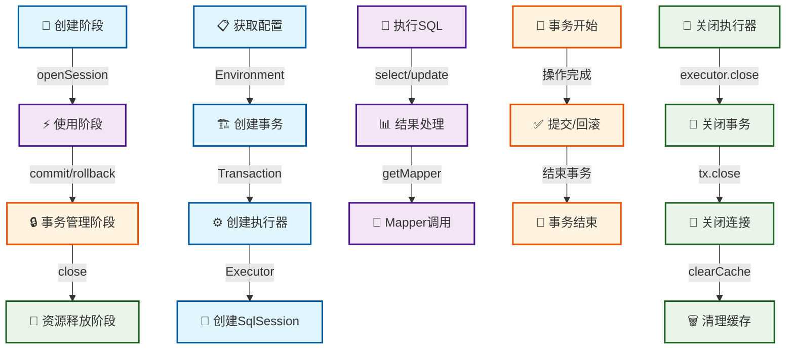
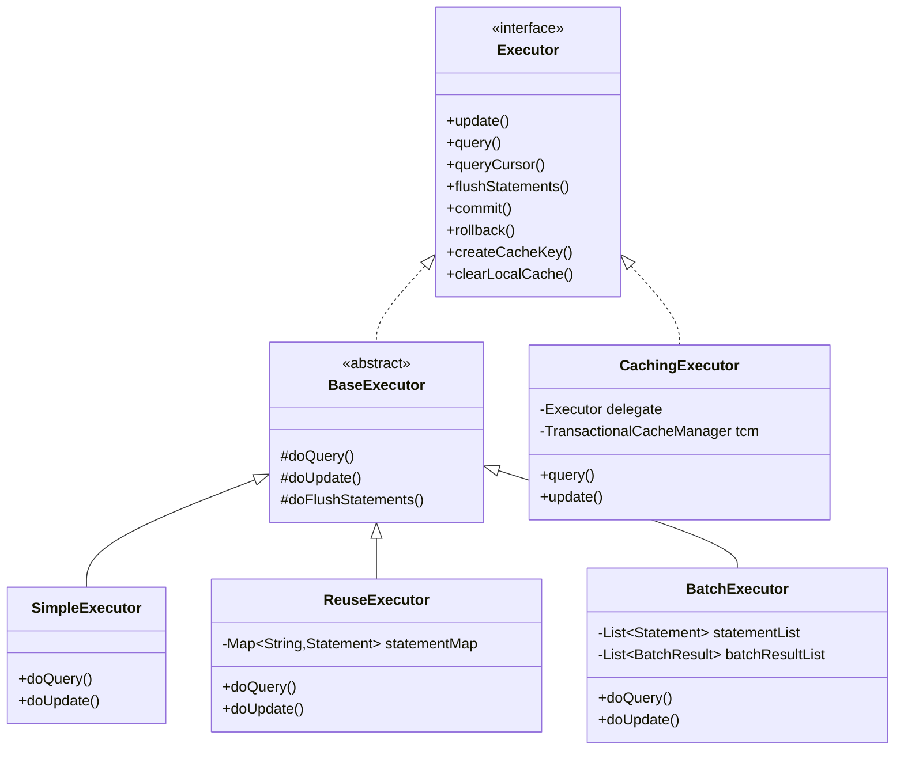

# 第3篇：SqlSession的创建与生命周期

## 1. 学习目标确认

### 1.0 第2篇思考题解答

在深入学习SqlSession之前，让我们先回顾并解答第2篇中提出的思考题，这将帮助我们更好地理解SqlSession在整个架构中的作用。

#### 思考题1：为什么MyBatis要设计如此复杂的配置系统？

**答案要点**：

- **统一管理**：所有配置项集中管理，避免配置分散和重复
- **灵活性**：支持XML、注解、代码三种配置方式，满足不同场景需求
- **可扩展性**：通过插件系统和自定义配置支持功能扩展
- **性能优化**：配置缓存、懒加载等机制提升性能
- **类型安全**：强类型配置减少运行时错误

**SqlSession的作用**：SqlSession作为配置系统的使用者，通过Configuration获取所有必要的配置信息。

#### 思考题2：配置系统的扩展性体现在哪些方面？

**答案要点**：

- **插件扩展**：Interceptor接口支持功能扩展
- **类型处理器扩展**：TypeHandler接口支持自定义类型转换
- **对象工厂扩展**：ObjectFactory接口支持自定义对象创建
- **数据源扩展**：DataSource接口支持自定义数据源
- **事务管理扩展**：TransactionFactory接口支持自定义事务管理

**SqlSession的扩展性**：SqlSession通过Executor、StatementHandler等组件实现功能扩展。

#### 思考题3：如何优化配置解析的性能？

**答案要点**：

- **缓存机制**：解析后的配置对象缓存，避免重复解析
- **懒加载**：非必需配置延迟加载，减少启动时间
- **批量处理**：相关配置项批量解析，提高效率
- **内存优化**：优化配置对象的内存使用，减少GC压力

**SqlSession的性能**：SqlSession通过Executor缓存、连接池等技术优化性能。

#### 思考题4：基于配置系统的理解，应该从哪个组件开始深入源码分析？

**推荐顺序**：SqlSession → Executor → StatementHandler → ParameterHandler + ResultSetHandler

**从SqlSession开始的原因**：

- SqlSession是配置系统的直接使用者
- 理解SqlSession有助于理解整个执行流程
- 为后续学习Executor等组件奠定基础

### 1.1 SqlSession概述（基于MyBatis 3.5.x）

SqlSession是MyBatis的核心接口，代表与数据库的一次会话。它是MyBatis架构中接口层的重要组成部分，为用户提供了简洁的API来执行数据库操作。

**SqlSession的核心职责**：

1. **数据库操作**：提供CRUD操作的统一接口
2. **事务管理**：管理数据库事务的提交和回滚
3. **Mapper管理**：获取Mapper接口的动态代理对象
4. **会话管理**：管理会话的生命周期和资源释放

**重要提示**：理解SqlSession的设计和实现是深入MyBatis源码的关键，后续的Executor、StatementHandler等组件都围绕SqlSession展开。

## 2. SqlSession接口设计分析

### 2.1 SqlSession接口结构

让我们深入分析SqlSession接口的设计：

```java
package org.apache.ibatis.session;

import java.io.Closeable;
import java.sql.Connection;
import java.util.List;
import java.util.Map;
import org.apache.ibatis.cursor.Cursor;
import org.apache.ibatis.executor.BatchResult;
import org.apache.ibatis.executor.result.ResultHandler;

public interface SqlSession extends Closeable {
    // 查询操作
    <T> T selectOne(String statement);
    <T> T selectOne(String statement, Object parameter);
    <E> List<E> selectList(String statement);
    <E> List<E> selectList(String statement, Object parameter);
    <E> List<E> selectList(String statement, Object parameter, RowBounds rowBounds);
  
    // Map查询操作
    <K, V> Map<K, V> selectMap(String statement, String mapKey);
    <K, V> Map<K, V> selectMap(String statement, Object parameter, String mapKey);
    <K, V> Map<K, V> selectMap(String statement, Object parameter, String mapKey, RowBounds rowBounds);
  
    // 游标查询
    <T> Cursor<T> selectCursor(String statement);
    <T> Cursor<T> selectCursor(String statement, Object parameter);
    <T> Cursor<T> selectCursor(String statement, Object parameter, RowBounds rowBounds);
  
    // 自定义结果处理（流式结果）
    void select(String statement, Object parameter, ResultHandler handler);
    void select(String statement, ResultHandler handler);
    void select(String statement, Object parameter, RowBounds rowBounds, ResultHandler handler);
  
    // 更新操作
    int insert(String statement);
    int insert(String statement, Object parameter);
    int update(String statement);
    int update(String statement, Object parameter);
    int delete(String statement);
    int delete(String statement, Object parameter);
  
    // 事务管理
    void commit();
    void commit(boolean force);
    void rollback();
    void rollback(boolean force);
  
    // 批量操作
    List<BatchResult> flushStatements();
  
    // Mapper获取
    <T> T getMapper(Class<T> type);
  
    // 连接管理
    Connection getConnection();
  
    // 配置获取
    Configuration getConfiguration();
  
    // 缓存管理
    void clearCache();
}
```

### 2.2 接口设计特点分析

#### 2.2.1 泛型设计

```java
// 泛型设计提供了类型安全
<T> T selectOne(String statement, Object parameter);
<E> List<E> selectList(String statement, Object parameter);
```

**优势**：

- **类型安全**：编译时类型检查，避免运行时类型转换错误
- **代码简洁**：无需手动类型转换
- **IDE支持**：更好的代码提示和重构支持

#### 2.2.2 ResultHandler自定义结果处理

```java
// 支持自定义结果处理，适用于流式结果处理
void select(String statement, Object parameter, ResultHandler handler);
void select(String statement, ResultHandler handler);
void select(String statement, Object parameter, RowBounds rowBounds, ResultHandler handler);
```

**使用场景**：

- **流式处理**：处理大量数据时避免内存溢出
- **自定义转换**：对结果进行自定义处理
- **实时处理**：边查询边处理结果

**示例用法**：

```java
// 流式处理大量数据
session.select("selectAllUsers", null, new ResultHandler<User>() {
    @Override
    public void handleResult(ResultContext<? extends User> resultContext) {
        User user = resultContext.getResultObject();
        // 实时处理每个用户数据
        processUser(user);
    }
});
```

#### 2.2.3 方法重载设计

```java
// 支持不同参数组合
<T> T selectOne(String statement);
<T> T selectOne(String statement, Object parameter);
<E> List<E> selectList(String statement, Object parameter);
<E> List<E> selectList(String statement, Object parameter, RowBounds rowBounds);
```

**优势**：

- **使用灵活**：支持不同使用场景
- **向后兼容**：保持API的向后兼容性
- **渐进式学习**：从简单到复杂的使用方式

#### 2.2.4 资源管理设计

```java
public interface SqlSession extends Closeable {
    // 继承Closeable接口，支持try-with-resources语法
}
```

**优势**：

- **自动资源管理**：支持try-with-resources语法
- **防止资源泄漏**：确保资源正确释放
- **代码简洁**：减少样板代码

## 3. SqlSessionFactory工厂模式分析

### 3.1 SqlSessionFactory接口设计

SqlSessionFactory是创建SqlSession的工厂接口，采用工厂模式设计：

```java
package org.apache.ibatis.session;

import java.sql.Connection;

public interface SqlSessionFactory {
    // 基本创建方法
    SqlSession openSession();
    SqlSession openSession(boolean autoCommit);
    SqlSession openSession(Connection connection);
  
    // 执行器类型指定
    SqlSession openSession(ExecutorType execType);
    SqlSession openSession(ExecutorType execType, boolean autoCommit);
    SqlSession openSession(ExecutorType execType, TransactionIsolationLevel level);
    SqlSession openSession(ExecutorType execType, Connection connection);
  
    // 事务隔离级别指定
    SqlSession openSession(TransactionIsolationLevel level);
  
    // 配置获取
    Configuration getConfiguration();
}
```

### 3.2 DefaultSqlSessionFactory实现分析

DefaultSqlSessionFactory是SqlSessionFactory的默认实现，让我们深入分析其源码：

```java
package org.apache.ibatis.session.defaults;

import org.apache.ibatis.executor.Executor;
import org.apache.ibatis.session.Configuration;
import org.apache.ibatis.session.ExecutorType;
import org.apache.ibatis.session.SqlSession;
import org.apache.ibatis.session.SqlSessionFactory;
import org.apache.ibatis.session.TransactionIsolationLevel;
import org.apache.ibatis.transaction.Transaction;
import org.apache.ibatis.transaction.TransactionFactory;
import org.apache.ibatis.transaction.managed.ManagedTransactionFactory;
import org.apache.ibatis.mapping.Environment;
import org.apache.ibatis.exceptions.ExceptionFactory;
import org.apache.ibatis.executor.ErrorContext;

public class DefaultSqlSessionFactory implements SqlSessionFactory {
    private final Configuration configuration;
  
    public DefaultSqlSessionFactory(Configuration configuration) {
        this.configuration = configuration;
    }
  
    @Override
    public SqlSession openSession() {
        return openSessionFromDataSource(configuration.getDefaultExecutorType(), null, false);
    }
  
    @Override
    public SqlSession openSession(boolean autoCommit) {
        return openSessionFromDataSource(configuration.getDefaultExecutorType(), null, autoCommit);
    }
  
    @Override
    public SqlSession openSession(ExecutorType execType) {
        return openSessionFromDataSource(execType, null, false);
    }
  
    // 核心创建方法
    private SqlSession openSessionFromDataSource(ExecutorType execType, TransactionIsolationLevel level, boolean autoCommit) {
        Transaction tx = null;
        try {
            // 1. 获取环境配置
            final Environment environment = configuration.getEnvironment();
        
            // 2. 获取事务工厂
            final TransactionFactory transactionFactory = getTransactionFactoryFromEnvironment(environment);
        
            // 3. 创建事务
            tx = transactionFactory.newTransaction(environment.getDataSource(), level, autoCommit);
        
            // 4. 创建执行器
            final Executor executor = configuration.newExecutor(tx, execType);
        
            // 5. 创建SqlSession
            return createSqlSession(configuration, executor, autoCommit);
        } catch (Exception e) {
            closeTransaction(tx);
            throw ExceptionFactory.wrapException("Error opening session.  Cause: " + e, e);
        } finally {
            ErrorContext.instance().reset();
        }
    }
  
    protected SqlSession createSqlSession(Configuration configuration, Executor executor, boolean autoCommit) {
        return new DefaultSqlSession(configuration, executor, autoCommit);
    }
}
```

### 3.3 工厂模式的优势

#### 3.3.1 封装复杂性

```java
// 用户只需要调用简单的方法
SqlSession session = sqlSessionFactory.openSession();

// 内部复杂的创建过程被封装
// 1. 环境配置获取
// 2. 事务工厂创建
// 3. 事务对象创建
// 4. 执行器创建
// 5. SqlSession创建
```

#### 3.3.2 参数灵活性

```java
// 支持多种参数组合
SqlSession session1 = sqlSessionFactory.openSession(); // 默认配置
SqlSession session2 = sqlSessionFactory.openSession(true); // 自动提交
SqlSession session3 = sqlSessionFactory.openSession(ExecutorType.BATCH); // 批处理执行器
```

#### 3.3.3 配置驱动

```java
// 基于Configuration配置创建SqlSession
final Executor executor = configuration.newExecutor(tx, execType);
```

## 4. SqlSession生命周期管理

### 4.1 生命周期阶段

SqlSession的生命周期可以分为以下几个阶段：



### 4.2 创建阶段详细分析

#### 4.2.1 配置获取

```java
// 从Configuration获取环境配置
final Environment environment = configuration.getEnvironment();
```

**Environment包含**：

- **DataSource**：数据源配置
- **TransactionFactory**：事务工厂配置
- **Id**：环境标识

#### 4.2.2 事务创建

```java
// 创建事务对象
final TransactionFactory transactionFactory = getTransactionFactoryFromEnvironment(environment);
tx = transactionFactory.newTransaction(environment.getDataSource(), level, autoCommit);
```

**事务创建过程**：

1. **获取事务工厂**：从环境配置获取TransactionFactory
2. **创建事务对象**：使用DataSource和参数创建Transaction
3. **设置事务属性**：隔离级别、自动提交等

#### 4.2.3 执行器创建

```java
// 创建执行器
final Executor executor = configuration.newExecutor(tx, execType);
```

**执行器创建过程**：

1. **执行器类型选择**：根据ExecutorType选择具体实现
2. **缓存包装**：如果启用缓存，用CachingExecutor包装
3. **插件应用**：应用所有配置的插件

#### 4.2.4 SqlSession创建

```java
// 创建SqlSession对象
return new DefaultSqlSession(configuration, executor, autoCommit);
```

### 4.3 使用阶段分析

#### 4.3.1 SQL执行流程

```java
// 用户调用
User user = session.selectOne("selectUser", 1);

// 内部执行流程
public <T> T selectOne(String statement, Object parameter) {
    List<T> list = this.selectList(statement, parameter);
    if (list.size() == 1) {
        return list.get(0);
    }
    if (list.size() > 1) {
        throw new TooManyResultsException("Expected one result...");
    } else {
        return null;
    }
}
```

#### 4.3.2 Mapper获取流程

```java
// 用户调用
UserMapper mapper = session.getMapper(UserMapper.class);

// 内部实现
@Override
public <T> T getMapper(Class<T> type) {
    return configuration.getMapper(type, this);
}
```

### 4.4 资源释放阶段

#### 4.4.1 手动关闭

```java
// 手动关闭SqlSession
session.close();

// 内部关闭流程
@Override
public void close() {
    try {
        executor.close(isCommitOrRollbackRequired(false));
    } catch (SQLException e) {
        throw ExceptionFactory.wrapException("Error closing SqlSession.  Cause: " + e, e);
    } finally {
        // 清理资源
        dirty = false;
        executor = null;
        configuration = null;
    }
}
```

#### 4.4.2 自动关闭

```java
// 使用try-with-resources语法
try (SqlSession session = sqlSessionFactory.openSession()) {
    User user = session.selectOne("selectUser", 1);
    // 自动关闭
}
```

## 5. DefaultSqlSession实现分析

### 5.1 DefaultSqlSession类结构

```java
public class DefaultSqlSession implements SqlSession {
    private final Configuration configuration;
    private final Executor executor;
    private final boolean autoCommit;
    private boolean dirty;
    private List<Cursor<?>> cursorList;
  
    public DefaultSqlSession(Configuration configuration, Executor executor, boolean autoCommit) {
        this.configuration = configuration;
        this.executor = executor;
        this.dirty = false;
        this.autoCommit = autoCommit;
    }
}
```

### 5.2 核心方法实现分析

#### 5.2.1 selectOne方法实现

```java
@Override
public <T> T selectOne(String statement, Object parameter) {
    // 调用selectList获取结果
    List<T> list = this.selectList(statement, parameter);
  
    // 结果数量验证
    if (list.size() == 1) {
        return list.get(0);
    }
    if (list.size() > 1) {
        throw new TooManyResultsException(
            "Expected one result (or null) to be returned by selectOne(), but found: " + list.size());
    } else {
        return null;
    }
}
```

**设计亮点**：

- **复用selectList**：避免代码重复
- **结果验证**：确保返回单个结果
- **异常处理**：结果过多时抛出异常

#### 5.2.2 selectList方法实现

```java
@Override
public <E> List<E> selectList(String statement, Object parameter, RowBounds rowBounds) {
    try {
        // 1. 获取MappedStatement
        MappedStatement ms = configuration.getMappedStatement(statement);
    
        // 2. 委托给Executor执行
        return executor.query(ms, wrapCollection(parameter), rowBounds, Executor.NO_RESULT_HANDLER);
    } catch (Exception e) {
        throw ExceptionFactory.wrapException("Error querying database.  Cause: " + e, e);
    } finally {
        ErrorContext.instance().reset();
    }
}
```

**执行流程**：

1. **获取映射语句**：从Configuration获取MappedStatement
2. **参数包装**：处理集合参数
3. **委托执行**：委托给Executor执行查询
4. **异常处理**：统一异常处理
5. **资源清理**：重置错误上下文

#### 5.2.3 update方法实现

```java
@Override
public int update(String statement, Object parameter) {
    try {
        // 1. 标记为脏数据
        dirty = true;
    
        // 2. 获取MappedStatement
        MappedStatement ms = configuration.getMappedStatement(statement);
    
        // 3. 委托给Executor执行
        return executor.update(ms, wrapCollection(parameter));
    } catch (Exception e) {
        throw ExceptionFactory.wrapException("Error updating database.  Cause: " + e, e);
    } finally {
        ErrorContext.instance().reset();
    }
}
```

**设计特点**：

- **脏数据标记**：标记SqlSession为脏状态
- **统一处理**：insert、update、delete都使用相同逻辑

#### 5.2.4 事务管理方法

```java
@Override
public void commit() {
    commit(false);
}

@Override
public void commit(boolean force) {
    try {
        executor.commit(isCommitOrRollbackRequired(force));
        dirty = false;
    } catch (Exception e) {
        throw ExceptionFactory.wrapException("Error committing transaction.  Cause: " + e, e);
    } finally {
        ErrorContext.instance().reset();
    }
}

@Override
public void rollback() {
    rollback(false);
}

@Override
public void rollback(boolean force) {
    try {
        executor.rollback(isCommitOrRollbackRequired(force));
        dirty = false;
    } catch (Exception e) {
        throw ExceptionFactory.wrapException("Error rolling back transaction.  Cause: " + e, e);
    } finally {
        ErrorContext.instance().reset();
    }
}
```

**事务管理特点**：

- **条件提交**：根据dirty状态决定是否需要提交
- **强制选项**：支持强制提交/回滚
- **状态重置**：提交/回滚后重置dirty状态

## 6. Executor执行器体系分析

### 6.1 Executor接口设计

Executor是MyBatis执行器的核心接口，其继承关系如下：



Executor是MyBatis执行器的核心接口：

```java
public interface Executor {
    // 查询操作
    <E> List<E> query(MappedStatement ms, Object parameter, RowBounds rowBounds, ResultHandler resultHandler) throws SQLException;
    <E> List<E> query(MappedStatement ms, Object parameter, RowBounds rowBounds, ResultHandler resultHandler, CacheKey cacheKey, BoundSql boundSql) throws SQLException;
    <E> Cursor<E> queryCursor(MappedStatement ms, Object parameter, RowBounds rowBounds) throws SQLException;
  
    // 更新操作
    int update(MappedStatement ms, Object parameter) throws SQLException;
  
    // 事务管理
    void commit(boolean required) throws SQLException;
    void rollback(boolean required) throws SQLException;
  
    // 缓存管理
    CacheKey createCacheKey(MappedStatement ms, Object parameterObject, RowBounds rowBounds, BoundSql boundSql);
    boolean isCached(MappedStatement ms, CacheKey key);
    void clearLocalCache();
  
    // 延迟加载
    void deferLoad(MappedStatement ms, MetaObject resultObject, String property, CacheKey key, Class<?> targetType);
  
    // 批量操作
    List<BatchResult> flushStatements() throws SQLException;
  
    // 资源管理
    Transaction getTransaction();
    void close(boolean forceRollback);
    boolean isClosed();
}
```

### 6.2 BaseExecutor抽象基类

BaseExecutor是Executor的抽象基类，实现了模板方法模式：

```java
public abstract class BaseExecutor implements Executor {
    protected Transaction transaction;
    protected Executor wrapper;
    protected PerpetualCache localCache;
    protected PerpetualCache localOutputParameterCache;
    protected Configuration configuration;
    protected int queryStack;
    private boolean closed;
  
    // 模板方法：查询操作
    @Override
    public <E> List<E> query(MappedStatement ms, Object parameter, RowBounds rowBounds, ResultHandler resultHandler) throws SQLException {
        BoundSql boundSql = ms.getBoundSql(parameter);
        CacheKey key = createCacheKey(ms, parameter, rowBounds, boundSql);
        return query(ms, parameter, rowBounds, resultHandler, key, boundSql);
    }
  
    @Override
    public <E> List<E> query(MappedStatement ms, Object parameter, RowBounds rowBounds, ResultHandler resultHandler, CacheKey cacheKey, BoundSql boundSql) throws SQLException {
        ErrorContext.instance().resource(ms.getResource()).activity("executing a query").object(ms.getId());
        if (closed) {
            throw new ExecutorException("Executor was closed.");
        }
        if (queryStack == 0 && ms.isFlushCacheRequired()) {
            clearLocalCache();
        }
        List<E> list;
        try {
            queryStack++;
            list = resultHandler == null ? (List<E>) localCache.getObject(cacheKey) : null;
            if (list != null) {
                handleLocallyCachedOutputParameters(ms, cacheKey, parameter, boundSql);
            } else {
                list = queryFromDatabase(ms, parameter, rowBounds, resultHandler, cacheKey, boundSql);
            }
        } finally {
            queryStack--;
        }
        if (queryStack == 0) {
            for (DeferredLoad deferredLoad : deferredLoads) {
                deferredLoad.load();
            }
            deferredLoads.clear();
            if (configuration.getLocalCacheScope() == LocalCacheScope.STATEMENT) {
                clearLocalCache();
            }
        }
        return list;
    }
  
    // 抽象方法：子类实现具体的数据库查询
    protected abstract <E> List<E> doQuery(MappedStatement ms, Object parameter, RowBounds rowBounds, ResultHandler resultHandler, BoundSql boundSql) throws SQLException;
  
    // 模板方法：更新操作
    @Override
    public int update(MappedStatement ms, Object parameter) throws SQLException {
        ErrorContext.instance().resource(ms.getResource()).activity("executing an update").object(ms.getId());
        if (closed) {
            throw new ExecutorException("Executor was closed.");
        }
        clearLocalCache();
        return doUpdate(ms, parameter);
    }
  
    // 抽象方法：子类实现具体的数据库更新
    protected abstract int doUpdate(MappedStatement ms, Object parameter) throws SQLException;
}
```

### 6.3 具体执行器实现

#### 6.3.1 SimpleExecutor

```java
public class SimpleExecutor extends BaseExecutor {
  
    public SimpleExecutor(Configuration configuration, Transaction transaction) {
        super(configuration, transaction);
    }
  
    @Override
    public <E> List<E> doQuery(MappedStatement ms, Object parameter, RowBounds rowBounds, ResultHandler resultHandler, BoundSql boundSql) throws SQLException {
        Statement stmt = null;
        try {
            Configuration configuration = ms.getConfiguration();
            StatementHandler handler = configuration.newStatementHandler(wrapper, ms, parameter, rowBounds, resultHandler, boundSql);
            stmt = prepareStatement(handler, ms.getStatementLog());
            return handler.query(stmt, resultHandler);
        } finally {
            closeStatement(stmt);
        }
    }
  
    @Override
    public int doUpdate(MappedStatement ms, Object parameter) throws SQLException {
        Statement stmt = null;
        try {
            Configuration configuration = ms.getConfiguration();
            StatementHandler handler = configuration.newStatementHandler(this, ms, parameter, RowBounds.DEFAULT, null, null);
            stmt = prepareStatement(handler, ms.getStatementLog());
            return handler.update(stmt);
        } finally {
            closeStatement(stmt);
        }
    }
  
    private Statement prepareStatement(StatementHandler handler, Log statementLog) throws SQLException {
        Statement stmt;
        Connection connection = getConnection(statementLog);
        stmt = handler.prepare(connection, transaction.getTimeout());
        handler.parameterize(stmt);
        return stmt;
    }
}
```

**特点**：

- **简单实现**：每次执行都创建新的Statement
- **资源管理**：及时关闭Statement和Connection
- **性能考虑**：适合单次执行场景

#### 6.3.2 ReuseExecutor

```java
public class ReuseExecutor extends BaseExecutor {
    private final Map<String, Statement> statementMap = new HashMap<>();
  
    @Override
    public <E> List<E> doQuery(MappedStatement ms, Object parameter, RowBounds rowBounds, ResultHandler resultHandler, BoundSql boundSql) throws SQLException {
        Configuration configuration = ms.getConfiguration();
        StatementHandler handler = configuration.newStatementHandler(wrapper, ms, parameter, rowBounds, resultHandler, boundSql);
        Statement stmt = prepareStatement(handler, ms.getStatementLog());
        return handler.query(stmt, resultHandler);
    }
  
    private Statement prepareStatement(StatementHandler handler, Log statementLog) throws SQLException {
        Statement stmt;
        BoundSql boundSql = handler.getBoundSql();
        String sql = boundSql.getSql();
        if (hasStatementFor(sql)) {
            stmt = getStatement(sql);
            applyTransactionTimeout(stmt);
        } else {
            Connection connection = getConnection(statementLog);
            stmt = handler.prepare(connection, transaction.getTimeout());
            putStatement(sql, stmt);
        }
        handler.parameterize(stmt);
        return stmt;
    }
  
    private boolean hasStatementFor(String sql) {
        return statementMap.containsKey(sql);
    }
  
    private Statement getStatement(String sql) {
        return statementMap.get(sql);
    }
  
    private void putStatement(String sql, Statement stmt) {
        statementMap.put(sql, stmt);
    }
}
```

**特点**：

- **Statement重用**：相同SQL重用Statement对象
- **性能优化**：减少Statement创建开销
- **内存管理**：需要管理Statement缓存

#### 6.3.3 BatchExecutor

```java
public class BatchExecutor extends BaseExecutor {
    private final List<Statement> statementList = new ArrayList<>();
    private final List<BatchResult> batchResultList = new ArrayList<>();
    private String currentSql;
    private MappedStatement currentStatement;
  
    @Override
    public int doUpdate(MappedStatement ms, Object parameter) throws SQLException {
        final Configuration configuration = ms.getConfiguration();
        final StatementHandler handler = configuration.newStatementHandler(this, ms, parameter, RowBounds.DEFAULT, null, null);
        final BoundSql boundSql = handler.getBoundSql();
        final String sql = boundSql.getSql();
        final StatementType statementType = ms.getStatementType();
    
        if (sql.equals(currentSql) && statementType == currentStatement.getStatementType()) {
            // 相同SQL，重用Statement
            final Statement stmt = statementList.get(statementList.size() - 1);
            applyTransactionTimeout(stmt);
            handler.parameterize(stmt);
            BatchResult batchResult = batchResultList.get(batchResultList.size() - 1);
            batchResult.addParameterObject(parameter);
            return BATCH_UPDATE_RETURN_VALUE;
        } else {
            // 不同SQL，创建新Statement
            final Statement stmt;
            if (sql.equals(currentSql) && ms.getStatementType() == currentStatement.getStatementType()) {
                int last = statementList.size() - 1;
                stmt = statementList.get(last);
                applyTransactionTimeout(stmt);
                handler.parameterize(stmt);
                BatchResult batchResult = batchResultList.get(last);
                batchResult.addParameterObject(parameter);
            } else {
                Connection connection = getConnection(ms.getStatementLog());
                stmt = handler.prepare(connection, transaction.getTimeout());
                handler.parameterize(stmt);
                currentSql = sql;
                currentStatement = ms;
                statementList.add(stmt);
                batchResultList.add(new BatchResult(ms, sql, parameter));
            }
            handler.batch(stmt);
            return BATCH_UPDATE_RETURN_VALUE;
        }
    }
}
```

**特点**：

- **批量执行**：收集多个SQL语句批量执行
- **性能优化**：减少数据库交互次数
- **结果管理**：管理批量执行的结果

### 6.4 CachingExecutor缓存装饰器

```java
public class CachingExecutor implements Executor {
    private final Executor delegate;
    private final TransactionalCacheManager tcm = new TransactionalCacheManager();
  
    public CachingExecutor(Executor delegate) {
        this.delegate = delegate;
        delegate.setExecutorWrapper(this);
    }
  
    @Override
    public <E> List<E> query(MappedStatement ms, Object parameterObject, RowBounds rowBounds, ResultHandler resultHandler, CacheKey key, BoundSql boundSql) throws SQLException {
        Cache cache = ms.getCache();
        if (cache != null) {
            flushCacheIfRequired(ms);
            if (ms.isUseCache() && resultHandler == null) {
                ensureNoOutParams(ms, boundSql);
                @SuppressWarnings("unchecked")
                List<E> list = (List<E>) tcm.getObject(cache, key);
                if (list == null) {
                    list = delegate.query(ms, parameterObject, rowBounds, resultHandler, key, boundSql);
                    tcm.putObject(cache, key, list);
                }
                return list;
            }
        }
        return delegate.query(ms, parameterObject, rowBounds, resultHandler, key, boundSql);
    }
  
    @Override
    public int update(MappedStatement ms, Object parameterObject) throws SQLException {
        flushCacheIfRequired(ms);
        return delegate.update(ms, parameterObject);
    }
  
    private void flushCacheIfRequired(MappedStatement ms) {
        Cache cache = ms.getCache();
        if (cache != null && ms.isFlushCacheRequired()) {
            tcm.clear(cache);
        }
    }
}
```

**特点**：

- **装饰器模式**：包装其他执行器，添加缓存功能
- **二级缓存**：支持跨SqlSession的缓存
- **缓存管理**：自动管理缓存的刷新和清理

### 6.4 Executor类型总结

| 执行器类型                | 特点                    | 适用场景             | 性能特点                 |
| ------------------------- | ----------------------- | -------------------- | ------------------------ |
| **SimpleExecutor**  | 每次执行创建新Statement | 单次执行、简单查询   | 简单直接，适合轻量级操作 |
| **ReuseExecutor**   | 重用相同SQL的Statement  | 重复执行相同SQL      | 减少Statement创建开销    |
| **BatchExecutor**   | 批量执行多个SQL         | 批量插入、更新、删除 | 大幅减少数据库交互次数   |
| **CachingExecutor** | 装饰器模式，添加缓存    | 需要缓存的查询场景   | 避免重复查询，提升性能   |

**选择建议**：

- **默认场景**：使用SimpleExecutor，简单可靠
- **重复SQL**：使用ReuseExecutor，提升性能
- **批量操作**：使用BatchExecutor，大幅提升批量操作性能
- **缓存需求**：配合CachingExecutor，提升查询性能

## 7. 实践案例

### 7.1 跟踪SqlSession创建流程

让我们通过一个完整的例子来跟踪SqlSession的创建流程：

#### 7.1.1 mybatis-config.xml配置文件

```xml
<?xml version="1.0" encoding="UTF-8" ?>
<!DOCTYPE configuration
        PUBLIC "-//mybatis.org//DTD Config 3.0//EN"
        "http://mybatis.org/dtd/mybatis-3-config.dtd">
<configuration>
    <environments default="development">
        <environment id="development">
            <transactionManager type="JDBC"/>
            <dataSource type="POOLED">
                <property name="driver" value="com.mysql.cj.jdbc.Driver"/>
                <property name="url" value="jdbc:mysql://localhost:3306/mybatis_test"/>
                <property name="username" value="root"/>
                <property name="password" value="password"/>
            </dataSource>
        </environment>
    </environments>
  
    <mappers>
        <mapper resource="UserMapper.xml"/>
    </mappers>
</configuration>
```

#### 7.1.2 UserMapper.java接口

```java
package com.example.mapper;

import com.example.model.User;
import java.util.List;

public interface UserMapper {
    User selectUser(int id);
    List<User> selectAllUsers();
    int insertUser(User user);
    int updateUser(User user);
    int deleteUser(int id);
}
```

#### 7.1.3 SqlSession创建示例

```java
package com.example;

import com.example.mapper.UserMapper;
import com.example.model.User;
import org.apache.ibatis.io.Resources;
import org.apache.ibatis.session.SqlSession;
import org.apache.ibatis.session.SqlSessionFactory;
import org.apache.ibatis.session.SqlSessionFactoryBuilder;

import java.io.IOException;
import java.io.InputStream;

public class SqlSessionCreationExample {
    public static void main(String[] args) throws IOException {
        // 1. 创建SqlSessionFactoryBuilder
        SqlSessionFactoryBuilder builder = new SqlSessionFactoryBuilder();
    
        // 2. 解析配置文件，创建SqlSessionFactory
        String resource = "mybatis-config.xml";
        InputStream inputStream = Resources.getResourceAsStream(resource);
        SqlSessionFactory sqlSessionFactory = builder.build(inputStream);
    
        // 3. 创建SqlSession
        SqlSession session = sqlSessionFactory.openSession();
    
        // 4. 使用SqlSession
        User user = session.selectOne("selectUser", 1);
        System.out.println("查询结果: " + user);
      
        // 5. 使用Mapper接口
        UserMapper userMapper = session.getMapper(UserMapper.class);
        User user2 = userMapper.selectUser(1);
        System.out.println("Mapper查询结果: " + user2);
    
        // 6. 关闭SqlSession
        session.close();
    }
}
```

**执行流程分析**：

1. **SqlSessionFactoryBuilder.build()**：

   - 创建XMLConfigBuilder
   - 解析配置文件
   - 创建Configuration对象
   - 创建DefaultSqlSessionFactory
2. **DefaultSqlSessionFactory.openSession()**：

   - 调用openSessionFromDataSource()
   - 获取Environment配置
   - 创建TransactionFactory
   - 创建Transaction对象
   - 创建Executor
   - 创建DefaultSqlSession
3. **DefaultSqlSession使用**：

   - 调用selectOne()方法
   - 内部调用selectList()
   - 委托给Executor执行
   - 返回查询结果
4. **资源释放**：

   - 调用session.close()
   - 关闭Executor
   - 关闭Transaction
   - 关闭Connection

### 7.2 分析不同Executor类型的使用场景

```java
public class ExecutorTypeExample {
    public static void main(String[] args) {
        SqlSessionFactory sqlSessionFactory = createSqlSessionFactory();
    
        // 1. 使用SimpleExecutor（默认）
        try (SqlSession session = sqlSessionFactory.openSession(ExecutorType.SIMPLE)) {
            System.out.println("使用SimpleExecutor执行查询");
            User user = session.selectOne("selectUser", 1);
            System.out.println("查询结果: " + user);
        }
    
        // 2. 使用ReuseExecutor
        try (SqlSession session = sqlSessionFactory.openSession(ExecutorType.REUSE)) {
            System.out.println("使用ReuseExecutor执行查询");
            User user = session.selectOne("selectUser", 1);
            System.out.println("查询结果: " + user);
        }
    
        // 3. 使用BatchExecutor
        try (SqlSession session = sqlSessionFactory.openSession(ExecutorType.BATCH)) {
            System.out.println("使用BatchExecutor执行批量更新");
        
            // 批量插入
            for (int i = 1; i <= 10; i++) {
                User user = new User(i, "User" + i, "user" + i + "@example.com");
                session.insert("insertUser", user);
            }
        
            // 执行批量操作
            List<BatchResult> results = session.flushStatements();
            System.out.println("批量执行结果数量: " + results.size());
        
            // 提交事务
            session.commit();
        }
    }
}
```

### 7.3 分析SqlSession的生命周期管理

```java
public class SqlSessionLifecycleExample {
    public static void main(String[] args) {
        SqlSessionFactory sqlSessionFactory = createSqlSessionFactory();
    
        // 1. 手动管理生命周期
        SqlSession session = sqlSessionFactory.openSession();
        try {
            // 执行业务操作
            User user = session.selectOne("selectUser", 1);
            System.out.println("查询结果: " + user);
        
            // 提交事务
            session.commit();
        } catch (Exception e) {
            // 回滚事务
            session.rollback();
            e.printStackTrace();
        } finally {
            // 关闭会话
            session.close();
        }
    
        // 2. 自动管理生命周期（推荐方式）
        try (SqlSession session2 = sqlSessionFactory.openSession()) {
            User user = session2.selectOne("selectUser", 1);
            System.out.println("查询结果: " + user);
            session2.commit();
        } catch (Exception e) {
            e.printStackTrace();
        }
    }
}
```

## 8. 源码学习路径

### 8.1 后续文章规划

基于SqlSession的理解，后续我们将深入分析：

1. **第4篇**：Mapper接口的动态代理机制

   - MapperProxy源码分析
   - 接口方法解析
   - 参数绑定和结果映射
2. **第5篇**：Executor执行器体系详解

   - BaseExecutor模板方法模式
   - StatementHandler语句处理器
   - ParameterHandler参数处理器
   - ResultSetHandler结果集处理器
3. **第6篇**：StatementHandler语句处理器

   - RoutingStatementHandler路由机制
   - PreparedStatementHandler实现
   - SQL预处理和参数绑定

### 8.2 学习建议

1. **深入理解**：深入理解SqlSession的设计思想和实现原理
2. **实践验证**：通过调试验证对SqlSession的理解
3. **源码分析**：分析关键方法的源码实现
4. **扩展开发**：尝试开发简单的SqlSession扩展功能

### 8.3 实践要求

1. **环境搭建**：确保能够调试SqlSession相关源码
2. **源码分析**：分析DefaultSqlSession和DefaultSqlSessionFactory的源码
3. **实践验证**：通过调试验证SqlSession创建和使用流程
4. **笔记记录**：记录源码分析的心得体会

## 总结

通过本文的学习，我们深入了解了MyBatis SqlSession的核心机制：

1. **SqlSession接口**：提供了完整的数据库操作API，支持查询、更新、事务管理等功能
2. **SqlSessionFactory**：采用工厂模式，封装了SqlSession的创建复杂性
3. **DefaultSqlSession**：SqlSession的默认实现，是用户操作数据库的主要入口
4. **Executor执行器**：SqlSession的核心组件，负责具体的SQL执行
5. **生命周期管理**：从创建到销毁的完整生命周期管理

**重要提示**：SqlSession是MyBatis架构的核心，理解SqlSession对于后续的源码学习至关重要。通过源码分析，我们能够更深入地理解MyBatis的设计思想和实现细节。

在下一篇文章中，我们将基于SqlSession的理解，深入分析Mapper接口的动态代理机制，了解MyBatis是如何实现接口代理的。

---

**思考题**：

1. **为什么MyBatis要设计SqlSession接口？这种设计有什么优势？**

   **提示答案**：

   - **统一抽象**：提供统一的数据库操作接口，隐藏底层复杂性
   - **资源管理**：集中管理数据库连接、事务等资源
   - **线程安全**：SqlSession是线程不安全的，建议在方法作用域使用，避免并发问题
   - **生命周期控制**：明确的生命周期管理，确保资源正确释放
   - **扩展性**：接口设计便于功能扩展和定制
2. **SqlSessionFactory的工厂模式设计有什么好处？**

   **提示答案**：

   - **封装复杂性**：隐藏SqlSession创建的复杂过程
   - **参数灵活性**：支持多种参数组合创建不同类型的SqlSession
   - **配置驱动**：基于Configuration配置创建SqlSession
   - **单例模式**：SqlSessionFactory通常为单例，避免重复创建
   - **解耦设计**：将创建逻辑与使用逻辑分离
3. **不同Executor类型的适用场景是什么？如何选择？**

   **提示答案**：

   - **SimpleExecutor**：默认选择，适合大多数场景，简单可靠
   - **ReuseExecutor**：适合重复执行相同SQL的场景，如循环查询
   - **BatchExecutor**：适合批量操作，如批量插入、更新、删除
   - **CachingExecutor**：装饰器模式，为其他执行器添加缓存功能
   - **选择原则**：根据具体业务场景和性能需求选择
4. **SqlSession的生命周期管理需要注意哪些问题？**

   **提示答案**：

   - **及时关闭**：使用完毕后及时调用close()方法
   - **异常处理**：在finally块中确保资源释放
   - **作用域控制**：建议在方法作用域内使用，避免长时间持有
   - **事务管理**：注意事务的提交和回滚时机
   - **连接泄漏**：避免忘记关闭SqlSession导致连接泄漏

**下篇预告**：在下一篇文章中，我们将深入分析Mapper接口的动态代理机制，并详细解答以上思考题，帮助大家更好地理解SqlSession在整个架构中的作用。
