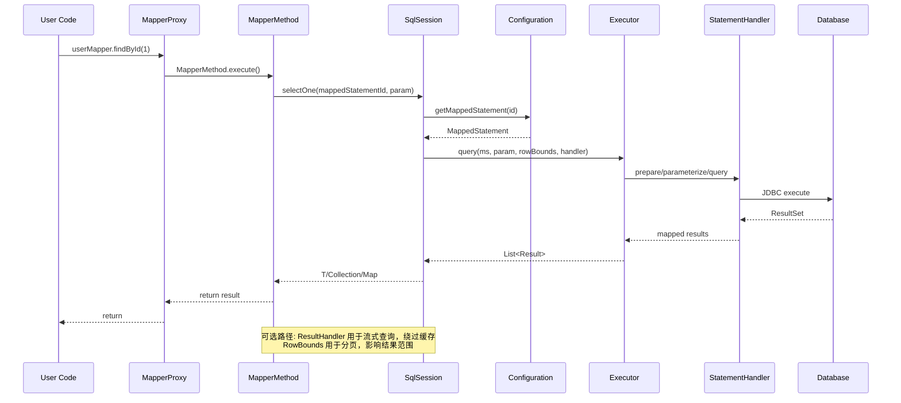

# 第4篇：Mapper 接口的动态代理机制

## 1. 学习目标确认

### 1.0 第3篇思考题解答

在深入学习Mapper接口的动态代理机制之前，让我们先回顾并解答第3篇中提出的思考题，这将帮助我们更好地理解Mapper代理在整个架构中的作用。

#### 思考题1：为什么MyBatis要设计SqlSession接口？这种设计有什么优势？

**答案要点**：

- **统一抽象**：提供统一的数据库操作接口，隐藏底层执行器、语句处理器与事务细节
- **资源管理**：集中管理数据库连接、事务等资源，避免资源泄漏
- **生命周期控制**：明确的生命周期管理，确保资源正确释放
- **扩展性**：接口设计便于功能扩展和定制，支持插件系统
- **线程安全考虑**：SqlSession是线程不安全的，建议在方法作用域使用

**Mapper代理的作用**：Mapper代理通过SqlSession执行具体的数据库操作，是用户与数据库交互的高级抽象。

#### 思考题2：SqlSessionFactory的工厂模式设计有什么好处？

**答案要点**：

- **封装复杂性**：隐藏SqlSession创建的复杂过程（Environment → Transaction → Executor → SqlSession）
- **参数灵活性**：支持多种参数组合创建不同类型的SqlSession（ExecutorType、autoCommit、Connection、隔离级别）
- **配置驱动**：基于Configuration配置创建SqlSession，配置与创建逻辑解耦
- **单例模式**：SqlSessionFactory通常为单例，避免重复创建，降低开销
- **解耦设计**：将创建逻辑与使用逻辑分离

**与Mapper代理的关系**：Mapper代理依赖SqlSessionFactory创建的SqlSession来执行数据库操作。

#### 思考题3：不同Executor类型的适用场景是什么？如何选择？

**答案要点**：

- **SimpleExecutor**：默认选择，适合大多数场景，每次执行创建新Statement，简单可靠
- **ReuseExecutor**：适合重复执行相同SQL的场景，重用Statement对象，减少创建开销
- **BatchExecutor**：适合批量操作，如批量插入、更新、删除，大幅减少数据库交互次数
- **CachingExecutor**：装饰器模式，为其他执行器添加缓存功能，提升查询性能
- **选择原则**：根据具体业务场景和性能需求选择，默认推荐SimpleExecutor

**对Mapper代理的影响**：不同的Executor类型会影响Mapper方法的执行性能，特别是批量操作和缓存使用。

#### 思考题4：SqlSession的生命周期管理需要注意哪些问题？

**答案要点**：

- **及时关闭**：使用完毕后及时调用close()方法，避免资源泄漏
- **异常处理**：在finally块中确保资源释放，或使用try-with-resources语法
- **作用域控制**：建议在方法作用域内使用，避免长时间持有SqlSession
- **事务管理**：注意事务的提交和回滚时机，结合脏标记驱动提交
- **连接泄漏防护**：避免忘记关闭SqlSession导致数据库连接泄漏

**对Mapper代理的指导**：Mapper代理的使用必须遵循SqlSession的生命周期管理原则，确保资源正确释放。

### 1.1 本篇学习目标

通过本文你将能够：

1. 系统理解 MyBatis 如何为 Mapper 接口生成动态代理。
2. 掌握 `MapperProxy`、`MapperMethod`、`MapperRegistry` 的协作关系。
3. 弄清一次 Mapper 方法调用如何落到 `SqlSession` 与 `MappedStatement`。
4. 读懂注解与 XML 下 SQL 解析到执行的关键路径。
5. 掌握常见问题（方法签名、参数命名、返回值映射、缓存与事务边界）。

## 2. 总览：调用链与核心类



- 入口：`SqlSession#getMapper(Class<T>)` 返回 `MapperProxy` 动态代理。
- 核心执行：`MapperProxy.invoke()` 将接口方法适配为 `MapperMethod` 并缓存。
- 落地：`MapperMethod.execute()` 根据命令类型（SELECT/INSERT/UPDATE/DELETE）委托 `SqlSession`。

## 3. 代理对象的创建流程

### 3.1 获取 Mapper 的入口

```java
// 用户侧
UserMapper mapper = sqlSession.getMapper(UserMapper.class);

// DefaultSqlSession
@Override
public <T> T getMapper(Class<T> type) {
    return configuration.getMapper(type, this);
}
```

### 3.2 注册与工厂

```java
// MapperRegistry 维护接口到工厂的映射
public class MapperRegistry {
    private final Configuration config;
    private final Map<Class<?>, MapperProxyFactory<?>> knownMappers = new HashMap<>();

    public <T> T getMapper(Class<T> type, SqlSession sqlSession) {
        final MapperProxyFactory<T> mapperProxyFactory = (MapperProxyFactory<T>) knownMappers.get(type);
        return mapperProxyFactory.newInstance(sqlSession);
    }
}

// MapperProxyFactory 负责创建 JDK 动态代理
public class MapperProxyFactory<T> {
    private final Class<T> mapperInterface;
    private final Map<Method, MapperMethod> methodCache = new ConcurrentHashMap<>();

    public T newInstance(SqlSession sqlSession) {
        final MapperProxy<T> mapperProxy = new MapperProxy<>(sqlSession, mapperInterface, methodCache);
        return (T) Proxy.newProxyInstance(mapperInterface.getClassLoader(), new Class[] { mapperInterface }, mapperProxy);
    }
}
```

要点：

- `MapperRegistry#addMapper` 在解析 XML/注解时完成注册。
- `MapperProxyFactory` 维持 `methodCache`，避免每次反射构建 `MapperMethod`。

## 4. 调用分派：MapperProxy 与 MapperMethod

### 4.1 MapperProxy.invoke()

```java
public Object invoke(Object proxy, Method method, Object[] args) throws Throwable {
    if (Object.class.equals(method.getDeclaringClass())) {
        return method.invoke(this, args);
    }
    final MapperMethod mapperMethod = cachedMapperMethod(method);
    return mapperMethod.execute(sqlSession, args);
}
```

关键点：

- 过滤 `Object` 通用方法（`toString`/`hashCode`）。
- `cachedMapperMethod` 基于方法签名缓存 `MapperMethod`。

### 4.2 MapperMethod.execute()

```java
switch (command.getType()) {
    case INSERT: return rowCountResult(sqlSession.insert(command.getName(), param));
    case UPDATE: return rowCountResult(sqlSession.update(command.getName(), param));
    case DELETE: return rowCountResult(sqlSession.delete(command.getName(), param));
    case SELECT:
        if (methodReturnsMany()) {
            return sqlSession.selectList(command.getName(), param);
        } else if (methodReturnsMap()) {
            return sqlSession.selectMap(command.getName(), param, mapKey);
        } else if (methodReturnsCursor()) {
            return sqlSession.selectCursor(command.getName(), param);
        } else {
            return sqlSession.selectOne(command.getName(), param);
        }
    default: throw new BindingException("Unknown command type");
}
```

要点：

- `command`：封装 `MappedStatement` 的 id 与 SQL 命令类型。
- `methodSignature`：基于方法返回值、泛型、注解，决定结果处理策略（单个/集合/Map/Cursor）。

`MethodSignature` 核心判定示例：

```java
// 伪代码示意
boolean returnsMany = Collection.class.isAssignableFrom(method.getReturnType())
    || method.getReturnType().isArray();
boolean returnsCursor = Cursor.class.isAssignableFrom(method.getReturnType());
boolean returnsMap = Map.class.isAssignableFrom(method.getReturnType())
    && method.isAnnotationPresent(MapKey.class);
boolean usesResultHandler = Arrays.stream(method.getParameterTypes())
    .anyMatch(ResultHandler.class::isAssignableFrom);
```

## 5. 方法参数与 @Param 解析

方法参数在进入 `SqlSession` 前会被包装为 `ParamMap`：

```java
// ParamNameResolver#getNamedParams
// 生成 {"param1": v1, "param2": v2, ... , "arg0": v1, "arg1": v2, 注解名...}
```

建议：

- 多参数方法务必使用 `@Param("name")` 明确命名，避免仅依赖 `arg0/param1` 带来的易碎性。
- 集合与数组参数会被包装为 `collection`/`list`/`array` 键，XML 中使用时需注意占位符名称。

进一步细节：

- ParamNameResolver 核心流程：
  - 读取方法参数与注解，优先取 `@Param` 指定名；
  - 未命名参数按配置与编译器参数名（需要 `-parameters`）或回退为 `argN/paramN`；
  - 生成 `ParamMap` 同时提供别名（`param1` 系列）保障兼容；
  - 集合/数组被包装额外键，`foreach` 常用 `collection` 作为 `items`。
- MethodSignature 影响：返回类型推断与 `@MapKey`、`ResultHandler` 会改变执行路径：
  - 存在 `ResultHandler` → 走流式 `select`，绕过缓存；
  - 返回 `Map<K,V>` 且有 `@MapKey` → 走 `selectMap`；
  - 返回 `Cursor<T>` → 走 `selectCursor`，需手动关闭。

## 6. SQL 绑定来源与优先级

- XML：`namespace.id` 绑定到 `MappedStatement`，优先级最高。
- 注解：`@Select/@Insert/...` 直接在接口方法上声明；当同名 XML 存在时由 XML 覆盖。
- 动态 SQL：注解可用 `<script>` 与动态标签；XML 通过 `<if>/<foreach>` 等由语言驱动处理。

补充：Provider 注解族与语言驱动

- `@SelectProvider/@InsertProvider/@UpdateProvider/@DeleteProvider` 允许以方法返回 `String/SqlNode` 构建 SQL，适合复杂动态场景或共享 SQL 片段。
- 语言驱动（`LanguageDriver`）负责将注解/XML 的 SQL 解析为 `SqlSource`，默认 `XMLLanguageDriver` 支持 `<script>` 节点；可自定义以支持 DSL。
- `RawLanguageDriver` 适合无动态标签的纯文本 SQL 场景，解析成本低；复杂动态建议仍使用 XMLLanguageDriver。

## 7. 常见返回值与映射规则

- 单值：`T selectOne(...)` → 0/1 行，>1 抛出 `TooManyResultsException`。
- 列表：`List<T>`/`Set<T>` → `selectList`。
- Map：`@MapKey("field") Map<K,V>` → `selectMap`，`K` 由 `@MapKey` 指定字段。
- Cursor：大数据量流式处理，注意在 try-with-resources 中关闭。

默认方法与可选返回：

- 接口默认方法（Java 8 default）在 `MapperProxy.invoke` 中会特殊处理（通过 `MethodHandle`/`Lookup` 调用），可编写复合逻辑而不落到 SQL。
- 可选返回如 `Optional<T>` 在较新版本中可支持，映射时遵循单值规则，注意空行与空对象的差异。
  - 建议注册/确认 `OptionalTypeHandler` 是否生效，或在结果映射中显式声明类型处理器。

## 8. 与缓存、事务的边界

- 一级缓存：`SqlSession` 级别，`Mapper` 调用共享同一会话缓存。
- 二级缓存：由 `MappedStatement` 的 `cache` 与 `CachingExecutor` 决定，受 `flushCache/useCache` 控制。
- 事务：由 `SqlSession` 所在事务管理，`Mapper` 层不感知事务，提交/回滚由外层控制。

细节补充：

- 使用 `ResultHandler` 时绕过二级缓存；存储过程带 OUT 参数也会绕过。
- `flushCache`：非 SELECT 默认 true，SELECT 默认 false，可在 XML/注解 `@Options` 覆写。
- 本地缓存 `LocalCacheScope` 受配置影响（`SESSION`/`STATEMENT`），影响一级缓存命中。
- `TransactionalCache`：`CachingExecutor` 通过 `TransactionalCacheManager` 将缓存写入延迟到事务提交时，避免脏读。

## 9. 源码走读建议（断点位置）

1. `Configuration#getMapper` → `MapperRegistry#getMapper` → `MapperProxyFactory#newInstance`。
2. `MapperProxy#invoke` → `MapperMethod#execute`。
3. `DefaultSqlSession#selectOne/selectList` → `Executor#query` → `StatementHandler`。

## 10. 实践案例：完整测试代码示例

本示例验证 XML 优先级和 Mapper 代理执行流程，包含完整的运行环境，确保可直接运行并验证动态代理机制。

### 10.1 配置文件

#### mybatis-config.xml

```xml
<?xml version="1.0" encoding="UTF-8" ?>
<!DOCTYPE configuration PUBLIC "-//mybatis.org//DTD Config 3.0//EN"
        "http://mybatis.org/dtd/mybatis-3-config.dtd">
<configuration>
    <environments default="development">
        <environment id="development">
            <transactionManager type="JDBC"/>
            <dataSource type="POOLED">
                <property name="driver" value="com.mysql.cj.jdbc.Driver"/>
                <property name="url" value="jdbc:mysql://localhost:3306/mybatis_test"/>
                <property name="username" value="root"/>
                <property name="password" value="password"/>
            </dataSource>
        </environment>
    </environments>
    <mappers>
        <mapper resource="com/example/UserMapper.xml"/>
    </mappers>
</configuration>
```

#### UserMapper.xml

```xml
<?xml version="1.0" encoding="UTF-8" ?>
<!DOCTYPE mapper PUBLIC "-//mybatis.org//DTD Mapper 3.0//EN"
        "http://mybatis.org/dtd/mybatis-3-mapper.dtd">
<mapper namespace="com.example.UserMapper">
    <resultMap id="userMap" type="com.example.User">
        <id property="id" column="id"/>
        <result property="name" column="name"/>
        <result property="email" column="email"/>
    </resultMap>

    <select id="findById" resultMap="userMap">
        SELECT id, name, email FROM t_user WHERE id = #{id}
    </select>

    <select id="findByStatus" resultMap="userMap">
        SELECT id, name, email FROM t_user WHERE status = #{status}
    </select>
</mapper>
```

### 10.2 实体类和接口

#### User.java

```java
package com.example;

public class User {
    private Long id;
    private String name;
    private String email;

    // Constructors
    public User() {}
    
    public User(Long id, String name, String email) {
        this.id = id;
        this.name = name;
        this.email = email;
    }

    // Getters and Setters
    public Long getId() { return id; }
    public void setId(Long id) { this.id = id; }
    public String getName() { return name; }
    public void setName(String name) { this.name = name; }
    public String getEmail() { return email; }
    public void setEmail(String email) { this.email = email; }

    @Override
    public String toString() {
        return "User{id=" + id + ", name='" + name + "', email='" + email + "'}";
    }
}
```

#### UserMapper.java

```java
package com.example;

import org.apache.ibatis.annotations.Param;
import org.apache.ibatis.annotations.Select;
import java.util.List;

public interface UserMapper {
    @Select("<script>SELECT id, name, email FROM t_user WHERE id = #{id}</script>")
    User findById(@Param("id") Long id);

    List<User> findByStatus(@Param("status") Integer status);
}
```

### 10.3 测试类

#### TestMapperExample.java

```java
package com.example;

import org.apache.ibatis.io.Resources;
import org.apache.ibatis.session.SqlSession;
import org.apache.ibatis.session.SqlSessionFactory;
import org.apache.ibatis.session.SqlSessionFactoryBuilder;
import java.io.IOException;
import java.io.InputStream;
import java.util.List;

public class TestMapperExample {
    public static void main(String[] args) {
        try {
            // 1. 加载配置文件
            String resource = "mybatis-config.xml";
            InputStream inputStream = Resources.getResourceAsStream(resource);
            SqlSessionFactory factory = new SqlSessionFactoryBuilder().build(inputStream);

            // 2. 创建 SqlSession
            try (SqlSession session = factory.openSession()) {
                // 3. 获取 Mapper 代理
                UserMapper mapper = session.getMapper(UserMapper.class);

                // 4. 测试 findById (XML 优先覆盖注解)
                System.out.println("=== 测试 findById 方法 ===");
                User user = mapper.findById(1L);
                System.out.println("findById 结果: " + user);

                // 5. 测试 findByStatus
                System.out.println("=== 测试 findByStatus 方法 ===");
                List<User> users = mapper.findByStatus(1);
                System.out.println("findByStatus 结果: " + users);

                // 6. 提交事务
                session.commit();
                System.out.println("=== 事务提交成功 ===");
            } catch (Exception e) {
                System.err.println("执行错误: " + e.getMessage());
                e.printStackTrace();
            }
        } catch (IOException e) {
            System.err.println("配置文件加载失败: " + e.getMessage());
            e.printStackTrace();
        }
    }
}
```

### 10.4 验证步骤和断点调试

**断点调试建议**：

1. **断点 `MapperProxy#invoke`**：观察 `MapperMethod` 缓存与解析过程
2. **断点 `MapperMethod#execute`**：确认命令类型与返回值适配逻辑
3. **断点 `DefaultSqlSession#selectList`**：跟进到 `Executor` 与 `StatementHandler` 执行流程

**验证要点**：

- **XML 优先级**：`findById` 方法在接口上有 `@Select` 注解，但 XML 中的同名方法会覆盖注解
- **参数绑定**：观察 `@Param` 注解如何影响参数映射
- **结果映射**：验证 `resultMap` 如何将数据库字段映射到对象属性
- **代理机制**：确认 `session.getMapper()` 返回的是动态代理对象

### 10.5 性能建议

- **高并发读多场景**：优先使用 XML + 二级缓存并确保刷新策略正确
- **复杂逻辑处理**：避免在 Mapper 方法上混用复杂逻辑与数据库交互，复杂逻辑可置于默认方法或服务层
- **动态 SQL 优化**：动态 SQL 复杂度大时考虑 Provider 或拆分语句，降低语言驱动解析成本
- **连接池配置**：根据并发量调整数据源连接池参数，避免连接等待

## 11. 易错与排错清单

- 缺少 namespace 或 `id` 错配 → `Invalid bound statement (not found)`。
- 多参数未加 `@Param`，XML 使用 `#{id}` 取值失败。
- 返回 `List<Map<String,Object>>` 与 `resultType` 不一致导致转换异常。
- 注解 `<script>` 少闭合标签或大小写错误，语言驱动解析失败。
- 二级缓存误用：更新语句未设置 `flushCache=true` 导致脏读。

## 12. 小结

- `MapperProxy` 将接口方法映射为可执行的 `MapperMethod`，再委托给 `SqlSession`。
- `MapperMethod` 基于方法签名与配置选择合适的执行与结果适配路径。
- XML/注解双通道绑定，XML 优先；@Param 明确命名提升可维护性。
- 与缓存、事务解耦，遵循会话边界与提交/回滚语义。

---

思考题：

1. 为什么 MyBatis 选择 JDK 动态代理而非字节码增强（如 ASM/CGLIB）？
2. 多返回值场景下，`MapperMethod` 如何区分集合、游标与映射类型？
3. 在开启二级缓存时，哪些因素会导致缓存失效或绕过？
