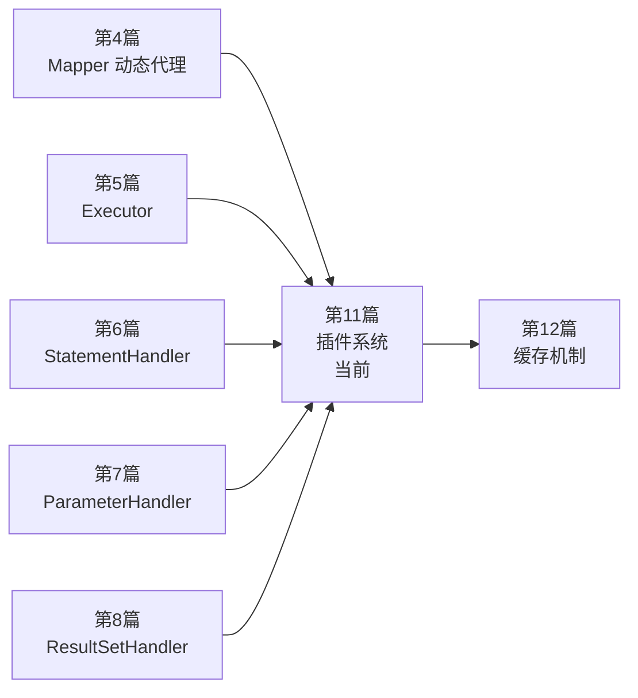

# 第11篇：插件系统深度解析

> **专栏定位**：MyBatis 源码解读专栏 - 第三部分：高级篇  
> **学习目标**：深入理解 MyBatis 插件体系的设计与实现，能独立编写常用拦截器  
> **难度等级**：4 星  
> **预计学时**：6-10 小时

## 本篇内容导航

### 主要文档

- [文章内容.md](./文章内容.md) - 插件系统主文档（必读）

### 学习辅助

- [学习检验与总结.md](./学习检验与总结.md) - 自测题与知识点总结
- [思考题解答.md](./思考题解答.md) - 思考题详细解答
- [代码示例集合.md](./代码示例集合.md) - 可直接复用的插件示例代码
- [实践任务指导.md](./实践任务指导.md) - 分步骤实践指南

## 学习路径建议

### 阶段一：理论学习（2-3 小时）

- 先通读 [文章内容.md](./文章内容.md) 第 1-4 章，建立“拦截点 + 代理链 + 签名匹配”的整体模型
- 对照源码看一遍 `Interceptor` / `Plugin` / `InterceptorChain` / `Invocation` 的职责边界

### 阶段二：动手实践（2-4 小时）

- 按 [实践任务指导.md](./实践任务指导.md) 实现“耗时统计插件”（必做）
- 再做“逻辑分页插件（RowBounds）”，理解插件如何改变行为而不侵入主流程

### 阶段三：总结提升（2-3 小时）

- 完成 [学习检验与总结.md](./学习检验与总结.md)
- 对照 [思考题解答.md](./思考题解答.md) 补齐薄弱点

## 核心知识点

### 必须掌握

- [ ] 插件只能拦截四大接口（Executor / StatementHandler / ParameterHandler / ResultSetHandler）的原因
- [ ] `Plugin.wrap()` 如何根据 `@Intercepts/@Signature` 决定“是否代理 / 代理哪些接口”
- [ ] `InterceptorChain.pluginAll()` 如何形成代理链，以及插件执行顺序
- [ ] 插件在 `Configuration` 中何时被应用到四大组件

## 与其他篇章的关系

## 相关文章

- 上一篇：[第10篇：动态SQL实现原理](../../第二部分-核心篇/第10篇-动态SQL实现原理/README.md)
- 下一篇：[第12篇：缓存机制源码分析](../第12篇-缓存机制源码分析/README.md)

