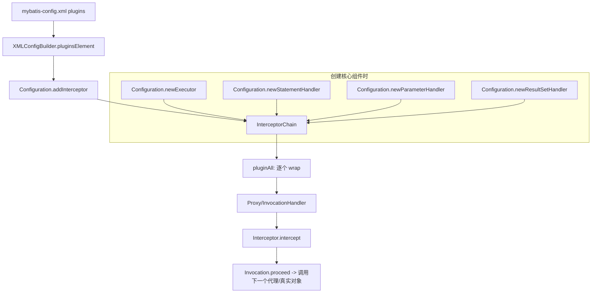

# 第11篇：插件系统深度解析

## 前言

在前面的核心篇里，我们已经把 MyBatis 的“主干执行链路”走通了：`MappedStatement` 描述一条映射语句，`Executor` 负责调度与缓存，`StatementHandler/ParameterHandler/ResultSetHandler` 分别负责语句、参数、结果集。

进入高级篇之后，我们要解决一个更“工程化”的问题：

- **当你想在不修改 MyBatis 源码的前提下，做一些横切能力（监控、分页、审计、脱敏、灰度、限流）时，MyBatis 给你的官方扩展点是什么？**

答案就是：**插件系统（Plugin / Interceptor）**。

本篇目标是把插件系统从“会用”提升到“看懂源码 + 能写对 + 知道边界在哪里”。

---

## 1. 学习目标确认

通过本文你将能够：

1. 理解插件系统的设计目标：在不侵入主流程的情况下扩展行为
2. 掌握插件系统核心组件：`Interceptor`、`Plugin`、`InterceptorChain`、`Invocation`
3. 搞清楚插件能拦截的四大接口与原因：`Executor` / `StatementHandler` / `ParameterHandler` / `ResultSetHandler`
4. 理解插件的加载、注册与应用时机：`XMLConfigBuilder` -> `Configuration` -> `newXXXHandler()`
5. 能写出可用的插件：耗时统计插件（必做）+ 逻辑分页插件（演示插件如何改变行为）

---

## 2. 插件系统在整体架构中的位置

### 2.1 插件系统“插”在哪里

插件不是随便拦截任意类方法。MyBatis 只允许拦截以下接口方法：

- `Executor`（update/query/commit/rollback...）
- `StatementHandler`（prepare/parameterize/batch/update/query）
- `ParameterHandler`（setParameters/getParameterObject）
- `ResultSetHandler`（handleResultSets/handleOutputParameters）

它们刚好覆盖了一次 SQL 执行的关键阶段：**调度、语句、参数、结果处理**。

### 2.2 组件关系图（心智模型）



---

## 3. 为什么插件只能拦截“四大接口”

这一点在源码里是“硬编码”的：`Invocation` 构造函数会校验拦截目标方法的 declaringClass，只允许四个接口。

这样设计的收益：

- **可控性**：插件能力很强，如果能拦截任意对象会造成生态失控，MyBatis 难以保证行为一致性
- **稳定性**：四大接口属于 MyBatis 的核心 SPI，变更频率远低于内部实现类
- **性能**：只在关键对象上创建代理，避免把整个系统代理化
- **可理解性**：一次 SQL 执行的可插拔点固定，调试成本更低

代价：

- 你不能拦截任意 Mapper 方法、不能直接拦截 `MappedStatement.getBoundSql()` 等内部调用（除非通过四大接口间接影响）。

---

## 4. 核心组件源码拆解

### 4.1 `@Intercepts` 与 `@Signature`：用注解声明“我要拦截谁”

插件通过注解声明需要拦截的方法签名，例如：

```java
@Intercepts({
  @Signature(type = Executor.class, method = "query",
    args = {MappedStatement.class, Object.class, RowBounds.class, ResultHandler.class})
})
public class MyPlugin implements Interceptor { ... }
```

关键点：

- `type` 必须是四大接口之一
- `method + args` 必须能在 `type` 上通过反射找到唯一方法，否则会抛出 `PluginException`

### 4.2 `Interceptor`：插件的 SPI 接口

`Interceptor` 只有三个能力点：

1. `intercept(Invocation)`：核心拦截逻辑
2. `plugin(Object)`：默认就是 `Plugin.wrap(target, this)`，用于把目标对象代理化
3. `setProperties(Properties)`：从 XML `<plugin>` 里读取配置

插件系统不是 AOP 框架，它不会帮你做参数绑定、切点表达式等；它只做两件事：

- **把四大接口实现类包成 JDK 动态代理**
- **在符合签名的方法调用处回调你的 `intercept()`**

### 4.3 `Plugin`：真正的动态代理实现

`Plugin.wrap(target, interceptor)` 的逻辑可以概括成三步：

1. 从插件类的 `@Intercepts` 里解析出签名集合（signatureMap）
2. 从 target 的 class 上找到“与签名集合匹配的接口”（getAllInterfaces）
3. 如果接口集合非空，就 `Proxy.newProxyInstance(...)` 创建代理，否则原样返回

调用发生时：

- 如果当前 method 属于签名集合：执行 `interceptor.intercept(new Invocation(target, method, args))`
- 否则直接 `method.invoke(target, args)`

### 4.4 `Invocation`：对一次方法调用的封装

`Invocation` 做了两件事：

- 校验 declaringClass 必须是四大接口之一（限制插件能力边界）
- 提供 `proceed()` 让你“继续执行链路”

这里的 proceed 非常关键，它意味着：

- 你可以在 proceed 前后做前置/后置逻辑（典型监控）
- 你可以完全不调用 proceed（短路返回，风险很高）
- 你可以修改 args 再 proceed（改变行为）

### 4.5 `InterceptorChain`：插件链（责任链 + 代理叠加）

`InterceptorChain.pluginAll(target)` 会按注册顺序循环：

```text
target = interceptor1.plugin(target)
target = interceptor2.plugin(target)
...
```

因此最终得到的是“多层代理叠加”的对象。

**执行顺序的结论（务必掌握）**：

- 插件注册顺序是：`interceptor1 -> interceptor2 -> ...`
- 方法真正调用时，最外层代理是最后注册的那个
- 所以 `intercept()` 的触发顺序通常是：`interceptorN -> ... -> interceptor2 -> interceptor1 -> 真实对象`

这也是为什么有些插件之间会互相影响：它们都可能修改参数、返回值或线程上下文。

---

## 5. 插件是如何“加载并生效”的

### 5.1 加载：`XMLConfigBuilder.pluginsElement()`

当解析 `mybatis-config.xml` 的 `<plugins>` 节点时：

1. 反射创建插件实例
2. 读取子节点 `<property/>` 并调用 `setProperties()`
3. 调用 `configuration.addInterceptor(interceptorInstance)`

这一步只做“注册”，并不会立刻代理任何对象。

### 5.2 生效：`Configuration.newXXX()` 创建对象时统一应用

插件在创建四大组件对象时被应用（`interceptorChain.pluginAll(...)`）：

- `newExecutor(...)`
- `newStatementHandler(...)`
- `newParameterHandler(...)`
- `newResultSetHandler(...)`

这意味着：

- **插件不是对全局生效的“静态织入”，而是在对象创建时把对象替换为代理对象**
- 如果某个对象不是通过 `Configuration` 创建的，那它就不会被插件代理（一般不建议绕过 Configuration）

---

## 6. 实战插件 1：SQL 执行耗时统计插件（推荐必做）

### 6.1 设计

目标：

- 拦截 `Executor.query(...)` 与 `Executor.update(...)`
- 统计耗时并输出日志（或埋点）

关键点：

- Executor 是最“上游”的拦截点，拦截 query/update 能覆盖大多数 SQL
- 但要注意：`Executor` 内部可能还会触发缓存逻辑、批处理等，耗时含义需要你自己定义

### 6.2 示例代码

```java
@Intercepts({
  @Signature(type = Executor.class, method = "query",
    args = {MappedStatement.class, Object.class, RowBounds.class, ResultHandler.class}),
  @Signature(type = Executor.class, method = "update",
    args = {MappedStatement.class, Object.class})
})
public class SqlCostInterceptor implements Interceptor {

  private long slowMs = 200;

  @Override
  public Object intercept(Invocation invocation) throws Throwable {
    long start = System.nanoTime();
    try {
      return invocation.proceed();
    } finally {
      long costMs = (System.nanoTime() - start) / 1_000_000;
      if (costMs >= slowMs) {
        // 生产建议接入日志框架/metrics，不要 System.out
        System.out.println("[MyBatis][SLOW] cost=" + costMs + "ms, method=" + invocation.getMethod());
      }
    }
  }

  @Override
  public void setProperties(Properties properties) {
    String v = properties.getProperty("slowMs");
    if (v != null) {
      slowMs = Long.parseLong(v);
    }
  }
}
```

### 6.3 配置方式

```xml
<plugins>
  <plugin interceptor="com.example.mybatis.SqlCostInterceptor">
    <property name="slowMs" value="100"/>
  </plugin>
</plugins>
```

---

## 7. 实战插件 2：逻辑分页插件（基于 RowBounds，演示“改变行为”）

这里我们用一个“逻辑分页”例子来说明：插件不仅能监控，也能改变结果。

### 7.1 设计

拦截 `Executor.query(...)`：

- 如果 `RowBounds` 不是默认值，则在 `proceed()` 返回结果后做 `subList` 裁剪
- 注意：这种分页会把全量结果先查出来再裁剪，只适合教学或小数据场景

### 7.2 示例代码

```java
@Intercepts({
  @Signature(type = Executor.class, method = "query",
    args = {MappedStatement.class, Object.class, RowBounds.class, ResultHandler.class})
})
public class InMemoryPagingInterceptor implements Interceptor {

  @Override
  @SuppressWarnings("unchecked")
  public Object intercept(Invocation invocation) throws Throwable {
    Object[] args = invocation.getArgs();
    RowBounds rb = (RowBounds) args[2];
    if (rb == null || rb == RowBounds.DEFAULT) {
      return invocation.proceed();
    }

    // 继续执行，先拿到全量结果
    List<Object> full = (List<Object>) invocation.proceed();

    int offset = Math.max(rb.getOffset(), 0);
    int limit = rb.getLimit();
    if (limit <= 0 || limit == RowBounds.NO_ROW_LIMIT) {
      return full;
    }

    if (offset >= full.size()) {
      return java.util.Collections.emptyList();
    }
    int end = Math.min(full.size(), offset + limit);
    return full.subList(offset, end);
  }
}
```

### 7.3 进一步：物理分页的实现思路（了解即可）

如果要做“物理分页”（直接改 SQL，加 LIMIT/OFFSET），通常会拦截：

- `StatementHandler.prepare(Connection, Integer)`：在 prepare 前修改 `BoundSql.sql`

但 MyBatis 的 `BoundSql.sql` 是 `private final` 字段，需要通过反射/MetaObject 等方式修改，风险与兼容成本更高。成熟方案可以参考 PageHelper 的实现思路（建议后续深入阅读）。

---

## 8. 插件开发的边界与最佳实践

### 8.1 不建议做的事情

- 在插件里“写业务逻辑”
- 修改 MyBatis 内部对象的私有字段（除非你非常清楚版本兼容风险）
- 不调用 `proceed()` 直接短路（容易破坏事务/缓存/批处理语义）

### 8.2 建议做的事情

- 插件尽量“无副作用”：监控、统计、traceId 传递、SQL 审计
- 有行为变更时，要写清楚：影响范围、边界条件、与其他插件的交互
- 控制插件数量与顺序：顺序改变可能导致语义改变

---

## 9. 小结

插件系统的本质是：

- **在四大接口实现类创建时，用 JDK 动态代理包一层或多层**
- **通过 `@Signature` 精确声明拦截的方法集合**
- **用 `Invocation.proceed()` 串起代理链**

理解这些之后，你就能：

- 读懂绝大多数 MyBatis 插件源码
- 写出行为正确、边界清晰、易于排查的插件


