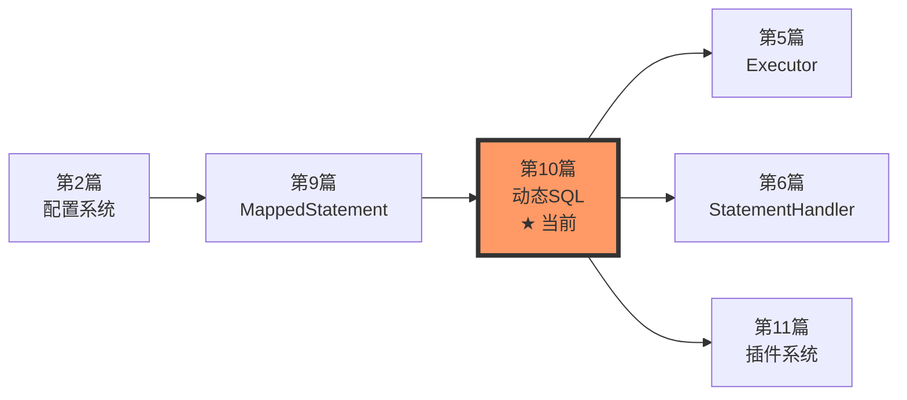

# 第10篇：动态SQL实现原理

> **专栏定位**：MyBatis源码解读专栏 - 第二部分：核心篇  
> **学习目标**：深入理解MyBatis动态SQL的实现机制，掌握SqlNode体系和OGNL表达式的使用  
> **难度等级**：⭐⭐⭐⭐ (4星)  
> **预计学时**：8-12小时

## 📚 本篇内容导航

### 📖 主要文档

- [**文章内容.md**](./文章内容.md) - 完整的动态SQL实现原理讲解（主文档，必读）

### 📝 学习辅助

- [**学习检验与总结.md**](./学习检验与总结.md) - 学习效果自测和知识点总结
- [**思考题解答.md**](./思考题解答.md) - 文章思考题的详细解答
- [**代码示例集合.md**](./代码示例集合.md) - 完整可运行的实践代码
- [**实践任务指导.md**](./实践任务指导.md) - 分步骤的动手实践指南

## 🎯 学习路径建议

### 阶段一：理论学习（3-4小时）

1. **前置准备**
   - 回顾第9篇《MappedStatement映射语句解析》
   - 了解 SqlSource 的基本概念
   - 熟悉 XML 动态标签的使用

2. **核心内容学习**
   - 阅读 [文章内容.md](./文章内容.md) 前6章
   - 理解 SqlNode 树状结构
   - 掌握常用动态标签的实现原理

3. **深入理解**
   - 学习 DynamicContext 的作用
   - 理解 OGNL 表达式求值
   - 掌握动态SQL的完整执行流程

### 阶段二：实践操作（3-4小时）

1. **基础实践**
   - 参考 [代码示例集合.md](./代码示例集合.md)
   - 完成动态查询示例
   - 测试不同动态标签的效果

2. **进阶实践**
   - 按照 [实践任务指导.md](./实践任务指导.md) 完成任务
   - 调试动态SQL生成过程
   - 分析性能差异

3. **综合应用**
   - 实现复杂的动态查询场景
   - 优化动态SQL性能
   - 排查常见问题

### 阶段三：总结提升（2-4小时）

1. **知识梳理**
   - 完成 [学习检验与总结.md](./学习检验与总结.md) 的自测题
   - 绘制动态SQL执行流程图
   - 整理学习笔记

2. **思考延伸**
   - 阅读 [思考题解答.md](./思考题解答.md)
   - 思考动态SQL的设计思想
   - 对比其他ORM框架的实现

3. **源码阅读**
   - 阅读 DynamicSqlSource 源码
   - 分析 SqlNode 实现类
   - 理解 OGNL 集成方式

## 🔑 核心知识点

### 必须掌握 ✅

- [ ] **SqlNode 体系**：接口设计与实现类
- [ ] **DynamicContext**：SQL收集和参数绑定
- [ ] **常用动态标签**：`<if>`、`<where>`、`<foreach>`
- [ ] **OGNL 表达式**：条件判断和变量绑定
- [ ] **动态SQL执行流程**：从XML到BoundSql

### 重点理解 🌟

- [ ] **SqlNode 树遍历机制**
- [ ] **额外参数生成与绑定**（`__frch_` 前缀）
- [ ] **TrimSqlNode 的前后缀处理**
- [ ] **ForEachSqlNode 的迭代逻辑**
- [ ] **动态SQL与静态SQL的性能差异**

### 扩展了解 💡

- [ ] **自定义 LanguageDriver**
- [ ] **动态SQL缓存优化策略**
- [ ] **SQL注入防范**
- [ ] **复杂动态SQL的设计模式**

## 📊 与其他篇章的关系



### 前序依赖

- **第2篇**：了解XML解析机制
- **第9篇**：理解SqlSource和MappedStatement

### 后续应用

- **第11篇**：插件可以拦截动态SQL生成过程
- **第17篇**：性能优化中会涉及动态SQL优化

## 🛠️ 学习工具准备

### 环境要求

- JDK 8+
- Maven 3.x
- IDE（推荐IDEA）
- MySQL 5.7+ 或其他数据库

### 调试工具

```xml
<!-- 开启SQL日志 -->
<settings>
    <setting name="logImpl" value="STDOUT_LOGGING"/>
</settings>
```

### 推荐断点位置

1. `DynamicSqlSource.getBoundSql(Object)`
2. `IfSqlNode.apply(DynamicContext)`
3. `ForEachSqlNode.apply(DynamicContext)`
4. `DynamicContext` 构造函数
5. `SqlSourceBuilder.parse(...)`

## 💡 学习建议

### ✅ DO - 推荐做法

1. **理论与实践结合**
   - 边看源码边调试
   - 每学完一个标签就动手实践
   - 对比生成的SQL理解原理

2. **循序渐进**
   - 先理解简单标签（`<if>`）
   - 再学习复杂标签（`<foreach>`）
   - 最后综合应用

3. **多问为什么**
   - 为什么要设计SqlNode树？
   - 为什么需要额外参数？
   - 性能差异的根本原因是什么？

### ❌ DON'T - 避免做法

1. **不要死记硬背标签语法**
   - 理解原理比记住语法更重要
   - 会查文档即可

2. **不要只看不练**
   - 动手实践才能真正理解
   - 调试源码加深印象

3. **不要忽略性能**
   - 了解动态SQL的性能开销
   - 学会权衡使用场景

## 🧪 效果检验

完成本篇学习后，你应该能够：

- ✅ 画出动态SQL的完整执行流程图
- ✅ 实现一个自定义的SqlNode
- ✅ 解释额外参数的生成机制
- ✅ 优化复杂动态SQL的性能
- ✅ 排查动态SQL相关的常见问题

**自测题**：详见 [学习检验与总结.md](./学习检验与总结.md)

## 📞 学习支持

### 遇到问题？

1. **查看常见问题**：文章第12节"调试与排查"
2. **参考思考题解答**：[思考题解答.md](./思考题解答.md)
3. **查阅官方文档**：[MyBatis 官方文档](https://mybatis.org/mybatis-3/)

### 讨论与反馈

- 💬 在文章评论区提问和讨论
- 📧 联系作者（见专栏主页）
- 🐛 发现错误请及时反馈

## 📈 学习进度跟踪

```markdown
## 我的学习进度

- [ ] 阅读完文章内容（第1-6章）
- [ ] 理解SqlNode体系结构
- [ ] 掌握常用动态标签
- [ ] 阅读完文章内容（第7-11章）
- [ ] 理解OGNL表达式求值
- [ ] 完成基础代码示例
- [ ] 完成实践任务（任务1-3）
- [ ] 完成实践任务（任务4-6）
- [ ] 完成学习检验自测
- [ ] 思考并回答思考题
- [ ] 绘制完整的流程图
- [ ] 整理学习笔记

**完成日期**：____年____月____日  
**学习心得**：_________________
```

## 🎓 下一步学习

完成本篇后，建议继续学习：

1. **第11篇：插件系统深度解析** - 学习如何扩展MyBatis
2. **第12篇：缓存机制源码分析** - 深入理解二级缓存
3. **第17篇：MyBatis性能优化实践** - 实战性能调优

---

**祝学习愉快！有任何问题欢迎讨论交流！** 🚀
