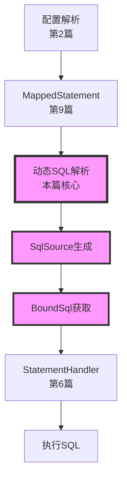
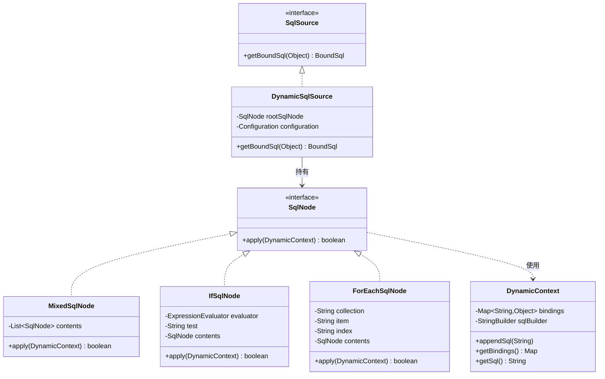
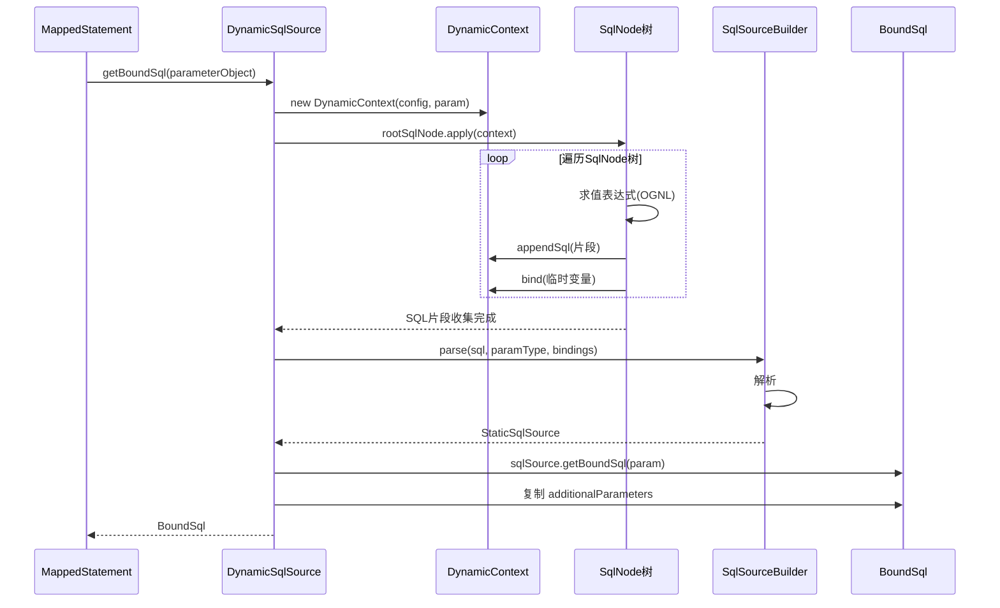

# 第10篇：动态SQL实现原理

## 前言

在前面的章节中，我们学习了 MyBatis 的核心执行流程，特别是第9篇中详细介绍了 `MappedStatement` 和 `SqlSource` 的作用。你可能注意到，MyBatis 能够根据不同的条件动态生成 SQL，这正是 MyBatis 最强大的特性之一 —— **动态SQL**。

动态SQL 允许我们根据不同的条件、参数来拼接不同的 SQL 语句，避免了在 Java 代码中进行繁琐的字符串拼接。理解动态SQL的实现原理，是掌握 MyBatis 高级用法的关键。

### 本篇在整体架构中的位置



### 与前序章节的关联

- **第2篇(配置系统)**：学习了 XML 解析，本篇将深入了解动态标签如何被解析
- **第9篇(MappedStatement)**：学习了 `SqlSource` 的类型，本篇将详细分析 `DynamicSqlSource` 的实现
- **第6篇(StatementHandler)**：学习了如何执行 SQL，本篇将了解动态 SQL 如何生成最终的可执行 SQL

## 1. 学习目标确认

### 1.0 第9篇思考题回顾

> 💡 **说明**：第9篇思考题的详细解答请见文末**附录A**。

**核心要点回顾**：

- `MappedStatement` 是单条 SQL 映射语句的完整描述
- `SqlSource` 负责提供 SQL，分为静态和动态两大类
- `BoundSql` 包含最终可执行的 SQL 和参数映射
- `additionalParameters` 用于存储动态生成的临时参数
- 缓存策略影响查询性能

### 1.1 本篇学习目标

1. 深入理解动态SQL的核心组件：`SqlNode`、`SqlSource`、`DynamicContext`
2. 掌握常用动态标签的实现原理：`<if>`、`<where>`、`<foreach>`、`<choose>` 等
3. 理解 OGNL 表达式在动态SQL中的作用
4. 掌握动态SQL的执行流程和性能优化
5. 学会调试和排查动态SQL相关问题

## 2. 动态SQL核心架构

### 2.1 核心组件关系图



### 2.2 核心组件职责

| 组件 | 职责 | 关键方法 |
|------|------|---------|
| **SqlSource** | SQL来源接口 | `getBoundSql(Object)` |
| **DynamicSqlSource** | 动态SQL实现 | 运行期生成SQL |
| **SqlNode** | SQL节点接口 | `apply(DynamicContext)` |
| **DynamicContext** | 动态上下文 | 收集SQL片段和参数 |
| **ExpressionEvaluator** | 表达式求值器 | 使用OGNL求值 |
| **SqlSourceBuilder** | SQL源构建器 | 解析`#{}`占位符 |

### 2.3 执行流程时序图



## 3. SqlNode 体系详解

### 3.1 SqlNode 接口定义

```java
/**
 * SQL节点接口
 * 所有动态SQL标签都实现此接口
 * 
 * 源码位置: org.apache.ibatis.scripting.xmltags.SqlNode
 */
public interface SqlNode {
    /**
     * 应用当前节点，将SQL片段添加到上下文
     * 
     * @param context 动态上下文
     * @return 是否应用成功
     */
    boolean apply(DynamicContext context);
}
```

### 3.2 SqlNode 实现类全景

| SqlNode 实现类 | 对应XML标签 | 作用 | 示例 |
|---------------|------------|------|------|
| **StaticTextSqlNode** | 静态文本 | 原样输出SQL片段 | `SELECT * FROM user` |
| **MixedSqlNode** | 混合节点 | 包含多个子节点 | `<select>` 的子内容 |
| **IfSqlNode** | `<if>` | 条件判断 | `<if test="name != null">` |
| **TrimSqlNode** | `<trim>` | 去除前后缀 | `<trim prefix="WHERE">` |
| **WhereSqlNode** | `<where>` | WHERE子句处理 | `<where>` |
| **SetSqlNode** | `<set>` | SET子句处理 | `<set>` |
| **ForEachSqlNode** | `<foreach>` | 遍历集合 | `<foreach collection="ids">` |
| **ChooseSqlNode** | `<choose>` | 多分支选择 | `<choose><when>` |
| **VarDeclSqlNode** | `<bind>` | 绑定变量 | `<bind name="pattern" value="'%' + name + '%'"/>` |

### 3.3 StaticTextSqlNode：最简单的实现

```java
/**
 * 静态文本SQL节点
 * 直接输出文本内容，不做任何处理
 * 
 * 源码位置: org.apache.ibatis.scripting.xmltags.StaticTextSqlNode
 */
public class StaticTextSqlNode implements SqlNode {
  
    private final String text;
  
    public StaticTextSqlNode(String text) {
        this.text = text;
    }
  
    @Override
    public boolean apply(DynamicContext context) {
        // 直接将文本添加到上下文
        context.appendSql(text);
        return true;
    }
}
```

**示例**：

```xml
<select id="findAll" resultType="User">
    SELECT * FROM user
</select>
```

解析后会生成一个 `StaticTextSqlNode`，包含文本 `"SELECT * FROM user"`。

### 3.4 MixedSqlNode：组合多个子节点

```java
/**
 * 混合SQL节点
 * 包含多个子节点，按顺序应用
 * 
 * 源码位置: org.apache.ibatis.scripting.xmltags.MixedSqlNode
 */
public class MixedSqlNode implements SqlNode {
  
    private final List<SqlNode> contents;
  
    public MixedSqlNode(List<SqlNode> contents) {
        this.contents = contents;
    }
  
    @Override
    public boolean apply(DynamicContext context) {
        // 遍历所有子节点，依次应用
        contents.forEach(node -> node.apply(context));
        return true;
    }
}
```

**示例**：

```xml
<select id="findByName" resultType="User">
    SELECT * FROM user
    <where>
        <if test="name != null">
            AND name = #{name}
        </if>
    </where>
</select>
```

这会生成一个 `MixedSqlNode`，包含多个子节点。

## 4. 条件判断标签

### 4.1 IfSqlNode：条件判断

```java
/**
 * IF条件SQL节点
 * 根据OGNL表达式决定是否包含SQL片段
 * 
 * 源码位置: org.apache.ibatis.scripting.xmltags.IfSqlNode
 */
public class IfSqlNode implements SqlNode {
  
    private final ExpressionEvaluator evaluator;
    private final String test;              // OGNL表达式
    private final SqlNode contents;         // 子节点
  
    public IfSqlNode(SqlNode contents, String test) {
        this.test = test;
        this.contents = contents;
        this.evaluator = new ExpressionEvaluator();
    }
  
    @Override
    public boolean apply(DynamicContext context) {
        // 1. 使用OGNL求值表达式
        if (evaluator.evaluateBoolean(test, context.getBindings())) {
            // 2. 条件为true，应用子节点
            contents.apply(context);
            return true;
        }
        return false;
    }
}
```

**使用示例**：

```xml
<select id="findUsers" resultType="User">
    SELECT * FROM user
    WHERE 1=1
    <if test="name != null and name != ''">
        AND name = #{name}
    </if>
    <if test="age != null">
        AND age > #{age}
    </if>
</select>
```

**运行期行为**：

```java
// 场景1: 只传 name
Map<String, Object> params = new HashMap<>();
params.put("name", "张三");

// 生成SQL: SELECT * FROM user WHERE 1=1 AND name = ?

// 场景2: 传 name 和 age
params.put("name", "张三");
params.put("age", 18);

// 生成SQL: SELECT * FROM user WHERE 1=1 AND name = ? AND age > ?
```

### 4.2 ChooseSqlNode：多分支选择

```java
/**
 * CHOOSE多分支SQL节点
 * 类似Java的 switch-case
 * 
 * 源码位置: org.apache.ibatis.scripting.xmltags.ChooseSqlNode
 */
public class ChooseSqlNode implements SqlNode {
  
    private final SqlNode defaultSqlNode;           // <otherwise>
    private final List<SqlNode> ifSqlNodes;         // <when> 列表
  
    public ChooseSqlNode(List<SqlNode> ifSqlNodes, SqlNode defaultSqlNode) {
        this.ifSqlNodes = ifSqlNodes;
        this.defaultSqlNode = defaultSqlNode;
    }
  
    @Override
    public boolean apply(DynamicContext context) {
        // 1. 遍历 <when> 节点，找到第一个满足条件的
        for (SqlNode sqlNode : ifSqlNodes) {
            if (sqlNode.apply(context)) {
                return true;
            }
        }
      
        // 2. 如果都不满足，应用 <otherwise>
        if (defaultSqlNode != null) {
            defaultSqlNode.apply(context);
            return true;
        }
      
        return false;
    }
}
```

**使用示例**：

```xml
<select id="findUsers" resultType="User">
    SELECT * FROM user
    <where>
        <choose>
            <when test="name != null">
                AND name = #{name}
            </when>
            <when test="email != null">
                AND email = #{email}
            </when>
            <otherwise>
                AND status = 'ACTIVE'
            </otherwise>
        </choose>
    </where>
</select>
```

## 5. WHERE/SET 子句处理

### 5.1 TrimSqlNode：通用的前后缀处理

```java
/**
 * TRIM修剪SQL节点
 * 可以去除前后缀和多余的分隔符
 * 
 * 源码位置: org.apache.ibatis.scripting.xmltags.TrimSqlNode
 */
public class TrimSqlNode implements SqlNode {
  
    private final SqlNode contents;
    private final String prefix;              // 要添加的前缀
    private final String suffix;              // 要添加的后缀
    private final List<String> prefixesToOverride;  // 要去除的前缀列表
    private final List<String> suffixesToOverride;  // 要去除的后缀列表
    private final Configuration configuration;
  
    @Override
    public boolean apply(DynamicContext context) {
        // 1. 创建过滤上下文
        FilteredDynamicContext filteredDynamicContext = 
            new FilteredDynamicContext(context);
      
        // 2. 应用子节点，收集SQL片段
        boolean result = contents.apply(filteredDynamicContext);
      
        // 3. 处理前后缀
        filteredDynamicContext.applyAll();
      
        return result;
    }
  
    /**
     * 过滤动态上下文
     * 负责去除多余的前后缀
     */
    private class FilteredDynamicContext extends DynamicContext {
        private final StringBuilder sqlBuffer;
      
        public void applyAll() {
            String trimmedSql = sqlBuffer.toString().trim();
            if (trimmedSql.length() > 0) {
                // 去除要移除的前缀
                trimmedSql = applyPrefixes(trimmedSql);
                // 去除要移除的后缀
                trimmedSql = applySuffixes(trimmedSql);
                // 添加新前缀
                if (prefix != null) {
                    trimmedSql = prefix + trimmedSql;
                }
                // 添加新后缀
                if (suffix != null) {
                    trimmedSql = trimmedSql + suffix;
                }
              
                delegate.appendSql(trimmedSql);
            }
        }
      
        private String applyPrefixes(String sql) {
            String upperSql = sql.toUpperCase(Locale.ENGLISH);
            for (String toRemove : prefixesToOverride) {
                if (upperSql.startsWith(toRemove.toUpperCase(Locale.ENGLISH))) {
                    return sql.substring(toRemove.length());
                }
            }
            return sql;
        }
      
        private String applySuffixes(String sql) {
            String upperSql = sql.toUpperCase(Locale.ENGLISH);
            for (String toRemove : suffixesToOverride) {
                if (upperSql.endsWith(toRemove.toUpperCase(Locale.ENGLISH))) {
                    return sql.substring(0, sql.length() - toRemove.length());
                }
            }
            return sql;
        }
    }
}
```

**使用示例**：

```xml
<select id="findUsers" resultType="User">
    SELECT * FROM user
    <trim prefix="WHERE" prefixOverrides="AND |OR ">
        <if test="name != null">
            AND name = #{name}
        </if>
        <if test="age != null">
            AND age > #{age}
        </if>
    </trim>
</select>
```

**处理过程**：

```java
// 场景1: 只有 name 参数
// 子节点生成: " AND name = #{name}"
// trim处理后: "WHERE name = #{name}"  (去除了开头的 AND)

// 场景2: name 和 age 都有
// 子节点生成: " AND name = #{name} AND age > #{age}"
// trim处理后: "WHERE name = #{name} AND age > #{age}"
```

### 5.2 WhereSqlNode：WHERE 子句简化

```java
/**
 * WHERE子句SQL节点
 * 本质是 TrimSqlNode 的特例
 * 
 * 源码位置: org.apache.ibatis.scripting.xmltags.WhereSqlNode
 */
public class WhereSqlNode extends TrimSqlNode {
  
    private static List<String> prefixList = Arrays.asList("AND ", "OR ", "AND\n", "OR\n", "AND\r", "OR\r", "AND\t", "OR\t");
  
    public WhereSqlNode(Configuration configuration, SqlNode contents) {
        super(configuration, contents, "WHERE", prefixList, null, null);
    }
}
```

**等价关系**：

```xml
<!-- 使用 <where> -->
<where>
    <if test="name != null">AND name = #{name}</if>
</where>

<!-- 等价于 <trim> -->
<trim prefix="WHERE" prefixOverrides="AND |OR ">
    <if test="name != null">AND name = #{name}</if>
</trim>
```

### 5.3 SetSqlNode：SET 子句简化

```java
/**
 * SET子句SQL节点
 * 用于UPDATE语句，自动去除最后的逗号
 * 
 * 源码位置: org.apache.ibatis.scripting.xmltags.SetSqlNode
 */
public class SetSqlNode extends TrimSqlNode {
  
    private static final List<String> COMMA = Collections.singletonList(",");
  
    public SetSqlNode(Configuration configuration, SqlNode contents) {
        super(configuration, contents, "SET", COMMA, null, COMMA);
    }
}
```

**使用示例**：

```xml
<update id="updateUser" parameterType="User">
    UPDATE user
    <set>
        <if test="name != null">name = #{name},</if>
        <if test="email != null">email = #{email},</if>
        <if test="age != null">age = #{age},</if>
    </set>
    WHERE id = #{id}
</update>
```

**处理过程**：

```java
// 场景: 只更新 name 和 email
// 子节点生成: "name = #{name}, email = #{email},"
// set处理后: "SET name = #{name}, email = #{email}"  (去除最后的逗号)
```

## 6. ForEach 循环标签

### 6.1 ForEachSqlNode 实现

```java
/**
 * FOREACH循环SQL节点
 * 用于遍历集合生成IN子句等
 * 
 * 源码位置: org.apache.ibatis.scripting.xmltags.ForEachSqlNode
 */
public class ForEachSqlNode implements SqlNode {
  
    public static final String ITEM_PREFIX = "__frch_";
  
    private final ExpressionEvaluator evaluator;
    private final String collectionExpression;    // collection属性
    private final Boolean nullable;
    private final SqlNode contents;               // 子节点
    private final String open;                    // 开始字符
    private final String close;                   // 结束字符
    private final String separator;               // 分隔符
    private final String item;                    // 当前元素变量名
    private final String index;                   // 索引变量名
    private final Configuration configuration;
  
    @Override
    public boolean apply(DynamicContext context) {
        Map<String, Object> bindings = context.getBindings();
      
        // 1. 求值集合表达式
        final Iterable<?> iterable = evaluator.evaluateIterable(
            collectionExpression, bindings,
            Optional.ofNullable(nullable).orElseGet(configuration::isNullableOnForEach)
        );
      
        if (iterable == null || !iterable.iterator().hasNext()) {
            return true;
        }
      
        boolean first = true;
      
        // 2. 添加开始字符
        applyOpen(context);
      
        int i = 0;
        for (Object o : iterable) {
            DynamicContext oldContext = context;
          
            // 3. 添加分隔符
            if (first) {
                first = !separator.isEmpty();
            } else {
                applySeparator(context);
            }
          
            int uniqueNumber = context.getUniqueNumber();
          
            // 4. 绑定迭代变量
            if (o instanceof Map.Entry) {
                @SuppressWarnings("unchecked")
                Map.Entry<Object, Object> mapEntry = (Map.Entry<Object, Object>) o;
                applyIndex(context, mapEntry.getKey(), uniqueNumber);
                applyItem(context, mapEntry.getValue(), uniqueNumber);
            } else {
                applyIndex(context, i, uniqueNumber);
                applyItem(context, o, uniqueNumber);
            }
          
            // 5. 应用子节点（使用过滤上下文）
            contents.apply(new FilteredDynamicContext(configuration, context, index, item, uniqueNumber));
          
            if (context != oldContext) {
                context = oldContext;
            }
          
            i++;
        }
      
        // 6. 添加结束字符
        applyClose(context);
      
        // 7. 移除迭代变量
        context.getBindings().remove(item);
        context.getBindings().remove(index);
      
        return true;
    }
  
    /**
     * 绑定当前元素
     */
    private void applyItem(DynamicContext context, Object o, int i) {
        if (item != null) {
            context.bind(item, o);
            context.bind(itemizeItem(item, i), o);
        }
    }
  
    /**
     * 绑定当前索引
     */
    private void applyIndex(DynamicContext context, Object o, int i) {
        if (index != null) {
            context.bind(index, o);
            context.bind(itemizeItem(index, i), o);
        }
    }
  
    /**
     * 生成唯一的参数名
     * 例如: __frch_id_0, __frch_id_1, ...
     */
    private static String itemizeItem(String item, int i) {
        return ITEM_PREFIX + item + "_" + i;
    }
  
    /**
     * 过滤动态上下文
     * 将 #{item} 替换为 #{__frch_item_0}
     */
    private static class FilteredDynamicContext extends DynamicContext {
        private final DynamicContext delegate;
        private final int index;
        private final String itemIndex;
        private final String item;
      
        @Override
        public void appendSql(String sql) {
            GenericTokenParser parser = new GenericTokenParser("#{", "}", content -> {
                String newContent = content.replaceFirst("^\\s*" + item + "(?![^.,:\\s])", 
                                                         itemizeItem(item, index));
                if (itemIndex != null && newContent.equals(content)) {
                    newContent = content.replaceFirst("^\\s*" + itemIndex + "(?![^.,:\\s])", 
                                                      itemizeItem(itemIndex, index));
                }
                return "#{" + newContent + "}";
            });
          
            delegate.appendSql(parser.parse(sql));
        }
    }
}
```

### 6.2 ForEach 使用示例

**示例1：IN 子句**

```xml
<select id="findByIds" resultType="User">
    SELECT * FROM user
    WHERE id IN
    <foreach collection="list" item="id" open="(" separator="," close=")">
        #{id}
    </foreach>
</select>
```

**执行过程**：

```java
// 输入参数
List<Long> ids = Arrays.asList(1L, 2L, 3L);

// 生成SQL
// SELECT * FROM user WHERE id IN (?, ?, ?)

// ParameterMappings
// [__frch_id_0, __frch_id_1, __frch_id_2]

// AdditionalParameters
// {
//   __frch_id_0 = 1,
//   __frch_id_1 = 2,
//   __frch_id_2 = 3
// }
```

**示例2：批量插入**

```xml
<insert id="batchInsert" parameterType="list">
    INSERT INTO user (name, email, age)
    VALUES
    <foreach collection="list" item="user" separator=",">
        (#{user.name}, #{user.email}, #{user.age})
    </foreach>
</insert>
```

**执行过程**：

```java
// 输入参数
List<User> users = Arrays.asList(
    new User("张三", "zhang@example.com", 25),
    new User("李四", "li@example.com", 30)
);

// 生成SQL
// INSERT INTO user (name, email, age)
// VALUES (?, ?, ?), (?, ?, ?)

// AdditionalParameters
// {
//   __frch_user_0 = User(name=张三, ...),
//   __frch_user_1 = User(name=李四, ...)
// }
```

## 7. Bind 变量绑定

### 7.1 VarDeclSqlNode 实现

```java
/**
 * 变量声明SQL节点
 * 对应 <bind> 标签
 * 
 * 源码位置: org.apache.ibatis.scripting.xmltags.VarDeclSqlNode
 */
public class VarDeclSqlNode implements SqlNode {
  
    private final String name;              // 变量名
    private final String expression;        // OGNL表达式
  
    public VarDeclSqlNode(String var, String exp) {
        this.name = var;
        this.expression = exp;
    }
  
    @Override
    public boolean apply(DynamicContext context) {
        // 1. 使用OGNL求值表达式
        Object value = OgnlCache.getValue(expression, context.getBindings());
      
        // 2. 绑定到上下文
        context.bind(name, value);
      
        return true;
    }
}
```

### 7.2 使用示例

```xml
<select id="findByName" resultType="User">
    <!-- 绑定模糊查询模式 -->
    <bind name="pattern" value="'%' + name + '%'"/>
  
    SELECT * FROM user
    WHERE name LIKE #{pattern}
</select>
```

**执行过程**：

```java
// 输入参数
Map<String, Object> params = new HashMap<>();
params.put("name", "张三");

// bind 处理
// pattern = '%' + '张三' + '%' = '%张三%'

// 生成SQL
// SELECT * FROM user WHERE name LIKE ?

// 参数绑定
// pattern = '%张三%'
```

## 8. DynamicContext 动态上下文

### 8.1 核心实现

```java
/**
 * 动态上下文
 * 用于收集SQL片段和绑定参数
 * 
 * 源码位置: org.apache.ibatis.scripting.xmltags.DynamicContext
 */
public class DynamicContext {
  
    public static final String PARAMETER_OBJECT_KEY = "_parameter";
    public static final String DATABASE_ID_KEY = "_databaseId";
  
    private final ContextMap bindings;      // 参数绑定Map
    private final StringBuilder sqlBuilder;  // SQL收集器
    private int uniqueNumber = 0;           // 唯一编号生成器
  
    /**
     * 构造函数
     */
    public DynamicContext(Configuration configuration, Object parameterObject) {
        // 1. 处理参数对象
        if (parameterObject != null && !(parameterObject instanceof Map)) {
            MetaObject metaObject = configuration.newMetaObject(parameterObject);
            boolean existsTypeHandler = configuration.getTypeHandlerRegistry()
                .hasTypeHandler(parameterObject.getClass());
            bindings = new ContextMap(metaObject, existsTypeHandler);
        } else {
            bindings = new ContextMap(null, false);
        }
      
        // 2. 绑定内置参数
        bindings.put(PARAMETER_OBJECT_KEY, parameterObject);
        bindings.put(DATABASE_ID_KEY, configuration.getDatabaseId());
      
        this.sqlBuilder = new StringBuilder();
    }
  
    /**
     * 获取绑定参数
     */
    public Map<String, Object> getBindings() {
        return bindings;
    }
  
    /**
     * 绑定参数
     */
    public void bind(String name, Object value) {
        bindings.put(name, value);
    }
  
    /**
     * 追加SQL片段
     */
    public void appendSql(String sql) {
        sqlBuilder.append(sql);
        sqlBuilder.append(" ");
    }
  
    /**
     * 获取生成的SQL
     */
    public String getSql() {
        return sqlBuilder.toString().trim();
    }
  
    /**
     * 获取唯一编号
     */
    public int getUniqueNumber() {
        return uniqueNumber++;
    }
  
    /**
     * 上下文Map
     * 特殊的Map，支持通过MetaObject访问属性
     */
    static class ContextMap extends HashMap<String, Object> {
        private final MetaObject parameterMetaObject;
        private final boolean fallbackParameterObject;
      
        public ContextMap(MetaObject parameterMetaObject, boolean fallbackParameterObject) {
            this.parameterMetaObject = parameterMetaObject;
            this.fallbackParameterObject = fallbackParameterObject;
        }
      
        @Override
        public Object get(Object key) {
            String strKey = (String) key;
          
            // 1. 先从Map中查找
            if (super.containsKey(strKey)) {
                return super.get(strKey);
            }
          
            // 2. 从参数对象中获取属性值
            if (parameterMetaObject == null) {
                return null;
            }
          
            if (fallbackParameterObject && !parameterMetaObject.hasGetter(strKey)) {
                return parameterMetaObject.getOriginalObject();
            } else {
                return parameterMetaObject.getValue(strKey);
            }
        }
    }
}
```

### 8.2 内置参数

| 参数名 | 说明 | 使用场景 |
|--------|------|---------|
| `_parameter` | 原始参数对象 | 访问整个参数对象 |
| `_databaseId` | 数据库厂商标识 | 多数据库适配 |

**使用示例**：

```xml
<select id="findUsers" resultType="User">
    SELECT * FROM user
    <where>
        <!-- 使用 _databaseId 做数据库兼容 -->
        <if test="_databaseId == 'mysql'">
            AND created_at > DATE_SUB(NOW(), INTERVAL 1 YEAR)
        </if>
        <if test="_databaseId == 'oracle'">
            AND created_at > ADD_MONTHS(SYSDATE, -12)
        </if>
      
        <!-- 使用 _parameter 访问整个参数对象 -->
        <if test="_parameter != null">
            AND status = 'ACTIVE'
        </if>
    </where>
</select>
```

## 9. OGNL 表达式求值

### 9.1 ExpressionEvaluator 实现

```java
/**
 * 表达式求值器
 * 使用OGNL进行表达式求值
 * 
 * 源码位置: org.apache.ibatis.scripting.xmltags.ExpressionEvaluator
 */
public class ExpressionEvaluator {
  
    /**
     * 求值布尔表达式
     */
    public boolean evaluateBoolean(String expression, Object parameterObject) {
        Object value = OgnlCache.getValue(expression, parameterObject);
        if (value instanceof Boolean) {
            return (Boolean) value;
        }
        if (value instanceof Number) {
            return !new BigDecimal(String.valueOf(value)).equals(BigDecimal.ZERO);
        }
        return value != null;
    }
  
    /**
     * 求值可迭代表达式
     */
    public Iterable<?> evaluateIterable(String expression, Object parameterObject, boolean nullable) {
        Object value = OgnlCache.getValue(expression, parameterObject);
      
        if (value == null) {
            if (nullable) {
                return null;
            } else {
                throw new BuilderException("The expression '" + expression + "' evaluated to a null value.");
            }
        }
      
        if (value instanceof Iterable) {
            return (Iterable<?>) value;
        }
      
        if (value.getClass().isArray()) {
            // 数组转List
            int size = Array.getLength(value);
            List<Object> answer = new ArrayList<>(size);
            for (int i = 0; i < size; i++) {
                answer.add(Array.get(value, i));
            }
            return answer;
        }
      
        if (value instanceof Map) {
            return ((Map<?, ?>) value).entrySet();
        }
      
        throw new BuilderException("Error evaluating expression '" + expression + "'. Return value (" + value + ") was not iterable.");
    }
}
```

### 9.2 常用OGNL表达式

| 表达式 | 说明 | 示例 |
|--------|------|------|
| `name != null` | 非空判断 | `<if test="name != null">` |
| `name != null and name != ''` | 非空非空串 | `<if test="name != null and name != ''">` |
| `age > 18` | 数值比较 | `<if test="age > 18">` |
| `list != null and list.size() > 0` | 集合非空 | `<if test="list != null and list.size() > 0">` |
| `user.name != null` | 嵌套属性 | `<if test="user.name != null">` |
| `@java.lang.Math@max(a, b)` | 静态方法调用 | `<bind name="max" value="@java.lang.Math@max(a, b)"/>` |

## 10. DynamicSqlSource 完整流程

### 10.1 源码实现

```java
/**
 * 动态SQL源
 * 运行期根据参数动态生成SQL
 * 
 * 源码位置: org.apache.ibatis.scripting.xmltags.DynamicSqlSource
 */
public class DynamicSqlSource implements SqlSource {
  
    private final Configuration configuration;
    private final SqlNode rootSqlNode;
  
    public DynamicSqlSource(Configuration configuration, SqlNode rootSqlNode) {
        this.configuration = configuration;
        this.rootSqlNode = rootSqlNode;
    }
  
    @Override
    public BoundSql getBoundSql(Object parameterObject) {
        // 1. 创建动态上下文
        DynamicContext context = new DynamicContext(configuration, parameterObject);
      
        // 2. 应用SqlNode树，生成SQL
        rootSqlNode.apply(context);
      
        // 3. 使用SqlSourceBuilder解析 #{} 占位符
        SqlSourceBuilder sqlSourceParser = new SqlSourceBuilder(configuration);
        Class<?> parameterType = parameterObject == null ? Object.class : parameterObject.getClass();
      
        SqlSource sqlSource = sqlSourceParser.parse(
            context.getSql(),
            parameterType,
            context.getBindings()
        );
      
        // 4. 获取BoundSql
        BoundSql boundSql = sqlSource.getBoundSql(parameterObject);
      
        // 5. 复制额外参数
        context.getBindings().forEach((key, value) -> {
            boundSql.setAdditionalParameter(key, value);
        });
      
        return boundSql;
    }
}
```

### 10.2 完整执行示例

```java
public class DynamicSqlDemo {
  
    public static void main(String[] args) throws Exception {
        // 1. 初始化MyBatis
        SqlSessionFactory factory = new SqlSessionFactoryBuilder()
            .build(Resources.getResourceAsStream("mybatis-config.xml"));
      
        Configuration configuration = factory.getConfiguration();
      
        // 2. 获取MappedStatement
        String statementId = "com.example.UserMapper.findUsers";
        MappedStatement ms = configuration.getMappedStatement(statementId);
      
        // 3. 准备参数
        Map<String, Object> params = new HashMap<>();
        params.put("name", "张三");
        params.put("age", 25);
        params.put("ids", Arrays.asList(1L, 2L, 3L));
      
        System.out.println("========== 动态SQL生成过程 ==========\n");
      
        // 4. 获取BoundSql（触发动态SQL生成）
        BoundSql boundSql = ms.getBoundSql(params);
      
        // 5. 打印结果
        System.out.println("生成的SQL:");
        System.out.println(boundSql.getSql());
      
        System.out.println("\n参数映射:");
        List<ParameterMapping> parameterMappings = boundSql.getParameterMappings();
        for (int i = 0; i < parameterMappings.size(); i++) {
            ParameterMapping pm = parameterMappings.get(i);
            String property = pm.getProperty();
            Object value;
          
            if (boundSql.hasAdditionalParameter(property)) {
                value = boundSql.getAdditionalParameter(property);
                System.out.println("  [" + i + "] " + property + " = " + value + " (额外参数)");
            } else {
                value = params.get(property);
                System.out.println("  [" + i + "] " + property + " = " + value + " (普通参数)");
            }
        }
      
        // 6. 实际执行
        System.out.println("\n========== 执行查询 ==========\n");
        try (SqlSession session = factory.openSession()) {
            List<Object> results = session.selectList(statementId, params);
            System.out.println("查询结果数: " + results.size());
            results.forEach(System.out::println);
        }
    }
}
```

**输出示例**：

```
========== 动态SQL生成过程 ==========

生成的SQL:
SELECT * FROM user WHERE name = ? AND age > ? AND id IN ( ? , ? , ? )

参数映射:
  [0] name = 张三 (普通参数)
  [1] age = 25 (普通参数)
  [2] __frch_id_0 = 1 (额外参数)
  [3] __frch_id_1 = 2 (额外参数)
  [4] __frch_id_2 = 3 (额外参数)

========== 执行查询 ==========

查询结果数: 2
User{id=1, name='张三', age=25}
User{id=2, name='张三', age=26}
```

## 11. 性能优化

### 11.1 避免不必要的动态SQL

```xml
<!-- ❌ 不推荐：简单查询使用动态SQL -->
<select id="findById" resultType="User">
    SELECT * FROM user
    <where>
        <if test="id != null">
            id = #{id}
        </if>
    </where>
</select>

<!-- ✅ 推荐：静态SQL -->
<select id="findById" resultType="User">
    SELECT * FROM user WHERE id = #{id}
</select>
```

### 11.2 合理使用 <where> 和 <trim>

```xml
<!-- ❌ 不推荐：手动处理WHERE -->
<select id="findUsers" resultType="User">
    SELECT * FROM user
    WHERE 1=1
    <if test="name != null">AND name = #{name}</if>
    <if test="age != null">AND age > #{age}</if>
</select>

<!-- ✅ 推荐：使用 <where> 自动处理 -->
<select id="findUsers" resultType="User">
    SELECT * FROM user
    <where>
        <if test="name != null">AND name = #{name}</if>
        <if test="age != null">AND age > #{age}</if>
    </where>
</select>
```

### 11.3 大集合遍历优化

```xml
<!-- ❌ 不推荐：单条SQL处理大量数据 -->
<select id="findByIds" resultType="User">
    SELECT * FROM user WHERE id IN
    <foreach collection="ids" item="id" open="(" separator="," close=")">
        #{id}
    </foreach>
</select>

<!-- ✅ 推荐：分批处理 -->
```

```java
// Java代码分批
public List<User> findByIds(List<Long> ids) {
    int batchSize = 1000;
    List<User> results = new ArrayList<>();
  
    for (int i = 0; i < ids.size(); i += batchSize) {
        int end = Math.min(i + batchSize, ids.size());
        List<Long> batch = ids.subList(i, end);
        results.addAll(userMapper.findByIdsBatch(batch));
    }
  
    return results;
}
```

### 11.4 缓存动态SQL解析结果

MyBatis 内部已经对 `SqlSource` 进行了缓存，但要注意：

- **RawSqlSource**：构建期解析一次，后续直接复用（性能最优）
- **DynamicSqlSource**：每次执行都要重新解析（性能较低）

**性能对比**：

```java
// 测试代码
@BenchmarkMode(Mode.Throughput)
@Warmup(iterations = 3)
@Measurement(iterations = 5)
public class SqlSourceBenchmark {
  
    @Benchmark
    public BoundSql testRawSqlSource() {
        // 静态SQL：SELECT * FROM user WHERE id = #{id}
        return rawMs.getBoundSql(Collections.singletonMap("id", 1L));
    }
  
    @Benchmark
    public BoundSql testDynamicSqlSource() {
        // 动态SQL：<if test="id != null">id = #{id}</if>
        return dynamicMs.getBoundSql(Collections.singletonMap("id", 1L));
    }
}

/**
 * 测试结果（ops/sec）：
 * 
 * testRawSqlSource:     12,000,000  (快)
 * testDynamicSqlSource:    500,000  (慢24倍)
 */
```

## 12. 调试与排查

### 12.1 开启SQL日志

```xml
<settings>
    <!-- 开启标准输出日志 -->
    <setting name="logImpl" value="STDOUT_LOGGING"/>
</settings>
```

### 12.2 断点调试位置

**推荐断点位置**：

1. `DynamicSqlSource.getBoundSql(Object)` - 动态SQL生成入口
2. `DynamicContext` 构造函数 - 查看初始参数绑定
3. `IfSqlNode.apply(DynamicContext)` - 条件判断逻辑
4. `ForEachSqlNode.apply(DynamicContext)` - 循环遍历逻辑
5. `SqlSourceBuilder.parse(...)` - `#{}` 占位符解析
6. `BoundSql` 构造函数 - 查看最终SQL和参数

### 12.3 打印动态SQL生成过程

```java
/**
 * 动态SQL调试工具类
 */
public class DynamicSqlDebugger {
  
    /**
     * 打印动态SQL生成详情
     */
    public static void debug(MappedStatement ms, Object parameterObject) {
        System.out.println("========== 动态SQL调试信息 ==========");
        System.out.println("MappedStatement ID: " + ms.getId());
        System.out.println("SqlSource类型: " + ms.getSqlSource().getClass().getSimpleName());
      
        // 获取BoundSql
        BoundSql boundSql = ms.getBoundSql(parameterObject);
      
        // 打印生成的SQL
        System.out.println("\n生成的SQL:");
        System.out.println(boundSql.getSql());
      
        // 打印参数映射
        System.out.println("\n参数映射:");
        List<ParameterMapping> parameterMappings = boundSql.getParameterMappings();
        for (int i = 0; i < parameterMappings.size(); i++) {
            ParameterMapping pm = parameterMappings.get(i);
            String property = pm.getProperty();
            Object value = getParameterValue(boundSql, parameterObject, property);
          
            System.out.printf("  [%d] %s = %s (jdbcType=%s, javaType=%s)%n",
                i, property, value, pm.getJdbcType(), pm.getJavaType().getSimpleName());
        }
      
        // 打印额外参数
        System.out.println("\n额外参数:");
        parameterMappings.stream()
            .map(ParameterMapping::getProperty)
            .filter(boundSql::hasAdditionalParameter)
            .forEach(property -> {
                Object value = boundSql.getAdditionalParameter(property);
                System.out.println("  " + property + " = " + value);
            });
      
        System.out.println("====================================\n");
    }
  
    private static Object getParameterValue(BoundSql boundSql, Object parameterObject, String property) {
        if (boundSql.hasAdditionalParameter(property)) {
            return boundSql.getAdditionalParameter(property);
        }
      
        if (parameterObject == null) {
            return null;
        }
      
        if (parameterObject instanceof Map) {
            return ((Map<?, ?>) parameterObject).get(property);
        }
      
        MetaObject metaObject = MetaObject.forObject(parameterObject,
            new DefaultObjectFactory(), new DefaultObjectWrapperFactory(), new DefaultReflectorFactory());
        return metaObject.getValue(property);
    }
}
```

**使用示例**：

```java
// 调试动态SQL
DynamicSqlDebugger.debug(ms, params);
```

### 12.4 常见问题排查

**问题1：条件不生效**

```xml
<!-- 错误：字符串比较使用 == -->
<if test="status == 'ACTIVE'">
    AND status = #{status}
</if>

<!-- 正确：字符串比较使用 equals 或单引号 -->
<if test='status == "ACTIVE"'>
    AND status = #{status}
</if>
<!-- 或 -->
<if test="status != null and status.equals('ACTIVE')">
    AND status = #{status}
</if>
```

**问题2：集合为空报错**

```xml
<!-- 错误：未判断集合是否为空 -->
<foreach collection="ids" item="id">
    #{id}
</foreach>

<!-- 正确：添加判空条件 -->
<if test="ids != null and ids.size() > 0">
    <foreach collection="ids" item="id" open="(" separator="," close=")">
        #{id}
    </foreach>
</if>
```

**问题3：参数名错误**

```java
// 错误：未使用 @Param 注解
List<User> findUsers(String name, Integer age);
// 参数名会是 param1, param2 或 arg0, arg1

// 正确：使用 @Param 指定参数名
List<User> findUsers(@Param("name") String name, @Param("age") Integer age);
```

## 13. 最佳实践

### 13.1 动态SQL设计原则

1. ✅ **简单优先**：能用静态SQL就不用动态SQL
2. ✅ **条件前置**：把最可能过滤数据的条件放在前面
3. ✅ **合理嵌套**：避免过深的嵌套结构（建议<= 3层）
4. ✅ **参数验证**：使用 `@Param` 明确参数名
5. ✅ **集合判空**：遍历前先判断集合非空
6. ✅ **性能测试**：对复杂动态SQL进行压测

### 13.2 可维护性建议

```xml
<!-- ✅ 推荐：使用 <sql> 片段复用 -->
<sql id="userColumns">
    id, name, email, age, status, created_at, updated_at
</sql>

<sql id="userWhere">
    <where>
        <if test="name != null">AND name = #{name}</if>
        <if test="age != null">AND age > #{age}</if>
        <if test="status != null">AND status = #{status}</if>
    </where>
</sql>

<select id="findUsers" resultType="User">
    SELECT <include refid="userColumns"/>
    FROM user
    <include refid="userWhere"/>
</select>

<select id="countUsers" resultType="long">
    SELECT COUNT(*)
    FROM user
    <include refid="userWhere"/>
</select>
```

### 13.3 安全注意事项

```xml
<!-- ❌ 危险：使用 ${} 可能导致SQL注入 -->
<select id="findUsers" resultType="User">
    SELECT * FROM user
    ORDER BY ${orderBy}
</select>

<!-- ✅ 安全：使用枚举或白名单验证 -->
```

```java
// Java代码验证
public List<User> findUsers(String orderBy) {
    // 白名单验证
    if (!Arrays.asList("name", "age", "created_at").contains(orderBy)) {
        throw new IllegalArgumentException("Invalid orderBy: " + orderBy);
    }
  
    return userMapper.findUsersOrderBy(orderBy);
}
```

## 14. 小结

**核心知识点**：

1. **动态SQL体系**：`SqlNode` → `DynamicContext` → `DynamicSqlSource` → `BoundSql`
2. **常用标签**：`<if>`、`<where>`、`<foreach>`、`<choose>`、`<bind>`
3. **OGNL表达式**：用于条件判断和变量绑定
4. **额外参数机制**：`<foreach>` 和 `<bind>` 生成的临时参数
5. **性能优化**：优先使用静态SQL，避免过度动态化

**设计亮点**：

- ✅ 灵活强大的SQL拼接能力
- ✅ 清晰的节点树结构
- ✅ 完善的表达式求值
- ✅ 高效的参数绑定机制

**注意事项**：

- ⚠️ 动态SQL有性能开销，谨慎使用
- ⚠️ 注意SQL注入风险（`${}` vs `#{}`）
- ⚠️ 集合遍历前要判空
- ⚠️ 复杂动态SQL要充分测试

---

## 思考题

1. 为什么 MyBatis 要设计 `SqlNode` 树状结构，而不是简单的模板字符串替换？
2. `<foreach>` 生成的额外参数（如 `__frch_id_0`）为什么要用这种命名方式？直接用原参数有什么问题？
3. 在什么场景下应该使用 `<bind>`，而不是在 Java 代码中处理参数？
4. 如何设计一个插件来缓存动态SQL的解析结果，以提升性能？
5. 对于包含大量 `<if>` 条件的复杂动态SQL，如何进行性能优化？

---

## 💬 交流与讨论

感谢您阅读本篇文章！希望这篇深入解析能帮助您更好地理解 MyBatis 的动态SQL实现原理。

### 🤝 期待您的参与

在学习和实践过程中，您可能会遇到各种问题或有独特的见解，**欢迎在评论区分享**：

**💡 分享您的经验**

- 在实际项目中使用动态SQL的经验和技巧
- 遇到的性能优化案例
- 有趣的问题排查过程
- 对动态SQL设计的理解

**❓ 提出您的疑问**

- 文章中不理解的地方
- 实践中遇到的困难
- 源码分析中的疑惑
- 特殊场景的解决方案咨询

**🔧 讨论实际问题**

- 复杂动态SQL的设计
- 性能调优的实战经验
- OGNL表达式的使用技巧
- SQL注入的防范措施

**📝 反馈与建议**

- 对文章内容的建议
- 希望补充的案例
- 希望深入讲解的知识点
- 对专栏的期待

### 🌟 共同进步

您的每一个问题、每一次分享都可能帮助到其他学习者！让我们一起：

- 📚 **深入学习**：通过讨论加深理解
- 🤔 **思考探索**：在交流中发现新思路
- 💪 **共同成长**：互相帮助，共同进步
- 🎯 **实战应用**：将知识应用到实际项目

> **温馨提示**：如果您觉得本文对您有帮助，欢迎点赞、收藏、转发，让更多人受益！

期待在评论区看到您的分享！👇

---

## 附录A：第9篇思考题详细解答

> 本附录提供第9篇《MappedStatement映射语句解析》思考题的详细解答。

### 思考题1：在读多写少的场景下，如何组合使用 `useCache` 与 `flushCacheRequired` 达到最优的缓存收益？

**最佳实践**：

1. **查询语句**：
```xml
<!-- ✅ 开启二级缓存 -->
<select id="findById" resultType="User" useCache="true" flushCacheRequired="false">
    SELECT * FROM user WHERE id = #{id}
</select>
```

2. **更新语句**：
```xml
<!-- ✅ 更新后刷新缓存 -->
<update id="updateUser" flushCacheRequired="true">
    UPDATE user SET name = #{name} WHERE id = #{id}
</update>
```

3. **统计查询**：
```xml
<!-- ✅ 实时统计不使用缓存 -->
<select id="countUsers" resultType="long" useCache="false">
    SELECT COUNT(*) FROM user
</select>
```

**策略组合**：

| 场景 | useCache | flushCacheRequired | 说明 |
|------|----------|-------------------|------|
| 基础查询 | true | false | 使用缓存，提升性能 |
| 更新操作 | false | true | 不缓存，更新后刷新命名空间缓存 |
| 实时查询 | false | false | 不缓存，保证实时性 |
| 统计查询 | 视情况 | false | 高频统计可缓存，实时统计不缓存 |

---

### 思考题2：什么时候应该优先选择 `RawSqlSource` 而避免动态SQL？有哪些折中方案？

**选择 RawSqlSource 的场景**：

1. ✅ SQL结构固定，只有参数值变化
2. ✅ 高并发热点查询
3. ✅ 对性能要求极高的场景
4. ✅ SQL逻辑简单，不需要条件判断

**折中方案**：

**方案1：拆分多个静态SQL**

```xml
<!-- 代替复杂的动态SQL -->
<select id="findByName" resultType="User">
    SELECT * FROM user WHERE name = #{name}
</select>

<select id="findByAge" resultType="User">
    SELECT * FROM user WHERE age > #{age}
</select>

<select id="findByNameAndAge" resultType="User">
    SELECT * FROM user WHERE name = #{name} AND age > #{age}
</select>
```

**方案2：使用 @SelectProvider 编程式构建**

```java
public class UserSqlProvider {
    public String findUsers(Map<String, Object> params) {
        // 可以缓存构建结果
        String cacheKey = generateCacheKey(params);
        return sqlCache.computeIfAbsent(cacheKey, k -> buildSql(params));
    }
}
```

**方案3：限制动态范围**

```xml
<!-- 只在必要的部分使用动态SQL -->
<select id="findUsers" resultType="User">
    SELECT * FROM user
    WHERE status = 'ACTIVE'
    <if test="name != null">
        AND name = #{name}
    </if>
</select>
```

---

### 思考题3：`BoundSql.additionalParameters` 在哪些场景会出现？它们的取值优先级如何影响参数绑定？

**出现场景**：

1. **`<foreach>` 遍历**：
```xml
<foreach collection="ids" item="id">
    #{id}
</foreach>
<!-- 生成: __frch_id_0, __frch_id_1, ... -->
```

2. **`<bind>` 变量**：
```xml
<bind name="pattern" value="'%' + name + '%'"/>
<!-- 生成: pattern = '%张三%' -->
```

3. **嵌套查询传参**：
```xml
<association property="user" column="user_id" select="findUserById"/>
<!-- column值作为额外参数传递 -->
```

**取值优先级**：

```java
// 优先级：额外参数 > 原始参数
Object value;
String property = parameterMapping.getProperty();

if (boundSql.hasAdditionalParameter(property)) {
    // 优先级1：额外参数
    value = boundSql.getAdditionalParameter(property);
} else if (parameterObject == null) {
    // 优先级2：空值
    value = null;
} else if (typeHandlerRegistry.hasTypeHandler(parameterObject.getClass())) {
    // 优先级3：基本类型
    value = parameterObject;
} else {
    // 优先级4：复杂对象属性
    MetaObject metaObject = configuration.newMetaObject(parameterObject);
    value = metaObject.getValue(property);
}
```

---

### 思考题4：如何利用 `resultSets` 正确处理存储过程返回的多个结果集？

**示例存储过程**：

```sql
CREATE PROCEDURE getUserAndOrders(IN userId BIGINT)
BEGIN
    -- 第一个结果集：用户信息
    SELECT * FROM user WHERE id = userId;
  
    -- 第二个结果集：订单信息
    SELECT * FROM `order` WHERE user_id = userId;
END
```

**MyBatis配置**：

```xml
<select id="getUserAndOrders" statementType="CALLABLE" resultSets="users,orders">
    {call getUserAndOrders(#{userId})}
</select>
```

**ResultMap配置**：

```xml
<!-- 第一个结果集 -->
<resultMap id="userMap" type="User">
    <id property="id" column="id"/>
    <result property="name" column="name"/>
</resultMap>

<!-- 第二个结果集 -->
<resultMap id="orderMap" type="Order">
    <id property="id" column="id"/>
    <result property="orderNo" column="order_no"/>
</resultMap>
```

**处理逻辑**：

```java
// ResultSetHandler按照resultSets顺序处理
List<Object> results = new ArrayList<>();

// 1. 处理第一个结果集 (users)
ResultSet rs1 = stmt.getResultSet();
List<User> users = handleResultSet(rs1, userMap);
results.add(users);

// 2. 移动到下一个结果集
stmt.getMoreResults();

// 3. 处理第二个结果集 (orders)
ResultSet rs2 = stmt.getResultSet();
List<Order> orders = handleResultSet(rs2, orderMap);
results.add(orders);
```

---

### 思考题5：如果要自定义 `LanguageDriver`，它会如何影响 `MappedStatement` 的构建与运行期行为？

**自定义示例**：

```java
/**
 * 自定义语言驱动
 * 支持JSON格式的动态SQL
 */
public class JsonLanguageDriver implements LanguageDriver {
  
    @Override
    public SqlSource createSqlSource(Configuration configuration, 
                                    String script, 
                                    Class<?> parameterType) {
        // 1. 解析JSON格式的SQL定义
        JSONObject json = JSON.parseObject(script);
      
        // 2. 构建自定义的SqlNode树
        SqlNode rootNode = parseJsonToSqlNode(json);
      
        // 3. 返回自定义SqlSource
        return new JsonDynamicSqlSource(configuration, rootNode);
    }
  
    private SqlNode parseJsonToSqlNode(JSONObject json) {
        // 解析逻辑...
        return new MixedSqlNode(nodes);
    }
}
```

**影响范围**：

1. **构建期影响**：
   - 改变SQL的解析方式（XML/注解/JSON/其他格式）
   - 自定义SqlNode的生成逻辑
   - 控制SqlSource的类型选择

2. **运行期影响**：
   - 影响BoundSql的生成方式
   - 改变参数绑定策略
   - 自定义占位符解析规则

**配置方式**：

```xml
<!-- 全局配置 -->
<settings>
    <setting name="defaultScriptingLanguage" value="com.example.JsonLanguageDriver"/>
</settings>

<!-- 或单个statement指定 -->
<select id="findUsers" lang="json" resultType="User">
    {
        "select": "SELECT * FROM user",
        "where": {
            "conditions": [
                {"test": "name != null", "sql": "AND name = #{name}"},
                {"test": "age != null", "sql": "AND age > #{age}"}
            ]
        }
    }
</select>
```

---

**说明**：以上解答提供了第9篇思考题的详细分析和代码示例。更多深入讨论和源码分析，请参考主文档或相关章节。
