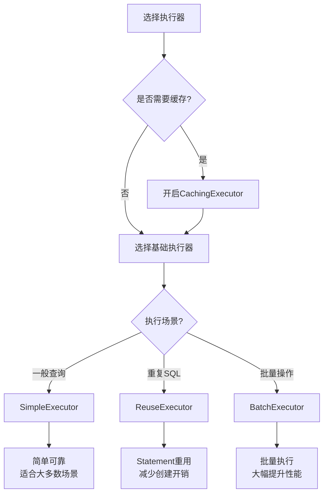

# 第5篇学习检验与总结

## 📊 学习成果检验

### ✅ 基础概念掌握度自检

请在学习完成后，对以下概念进行自我评估：

- [ ] **Executor接口的核心方法** - 能够说出主要方法的作用
- [ ] **BaseExecutor的模板方法模式** - 理解模板方法的实现机制
- [ ] **一级缓存的工作原理** - 掌握PerpetualCache的使用
- [ ] **CacheKey的生成规则** - 了解缓存键的构成要素
- [ ] **SimpleExecutor的执行流程** - 理解简单执行器的工作方式
- [ ] **ReuseExecutor的Statement重用机制** - 掌握Statement缓存策略
- [ ] **BatchExecutor的批量执行原理** - 理解批量操作的实现
- [ ] **CachingExecutor的装饰器模式** - 掌握二级缓存的工作机制
- [ ] **TransactionalCacheManager的作用** - 理解事务缓存管理
- [ ] **执行器选择策略** - 能够根据场景选择合适的执行器

## 📝 核心知识点总结

### 1. Executor体系架构

```
Executor (接口)
├── BaseExecutor (抽象类)
│   ├── SimpleExecutor (简单执行器)
│   ├── ReuseExecutor (重用执行器)
│   └── BatchExecutor (批量执行器)
└── CachingExecutor (缓存装饰器)
```

### 2. 设计模式应用

| 设计模式 | 应用类 | 作用 |
|---------|--------|------|
| **模板方法模式** | BaseExecutor | 定义执行流程，子类实现具体逻辑 |
| **装饰器模式** | CachingExecutor | 为执行器添加缓存功能 |
| **策略模式** | ExecutorType枚举 | 运行时选择不同的执行策略 |

### 3. 缓存机制对比

| 缓存类型 | 作用域 | 管理者 | 生命周期 | 配置方式 |
|---------|--------|--------|---------|---------|
| **一级缓存** | SqlSession | BaseExecutor | 会话级别 | 默认开启 |
| **二级缓存** | Namespace | CachingExecutor | 应用级别 | 需要配置 |

### 4. 执行器选择指南



## 🧩 重要源码片段

### BaseExecutor模板方法实现

```java
// 查询模板方法
@Override
public <E> List<E> query(MappedStatement ms, Object parameter, 
                        RowBounds rowBounds, ResultHandler resultHandler, 
                        CacheKey cacheKey, BoundSql boundSql) throws SQLException {
    // 1. 错误检查
    if (closed) {
        throw new ExecutorException("Executor was closed.");
    }
    
    // 2. 缓存清理检查
    if (queryStack == 0 && ms.isFlushCacheRequired()) {
        clearLocalCache();
    }
    
    List<E> list;
    try {
        queryStack++;
        // 3. 尝试从缓存获取
        list = resultHandler == null ? (List<E>) localCache.getObject(cacheKey) : null;
        if (list != null) {
            handleLocallyCachedOutputParameters(ms, cacheKey, parameter, boundSql);
        } else {
            // 4. 从数据库查询
            list = queryFromDatabase(ms, parameter, rowBounds, resultHandler, cacheKey, boundSql);
        }
    } finally {
        queryStack--;
    }
    
    // 5. 延迟加载处理
    if (queryStack == 0) {
        for (DeferredLoad deferredLoad : deferredLoads) {
            deferredLoad.load();
        }
        deferredLoads.clear();
        if (configuration.getLocalCacheScope() == LocalCacheScope.STATEMENT) {
            clearLocalCache();
        }
    }
    return list;
}
```

### CacheKey生成逻辑

```java
@Override
public CacheKey createCacheKey(MappedStatement ms, Object parameterObject, 
                              RowBounds rowBounds, BoundSql boundSql) {
    CacheKey cacheKey = new CacheKey();
    // 影响缓存Key的因素
    cacheKey.update(ms.getId());              // SQL ID
    cacheKey.update(rowBounds.getOffset());   // 分页偏移
    cacheKey.update(rowBounds.getLimit());    // 分页大小
    cacheKey.update(boundSql.getSql());       // SQL语句
    
    // 参数值也是缓存Key的一部分
    List<ParameterMapping> parameterMappings = boundSql.getParameterMappings();
    for (ParameterMapping parameterMapping : parameterMappings) {
        if (parameterMapping.getMode() != ParameterMode.OUT) {
            Object value = getParameterValue(parameterMapping, parameterObject, boundSql);
            cacheKey.update(value);
        }
    }
    
    // 环境ID也影响缓存Key
    if (configuration.getEnvironment() != null) {
        cacheKey.update(configuration.getEnvironment().getId());
    }
    return cacheKey;
}
```

## 🚀 实践心得记录

### 执行器性能测试结果

| 执行器类型 | 1000次查询耗时 | 1000次批量插入耗时 | 内存使用情况 |
|-----------|---------------|------------------|-------------|
| SimpleExecutor | ___ ms | ___ ms | ___ MB |
| ReuseExecutor | ___ ms | ___ ms | ___ MB |
| BatchExecutor | ___ ms | ___ ms | ___ MB |

### 缓存命中率测试

| 场景 | 一级缓存命中率 | 二级缓存命中率 | 说明 |
|------|---------------|---------------|------|
| 相同参数重复查询 | __% | __% | |
| 不同参数查询 | __% | __% | |
| 跨会话查询 | __% | __% | |

### 遇到的问题与解决方案

1. **问题**: ________________
   **解决方案**: ________________

2. **问题**: ________________
   **解决方案**: ________________

## 💡 关键理解点

### 1. 为什么需要多种执行器？

- **职责单一**: 每种执行器专注于特定场景
- **性能优化**: 针对不同场景提供最优的执行策略
- **灵活配置**: 可以根据业务需求选择合适的执行器

### 2. BaseExecutor的设计巧思

- **模板方法**: 统一执行流程，子类实现差异化逻辑
- **缓存管理**: 内置一级缓存，提升查询性能
- **延迟加载**: 支持懒加载，避免不必要的查询

### 3. CachingExecutor的装饰器价值

- **功能增强**: 为任意执行器添加二级缓存能力
- **透明代理**: 对原执行器的调用者完全透明
- **事务安全**: 通过TransactionalCacheManager保证事务一致性

## 🎯 下一步学习计划

基于本篇学习，建议接下来重点关注：

1. **StatementHandler**: 了解SQL语句的预处理和执行
2. **ParameterHandler**: 学习参数设置和类型转换
3. **ResultSetHandler**: 掌握结果集映射和处理
4. **TypeHandler**: 理解Java类型与JDBC类型的转换

## ✍️ 学习反思

### 本篇最大收获是什么？

```
请在此记录你本篇学习的最大收获...
```

### 还有哪些地方需要加强？

```
请在此记录需要进一步学习的内容...
```

### 如何应用到实际项目中？

```
请在此记录如何将所学知识应用到实际项目中...
```

---

**恭喜完成第5篇的学习！继续保持学习热情，迎接下一个挑战！** 🎉