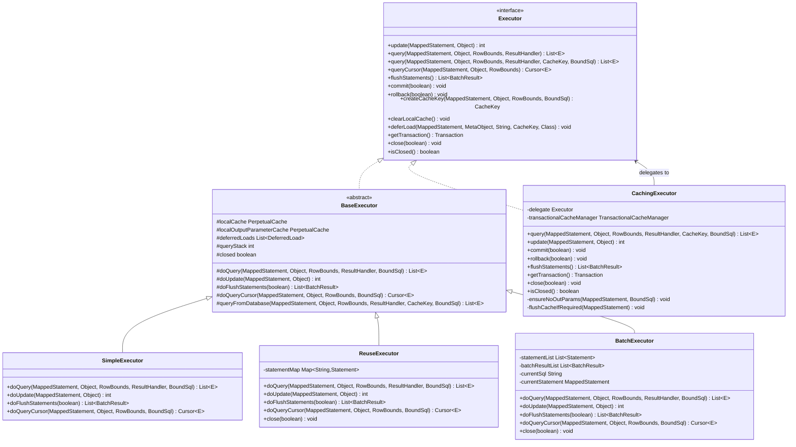
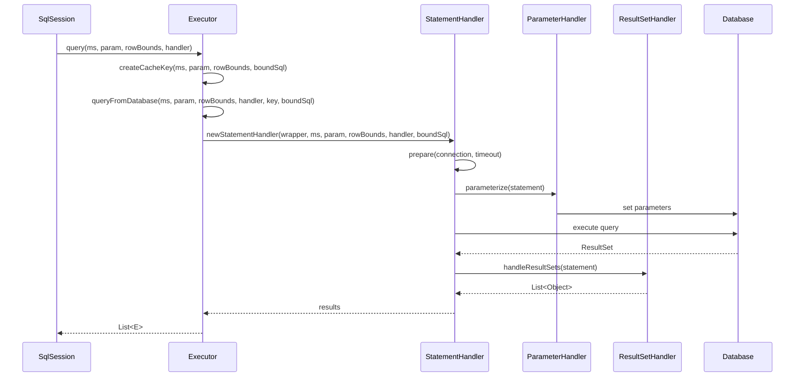

# 第5篇：Executor执行器体系详解

## 1. 学习目标确认

### 1.0 第4篇思考题解答

在深入学习Executor执行器体系之前，让我们先回顾并解答第4篇中提出的思考题，这将帮助我们更好地理解Executor在整个架构中的作用。

#### 思考题1：为什么MyBatis选择JDK动态代理而非字节码增强（如ASM/CGLIB）？

**答案要点**：

- **接口代理特性**：MyBatis的Mapper接口都是接口，JDK动态代理天然支持接口代理，无需依赖第三方库
- **性能考虑**：JDK动态代理在JVM层面有优化，性能优于字节码增强方案
- **兼容性**：JDK动态代理是Java标准库的一部分，兼容性更好，无需额外依赖
- **简洁性**：实现相对简单，代码量少，维护成本低
- **功能满足**：对于MyBatis的需求（方法调用拦截和转发），JDK动态代理完全满足

**Executor的作用**：Executor作为Mapper代理调用的最终执行者，负责具体的SQL执行和结果处理。

#### 思考题2：多返回值场景下，MapperMethod如何区分集合、游标与映射类型？

**答案要点**：

- **返回类型检测**：通过反射获取方法返回类型，判断是否为Collection、Cursor或Map类型
- **注解识别**：通过@MapKey注解识别Map类型，通过泛型参数确定Map的key类型
- **执行路径选择**：根据返回类型选择对应的SqlSession方法（selectList、selectCursor、selectMap）
- **结果适配**：MapperMethod根据方法签名进行结果类型适配和转换
- **异常处理**：对不匹配的返回类型进行异常处理和提示

**与Executor的协作**：Executor根据不同的执行类型（SELECT/INSERT/UPDATE/DELETE）和返回类型选择合适的执行策略。

#### 思考题3：在开启二级缓存时，哪些因素会导致缓存失效或绕过？

**答案要点**：

- **flushCache配置**：非SELECT语句默认flushCache=true，会清空相关缓存
- **useCache配置**：SELECT语句可配置useCache=false绕过缓存
- **ResultHandler使用**：使用ResultHandler的查询会绕过二级缓存
- **存储过程OUT参数**：带有OUT参数的存储过程会绕过缓存
- **事务边界**：事务提交/回滚会影响TransactionalCache的缓存策略
- **缓存Key变化**：参数或配置变化导致CacheKey不同，无法命中缓存

**Executor的缓存管理**：CachingExecutor负责二级缓存的读写管理，SimpleExecutor等负责一级缓存的维护。

### 1.1 本篇学习目标

通过本文你将能够：

1. 深入理解MyBatis Executor执行器体系的设计思想和架构模式
2. 掌握BaseExecutor模板方法模式的实现原理和优势
3. 理解SimpleExecutor、ReuseExecutor、BatchExecutor的具体实现和适用场景
4. 掌握CachingExecutor装饰器模式在缓存管理中的应用
5. 了解Executor与StatementHandler、ParameterHandler、ResultSetHandler的协作关系
6. 具备自定义Executor扩展开发的能力

## 2. Executor执行器体系总览

### 2.1 执行器继承关系图



### 2.2 执行器职责分工

| 执行器类型 | 核心职责 | 适用场景 | 性能特点 |
|-----------|---------|---------|---------|
| **BaseExecutor** | 模板方法实现，一级缓存管理 | 所有场景的基础 | 提供通用功能和缓存 |
| **SimpleExecutor** | 简单执行，每次创建新Statement | 单次执行、简单查询 | 简单直接，资源及时释放 |
| **ReuseExecutor** | 重用Statement对象 | 重复执行相同SQL | 减少Statement创建开销 |
| **BatchExecutor** | 批量执行多个SQL | 批量插入、更新、删除 | 大幅减少数据库交互次数 |
| **CachingExecutor** | 二级缓存管理 | 需要缓存的查询场景 | 避免重复查询，提升性能 |

### 2.3 执行器协作关系



## 3. BaseExecutor抽象基类深度解析

### 3.1 模板方法模式实现

BaseExecutor采用模板方法模式，定义了SQL执行的标准流程，子类只需实现具体的执行逻辑：

```java
package org.apache.ibatis.executor;

/**
 * 执行器抽象基类，采用模板方法模式
 * 定义SQL执行的标准流程，子类实现具体的执行逻辑
 */
public abstract class BaseExecutor implements Executor {
    // 事务管理器，用于管理数据库事务
    protected Transaction transaction;
    // 执行器包装器，通常是CachingExecutor
    protected Executor wrapper;
    // 一级缓存（本地缓存），session级别缓存
    protected PerpetualCache localCache;
    // 存储过程出参缓存
    protected PerpetualCache localOutputParameterCache;
    // MyBatis全局配置对象
    protected Configuration configuration;
    // 查询栈深度，用于控制嵌套查询
    protected int queryStack;
    // 执行器是否已关闭
    private boolean closed;
    // 延迟加载队列，存储需要延迟加载的对象
    protected List<DeferredLoad> deferredLoads = new ArrayList<>();
    
    /**
     * 模板方法：查询操作的标准流程（重载方法1）
     * @param ms SQL映射语句
     * @param parameter 查询参数
     * @param rowBounds 分页参数
     * @param resultHandler 结果处理器
     * @return 查询结果列表
     */
    @Override
    public <E> List<E> query(MappedStatement ms, Object parameter, RowBounds rowBounds, ResultHandler resultHandler) throws SQLException {
        // 根据参数生成动态SQL
        BoundSql boundSql = ms.getBoundSql(parameter);
        // 创建缓存键，用于一级缓存
        CacheKey key = createCacheKey(ms, parameter, rowBounds, boundSql);
        // 调用重载方法继续执行
        return query(ms, parameter, rowBounds, resultHandler, key, boundSql);
    }
    
    /**
     * 模板方法：查询操作的标准流程（重载方法2）
     * 这是查询的核心方法，包含完整的缓存和执行逻辑
     */
    @Override
    public <E> List<E> query(MappedStatement ms, Object parameter, RowBounds rowBounds, ResultHandler resultHandler, CacheKey cacheKey, BoundSql boundSql) throws SQLException {
        // 设置错误上下文，便于调试和错误定位
        ErrorContext.instance().resource(ms.getResource()).activity("executing a query").object(ms.getId());
        
        // 检查执行器是否已关闭
        if (closed) {
            throw new ExecutorException("Executor was closed.");
        }
        
        // 如果是最外层查询且配置了刷新缓存，则清空本地缓存
        if (queryStack == 0 && ms.isFlushCacheRequired()) {
            clearLocalCache();
        }
        
        List<E> list;
        try {
            // 查询栈深度+1，用于处理嵌套查询
            queryStack++;
            
            // 尝试从一级缓存中获取结果（仅当没有结果处理器时）
            list = resultHandler == null ? (List<E>) localCache.getObject(cacheKey) : null;
            
            if (list != null) {
                // 缓存命中，处理存储过程的输出参数
                handleLocallyCachedOutputParameters(ms, cacheKey, parameter, boundSql);
            } else {
                // 缓存未命中，从数据库查询
                list = queryFromDatabase(ms, parameter, rowBounds, resultHandler, cacheKey, boundSql);
            }
        } finally {
            // 查询栈深度-1
            queryStack--;
        }
        
        // 如果回到最外层查询
        if (queryStack == 0) {
            // 执行所有延迟加载
            for (DeferredLoad deferredLoad : deferredLoads) {
                deferredLoad.load();
            }
            // 清空延迟加载队列
            deferredLoads.clear();
            
            // 如果配置为STATEMENT级别缓存，执行完成后清空缓存
            if (configuration.getLocalCacheScope() == LocalCacheScope.STATEMENT) {
                clearLocalCache();
            }
        }
        return list;
    }
    
    /**
     * 抽象方法：子类实现具体的数据库查询逻辑
     * 不同的执行器有不同的实现策略
     */
    protected abstract <E> List<E> doQuery(MappedStatement ms, Object parameter, RowBounds rowBounds, ResultHandler resultHandler, BoundSql boundSql) throws SQLException;
    
    /**
     * 模板方法：更新操作的标准流程
     * 包括插入、更新、删除操作
     */
    @Override
    public int update(MappedStatement ms, Object parameter) throws SQLException {
        // 设置错误上下文
        ErrorContext.instance().resource(ms.getResource()).activity("executing an update").object(ms.getId());
        
        // 检查执行器是否已关闭
        if (closed) {
            throw new ExecutorException("Executor was closed.");
        }
        
        // 清空本地缓存（更新操作会影响缓存一致性）
        clearLocalCache();
        
        // 调用子类的具体实现
        return doUpdate(ms, parameter);
    }
    
    /**
     * 抽象方法：子类实现具体的数据库更新逻辑
     */
    protected abstract int doUpdate(MappedStatement ms, Object parameter) throws SQLException;
}
```

### 3.2 一级缓存机制

BaseExecutor实现了一级缓存（本地缓存），提升重复查询的性能：

```java
/**
 * 从数据库查询数据并缓存结果
 * 这是一级缓存的核心实现方法
 */
private <E> List<E> queryFromDatabase(MappedStatement ms, Object parameter, RowBounds rowBounds, ResultHandler resultHandler, CacheKey cacheKey, BoundSql boundSql) throws SQLException {
    List<E> list;
    
    // 在缓存中放入占位符，防止循环引用
    localCache.putObject(cacheKey, EXECUTION_PLACEHOLDER);
    
    try {
        // 调用子类的具体实现执行数据库查询
        list = doQuery(ms, parameter, rowBounds, resultHandler, boundSql);
    } finally {
        // 无论成功还是失败，都要移除占位符
        localCache.removeObject(cacheKey);
    }
    
    // 将查询结果放入一级缓存
    localCache.putObject(cacheKey, list);
    
    // 如果是存储过程调用，需要缓存输出参数
    if (ms.getStatementType() == StatementType.CALLABLE) {
        localOutputParameterCache.putObject(cacheKey, parameter);
    }
    
    return list;
}

/**
 * 创建缓存键
 * 缓存键由多个因素组成，确保唯一性
 */
@Override
public CacheKey createCacheKey(MappedStatement ms, Object parameterObject, RowBounds rowBounds, BoundSql boundSql) {
    // 检查执行器是否已关闭
    if (closed) {
        throw new ExecutorException("Executor was closed.");
    }
    
    // 创建缓存键对象
    CacheKey cacheKey = new CacheKey();
    
    // 添加SQL映射语句ID到缓存键中
    cacheKey.update(ms.getId());
    
    // 添加分页参数到缓存键中
    cacheKey.update(rowBounds.getOffset());
    cacheKey.update(rowBounds.getLimit());
    
    // 添加SQL语句到缓存键中
    cacheKey.update(boundSql.getSql());
    
    // 获取参数映射列表
    List<ParameterMapping> parameterMappings = boundSql.getParameterMappings();
    TypeHandlerRegistry typeHandlerRegistry = ms.getConfiguration().getTypeHandlerRegistry();
    
    // 遍历所有参数，将参数值添加到缓存键中
    for (ParameterMapping parameterMapping : parameterMappings) {
        // 只处理输入参数，不处理输出参数
        if (parameterMapping.getMode() != ParameterMode.OUT) {
            Object value;
            String propertyName = parameterMapping.getProperty();
            
            // 获取参数值的逐个判断逻辑
            if (boundSql.hasAdditionalParameter(propertyName)) {
                // 从额外参数中获取
                value = boundSql.getAdditionalParameter(propertyName);
            } else if (parameterObject == null) {
                // 参数对象为空
                value = null;
            } else if (typeHandlerRegistry.hasTypeHandler(parameterObject.getClass())) {
                // 参数对象有对应的类型处理器（基本类型）
                value = parameterObject;
            } else {
                // 复杂对象，通过反射获取属性值
                MetaObject metaObject = configuration.newMetaObject(parameterObject);
                value = metaObject.getValue(propertyName);
            }
            
            // 将参数值添加到缓存键中
            cacheKey.update(value);
        }
    }
    
    // 将环境ID添加到缓存键中（区分不同环境）
    if (configuration.getEnvironment() != null) {
        cacheKey.update(configuration.getEnvironment().getId());
    }
    
    return cacheKey;
}
```

### 3.3 延迟加载机制

BaseExecutor支持延迟加载（懒加载），通过DeferredLoad实现：

```java
/**
 * 延迟加载类，用于实现懒加载功能
 * 当访问某个属性时，才真正执行相关查询
 */
public class DeferredLoad {
    // 结果对象的元数据包装器，用于反射操作
    private final MetaObject resultObject;
    // 需要延迟加载的属性名
    private final String property;
    // 目标类型（属性的类型）
    private final Class<?> targetType;
    // 缓存键，用于标识该次查询
    private final CacheKey key;
    // SQL映射语句，包含延迟加载的SQL信息
    private final MappedStatement mappedStatement;
    // 执行器，用于执行延迟加载查询
    private final Executor executor;
    
    /**
     * 构造延迟加载对象
     */
    public DeferredLoad(MetaObject resultObject, String property, Class<?> targetType, CacheKey key, MappedStatement mappedStatement, Executor executor) {
        this.resultObject = resultObject;
        this.property = property;
        this.targetType = targetType;
        this.key = key;
        this.mappedStatement = mappedStatement;
        this.executor = executor;
    }
    
    /**
     * 执行延迟加载
     * 这个方法会在适当的时机被调用，执行实际的数据库查询
     */
    public void load() throws SQLException {
        // 检查属性是否已经有值，如果已经有值则不需要加载
        if (resultObject.getValue(property) != null) {
            return;
        }
        
        // 执行实际的数据库查询
        List<Object> list = (List<Object>) executor.query(
            mappedStatement, 
            key.getParameterObject(), 
            RowBounds.DEFAULT, 
            Executor.NO_RESULT_HANDLER, 
            key, 
            mappedStatement.getBoundSql(key.getParameterObject())
        );
        
        // 处理查询结果
        if (list != null && list.size() > 0) {
            if (list.size() > 1) {
                // 多个结果，设置为列表
                resultObject.setValue(property, list);
            } else {
                // 单个结果，设置为单个对象
                resultObject.setValue(property, list.get(0));
            }
        }
    }
}
```

## 4. SimpleExecutor简单执行器

### 4.1 核心实现

SimpleExecutor是最基础的执行器，每次执行都创建新的Statement：

```java
package org.apache.ibatis.executor;

/**
 * 简单执行器：MyBatis的默认执行器
 * 特点：每次执行都创建新的Statement对象
 * 优点：简单可靠，资源管理清晰
 * 缺点：每次都要创建新Statement，有一定性能开销
 */
public class SimpleExecutor extends BaseExecutor {
    
    /**
     * 构造方法
     * @param configuration MyBatis全局配置
     * @param transaction 事务管理器
     */
    public SimpleExecutor(Configuration configuration, Transaction transaction) {
        super(configuration, transaction);
    }
    
    /**
     * 执行查询操作
     * 每次查询都会创建新的Statement对象
     */
    @Override
    public <E> List<E> doQuery(MappedStatement ms, Object parameter, RowBounds rowBounds, ResultHandler resultHandler, BoundSql boundSql) throws SQLException {
        Statement stmt = null;
        try {
            // 获取全局配置
            Configuration configuration = ms.getConfiguration();
            
            // 创建 StatementHandler，用于处理 SQL 语句
            StatementHandler handler = configuration.newStatementHandler(wrapper, ms, parameter, rowBounds, resultHandler, boundSql);
            
            // 准备 Statement（创建并设置参数）
            stmt = prepareStatement(handler, ms.getStatementLog());
            
            // 执行查询并返回结果
            return handler.query(stmt, resultHandler);
        } finally {
            // 无论成功还是失败，都要关闭 Statement
            closeStatement(stmt);
        }
    }
    
    /**
     * 执行更新操作（包括 INSERT、UPDATE、DELETE）
     */
    @Override
    public int doUpdate(MappedStatement ms, Object parameter) throws SQLException {
        Statement stmt = null;
        try {
            // 获取全局配置
            Configuration configuration = ms.getConfiguration();
            
            // 创建 StatementHandler
            StatementHandler handler = configuration.newStatementHandler(this, ms, parameter, RowBounds.DEFAULT, null, null);
            
            // 准备 Statement
            stmt = prepareStatement(handler, ms.getStatementLog());
            
            // 执行更新并返回影响行数
            return handler.update(stmt);
        } finally {
            // 关闭 Statement
            closeStatement(stmt);
        }
    }
    
    /**
     * 刷新批量操作
     * SimpleExecutor 不支持批量操作，返回空列表
     */
    @Override
    public List<BatchResult> doFlushStatements(boolean isRollback) throws SQLException {
        return Collections.emptyList();
    }
    
    /**
     * 执行游标查询
     * 游标查询适用于大结果集的流式处理
     */
    @Override
    public <E> Cursor<E> doQueryCursor(MappedStatement ms, Object parameter, RowBounds rowBounds, BoundSql boundSql) throws SQLException {
        // 获取全局配置
        Configuration configuration = ms.getConfiguration();
        
        // 创建 StatementHandler
        StatementHandler handler = configuration.newStatementHandler(wrapper, ms, parameter, rowBounds, null, boundSql);
        
        // 准备 Statement
        Statement stmt = prepareStatement(handler, ms.getStatementLog());
        
        // 返回游标对象（注意：游标不在这里关闭，由调用者负责关闭）
        return handler.queryCursor(stmt);
    }
    
    /**
     * 准备 Statement对象
     * 包括创建、设置超时、设置参数等操作
     */
    private Statement prepareStatement(StatementHandler handler, Log statementLog) throws SQLException {
        Statement stmt;
        
        // 获取数据库连接
        Connection connection = getConnection(statementLog);
        
        // 创建 Statement 并设置超时时间
        stmt = handler.prepare(connection, transaction.getTimeout());
        
        // 设置 SQL 参数
        handler.parameterize(stmt);
        
        return stmt;
    }
    
    /**
     * 关闭 Statement对象
     * 安全关闭，忽略异常
     */
    private void closeStatement(Statement stmt) {
        if (stmt != null) {
            try {
                stmt.close();
            } catch (SQLException e) {
                // 忽略关闭异常，避免影响主逻辑
            }
        }
    }
}
```

### 4.2 特点分析

**优势**：
- **简单可靠**：逻辑简单，易于理解和维护
- **资源管理**：及时释放Statement资源，避免内存泄漏
- **线程安全**：每次执行创建新Statement，无状态共享问题
- **适用广泛**：适合大多数业务场景

**劣势**：
- **性能开销**：每次执行都创建新Statement，有一定性能开销
- **重复工作**：相同SQL的重复执行无法复用Statement

## 5. ReuseExecutor重用执行器

### 5.1 核心实现

ReuseExecutor通过重用Statement对象来提升性能：

```java
package org.apache.ibatis.executor;

/**
 * 重用执行器：通过重用Statement对象来提升性能
 * 特点：相同SQL会重用同一个Statement对象
 * 优点：减少Statement创建开销，提升性能
 * 适用场景：重复执行相同SQL的场景
 */
public class ReuseExecutor extends BaseExecutor {
    // Statement缓存Map，以SQL为键，Statement为值
    private final Map<String, Statement> statementMap = new HashMap<>();
    
    /**
     * 构造方法
     */
    public ReuseExecutor(Configuration configuration, Transaction transaction) {
        super(configuration, transaction);
    }
    
    /**
     * 执行查询操作
     * 会尝试重用已存在的Statement
     */
    @Override
    public <E> List<E> doQuery(MappedStatement ms, Object parameter, RowBounds rowBounds, ResultHandler resultHandler, BoundSql boundSql) throws SQLException {
        Configuration configuration = ms.getConfiguration();
        StatementHandler handler = configuration.newStatementHandler(wrapper, ms, parameter, rowBounds, resultHandler, boundSql);
        
        // 准备Statement（可能会重用已存在的）
        Statement stmt = prepareStatement(handler, ms.getStatementLog());
        
        return handler.query(stmt, resultHandler);
    }
    
    /**
     * 执行更新操作
     */
    @Override
    public int doUpdate(MappedStatement ms, Object parameter) throws SQLException {
        Configuration configuration = ms.getConfiguration();
        StatementHandler handler = configuration.newStatementHandler(this, ms, parameter, RowBounds.DEFAULT, null, null);
        
        // 准备Statement
        Statement stmt = prepareStatement(handler, ms.getStatementLog());
        
        return handler.update(stmt);
    }
    
    /**
     * 刷新批量操作
     * 关闭所有缓存的Statement并清空缓存
     */
    @Override
    public List<BatchResult> doFlushStatements(boolean isRollback) throws SQLException {
        // 关闭所有缓存的Statement
        for (Statement stmt : statementMap.values()) {
            closeStatement(stmt);
        }
        // 清空缓存
        statementMap.clear();
        return Collections.emptyList();
    }
    
    /**
     * 执行游标查询
     */
    @Override
    public <E> Cursor<E> doQueryCursor(MappedStatement ms, Object parameter, RowBounds rowBounds, BoundSql boundSql) throws SQLException {
        Configuration configuration = ms.getConfiguration();
        StatementHandler handler = configuration.newStatementHandler(wrapper, ms, parameter, rowBounds, null, boundSql);
        Statement stmt = prepareStatement(handler, ms.getStatementLog());
        return handler.queryCursor(stmt);
    }
    
    /**
     * 准备Statement对象
     * 核心方法：实现Statement的重用逻辑
     */
    private Statement prepareStatement(StatementHandler handler, Log statementLog) throws SQLException {
        Statement stmt;
        BoundSql boundSql = handler.getBoundSql();
        String sql = boundSql.getSql();
        
        // 检查是否已经有可用的Statement
        if (hasStatementFor(sql)) {
            // 重用已存在的Statement
            stmt = getStatement(sql);
            // 重新设置事务超时时间
            applyTransactionTimeout(stmt);
        } else {
            // 创建新的Statement
            Connection connection = getConnection(statementLog);
            stmt = handler.prepare(connection, transaction.getTimeout());
            // 将新创建的Statement放入缓存
            putStatement(sql, stmt);
        }
        
        // 设置参数
        handler.parameterize(stmt);
        return stmt;
    }
    
    /**
     * 检查是否已经有可用的Statement
     * @param sql SQL语句
     * @return 是否存在可用的Statement
     */
    private boolean hasStatementFor(String sql) {
        try {
            // 检查缓存中是否存在该SQL对应的Statement，且Statement未关闭
            return statementMap.containsKey(sql) && !statementMap.get(sql).isClosed();
        } catch (SQLException e) {
            // 如果检查过程中出现异常，认为不可用
            return false;
        }
    }
    
    /**
     * 从缓存中获取Statement
     */
    private Statement getStatement(String s) {
        return statementMap.get(s);
    }
    
    /**
     * 将Statement放入缓存
     */
    private void putStatement(String sql, Statement stmt) {
        statementMap.put(sql, stmt);
    }
    
    /**
     * 关闭执行器
     * 需要清理所有缓存的Statement
     */
    @Override
    public void close(boolean forceRollback) {
        try {
            // 先刷新批量操作
            doFlushStatements(forceRollback);
        } finally {
            // 关闭所有Statement并清空缓存
            for (Statement stmt : statementMap.values()) {
                closeStatement(stmt);
            }
            statementMap.clear();
            // 调用父类的关闭方法
            super.close(forceRollback);
        }
    }
}
```

### 5.2 适用场景

**最佳场景**：
- **循环查询**：在循环中执行相同的SQL语句
- **重复调用**：同一个Mapper方法被频繁调用
- **报表查询**：生成报表时执行大量相同结构的查询

**性能提升**：
- **减少Statement创建开销**：避免重复创建Statement对象
- **减少SQL解析开销**：重用已解析的Statement
- **提升执行效率**：特别是在高并发场景下

## 6. BatchExecutor批量执行器

### 6.1 核心实现

BatchExecutor通过批量执行多个SQL来提升批量操作的性能：

```java
package org.apache.ibatis.executor;

public class BatchExecutor extends BaseExecutor {
    private final List<Statement> statementList = new ArrayList<>();
    private final List<BatchResult> batchResultList = new ArrayList<>();
    private String currentSql;
    private MappedStatement currentStatement;
    
    public BatchExecutor(Configuration configuration, Transaction transaction) {
        super(configuration, transaction);
    }
    
    /**
     * 执行更新操作（批量模式）
     * 核心方法：将多个相同SQL的更新操作打包成批量执行
     */
    @Override
    public int doUpdate(MappedStatement ms, Object parameter) throws SQLException {
        final Configuration configuration = ms.getConfiguration();
        final StatementHandler handler = configuration.newStatementHandler(this, ms, parameter, RowBounds.DEFAULT, null, null);
        final BoundSql boundSql = handler.getBoundSql();
        final String sql = boundSql.getSql();
        final StatementType statementType = ms.getStatementType();
        
        // 检查是否可以重用当前的Statement（相同SQL和语句类型）
        if (sql.equals(currentSql) && statementType == currentStatement.getStatementType()) {
            // 相同SQL，重用Statement
            final Statement stmt = statementList.get(statementList.size() - 1);
            applyTransactionTimeout(stmt);
            
            // 设置参数
            handler.parameterize(stmt);
            
            // 将参数添加到批量结果中
            BatchResult batchResult = batchResultList.get(batchResultList.size() - 1);
            batchResult.addParameterObject(parameter);
            
            return BATCH_UPDATE_RETURN_VALUE;
        } else {
            // 不同SQL，创建新Statement
            final Statement stmt;
            
            // 再次检查是否可以重用（双重检查机制）
            if (sql.equals(currentSql) && ms.getStatementType() == currentStatement.getStatementType()) {
                int last = statementList.size() - 1;
                stmt = statementList.get(last);
                applyTransactionTimeout(stmt);
                handler.parameterize(stmt);
                BatchResult batchResult = batchResultList.get(last);
                batchResult.addParameterObject(parameter);
            } else {
                // 创建全新的Statement
                Connection connection = getConnection(ms.getStatementLog());
                stmt = handler.prepare(connection, transaction.getTimeout());
                handler.parameterize(stmt);
                
                // 更新当前SQL和语句信息
                currentSql = sql;
                currentStatement = ms;
                
                // 将Statement和结果对象添加到列表中
                statementList.add(stmt);
                batchResultList.add(new BatchResult(ms, sql, parameter));
            }
            
            // 将操作添加到批量中（但不立即执行）
            handler.batch(stmt);
            
            return BATCH_UPDATE_RETURN_VALUE;
        }
    }
    
    @Override
    public <E> List<E> doQuery(MappedStatement ms, Object parameter, RowBounds rowBounds, ResultHandler resultHandler, BoundSql boundSql) throws SQLException {
        Statement stmt = null;
        try {
            flushStatements();
            Configuration configuration = ms.getConfiguration();
            StatementHandler handler = configuration.newStatementHandler(wrapper, ms, parameter, rowBounds, resultHandler, boundSql);
            Connection connection = getConnection(ms.getStatementLog());
            stmt = handler.prepare(connection, transaction.getTimeout());
            handler.parameterize(stmt);
            return handler.query(stmt, resultHandler);
        } finally {
            closeStatement(stmt);
        }
    }
    
    /**
     * 刷新批量操作 - 执行所有缓存的批量操作
     * 这是批量执行器的核心方法，实际执行所有缓存的SQL操作
     */
    @Override
    public List<BatchResult> doFlushStatements(boolean isRollback) throws SQLException {
        try {
            List<BatchResult> results = new ArrayList<>();
            
            // 如果是回滚操作，直接返回空列表
            if (isRollback) {
                return Collections.emptyList();
            }
            
            // 遍历所有缓存的Statement
            for (int i = 0, n = statementList.size(); i < n; i++) {
                Statement stmt = statementList.get(i);
                
                // 重新设置事务超时时间
                applyTransactionTimeout(stmt);
                
                try {
                    // 执行批量操作，返回影响行数数组
                    int updateCount = stmt.executeBatch();
                    
                    // 获取对应的批量结果对象
                    BatchResult batchResult = batchResultList.get(i);
                    
                    // 设置影响行数
                    batchResult.setUpdateCounts(new int[]{updateCount});
                    
                    // 添加到结果列表中
                    results.add(batchResult);
                    
                } catch (BatchUpdateException e) {
                    // 批量执行异常处理
                    StringBuilder message = new StringBuilder();
                    message.append(batchResultList.get(i).getSql()).append(" (failed)\n");
                    
                    if (e.getMessage() != null && e.getMessage().length() > 0) {
                        message.append("  Cause: ").append(e.getMessage());
                    }
                    
                    // 抛出自定义批量执行异常，包含已成功的结果
                    throw new BatchExecutorException(message.toString(), e, results, batchResultList.get(i));
                }
            }
            
            return results;
            
        } finally {
            // 无论成功还是失败，都要清理资源
            
            // 关闭所有Statement
            for (Statement stmt : statementList) {
                closeStatement(stmt);
            }
            
            // 清空所有缓存列表
            statementList.clear();
            batchResultList.clear();
            
            // 重置当前状态
            currentSql = null;
            currentStatement = null;
        }
    }
}
```

### 6.2 批量操作优势

**性能提升**：
- **减少网络往返**：多个SQL一次性发送到数据库
- **减少事务开销**：批量操作在同一个事务中完成
- **提升吞吐量**：特别适合大量数据的批量处理

**适用场景**：
- **批量插入**：大量数据的批量插入操作
- **批量更新**：相同条件的批量更新操作
- **批量删除**：大量数据的批量删除操作
- **数据迁移**：数据导入导出场景

## 7. CachingExecutor缓存装饰器

### 7.1 装饰器模式实现

CachingExecutor采用装饰器模式，为其他执行器添加二级缓存功能：

```java
package org.apache.ibatis.executor;

/**
 * 缓存执行器 - 采用装饰器模式实现二级缓存
 * 特点：为其他执行器添加二级缓存功能
 * 优点：大幅提升查询性能，减少数据库访问
 * 适用场景：需要缓存的查询场景
 */
public class CachingExecutor implements Executor {
    // 被装饰的执行器（可以是任意类型的执行器）
    private final Executor delegate;
    // 事务缓存管理器，管理二级缓存的事务性
    private final TransactionalCacheManager tcm = new TransactionalCacheManager();
    
    /**
     * 构造方法 - 装饰器模式的典型实现
     * @param delegate 被装饰的执行器
     */
    public CachingExecutor(Executor delegate) {
        this.delegate = delegate;
        // 设置装饰器引用，便于被装饰者访问装饰器
        delegate.setExecutorWrapper(this);
    }
    
    /**
     * 查询方法 - 二级缓存的核心实现
     * 先检查二级缓存，未命中再委托给被装饰的执行器
     */
    @Override
    public <E> List<E> query(MappedStatement ms, Object parameterObject, RowBounds rowBounds, ResultHandler resultHandler, CacheKey key, BoundSql boundSql) throws SQLException {
        // 获取当前映射语句的缓存对象
        Cache cache = ms.getCache();
        
        // 只有配置了缓存的语句才会使用二级缓存
        if (cache != null) {
            // 检查是否需要刷新缓存（更新操作会刷新缓存）
            flushCacheIfRequired(ms);
            
            // 检查是否启用缓存且没有结果处理器
            if (ms.isUseCache() && resultHandler == null) {
                // 确保没有输出参数（存储过程的OUT参数不能缓存）
                ensureNoOutParams(ms, boundSql);
                
                // 尝试从二级缓存中获取结果
                @SuppressWarnings("unchecked")
                List<E> list = (List<E>) tcm.getObject(cache, key);
                
                if (list == null) {
                    // 缓存未命中，委托给被装饰的执行器执行查询
                    list = delegate.query(ms, parameterObject, rowBounds, resultHandler, key, boundSql);
                    
                    // 将查询结果放入二级缓存
                    tcm.putObject(cache, key, list);
                }
                
                return list;
            }
        }
        
        // 没有配置缓存或不符合缓存条件，直接委托执行
        return delegate.query(ms, parameterObject, rowBounds, resultHandler, key, boundSql);
    }
    
    /**
     * 更新方法 - 处理更新操作对缓存的影响
     */
    @Override
    public int update(MappedStatement ms, Object parameterObject) throws SQLException {
        // 更新操作前先刷新相关缓存
        flushCacheIfRequired(ms);
        
        // 委托给被装饰的执行器执行更新
        return delegate.update(ms, parameterObject);
    }
    
    /**
     * 提交事务 - 同时提交缓存事务
     */
    @Override
    public void commit(boolean required) throws SQLException {
        // 先提交数据库事务
        delegate.commit(required);
        
        // 再提交缓存事务（将缓存的数据真正写入缓存）
        tcm.commit();
    }
    
    /**
     * 回滚事务 - 同时回滚缓存事务
     */
    @Override
    public void rollback(boolean required) throws SQLException {
        try {
            // 先回滚数据库事务
            delegate.rollback(required);
        } finally {
            // 确保缓存事务也被回滚
            if (required) {
                tcm.rollback();
            }
        }
    }
    
    /**
     * 刷新语句 - 委托给被装饰的执行器
     */
    @Override
    public void flushStatements() throws SQLException {
        delegate.flushStatements();
    }
    
    /**
     * 根据需要刷新缓存
     * 如果映射语句配置了flushCache=true，则清空缓存
     */
    private void flushCacheIfRequired(MappedStatement ms) {
        Cache cache = ms.getCache();
        // 检查是否有缓存且需要刷新
        if (cache != null && ms.isFlushCacheRequired()) {
            tcm.clear(cache);
        }
    }
    
    /**
     * 确保没有输出参数
     * 存储过程的OUT参数不能被缓存，因为每次调用结果都可能不同
     */
    private void ensureNoOutParams(MappedStatement ms, BoundSql boundSql) {
        if (ms.getStatementType() == StatementType.CALLABLE) {
            for (ParameterMapping parameterMapping : boundSql.getParameterMappings()) {
                if (parameterMapping.getMode() != ParameterMode.IN) {
                    throw new ExecutorException("Caching stored procedures with OUT params is not supported. Please configure useCache=false in " + ms.getId() + " statement.");
                }
            }
        }
    }
}
```

### 7.2 事务缓存管理

TransactionalCacheManager管理事务级别的缓存操作：

```java
package org.apache.ibatis.executor;

public class TransactionalCacheManager {
    private final Map<Cache, TransactionalCache> transactionalCaches = new HashMap<>();
    
    public void clear(Cache cache) {
        getTransactionalCache(cache).clear();
    }
    
    public Object getObject(Cache cache, CacheKey key) {
        return getTransactionalCache(cache).getObject(key);
    }
    
    public void putObject(Cache cache, CacheKey key, Object value) {
        getTransactionalCache(cache).putObject(key, value);
    }
    
    public void commit() {
        for (TransactionalCache txCache : transactionalCaches.values()) {
            txCache.commit();
        }
    }
    
    public void rollback() {
        for (TransactionalCache txCache : transactionalCaches.values()) {
            txCache.rollback();
        }
    }
    
    private TransactionalCache getTransactionalCache(Cache cache) {
        TransactionalCache txCache = transactionalCaches.get(cache);
        if (txCache == null) {
            txCache = new TransactionalCache(cache);
            transactionalCaches.put(cache, txCache);
        }
        return txCache;
    }
}
```

## 8. 执行器选择策略

### 8.1 默认选择逻辑

MyBatis通过Configuration的newExecutor方法创建执行器：

```java
public Executor newExecutor(Transaction transaction, ExecutorType execType) {
    execType = execType == null ? defaultExecutorType : execType;
    execType = execType == null ? ExecutorType.SIMPLE : execType;
    Executor executor;
    if (ExecutorType.BATCH == execType) {
        executor = new BatchExecutor(this, transaction);
    } else if (ExecutorType.REUSE == execType) {
        executor = new ReuseExecutor(this, transaction);
    } else {
        executor = new SimpleExecutor(this, transaction);
    }
    if (cacheEnabled) {
        executor = new CachingExecutor(executor);
    }
    executor = (Executor) interceptorChain.pluginAll(executor);
    return executor;
}
```

### 8.2 选择建议

| 场景 | 推荐执行器 | 原因 |
|------|-----------|------|
| **一般业务查询** | SimpleExecutor | 简单可靠，适合大多数场景 |
| **重复SQL查询** | ReuseExecutor | 减少Statement创建开销 |
| **批量数据操作** | BatchExecutor | 大幅提升批量操作性能 |
| **需要缓存** | CachingExecutor + 任意基础执行器 | 提供二级缓存支持 |
| **高并发读多** | CachingExecutor + ReuseExecutor | 结合缓存和Statement重用 |

## 9. 实践案例：自定义执行器

### 9.1 性能监控执行器

让我们创建一个性能监控执行器，记录SQL执行时间：

```java
package com.example.executor;

import org.apache.ibatis.executor.Executor;
import org.apache.ibatis.executor.ExecutorException;
import org.apache.ibatis.mapping.BoundSql;
import org.apache.ibatis.mapping.MappedStatement;
import org.apache.ibatis.plugin.Interceptor;
import org.apache.ibatis.plugin.Intercepts;
import org.apache.ibatis.plugin.Invocation;
import org.apache.ibatis.plugin.Plugin;
import org.apache.ibatis.plugin.Signature;
import org.apache.ibatis.session.ResultHandler;
import org.apache.ibatis.session.RowBounds;

import java.util.Properties;

@Intercepts({
    @Signature(type = Executor.class, method = "update", args = {MappedStatement.class, Object.class}),
    @Signature(type = Executor.class, method = "query", args = {MappedStatement.class, Object.class, RowBounds.class, ResultHandler.class})
})
public class PerformanceMonitorInterceptor implements Interceptor {
    
    private long slowQueryThreshold = 1000; // 慢查询阈值，默认1秒
    
    @Override
    public Object intercept(Invocation invocation) throws Throwable {
        long startTime = System.currentTimeMillis();
        Object result = invocation.proceed();
        long endTime = System.currentTimeMillis();
        long executionTime = endTime - startTime;
        
        MappedStatement ms = (MappedStatement) invocation.getArgs()[0];
        String methodName = invocation.getMethod().getName();
        
        if (executionTime > slowQueryThreshold) {
            System.out.println(String.format("SLOW QUERY DETECTED: %s.%s executed in %d ms", 
                ms.getId(), methodName, executionTime));
        }
        
        System.out.println(String.format("SQL Execution: %s.%s completed in %d ms", 
            ms.getId(), methodName, executionTime));
        
        return result;
    }
    
    @Override
    public Object plugin(Object target) {
        return Plugin.wrap(target, this);
    }
    
    @Override
    public void setProperties(Properties properties) {
        String threshold = properties.getProperty("slowQueryThreshold");
        if (threshold != null) {
            this.slowQueryThreshold = Long.parseLong(threshold);
        }
    }
}
```

### 9.2 配置使用

在mybatis-config.xml中配置插件：

```xml
<configuration>
    <plugins>
        <plugin interceptor="com.example.executor.PerformanceMonitorInterceptor">
            <property name="slowQueryThreshold" value="500"/>
        </plugin>
    </plugins>
    
    <settings>
        <setting name="defaultExecutorType" value="REUSE"/>
        <setting name="cacheEnabled" value="true"/>
    </settings>
</configuration>
```

### 9.3 测试代码

```java
package com.example;

import org.apache.ibatis.io.Resources;
import org.apache.ibatis.session.SqlSession;
import org.apache.ibatis.session.SqlSessionFactory;
import org.apache.ibatis.session.SqlSessionFactoryBuilder;
import org.apache.ibatis.session.ExecutorType;

import java.io.InputStream;

/**
 * Executor执行器示例测试类
 * 展示不同类型执行器的使用和性能特点
 */
public class ExecutorExample {
    public static void main(String[] args) throws Exception {
        // 加载MyBatis配置文件
        String resource = "mybatis-config.xml";
        InputStream inputStream = Resources.getResourceAsStream(resource);
        SqlSessionFactory factory = new SqlSessionFactoryBuilder().build(inputStream);
        
        // 测试不同类型的执行器
        testSimpleExecutor(factory);
        testReuseExecutor(factory);
        testBatchExecutor(factory);
    }
    
    /**
     * 测试SimpleExecutor（简单执行器）
     * 特点：每次执行都创建新的Statement
     */
    private static void testSimpleExecutor(SqlSessionFactory factory) {
        System.out.println("=== 测试 SimpleExecutor ===");
        
        // 使用SIMPLE类型执行器创建SqlSession
        try (SqlSession session = factory.openSession(ExecutorType.SIMPLE)) {
            UserMapper mapper = session.getMapper(UserMapper.class);
            
            // 执行多次相同查询，观察性能表现
            for (int i = 0; i < 3; i++) {
                System.out.println(">>> 第" + (i + 1) + "次查询（SimpleExecutor）");
                User user = mapper.findById(1L);
                System.out.println("查询结果: " + user);
            }
            
            System.out.println("注意：每次查询都会创建新的Statement，但会命中一级缓存");
        }
    }
    
    /**
     * 测试ReuseExecutor（重用执行器）
     * 特点：相同SQL会重用Statement对象
     */
    private static void testReuseExecutor(SqlSessionFactory factory) {
        System.out.println("=== 测试 ReuseExecutor ===");
        
        // 使用REUSE类型执行器创建SqlSession
        try (SqlSession session = factory.openSession(ExecutorType.REUSE)) {
            UserMapper mapper = session.getMapper(UserMapper.class);
            
            // 执行多次相同查询，Statement会被重用
            for (int i = 0; i < 3; i++) {
                System.out.println(">>> 第" + (i + 1) + "次查询（ReuseExecutor）");
                User user = mapper.findById(1L);
                System.out.println("查询结果: " + user);
            }
            
            System.out.println("注意：相同SQL会重用Statement，性能优于 SimpleExecutor");
            
            // 测试不同SQL的情况
            System.out.println(">>> 执行不同SQL");
            User user2 = mapper.findByName("John");
            System.out.println("不同SQL查询结果: " + user2);
        }
    }
    
    /**
     * 测试BatchExecutor（批量执行器）
     * 特点：将多个操作打包成批量执行，提升性能
     */
    private static void testBatchExecutor(SqlSessionFactory factory) {
        System.out.println("=== 测试 BatchExecutor ===");
        
        // 使用BATCH类型执行器创建SqlSession
        try (SqlSession session = factory.openSession(ExecutorType.BATCH)) {
            UserMapper mapper = session.getMapper(UserMapper.class);
            
            System.out.println(">>> 执行批量插入操作");
            
            // 批量插入多个用户
            for (int i = 1; i <= 5; i++) {
                User user = new User((long) i, "User" + i, "user" + i + "@example.com");
                
                // 注意：这里只是将操作加入批量队列，并没有立即执行
                int result = mapper.insertUser(user);
                System.out.println("批量插入 User" + i + "，返回值：" + result + " （注意：返回值为固定值）");
            }
            
            System.out.println(">>> 执行批量提交");
            
            // 手动刷新批量操作，这时才会真正执行数据库操作
            List<BatchResult> batchResults = session.flushStatements();
            
            System.out.println("批量执行结果：");
            for (BatchResult batchResult : batchResults) {
                System.out.println("  SQL: " + batchResult.getSql());
                System.out.println("  影响行数: " + Arrays.toString(batchResult.getUpdateCounts()));
                System.out.println("  参数数量: " + batchResult.getParameterObjects().size());
            }
            
            // 提交事务
            session.commit();
            System.out.println("批量插入完成，共处理 5 条记录");
            
            System.out.println("注意：BatchExecutor 适合大量数据的批量操作，能显著提升性能");
        }
    }
}
```

## 10. 源码调试指导

### 10.1 关键断点位置

**BaseExecutor断点**：
1. `BaseExecutor.query()` - 查询入口，观察缓存逻辑
2. `BaseExecutor.createCacheKey()` - 缓存Key创建过程
3. `BaseExecutor.queryFromDatabase()` - 数据库查询执行

**SimpleExecutor断点**：
1. `SimpleExecutor.doQuery()` - 简单查询执行
2. `SimpleExecutor.prepareStatement()` - Statement准备过程

**ReuseExecutor断点**：
1. `ReuseExecutor.prepareStatement()` - Statement重用逻辑
2. `ReuseExecutor.hasStatementFor()` - Statement存在性检查

**BatchExecutor断点**：
1. `BatchExecutor.doUpdate()` - 批量更新逻辑
2. `BatchExecutor.doFlushStatements()` - 批量执行提交

**CachingExecutor断点**：
1. `CachingExecutor.query()` - 二级缓存查询逻辑
2. `TransactionalCacheManager.getObject()` - 事务缓存获取

### 10.2 调试技巧

**观察执行器类型**：
```java
// 在SqlSession创建时观察executor类型
SqlSession session = factory.openSession(ExecutorType.REUSE);
System.out.println("Executor类型: " + session.getConfiguration().getDefaultExecutorType());
```

**观察缓存行为**：
```java
// 观察一级缓存命中
User user1 = mapper.findById(1L); // 第一次查询，从数据库获取
User user2 = mapper.findById(1L); // 第二次查询，从缓存获取
```

**观察批量操作**：
```java
// 观察批量执行效果
try (SqlSession session = factory.openSession(ExecutorType.BATCH)) {
    // 多次update操作
    List<BatchResult> results = session.flushStatements(); // 批量执行
}
```

## 11. 易错与排错清单

### 11.1 常见问题

| 问题 | 原因 | 解决方案 |
|------|------|---------|
| **Statement泄漏** | 忘记关闭Statement | 使用try-with-resources或确保在finally中关闭 |
| **批量操作不生效** | 忘记调用flushStatements() | 批量操作后必须调用flushStatements() |
| **缓存不生效** | 配置错误或缓存Key不匹配 | 检查cacheEnabled配置和CacheKey生成逻辑 |
| **ReuseExecutor性能问题** | 在非重复SQL场景使用 | 根据实际场景选择合适的执行器类型 |
| **事务缓存问题** | 事务边界与缓存不一致 | 确保事务提交/回滚与缓存操作同步 |

### 11.2 性能优化建议

- **合理选择执行器**：根据业务场景选择合适的执行器类型
- **缓存策略优化**：合理配置一级缓存和二级缓存
- **批量操作优化**：大量数据操作使用BatchExecutor
- **连接池配置**：根据并发量调整数据源连接池参数
- **SQL优化**：优化SQL语句，减少执行时间

## 12. 小结

通过本文的学习，我们深入了解了MyBatis Executor执行器体系：

1. **BaseExecutor**：采用模板方法模式，提供统一的执行框架和一级缓存管理
2. **SimpleExecutor**：基础执行器，每次创建新Statement，简单可靠
3. **ReuseExecutor**：重用Statement对象，适合重复SQL场景
4. **BatchExecutor**：批量执行器，大幅提升批量操作性能
5. **CachingExecutor**：装饰器模式实现二级缓存，提升查询性能

**重要提示**：Executor是MyBatis执行层的核心，理解Executor体系对于掌握MyBatis的执行机制至关重要。通过源码分析和实践案例，我们能够更好地理解不同执行器的适用场景和性能特点。

在下一篇文章中，我们将深入分析StatementHandler语句处理器，了解SQL语句的预处理和执行过程。

---

**思考题**：

1. **为什么MyBatis要设计多种Executor类型？它们各自的优势是什么？**
2. **BaseExecutor的模板方法模式是如何实现的？这种设计有什么优势？**
3. **CachingExecutor的装饰器模式是如何工作的？与一级缓存有什么区别？**
4. **在什么场景下应该使用BatchExecutor？使用时需要注意什么问题？**
