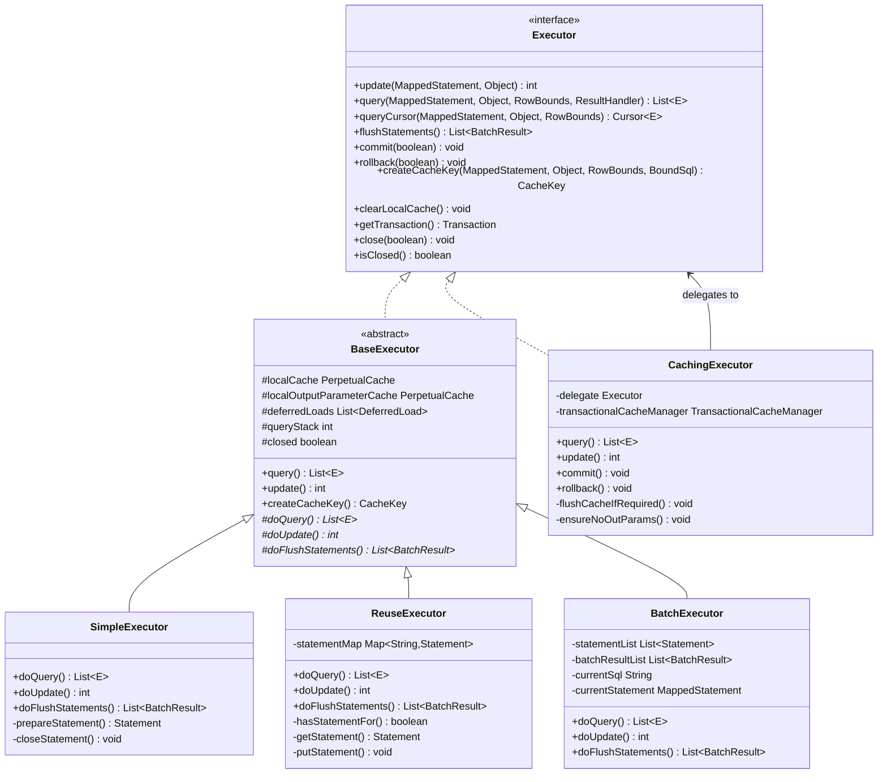
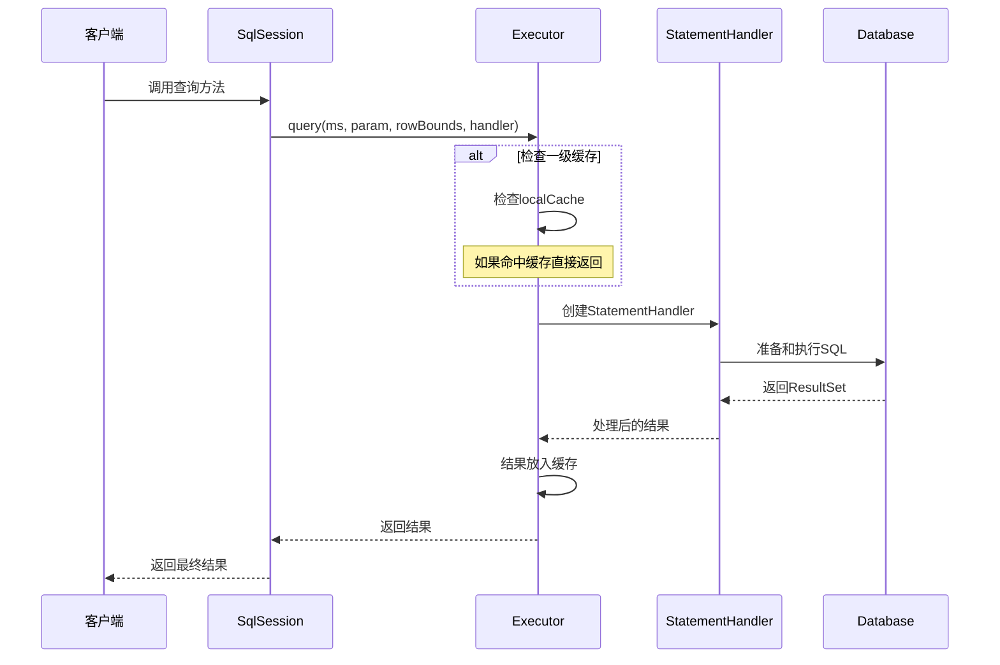
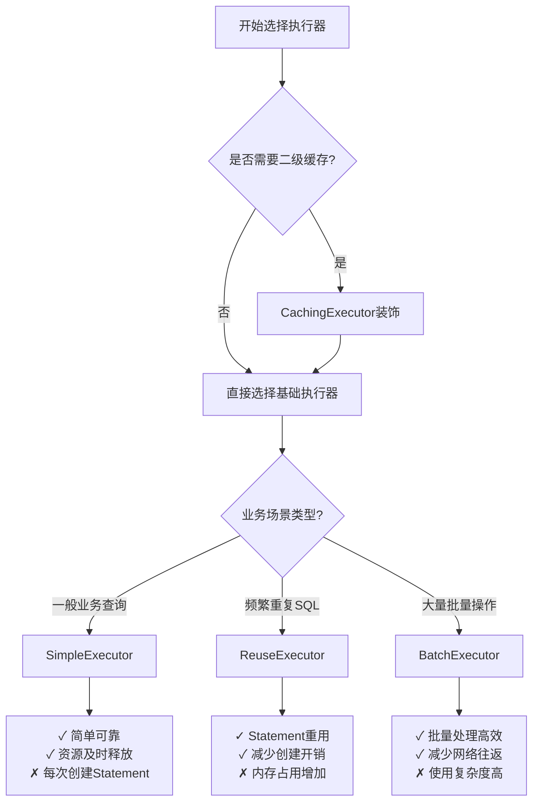
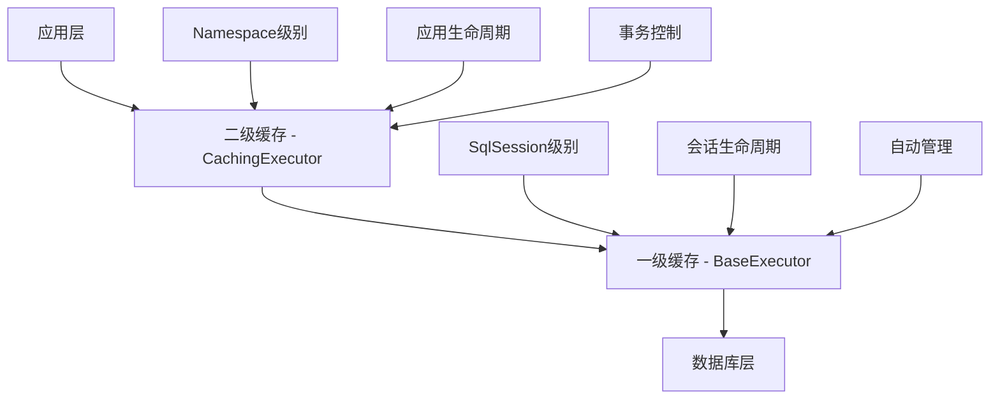
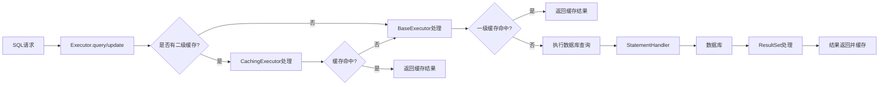

# Executor体系架构总览

## 🏗️ 执行器继承关系

MyBatis的Executor体系采用了多层次的设计，通过接口定义规范，抽象类提供通用功能，具体类实现特定策略。

### 类图关系



## 🎯 执行器职责分工

### 核心组件职责

| 组件 | 主要职责 | 设计模式 | 关键特性 |
|------|---------|---------|---------|
| **Executor接口** | 定义执行器规范 | 接口模式 | 统一的执行器契约 |
| **BaseExecutor** | 提供通用功能和一级缓存 | 模板方法模式 | 缓存管理、延迟加载 |
| **SimpleExecutor** | 简单直接的SQL执行 | 具体实现 | 每次创建新Statement |
| **ReuseExecutor** | Statement重用优化 | 具体实现 | Statement缓存池 |
| **BatchExecutor** | 批量操作优化 | 具体实现 | JDBC批量处理 |
| **CachingExecutor** | 二级缓存管理 | 装饰器模式 | 透明的缓存增强 |

### 执行流程概览



## 🔧 执行器选择策略

### 默认执行器创建逻辑

```java
public Executor newExecutor(Transaction transaction, ExecutorType execType) {
    execType = execType == null ? defaultExecutorType : execType;
    execType = execType == null ? ExecutorType.SIMPLE : execType;
    
    Executor executor;
    if (ExecutorType.BATCH == execType) {
        executor = new BatchExecutor(this, transaction);
    } else if (ExecutorType.REUSE == execType) {
        executor = new ReuseExecutor(this, transaction);
    } else {
        executor = new SimpleExecutor(this, transaction);
    }
    
    // 如果启用了二级缓存，用CachingExecutor装饰
    if (cacheEnabled) {
        executor = new CachingExecutor(executor);
    }
    
    // 应用插件拦截器
    executor = (Executor) interceptorChain.pluginAll(executor);
    return executor;
}
```

### 选择决策树



## 📊 性能特性对比

### 执行器性能矩阵

| 特性维度 | SimpleExecutor | ReuseExecutor | BatchExecutor |
|---------|---------------|---------------|---------------|
| **创建开销** | 每次创建 | 重用Statement | 批量创建 |
| **内存使用** | 低 | 中等 | 高（批量时） |
| **网络往返** | 每次一次 | 每次一次 | 批量一次 |
| **适用场景** | 通用查询 | 重复SQL | 批量操作 |
| **复杂度** | 简单 | 中等 | 复杂 |
| **事务安全** | 高 | 高 | 需注意异常处理 |

### 缓存层次结构



## 🔄 组件协作关系

### 核心协作模式

1. **委托模式**：CachingExecutor委托给基础执行器
2. **模板方法**：BaseExecutor定义标准流程
3. **策略模式**：根据ExecutorType选择具体实现
4. **装饰器模式**：CachingExecutor增强基础功能

### 数据流转过程



## 🚀 扩展点与插件机制

### 可拦截的Executor方法

```java
// 常见的拦截点
@Intercepts({
    @Signature(type = Executor.class, method = "update", 
               args = {MappedStatement.class, Object.class}),
    @Signature(type = Executor.class, method = "query", 
               args = {MappedStatement.class, Object.class, RowBounds.class, ResultHandler.class})
})
public class CustomExecutorInterceptor implements Interceptor {
    // 自定义拦截逻辑
}
```

### 自定义执行器扩展

开发者可以通过以下方式扩展Executor：

1. **继承BaseExecutor**：实现自定义的执行逻辑
2. **实现Executor接口**：完全自定义的执行器
3. **使用插件机制**：在现有执行器基础上增强功能
4. **装饰器模式**：类似CachingExecutor的功能增强

---

**通过这个架构总览，你应该对Executor体系有了全面的认识！** 🎯