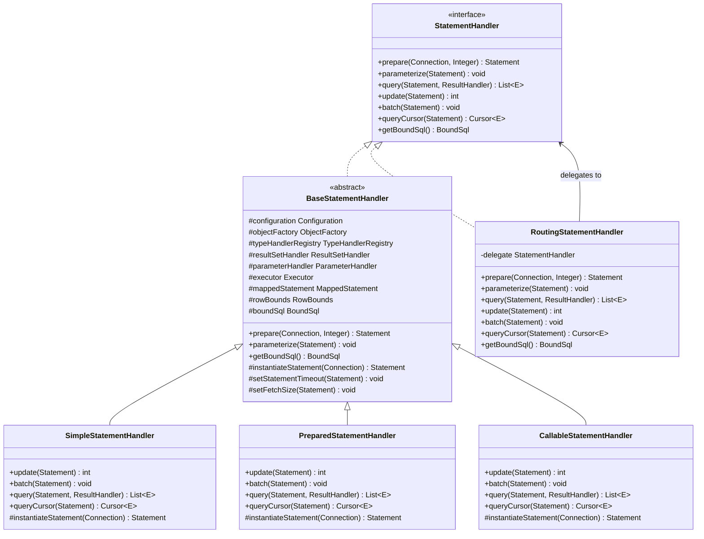
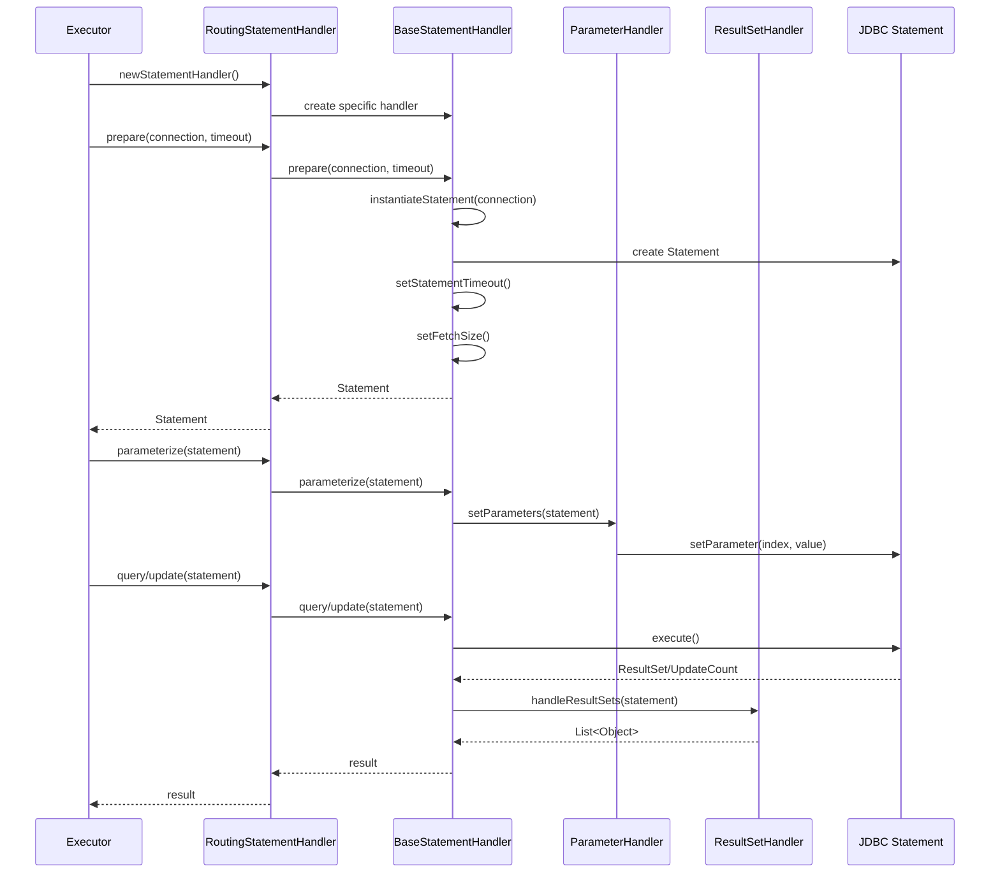
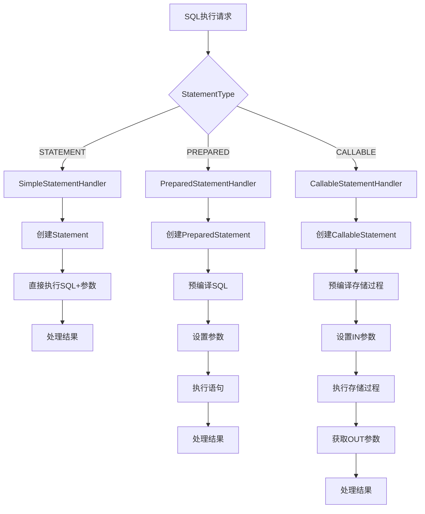
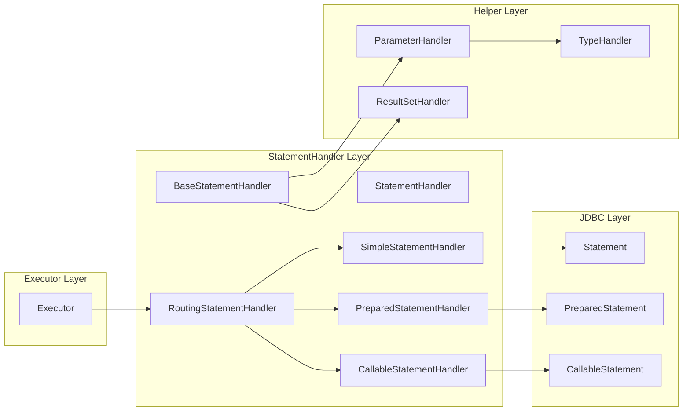

# StatementHandler语句处理器架构总览分析

## 📋 目录
1. [StatementHandler体系架构](#1-statementhandler体系架构)
2. [核心组件分析](#2-核心组件分析)
3. [处理流程架构](#3-处理流程架构)
4. [协作关系分析](#4-协作关系分析)
5. [设计模式应用](#5-设计模式应用)
6. [性能特征分析](#6-性能特征分析)

## 1. StatementHandler体系架构

### 1.1 整体架构图



### 1.2 类职责分工

| 组件 | 职责 | 特点 | 适用场景 |
|------|------|------|----------|
| **StatementHandler** | 定义语句处理器接口 | 统一抽象 | 所有场景的基础接口 |
| **BaseStatementHandler** | 提供通用功能实现 | 模板方法模式 | 子类的共同基础 |
| **SimpleStatementHandler** | 处理简单SQL语句 | 每次编译SQL | 动态SQL、简单查询 |
| **PreparedStatementHandler** | 处理预编译语句 | SQL预编译 | 大多数场景的首选 |
| **CallableStatementHandler** | 处理存储过程调用 | 支持IN/OUT参数 | 存储过程调用 |
| **RoutingStatementHandler** | 路由到具体处理器 | 委托模式 | 统一入口点 |

## 2. 核心组件分析

### 2.1 StatementHandler接口设计

```java
/**
 * StatementHandler核心接口
 * 定义了SQL语句处理的标准流程
 */
public interface StatementHandler {
    // Statement准备阶段
    Statement prepare(Connection connection, Integer transactionTimeout) throws SQLException;
    
    // 参数设置阶段
    void parameterize(Statement statement) throws SQLException;
    
    // 查询执行阶段
    <E> List<E> query(Statement statement, ResultHandler resultHandler) throws SQLException;
    
    // 更新执行阶段
    int update(Statement statement) throws SQLException;
    
    // 批量操作阶段
    void batch(Statement statement) throws SQLException;
    
    // 游标查询阶段
    <E> Cursor<E> queryCursor(Statement statement) throws SQLException;
    
    // 获取绑定SQL
    BoundSql getBoundSql();
}
```

### 2.2 BaseStatementHandler抽象基类

```java
/**
 * 基础StatementHandler实现
 * 采用模板方法模式，定义通用处理流程
 */
public abstract class BaseStatementHandler implements StatementHandler {
    // 核心组件依赖
    protected final Configuration configuration;
    protected final ObjectFactory objectFactory;
    protected final TypeHandlerRegistry typeHandlerRegistry;
    protected final ResultSetHandler resultSetHandler;
    protected final ParameterHandler parameterHandler;
    
    // 执行上下文
    protected final Executor executor;
    protected final MappedStatement mappedStatement;
    protected final RowBounds rowBounds;
    protected final BoundSql boundSql;
    
    // 模板方法：Statement准备
    @Override
    public Statement prepare(Connection connection, Integer transactionTimeout) throws SQLException {
        Statement statement = null;
        try {
            // 子类实现具体的Statement创建逻辑
            statement = instantiateStatement(connection);
            // 设置超时时间
            setStatementTimeout(statement, transactionTimeout);
            // 设置获取大小
            setFetchSize(statement);
            return statement;
        } catch (SQLException e) {
            closeStatement(statement);
            throw e;
        } catch (Exception e) {
            closeStatement(statement);
            throw new ExecutorException("Error preparing statement.  Cause: " + e, e);
        }
    }
    
    // 抽象方法：子类实现具体的Statement创建
    protected abstract Statement instantiateStatement(Connection connection) throws SQLException;
}
```

### 2.3 路由StatementHandler

```java
/**
 * 路由StatementHandler
 * 根据StatementType选择具体的处理器实现
 */
public class RoutingStatementHandler implements StatementHandler {
    private final StatementHandler delegate;
    
    public RoutingStatementHandler(Executor executor, MappedStatement ms, Object parameter, 
                                   RowBounds rowBounds, ResultHandler resultHandler, BoundSql boundSql) {
        // 根据语句类型创建对应的处理器
        switch (ms.getStatementType()) {
            case STATEMENT:
                delegate = new SimpleStatementHandler(executor, ms, parameter, rowBounds, resultHandler, boundSql);
                break;
            case PREPARED:
                delegate = new PreparedStatementHandler(executor, ms, parameter, rowBounds, resultHandler, boundSql);
                break;
            case CALLABLE:
                delegate = new CallableStatementHandler(executor, ms, parameter, rowBounds, resultHandler, boundSql);
                break;
            default:
                throw new ExecutorException("Unknown statement type: " + ms.getStatementType());
        }
    }
    
    // 委托给具体的处理器
    @Override
    public Statement prepare(Connection connection, Integer transactionTimeout) throws SQLException {
        return delegate.prepare(connection, transactionTimeout);
    }
    
    // ... 其他方法都是委托调用
}
```

## 3. 处理流程架构

### 3.1 StatementHandler执行流程



### 3.2 不同StatementHandler的处理差异



## 4. 协作关系分析

### 4.1 StatementHandler生态系统



### 4.2 组件协作职责

| 协作关系 | 职责分工 | 交互方式 |
|----------|----------|----------|
| **Executor ↔ StatementHandler** | Executor负责整体流程，StatementHandler负责SQL处理 | 方法调用 |
| **StatementHandler ↔ ParameterHandler** | StatementHandler管理Statement，ParameterHandler设置参数 | 委托调用 |
| **StatementHandler ↔ ResultSetHandler** | StatementHandler执行SQL，ResultSetHandler处理结果 | 委托调用 |
| **RoutingStatementHandler ↔ 具体Handler** | Router负责路由，具体Handler负责实现 | 委托模式 |

## 5. 设计模式应用

### 5.1 模板方法模式

```java
// BaseStatementHandler中的模板方法模式
public abstract class BaseStatementHandler implements StatementHandler {
    
    // 模板方法：定义算法骨架
    @Override
    public Statement prepare(Connection connection, Integer transactionTimeout) throws SQLException {
        Statement statement = null;
        try {
            // 步骤1：创建Statement（子类实现）
            statement = instantiateStatement(connection);
            // 步骤2：设置超时（通用逻辑）
            setStatementTimeout(statement, transactionTimeout);
            // 步骤3：设置获取大小（通用逻辑）
            setFetchSize(statement);
            return statement;
        } catch (Exception e) {
            closeStatement(statement);
            throw new ExecutorException("Error preparing statement.", e);
        }
    }
    
    // 抽象方法：子类实现具体步骤
    protected abstract Statement instantiateStatement(Connection connection) throws SQLException;
}
```

### 5.2 策略模式

```java
// 不同的StatementHandler实现不同的处理策略
public class PreparedStatementHandler extends BaseStatementHandler {
    @Override
    protected Statement instantiateStatement(Connection connection) throws SQLException {
        String sql = boundSql.getSql();
        if (mappedStatement.getKeyGenerator() instanceof Jdbc3KeyGenerator) {
            String[] keyColumnNames = mappedStatement.getKeyColumns();
            if (keyColumnNames == null) {
                return connection.prepareStatement(sql, Statement.RETURN_GENERATED_KEYS);
            } else {
                return connection.prepareStatement(sql, keyColumnNames);
            }
        } else if (mappedStatement.getResultSetType() == ResultSetType.DEFAULT) {
            return connection.prepareStatement(sql);
        } else {
            return connection.prepareStatement(sql, mappedStatement.getResultSetType().getValue(), 
                                               ResultSet.CONCUR_READ_ONLY);
        }
    }
}
```

### 5.3 委托模式

```java
// RoutingStatementHandler使用委托模式
public class RoutingStatementHandler implements StatementHandler {
    private final StatementHandler delegate;
    
    // 所有方法都委托给具体的StatementHandler
    @Override
    public Statement prepare(Connection connection, Integer transactionTimeout) throws SQLException {
        return delegate.prepare(connection, transactionTimeout);
    }
    
    @Override
    public void parameterize(Statement statement) throws SQLException {
        delegate.parameterize(statement);
    }
    
    // ... 其他委托方法
}
```

## 6. 性能特征分析

### 6.1 不同StatementHandler性能对比

| StatementHandler | SQL编译 | 参数处理 | 性能特点 | 适用场景 |
|------------------|---------|----------|----------|----------|
| **SimpleStatementHandler** | 每次编译 | 字符串拼接 | 灵活但慢 | 动态SQL，少量执行 |
| **PreparedStatementHandler** | 预编译缓存 | 参数绑定 | 快速安全 | 大多数业务场景 |
| **CallableStatementHandler** | 预编译缓存 | IN/OUT参数 | 功能完整 | 存储过程调用 |

### 6.2 性能优化要点

```java
// PreparedStatementHandler的性能优势
public class PreparedStatementHandler extends BaseStatementHandler {
    
    @Override
    protected Statement instantiateStatement(Connection connection) throws SQLException {
        String sql = boundSql.getSql();
        
        // 1. SQL预编译，避免重复解析
        PreparedStatement ps = connection.prepareStatement(sql);
        
        // 2. 支持参数绑定，防止SQL注入
        // 3. 数据库可以缓存执行计划
        // 4. 支持批量操作优化
        
        return ps;
    }
    
    @Override
    public void parameterize(Statement statement) throws SQLException {
        // 使用ParameterHandler设置参数，类型安全
        parameterHandler.setParameters((PreparedStatement) statement);
    }
}
```

### 6.3 内存和资源管理

```java
// BaseStatementHandler中的资源管理
public abstract class BaseStatementHandler implements StatementHandler {
    
    @Override
    public Statement prepare(Connection connection, Integer transactionTimeout) throws SQLException {
        Statement statement = null;
        try {
            statement = instantiateStatement(connection);
            setStatementTimeout(statement, transactionTimeout);
            setFetchSize(statement);
            return statement;
        } catch (SQLException e) {
            // 异常时确保资源释放
            closeStatement(statement);
            throw e;
        } catch (Exception e) {
            // 任何异常都要清理资源
            closeStatement(statement);
            throw new ExecutorException("Error preparing statement.  Cause: " + e, e);
        }
    }
    
    protected void closeStatement(Statement statement) {
        try {
            if (statement != null) {
                statement.close();
            }
        } catch (SQLException e) {
            // ignore
        }
    }
}
```

## 📊 架构总结

### 核心优势
1. **统一抽象**: StatementHandler接口提供统一的SQL处理抽象
2. **灵活扩展**: 基于接口和抽象类的设计支持灵活扩展
3. **职责分离**: 不同Handler专注不同类型的SQL处理
4. **性能优化**: PreparedStatement预编译提供最佳性能
5. **资源管理**: 完善的资源创建和释放机制

### 设计精髓
1. **模板方法模式**: 定义处理流程，子类实现具体逻辑
2. **策略模式**: 不同Handler实现不同的处理策略
3. **委托模式**: Router统一入口，委托给具体处理器
4. **组合模式**: 与ParameterHandler、ResultSetHandler协作

### 扩展要点
1. **自定义StatementHandler**: 继承BaseStatementHandler实现特殊需求
2. **插件拦截**: 可以拦截StatementHandler的关键方法
3. **性能监控**: 在prepare、execute等关键点添加监控
4. **连接池优化**: 合理设置Statement相关参数

这个架构设计体现了MyBatis在SQL处理层面的深度思考，为不同场景提供了最优的解决方案。