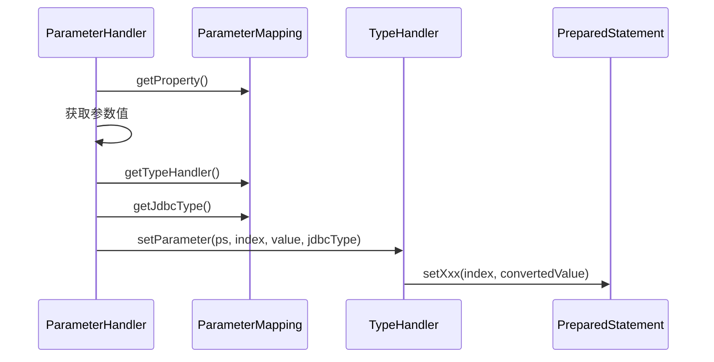

# 第7篇思考题解答

## 思考题1：DefaultParameterHandler的参数值获取为什么要设计优先级策略？各个优先级的应用场景是什么？

### 问题分析
DefaultParameterHandler采用了四级优先级策略来获取参数值，这种设计背后有着深刻的技术考量。

### 优先级策略详解

#### 1. 额外参数（AdditionalParameter）- 最高优先级
```java
if (boundSql.hasAdditionalParameter(propertyName)) {
    value = boundSql.getAdditionalParameter(propertyName);
}
```

**设计原因**：
- **动态SQL需求**：动态SQL（如foreach、if等）会在运行时生成新的参数
- **参数覆盖能力**：需要能够覆盖用户传入的参数值
- **临时参数管理**：框架内部生成的临时参数需要特殊处理

**应用场景**：
```sql
-- foreach标签会生成额外参数
<foreach collection="ids" item="id" separator=",">
    #{id}  -- 实际生成 #{__frch_id_0}, #{__frch_id_1} 等额外参数
</foreach>

-- if标签中的表达式参数
<if test="name != null and name != ''">
    AND name = #{name}
</if>
```

#### 2. 空参数处理 - 第二优先级
```java
else if (parameterObject == null) {
    value = null;
}
```

**设计原因**：
- **空安全处理**：避免空指针异常
- **明确的null语义**：区分参数对象为null和参数值为null

**应用场景**：
```java
// 无参数的查询方法
List<User> findAll(); // parameterObject为null

// 显式传入null参数
User findById(null); // parameterObject为null
```

#### 3. 基本类型参数 - 第三优先级
```java
else if (typeHandlerRegistry.hasTypeHandler(parameterObject.getClass())) {
    value = parameterObject;
}
```

**设计原因**：
- **性能优化**：避免不必要的反射操作
- **类型安全**：基本类型有对应的TypeHandler，类型转换更安全
- **简化处理**：基本类型直接使用，无需属性提取

**应用场景**：
```java
// 单个基本类型参数
User findById(Long id);           // parameterObject就是Long值
List<User> findByName(String name); // parameterObject就是String值

// MyBatis内置TypeHandler的类型
Integer, String, Date, BigDecimal, Enum等
```

#### 4. 复杂对象参数 - 最低优先级
```java
else {
    if (metaObject == null) {
        metaObject = configuration.newMetaObject(parameterObject);
    }
    value = metaObject.getValue(propertyName);
}
```

**设计原因**：
- **灵活性**：支持任意复杂的对象结构
- **反射成本**：反射操作成本较高，放在最低优先级
- **属性访问**：通过属性名访问对象的属性值

**应用场景**：
```java
// POJO对象参数
int updateUser(User user);  // 通过user.getName()、user.getAge()等获取属性值

// Map参数
List<User> findByConditions(Map<String, Object> params);

// 嵌套对象
// #{user.address.city} -> metaObject.getValue("user.address.city")
```

### 设计优势

1. **性能优化**：从高效到低效的处理顺序
2. **功能完整性**：覆盖所有可能的参数场景
3. **扩展性**：额外参数机制为动态SQL提供支持
4. **安全性**：每种场景都有对应的安全处理机制

---

## 思考题2：ParameterHandler如何与TypeHandler协作完成类型转换？为什么要这样设计？

### 协作机制分析

#### 1. 职责分工
```java
// ParameterHandler：负责参数值获取和协调
public void setParameters(PreparedStatement ps) throws SQLException {
    // 1. 获取参数值
    Object value = getParameterValue(parameterMapping);
    
    // 2. 获取对应的TypeHandler
    TypeHandler typeHandler = parameterMapping.getTypeHandler();
    JdbcType jdbcType = parameterMapping.getJdbcType();
    
    // 3. 委托给TypeHandler进行类型转换和设置
    typeHandler.setParameter(ps, i + 1, value, jdbcType);
}

// TypeHandler：负责具体的类型转换和JDBC操作
public void setParameter(PreparedStatement ps, int i, T parameter, JdbcType jdbcType) throws SQLException {
    // 具体的类型转换和PreparedStatement设置逻辑
    if (parameter == null) {
        ps.setNull(i, jdbcType.TYPE_CODE);
    } else {
        ps.setString(i, parameter.toString()); // 示例：String类型处理
    }
}
```

#### 2. 协作流程


#### 3. TypeHandler的选择和解析
```java
// 在ParameterMapping构建时解析TypeHandler
private void resolveTypeHandler() {
    if (parameterMapping.typeHandler == null && parameterMapping.javaType != null) {
        Configuration configuration = parameterMapping.configuration;
        TypeHandlerRegistry registry = configuration.getTypeHandlerRegistry();
        
        // 根据Java类型和JDBC类型获取TypeHandler
        parameterMapping.typeHandler = registry.getTypeHandler(
            parameterMapping.javaType, 
            parameterMapping.jdbcType
        );
    }
}
```

### 设计优势

#### 1. 单一职责原则
- **ParameterHandler**：专注于参数值获取和流程控制
- **TypeHandler**：专注于类型转换和JDBC操作
- **职责明确**：避免了代码耦合和职责混乱

#### 2. 开放封闭原则
```java
// 可以轻松扩展新的类型处理器
public class CustomTypeHandler implements TypeHandler<CustomType> {
    @Override
    public void setParameter(PreparedStatement ps, int i, CustomType parameter, JdbcType jdbcType) {
        // 自定义类型转换逻辑
    }
    
    // 其他方法略...
}

// 注册自定义TypeHandler
configuration.getTypeHandlerRegistry().register(CustomType.class, new CustomTypeHandler());
```

#### 3. 可测试性
```java
// ParameterHandler和TypeHandler可以独立测试
@Test
public void testParameterHandler() {
    // 测试参数值获取逻辑
    ParameterHandler handler = new DefaultParameterHandler(ms, param, boundSql);
    Object value = handler.getParameterObject();
    // 断言...
}

@Test
public void testTypeHandler() {
    // 测试类型转换逻辑
    TypeHandler<String> handler = new StringTypeHandler();
    PreparedStatement ps = mock(PreparedStatement.class);
    handler.setParameter(ps, 1, "test", JdbcType.VARCHAR);
    verify(ps).setString(1, "test");
}
```

#### 4. 配置灵活性
```xml
<!-- 可以在映射文件中指定TypeHandler -->
<result property="status" column="status" typeHandler="org.apache.ibatis.type.EnumTypeHandler"/>

<!-- 或者在参数中指定 -->
<select id="findByStatus" parameterType="UserStatus">
    SELECT * FROM user WHERE status = #{status,typeHandler=org.apache.ibatis.type.EnumTypeHandler}
</select>
```

---

## 思考题3：在什么情况下会产生额外参数（AdditionalParameter）？它们是如何生成和使用的？

### 额外参数的产生场景

#### 1. foreach标签处理
```xml
<!-- 原始SQL -->
<select id="findByIds">
    SELECT * FROM user WHERE id IN
    <foreach collection="ids" item="id" open="(" separator="," close=")">
        #{id}
    </foreach>
</select>

<!-- 处理后的SQL和参数 -->
<!-- SQL: SELECT * FROM user WHERE id IN (?, ?, ?) -->
<!-- 额外参数: __frch_id_0=1, __frch_id_1=2, __frch_id_2=3 -->
```

**生成过程**：
```java
// ForEachSqlNode处理逻辑
public boolean apply(DynamicContext context) {
    Map<String, Object> bindings = context.getBindings();
    Iterable<?> iterable = evaluator.evaluateIterable(collectionExpression, bindings);
    
    int i = 0;
    for (Object o : iterable) {
        String itemKey = "__frch_" + item + "_" + i;
        String indexKey = "__frch_" + index + "_" + i;
        
        // 生成额外参数
        DynamicContext oldContext = context;
        Map<String, Object> uniqueKeys = new HashMap<>(bindings);
        uniqueKeys.put(itemKey, o);
        uniqueKeys.put(indexKey, i);
        
        // 将额外参数添加到BoundSql中
        for (Map.Entry<String, Object> entry : uniqueKeys.entrySet()) {
            context.bind(entry.getKey(), entry.getValue());
        }
        
        i++;
    }
}
```

#### 2. 动态SQL中的bind标签
```xml
<select id="findByNameLike">
    <bind name="pattern" value="'%' + name + '%'"/>
    SELECT * FROM user WHERE name LIKE #{pattern}
</select>

<!-- 额外参数: pattern="%张%" （如果name="张"） -->
```

**生成过程**：
```java
// BindSqlNode处理逻辑
public boolean apply(DynamicContext context) {
    // 计算表达式值
    Object value = OgnlCache.getValue(expression, context.getBindings());
    
    // 添加为额外参数
    context.bind(name, value);
    return true;
}
```

#### 3. 动态SQL中的if/choose等条件判断
```xml
<select id="findUsers">
    SELECT * FROM user 
    <where>
        <if test="name != null">
            AND name = #{name}
        </if>
        <if test="minAge != null">
            <bind name="ageCondition" value="'age >= ' + minAge"/>
            AND ${ageCondition}
        </if>
    </where>
</select>
```

#### 4. 自定义SqlNode产生的参数
```java
// 自定义SqlNode可以产生额外参数
public class CustomSqlNode implements SqlNode {
    @Override
    public boolean apply(DynamicContext context) {
        // 动态生成参数
        String currentTime = DateFormat.format(new Date());
        context.bind("currentTime", currentTime);
        
        context.appendSql("AND created_time <= #{currentTime}");
        return true;
    }
}
```

### 额外参数的存储和使用

#### 1. 存储机制
```java
// BoundSql中的额外参数存储
public class BoundSql {
    private Map<String, Object> additionalParameters = new HashMap<>();
    
    public void setAdditionalParameter(String name, Object value) {
        this.additionalParameters.put(name, value);
    }
    
    public Object getAdditionalParameter(String name) {
        return additionalParameters.get(name);
    }
    
    public boolean hasAdditionalParameter(String name) {
        return additionalParameters.containsKey(name);
    }
}
```

#### 2. 使用机制
```java
// DefaultParameterHandler中的使用
@Override
public void setParameters(PreparedStatement ps) throws SQLException {
    List<ParameterMapping> parameterMappings = boundSql.getParameterMappings();
    
    for (int i = 0; i < parameterMappings.size(); i++) {
        ParameterMapping parameterMapping = parameterMappings.get(i);
        String propertyName = parameterMapping.getProperty();
        
        Object value;
        // 最高优先级：检查额外参数
        if (boundSql.hasAdditionalParameter(propertyName)) {
            value = boundSql.getAdditionalParameter(propertyName);
        }
        // 其他优先级...
    }
}
```

### 设计优势

1. **动态性**：支持运行时生成的参数
2. **隔离性**：额外参数不会影响原始参数对象
3. **优先级**：额外参数具有最高优先级，可以覆盖用户参数
4. **灵活性**：为复杂的动态SQL提供支持

---

## 思考题4：如何设计一个通用的参数处理器来支持多种扩展功能（如加密、验证、日志等）？

### 设计思路

#### 1. 责任链模式 + 装饰器模式
```java
/**
 * 通用参数处理器基于责任链模式设计
 * 每个处理器负责一个特定功能，可以灵活组合
 */
public abstract class ParameterProcessor {
    protected ParameterProcessor next;
    
    public ParameterProcessor setNext(ParameterProcessor next) {
        this.next = next;
        return next;
    }
    
    public abstract ProcessResult process(ParameterContext context);
    
    protected ProcessResult processNext(ParameterContext context) {
        if (next != null) {
            return next.process(context);
        }
        return ProcessResult.success();
    }
}
```

#### 2. 参数上下文设计
```java
/**
 * 参数处理上下文
 * 包含处理过程中需要的所有信息
 */
public class ParameterContext {
    private final MappedStatement mappedStatement;
    private final Object parameterObject;
    private final BoundSql boundSql;
    private final PreparedStatement preparedStatement;
    private final Map<String, Object> metadata;
    
    // 当前处理的参数信息
    private ParameterMapping currentParameterMapping;
    private Object currentValue;
    private int currentIndex;
    
    // 处理结果
    private final Map<String, Object> processedValues = new HashMap<>();
    
    // 构造方法和getter/setter...
}
```

#### 3. 处理结果封装
```java
/**
 * 处理结果封装
 */
public class ProcessResult {
    private final boolean success;
    private final String message;
    private final Object processedValue;
    private final boolean stopChain;
    
    public static ProcessResult success() {
        return new ProcessResult(true, null, null, false);
    }
    
    public static ProcessResult success(Object value) {
        return new ProcessResult(true, null, value, false);
    }
    
    public static ProcessResult fail(String message) {
        return new ProcessResult(false, message, null, true);
    }
    
    public static ProcessResult skip() {
        return new ProcessResult(true, "skipped", null, false);
    }
}
```

### 具体处理器实现

#### 1. 验证处理器
```java
/**
 * 参数验证处理器
 */
public class ValidationParameterProcessor extends ParameterProcessor {
    private final Map<String, Validator> validators = new HashMap<>();
    
    @Override
    public ProcessResult process(ParameterContext context) {
        String propertyName = context.getCurrentParameterMapping().getProperty();
        Object value = context.getCurrentValue();
        
        Validator validator = validators.get(propertyName);
        if (validator != null) {
            ValidationResult result = validator.validate(value);
            if (!result.isValid()) {
                return ProcessResult.fail("参数验证失败: " + result.getMessage());
            }
        }
        
        return processNext(context);
    }
    
    public ValidationParameterProcessor addValidator(String property, Validator validator) {
        validators.put(property, validator);
        return this;
    }
    
    // Validator接口和实现
    public interface Validator {
        ValidationResult validate(Object value);
    }
    
    public static class EmailValidator implements Validator {
        private static final Pattern EMAIL_PATTERN = 
            Pattern.compile("^[A-Za-z0-9+_.-]+@([A-Za-z0-9.-]+\\.[A-Za-z]{2,})$");
        
        @Override
        public ValidationResult validate(Object value) {
            if (value == null) {
                return ValidationResult.valid();
            }
            
            String email = value.toString();
            boolean isValid = EMAIL_PATTERN.matcher(email).matches();
            return isValid ? ValidationResult.valid() : 
                ValidationResult.invalid("邮箱格式不正确");
        }
    }
}
```

#### 2. 加密处理器
```java
/**
 * 参数加密处理器
 */
public class EncryptionParameterProcessor extends ParameterProcessor {
    private final Set<String> encryptFields = new HashSet<>();
    private final Encryptor encryptor;
    
    public EncryptionParameterProcessor(Encryptor encryptor) {
        this.encryptor = encryptor;
    }
    
    @Override
    public ProcessResult process(ParameterContext context) {
        String propertyName = context.getCurrentParameterMapping().getProperty();
        Object value = context.getCurrentValue();
        
        if (needEncryption(propertyName, value)) {
            try {
                Object encryptedValue = encryptor.encrypt(value);
                context.setCurrentValue(encryptedValue);
                
                // 记录加密操作
                context.addMetadata("encrypted_" + propertyName, true);
                
                return ProcessResult.success(encryptedValue);
            } catch (Exception e) {
                return ProcessResult.fail("参数加密失败: " + e.getMessage());
            }
        }
        
        return processNext(context);
    }
    
    private boolean needEncryption(String propertyName, Object value) {
        return value instanceof String && 
               encryptFields.contains(propertyName) && 
               !((String) value).isEmpty();
    }
    
    public EncryptionParameterProcessor addEncryptField(String field) {
        encryptFields.add(field);
        return this;
    }
    
    // 加密接口
    public interface Encryptor {
        Object encrypt(Object value) throws Exception;
        Object decrypt(Object value) throws Exception;
    }
}
```

#### 3. 日志处理器
```java
/**
 * 参数日志处理器
 */
public class LoggingParameterProcessor extends ParameterProcessor {
    private final Logger logger = LoggerFactory.getLogger(LoggingParameterProcessor.class);
    private final Set<String> sensitiveFields = new HashSet<>();
    
    @Override
    public ProcessResult process(ParameterContext context) {
        String propertyName = context.getCurrentParameterMapping().getProperty();
        Object value = context.getCurrentValue();
        String statementId = context.getMappedStatement().getId();
        
        // 记录参数日志
        if (logger.isDebugEnabled()) {
            String logValue = isSensitive(propertyName) ? "****" : String.valueOf(value);
            logger.debug("SQL参数设置: {} -> {}={}", statementId, propertyName, logValue);
        }
        
        // 收集统计信息
        collectStatistics(context, propertyName, value);
        
        return processNext(context);
    }
    
    private boolean isSensitive(String propertyName) {
        return sensitiveFields.contains(propertyName);
    }
    
    private void collectStatistics(ParameterContext context, String propertyName, Object value) {
        // 收集参数统计信息，如参数使用频率、类型分布等
        String statementId = context.getMappedStatement().getId();
        
        // 这里可以集成监控系统
        StatisticsCollector.record(statementId, propertyName, value != null ? value.getClass() : null);
    }
    
    public LoggingParameterProcessor addSensitiveField(String field) {
        sensitiveFields.add(field);
        return this;
    }
}
```

#### 4. 缓存处理器
```java
/**
 * 参数缓存处理器
 */
public class CacheParameterProcessor extends ParameterProcessor {
    private final Map<String, Object> parameterCache = new ConcurrentHashMap<>();
    private final Set<String> cacheableFields = new HashSet<>();
    
    @Override
    public ProcessResult process(ParameterContext context) {
        String propertyName = context.getCurrentParameterMapping().getProperty();
        Object value = context.getCurrentValue();
        
        if (isCacheable(propertyName)) {
            // 尝试从缓存获取
            String cacheKey = generateCacheKey(context, propertyName, value);
            Object cachedValue = parameterCache.get(cacheKey);
            
            if (cachedValue != null) {
                context.setCurrentValue(cachedValue);
                context.addMetadata("cached_" + propertyName, true);
                return ProcessResult.success(cachedValue);
            } else {
                // 处理后缓存结果
                ProcessResult result = processNext(context);
                if (result.isSuccess() && result.getProcessedValue() != null) {
                    parameterCache.put(cacheKey, result.getProcessedValue());
                }
                return result;
            }
        }
        
        return processNext(context);
    }
    
    private boolean isCacheable(String propertyName) {
        return cacheableFields.contains(propertyName);
    }
    
    private String generateCacheKey(ParameterContext context, String propertyName, Object value) {
        return String.format("%s:%s:%s", 
            context.getMappedStatement().getId(), 
            propertyName, 
            value != null ? value.toString() : "null");
    }
    
    public CacheParameterProcessor addCacheableField(String field) {
        cacheableFields.add(field);
        return this;
    }
}
```

### 通用参数处理器主类
```java
/**
 * 通用参数处理器
 * 整合多种处理功能
 */
public class UniversalParameterHandler implements ParameterHandler {
    private final DefaultParameterHandler delegate;
    private final ParameterProcessor processorChain;
    private final Configuration configuration;
    
    public UniversalParameterHandler(MappedStatement mappedStatement, 
                                   Object parameterObject, 
                                   BoundSql boundSql,
                                   ParameterProcessor processorChain) {
        this.delegate = new DefaultParameterHandler(mappedStatement, parameterObject, boundSql);
        this.processorChain = processorChain;
        this.configuration = mappedStatement.getConfiguration();
    }
    
    @Override
    public Object getParameterObject() {
        return delegate.getParameterObject();
    }
    
    @Override
    public void setParameters(PreparedStatement ps) throws SQLException {
        // 创建处理上下文
        ParameterContext context = new ParameterContext(
            mappedStatement, parameterObject, boundSql, ps);
        
        List<ParameterMapping> parameterMappings = boundSql.getParameterMappings();
        
        if (parameterMappings != null) {
            MetaObject metaObject = null;
            
            for (int i = 0; i < parameterMappings.size(); i++) {
                ParameterMapping parameterMapping = parameterMappings.get(i);
                
                if (parameterMapping.getMode() != ParameterMode.OUT) {
                    // 获取原始参数值
                    Object value = getOriginalValue(parameterMapping, metaObject, context);
                    
                    // 设置当前处理上下文
                    context.setCurrentParameterMapping(parameterMapping);
                    context.setCurrentValue(value);
                    context.setCurrentIndex(i);
                    
                    // 执行处理器链
                    ProcessResult result = processorChain.process(context);
                    
                    if (!result.isSuccess()) {
                        throw new SQLException("参数处理失败: " + result.getMessage());
                    }
                    
                    // 获取处理后的值
                    Object processedValue = result.getProcessedValue() != null ? 
                        result.getProcessedValue() : context.getCurrentValue();
                    
                    // 设置最终参数
                    setFinalParameter(ps, i + 1, processedValue, parameterMapping);
                }
            }
        }
    }
    
    private Object getOriginalValue(ParameterMapping parameterMapping, 
                                  MetaObject metaObject, 
                                  ParameterContext context) {
        // 使用与DefaultParameterHandler相同的逻辑获取原始值
        String propertyName = parameterMapping.getProperty();
        
        if (boundSql.hasAdditionalParameter(propertyName)) {
            return boundSql.getAdditionalParameter(propertyName);
        } else if (parameterObject == null) {
            return null;
        } else if (configuration.getTypeHandlerRegistry().hasTypeHandler(parameterObject.getClass())) {
            return parameterObject;
        } else {
            if (metaObject == null) {
                metaObject = configuration.newMetaObject(parameterObject);
            }
            return metaObject.getValue(propertyName);
        }
    }
    
    private void setFinalParameter(PreparedStatement ps, int index, Object value, ParameterMapping parameterMapping) 
        throws SQLException {
        TypeHandler typeHandler = parameterMapping.getTypeHandler();
        JdbcType jdbcType = parameterMapping.getJdbcType();
        
        if (value == null && jdbcType == null) {
            jdbcType = configuration.getJdbcTypeForNull();
        }
        
        try {
            typeHandler.setParameter(ps, index, value, jdbcType);
        } catch (Exception e) {
            throw new SQLException("参数设置失败: " + e.getMessage(), e);
        }
    }
}
```

### 使用示例
```java
/**
 * 通用参数处理器使用示例
 */
public class UniversalParameterHandlerExample {
    
    public static void main(String[] args) {
        // 构建处理器链
        ParameterProcessor chain = new ValidationParameterProcessor()
            .addValidator("email", new EmailValidator())
            .addValidator("phone", new PhoneValidator())
            .setNext(new EncryptionParameterProcessor(new AESEncryptor())
                .addEncryptField("password")
                .addEncryptField("idCard"))
            .setNext(new LoggingParameterProcessor()
                .addSensitiveField("password")
                .addSensitiveField("idCard"))
            .setNext(new CacheParameterProcessor()
                .addCacheableField("userId"));
        
        // 创建自定义语言驱动器
        LanguageDriver languageDriver = new UniversalLanguageDriver(chain);
        
        // 在MyBatis配置中注册
        Configuration configuration = new Configuration();
        configuration.setDefaultScriptingLanguage(UniversalLanguageDriver.class);
    }
}

/**
 * 自定义语言驱动器
 */
class UniversalLanguageDriver extends XMLLanguageDriver {
    private final ParameterProcessor processorChain;
    
    public UniversalLanguageDriver(ParameterProcessor processorChain) {
        this.processorChain = processorChain;
    }
    
    @Override
    public ParameterHandler createParameterHandler(MappedStatement mappedStatement, 
                                                 Object parameterObject, 
                                                 BoundSql boundSql) {
        return new UniversalParameterHandler(mappedStatement, parameterObject, boundSql, processorChain);
    }
}
```

### 设计优势

1. **模块化**：每个处理器负责单一功能，职责明确
2. **可组合**：通过责任链模式灵活组合不同功能
3. **可扩展**：容易添加新的处理器类型
4. **配置化**：可以通过配置灵活控制处理器的启用和参数
5. **性能优化**：支持缓存、跳过等优化策略
6. **监控友好**：内置日志和统计功能，便于监控和调试

这种设计既保持了灵活性，又提供了强大的扩展能力，能够满足各种复杂的参数处理需求。