# 第9篇：MappedStatement映射语句解析

## 1. 学习目标确认

### 1.0 第8篇思考题解答

#### 思考题1：ResultSetHandler与ParameterHandler有什么本质区别？它们如何协作完成完整的数据流转？

- 本质区别：`ParameterHandler` 负责“入参绑定”，把 Java 参数写入 JDBC `Statement`；`ResultSetHandler` 负责“出参映射”，把 JDBC `ResultSet` 转为 Java 对象。两者共享同一套 `TypeHandler` 类型转换体系，入参与出参转换保持一致性。
- 协作链路：`SqlSession` → `Executor` → `StatementHandler` → `ParameterHandler.setParameters(...)` 写入参数 → DB 执行 → `ResultSetHandler.handleResultSets(...)` 映射结果 → 返回调用方。

#### 思考题2：嵌套查询和嵌套结果映射各有什么优缺点？在什么场景下应该选择哪种方式？

- 嵌套查询（`association/collection` + `select`）：实现简单、语义直观；缺点是可能出现 N+1 查询，适合对象导航性强、数据量较小、结构复杂但每次只需局部数据的场景。
- 嵌套结果映射（一次 JOIN + 结果展开）：一次性取齐，避免 N+1；缺点是 SQL 复杂、行列膨胀、结果去重与集合组装有成本；适合报表/列表类、强一致读取且数据量可控的场景。

#### 思考题3：延迟加载的实现原理是什么？为什么需要使用代理对象？

- 原理：在需要延迟的属性上包裹代理，拦截访问（getter/方法调用）触发真实查询；配置项如 `lazyLoadingEnabled`、`aggressiveLazyLoading` 控制触发策略。
- 代理必要性：无需修改实体类即可在访问点切入；支持按属性精细触发；与 `Executor.deferLoad(...)` 协作保障事务与缓存一致性。

#### 思考题4：如何设计一个通用的ResultSetHandler来支持多种扩展功能（如脱敏、审计、缓存等）？

- 设计要点：保持 `ResultSetHandler` 核心职责不变，通过装饰器/拦截器在“结果对象生成后、返回前”管线化执行“脱敏→审计→缓存标记”等扩展；扩展仅读取与变更对象属性，不更改类型转换职责。
- 启用方式：插件拦截 `StatementHandler.query(...)` 后的 `ResultSetHandler.handleResultSets(...)` 结果；或自定义 `Configuration.newResultSetHandler(...)` 的装配过程。

#### 思考题5：在高并发场景下，ResultSetHandler的哪些设计可能成为性能瓶颈？如何优化？

- 瓶颈：反射访问属性、自动映射列扫描与匹配、嵌套结果的对象创建与去重、过度 FULL 自动映射导致多余尝试。
- 优化：使用 PARTIAL 自动映射、为热点 `ResultMap` 预构建/缓存自动映射表、合理设置 `fetchSize`/游标流式处理、避免无用列返回、必要时用手动映射减少反射。

### 1.1 本篇学习目标

1. 掌握 `MappedStatement` 的结构与构建流程（XML/注解）
2. 理解 `SqlSource` 与 `BoundSql` 的协作与 `additionalParameters`
3. 熟悉运行期 `MappedStatement.getBoundSql(...)` 的调用链与缓存键生成
4. 理解 `useCache`/`flushCacheRequired`、`resultSets` 等关键属性的行为
5. 掌握调试断点与常见问题定位方法

## 2. MappedStatement 概览与核心结构

`MappedStatement` 是对单条映射语句（select/insert/update/delete）的完整描述，包含 SQL 来源、参数与结果映射、执行属性、缓存策略等。

```java
// 结构概览（节选，简化展示）
public final class MappedStatement {
    private String id;                          // 唯一ID：namespace + statementId
    private Configuration configuration;        // 全局配置
    private SqlSource sqlSource;                // SQL来源（动态/静态）
    private StatementType statementType;        // STATEMENT/PREPARED/CALLABLE
    private Integer fetchSize;                  // 获取大小（游标/大结果集）
    private Integer timeout;                    // 查询超时
    private List<ResultMap> resultMaps;         // 结果映射
    private ParameterMap parameterMap;          // 参数映射（不常用）
    private SqlCommandType sqlCommandType;      // SELECT/INSERT/UPDATE/DELETE
    private KeyGenerator keyGenerator;          // 主键生成策略
    private String[] keyProperties;             // 主键属性
    private Cache cache;                        // 二级缓存（命名空间）
    private boolean useCache;                   // SELECT是否使用二级缓存
    private boolean flushCacheRequired;         // 执行后是否刷新缓存
    private String[] resultSets;                // 多结果集标识（存储过程等）

    public BoundSql getBoundSql(Object parameterObject) {
        return sqlSource.getBoundSql(parameterObject);
    }
}
```

构建采用 Builder 模式：

```java
public static class Builder {
    public Builder(Configuration configuration, String id, SqlSource sqlSource, SqlCommandType sqlCommandType) { /*...*/ }
    public Builder resultMaps(List<ResultMap> resultMaps) { /*...*/ return this; }
    public Builder parameterMap(ParameterMap parameterMap) { /*...*/ return this; }
    public Builder keyGenerator(KeyGenerator keyGenerator) { /*...*/ return this; }
    public Builder useCache(boolean useCache) { /*...*/ return this; }
    public Builder flushCacheRequired(boolean flushCache) { /*...*/ return this; }
    public MappedStatement build() { /*...*/ return mappedStatement; }
}
```

### 2.1 构建与运行流程图

```mermaid
sequenceDiagram
    participant XML as "XMLMapperBuilder"
    participant LS as "LanguageDriver/SqlSource"
    participant MS as "MappedStatement.Builder"
    participant Conf as "Configuration"
    participant Exec as "Executor"
    participant SH as "StatementHandler"
    participant PH as "ParameterHandler"
    participant RSH as "ResultSetHandler"

    XML->>LS: parse <select/insert/...> to SqlSource
    LS->>MS: new Builder(conf, id, sqlSource, commandType)
    MS->>MS: set resultMaps/parameterMap/keyGenerator/useCache/flushCache
    MS-->>Conf: build() & addMappedStatement(id, ms)

    Exec->>MS: ms.getBoundSql(parameter)
    MS->>LS: sqlSource.getBoundSql(parameter)
    LS-->>MS: BoundSql(sql + parameterMappings + additionalParameters)

    SH->>PH: setParameters(statement)
    SH->>DB: execute
    DB-->>RSH: ResultSet
    RSH-->>SH: List<E>
```



Note: `BoundSql.additionalParameters` 存放 `<foreach>` 展开、`<bind>` 计算、嵌套传参临时变量；取值优先于普通参数，保证动态生成的数据正确绑定。

### 2.2 构建期 XML 解析源码脉络

源码节选：XMLMapperBuilder.buildStatementFromContext

```java
// XMLMapperBuilder
private void buildStatementFromContext(List<XNode> list, String requiredDatabaseId) {
  for (XNode context : list) {
    final XMLStatementBuilder statementParser = new XMLStatementBuilder(configuration, builderAssistant, context,
        requiredDatabaseId);
    try {
      statementParser.parseStatementNode();
    } catch (IncompleteElementException e) {
      configuration.addIncompleteStatement(statementParser);
    }
  }
}
```


- 入口与预处理：`XMLMapperBuilder.parseStatementNode(XNode context)` 负责读取 `<select|insert|update|delete>` 元素的属性与子节点；在此之前通过 `XMLIncludeTransformer.applyIncludes` 展开 `<sql id>` 片段与 `<include refid>` 引用。
- 数据库厂商选择：当配置了 `databaseId` 时，优先选择匹配的语句定义，避免不同数据库方言互相覆盖。
- `SqlSource` 创建：根据 `<select>` 的 `lang` 或默认 `LanguageDriver`，调用 `languageDriver.createSqlSource(configuration, context, parameterType)` 生成 `SqlSource`（动态或静态）。
- 结果映射解析：优先级为 `resultMap > resultType`；若引用的 `resultMap` 暂未解析完全，可能抛出 `IncompleteElementException`，在二次解析阶段补全。
- 构建 `MappedStatement`：通过 `MapperBuilderAssistant.addMappedStatement(...)` 将解析结果落入 `Configuration`，同时设置默认策略：SELECT 默认 `useCache=true`、非 SELECT 默认 `flushCacheRequired=true`。

示例（关键调用链，简化展示）：

```java
// 关键调用链
XMLMapperBuilder.parseStatementNode(XNode context) {
  SqlSource sqlSource = languageDriver.createSqlSource(configuration, context, parameterType);
  builderAssistant.addMappedStatement(id, sqlSource, commandType, parameterMap,
    resultMap, timeout, fetchSize, statementType, useCache, flushCache, keyGenerator);
}
```

### 2.3 注解驱动 MappedStatement 构建

源码节选：MapperBuilderAssistant.addMappedStatement（Builder链）

```java
// MapperBuilderAssistant
public MappedStatement addMappedStatement(String id, SqlSource sqlSource, StatementType statementType,
    SqlCommandType sqlCommandType, Integer fetchSize, Integer timeout, String parameterMap, Class<?> parameterType,
    String resultMap, Class<?> resultType, ResultSetType resultSetType, boolean flushCache, boolean useCache,
    boolean resultOrdered, KeyGenerator keyGenerator, String keyProperty, String keyColumn, String databaseId,
    LanguageDriver lang, String resultSets, boolean dirtySelect) {

  id = applyCurrentNamespace(id, false);

  MappedStatement.Builder statementBuilder = new MappedStatement.Builder(configuration, id, sqlSource, sqlCommandType)
      .resource(resource).fetchSize(fetchSize).timeout(timeout).statementType(statementType)
      .keyGenerator(keyGenerator).keyProperty(keyProperty).keyColumn(keyColumn).databaseId(databaseId).lang(lang)
      .resultOrdered(resultOrdered).resultSets(resultSets)
      .resultMaps(getStatementResultMaps(resultMap, resultType, id)).resultSetType(resultSetType)
      .flushCacheRequired(flushCache).useCache(useCache).cache(currentCache).dirtySelect(dirtySelect);

  ParameterMap statementParameterMap = getStatementParameterMap(parameterMap, parameterType, id);
  if (statementParameterMap != null) {
    statementBuilder.parameterMap(statementParameterMap);
  }

  MappedStatement statement = statementBuilder.build();
  configuration.addMappedStatement(statement);
  return statement;
}
```


- 入口：`MapperAnnotationBuilder.parse()` 扫描 Mapper 接口方法上的注解（如 `@Select/@Insert/@Update/@Delete`、`@SelectProvider` 等），并按方法签名构建 `MappedStatement`。
- 结果映射：使用 `@Results`/`@Result`/`@One`/`@Many` 装配 `ResultMap`；未显式指定时可推断为 `resultType`。
- 执行属性：通过 `@Options` 配置 `useCache`、`flushCache`、`fetchSize`、`timeout`、`statementType`、`resultSets` 等。

示例：

```java
public interface OrderMapper {
  @Select({
    "SELECT * FROM t_order",
    "<where>",
    "  <if test=\"status != null\">status = #{status}</if>",
    "  <if test=\"userId != null\">AND user_id = #{userId}</if>",
    "</where>"
  })
  @Results(id = "orderMap", value = {
    @Result(property = "id",    column = "id",    id = true),
    @Result(property = "userId",column = "user_id"),
    @Result(property = "status",column = "status")
  })
  @Options(useCache = true, flushCache = Options.FlushCachePolicy.DEFAULT,
           statementType = StatementType.PREPARED)
  List<Order> findByStatus(@Param("status") String status, @Param("userId") Long userId);

  @SelectProvider(type = SqlProvider.class, method = "buildSql")
  List<Order> findByProvider(Map<String, Object> params);
}
```


## 3. 关键属性详解与行为

- `statementType`：决定路由到哪种 `StatementHandler`（`STATEMENT`→简单；`PREPARED`→预编译，默认；`CALLABLE`→存储过程）。
- `useCache`（仅对 SELECT）：为命名空间级 `Cache` 开关；结合 `resultHandler` 使用时会绕过二级缓存。
- `flushCacheRequired`：语句执行后是否刷新命名空间缓存；非 SELECT 默认 true，SELECT 可配置。
- `resultMaps`：结果映射规则集，支持 `association`/`collection` 嵌套、自动映射级别（由全局 `autoMappingBehavior` 控制）。
- `parameterMap`：参数映射的旧机制，通常不建议使用，现代 MyBatis 通过 `ParameterMapping` 列表（在 `BoundSql` 中）管理参数。
- `keyGenerator`/`keyProperties`：主键回填策略（如 `Jdbc3KeyGenerator`），影响 INSERT 的返回键处理。
- `resultSets`：多结果集名标识（存储过程、`statementType=CALLABLE`），与 `ResultSetHandler.handleResultSets(...)` 协作解析多个结果集。
- `fetchSize`/`timeout`：执行器与驱动的性能/超时参数；大结果集搭配游标/流式读取更佳。

## 4. SqlSource 与 BoundSql 协作

源码节选：DynamicSqlSource.getBoundSql

```java
@Override
public BoundSql getBoundSql(Object parameterObject) {
  DynamicContext context = new DynamicContext(configuration, parameterObject);
  rootSqlNode.apply(context);
  SqlSourceBuilder sqlSourceParser = new SqlSourceBuilder(configuration);
  Class<?> parameterType = parameterObject == null ? Object.class : parameterObject.getClass();
  SqlSource sqlSource = sqlSourceParser.parse(context.getSql(), parameterType, context.getBindings());
  BoundSql boundSql = sqlSource.getBoundSql(parameterObject);
  context.getBindings().forEach(boundSql::setAdditionalParameter);
  return boundSql;
}
```


`SqlSource` 负责把（可能包含动态标签/OGNL 的）SQL模板，在运行时或构建时转换为可执行的 `BoundSql`：

```java
// 运行期调用入口
BoundSql boundSql = mappedStatement.getBoundSql(parameter);
String rawSql = boundSql.getSql();                      // 最终SQL（含?占位）
List<ParameterMapping> pms = boundSql.getParameterMappings();
Object paramObj = boundSql.getParameterObject();
Object temp = boundSql.getAdditionalParameter("__frch_id_0"); // foreach/bind等临时参数
```

典型实现：
- `RawSqlSource`：静态 SQL，构建期完成解析，运行期直接返回 `BoundSql`。
- `DynamicSqlSource`：动态 SQL，运行期计算 `SqlNode` 树，生成 `SqlSourceBuilder`，构造 `BoundSql`。

### 4.1 SqlNode 树关键节点与行为

- `TrimSqlNode`/`WhereSqlNode`/`SetSqlNode`：负责处理多余的前后缀（如自动添加 `WHERE`/`SET`，去掉首尾的 `AND/OR`）。
- `ChooseSqlNode`：等价于 `<choose>/<when>/<otherwise>`，运行期按 OGNL 条件选择分支。
- `ForEachSqlNode`：遍历集合生成片段，支持 `item/index/collection`，并向上下文注入临时参数（见 4.2）。
- `BindSqlNode`：执行 OGNL 表达式并把结果绑定到上下文变量中（临时参数）。
- `IfSqlNode`：按 OGNL 条件决定是否包含片段。

示例（ForEach 展开后的占位符片段，示意）：

```xml
<foreach collection="ids" item="id" open="(" separator="," close=")">
  #{id}
</foreach>
// 运行期 → SQL: IN (?, ?, ...)
// additionalParameters:
//   __frch_id_0 = 101
//   __frch_id_1 = 102
```

### 4.2 additionalParameters 生成机制（运行期）

源码节选：ForEachSqlNode.apply / FilteredDynamicContext.appendSql

```java
public class ForEachSqlNode implements SqlNode {
  public static final String ITEM_PREFIX = "__frch_";
  // ... existing code ...
  @Override
  public boolean apply(DynamicContext context) {
    Map<String, Object> bindings = context.getBindings();
    final Iterable<?> iterable = evaluator.evaluateIterable(collectionExpression, bindings,
        Optional.ofNullable(nullable).orElseGet(configuration::isNullableOnForEach));
    if (iterable == null || !iterable.iterator().hasNext()) {
      return true;
    }
    // ... existing code ...
    int i = 0;
    for (Object o : iterable) {
      int uniqueNumber = context.getUniqueNumber();
      // 绑定 index/item 以及唯一下标后的临时变量
      applyIndex(context, i, uniqueNumber);
      applyItem(context, o, uniqueNumber);
      contents.apply(new FilteredDynamicContext(configuration, context, index, item, uniqueNumber));
      i++;
    }
    // 移除临时绑定
    context.getBindings().remove(item);
    context.getBindings().remove(index);
    return true;
  }
  private static String itemizeItem(String item, int i) {
    return ITEM_PREFIX + item + "_" + i;
  }
  // ... existing code ...
  private static class FilteredDynamicContext extends DynamicContext {
    @Override
    public void appendSql(String sql) {
      GenericTokenParser parser = new GenericTokenParser("#{", "}", content -> {
        String newContent = content.replaceFirst("^\\s*" + item + "(?![^.,:\\s])", itemizeItem(item, index));
        if (itemIndex != null && newContent.equals(content)) {
          newContent = content.replaceFirst("^\\s*" + itemIndex + "(?![^.,:\\s])", itemizeItem(itemIndex, index));
        }
        return "#{" + newContent + "}";
      });
      delegate.appendSql(parser.parse(sql));
    }
  }
}
```


- 运行容器：动态 SQL 在 `DynamicContext` 中累计 `bindings`，`SqlNode.apply(context)` 把新变量写入；最终 `SqlSourceBuilder.parse(...)` 生成 `BoundSql`，并把上下文变量拷贝为 `additionalParameters`。
- 命名约定：`ForEachSqlNode` 以 `__frch_${item}_${index}` 形式生成迭代变量；`BindSqlNode` 使用 `<bind name="var" value="...">` 的 `name` 作为键。
- 取值优先级：`ParameterHandler` 与 `Executor.createCacheKey` 均优先 `boundSql.hasAdditionalParameter(name)` 命中临时参数，再回退到主参数对象。


## 5. CacheKey 生成与缓存协作

`Executor.createCacheKey(...)` 组合多因素生成查询缓存键（一级/二级缓存共用格式）：

```java
// 要点：ID、分页、SQL文本、入参值序列、环境ID
CacheKey cacheKey = new CacheKey();
cacheKey.update(ms.getId());
cacheKey.update(rowBounds.getOffset());
cacheKey.update(rowBounds.getLimit());
cacheKey.update(boundSql.getSql());
for (ParameterMapping pm : boundSql.getParameterMappings()) {
  if (pm.getMode() != ParameterMode.OUT) {
    Object value;
    String name = pm.getProperty();
    if (boundSql.hasAdditionalParameter(name)) {
      value = boundSql.getAdditionalParameter(name);
    } else if (parameterObject == null) {
      value = null;
    } else if (typeHandlerRegistry.hasTypeHandler(parameterObject.getClass())) {
      value = parameterObject;
    } else {
      MetaObject mo = configuration.newMetaObject(parameterObject);
      value = mo.getValue(name);
    }
    cacheKey.update(value);
  }
}
if (configuration.getEnvironment() != null) {
  cacheKey.update(configuration.getEnvironment().getId());
}
```

行为提示：
- SELECT 且 `useCache=true` 时参与二级缓存；`resultHandler` 存在则绕过二级缓存。
- 非 SELECT 或 `flushCacheRequired=true` 会刷新命名空间缓存。

### 5.1 缓存未命中的常见原因与优化

- 参数不稳定：同一方法不同参数顺序/命名导致取值不同（尤其 Map/动态参数），建议固定命名并使用 `@Param`。
- 额外参数差异：动态 SQL 导致 `additionalParameters` 不一致（如 `<foreach>` 迭代次数不同），自然不会命中缓存；可在热点查询中减少不必要的动态拼装。
- 分页维度：`RowBounds` 的 offset/limit 参与缓存键，分页不同不会命中；建议把分页参数纳入业务策略缓存或使用二级缓存+结果命中。
- 环境隔离：`Environment.id` 不同（多数据源/多环境）必然不命中；确保在同一环境评估缓存。
- 结果处理器：使用 `ResultHandler` 的查询绕过二级缓存，必要时减少自定义处理或改为后置处理。

优化建议：稳定 SQL 文本（减少动态分支）、固定参数命名与类型（注册合适的 `TypeHandler`）、合理拆分查询（热点查询静态化）、评估缓存粒度与过期策略。

## 6. 与核心组件的协作关系

- 与 `StatementHandler`：通过 `getBoundSql(parameter)` 提供最终 SQL 与 `ParameterMapping`；决定路由（`statementType`）。
- 与 `ParameterHandler`：提供 `BoundSql`，其中包含参数映射与临时参数；参数侧优先取 `additionalParameters`。
- 与 `ResultSetHandler`：通过 `resultMaps/resultSets` 描述结果解析策略；影响多结果集处理。
- 与 `Executor`：控制缓存策略（`useCache/flushCacheRequired`）、主键生成（`keyGenerator`）、延迟加载（配合 `deferLoad`）。

## 7. 性能优化与常见坑位

- 静态优先：能用 `RawSqlSource` 的场景尽量避免动态标签，降低运行期解析成本。
- 精准映射：合理设计 `ResultMap`，减少 FULL 自动映射尝试；必要时关闭不需要的自动映射（`NONE/PARTIAL`）。
- 参数命名：OGNL 表达式与属性名一致，避免 `BindingException`；`<foreach item/index/collection>` 命名规范统一。
- 多结果集：设置 `resultSets` 与 `CallableStatement` 的输出参数注册一致，便于 `ResultSetHandler` 正确消费。
- 缓存策略：读多写少的查询开启 `useCache`，更新语句谨慎配置 `flushCacheRequired`；分页与环境 ID 影响缓存键命中。

## 8. 调试指导（断点与打印）

建议断点：
- `XMLMapperBuilder.parseStatementNode(...)`（XML解析）
- `MappedStatement.Builder.build()`（构建完成）
- `MappedStatement.getBoundSql(...)`（运行期取 SQL）
- `SqlSource.getBoundSql(...)` / `DynamicSqlSource.getBoundSql(...)`（动态 SQL 计算）
- `SqlNode.apply(...)` / `SqlSourceBuilder.parse(...)`（参数映射生成）
- `BaseExecutor.createCacheKey(...)`（缓存键生成）

快速打印 `BoundSql` 参数映射与临时参数：

```java
BoundSql bs = ms.getBoundSql(param);
System.out.println("SQL=" + bs.getSql());
for (ParameterMapping pm : bs.getParameterMappings()) {
    String name = pm.getProperty();
    Object val = bs.hasAdditionalParameter(name) ? bs.getAdditionalParameter(name) :
                 (bs.getParameterObject() == null ? null :
                  configuration.newMetaObject(bs.getParameterObject()).getValue(name));
    System.out.println("param=" + name + ", value=" + val);
}
// 额外参数（示例性打印）
for (String prefix : java.util.List.of("__frch_", "_parameter", "_databaseId")) {
    // foreach/bind等常见前缀，可根据业务约定补充
    // 注意：BoundSql未公开所有键名遍历接口，这里演示按约定探测
}
```

进阶：通过插件拦截 `ParameterHandler.setParameters(...)` 记录最终绑定到 JDBC 的参数和值，避免反射读取私有字段。

## 9. 实践片段

### 9.1 XML 映射与运行期取 SQL

```xml
<select id="findByStatus" parameterType="map" resultMap="orderMap" useCache="true">
  SELECT * FROM t_order
  <where>
    <if test="status != null">status = #{status}</if>
    <if test="userId != null">AND user_id = #{userId}</if>
  </where>
</select>
```

```java
// 运行期
MappedStatement ms = configuration.getMappedStatement("OrderMapper.findByStatus");
BoundSql bs = ms.getBoundSql(Map.of("status", "PAID", "userId", 1L));
String sql = bs.getSql();                 // 带?的最终SQL
List<ParameterMapping> pms = bs.getParameterMappings();
```

### 9.2 存储过程与多结果集

```xml
<select id="callProc" statementType="CALLABLE" resultSets="users,orders">
  {call get_user_and_orders(#{userId})}
</select>
```

与 `ResultSetHandler.handleResultSets(...)` 协作，按 `resultSets` 顺序消费多个结果集。

### 9.3 注解驱动示例（Provider 与 Options）

```java
class SqlProvider {
  public String buildSql(Map<String,Object> p) {
    StringBuilder sb = new StringBuilder("SELECT * FROM t_order WHERE 1=1");
    if (p.get("status") != null) sb.append(" AND status = #{status}");
    if (p.get("userId") != null) sb.append(" AND user_id = #{userId}");
    return sb.toString();
  }
}

public interface OrderMapper {
  @SelectProvider(type = SqlProvider.class, method = "buildSql")
  @Options(useCache = true, flushCache = Options.FlushCachePolicy.DEFAULT,
           statementType = StatementType.PREPARED, fetchSize = 1000)
  List<Order> findBy(Map<String,Object> params);
}
```

## 10. 小结

- `MappedStatement` 是“单条语句的完整画像”，贯穿构建期（XML/注解解析）与运行期（取 SQL、映射与执行）。
- `SqlSource → BoundSql → ParameterMapping/additionalParameters` 构成参数绑定的核心链路。
- 缓存策略、主键生成、结果映射与语句类型共同影响执行路径与性能表现。
- 调试定位以“构建→运行→缓存键”为主线设置断点，结合打印 `BoundSql` 与参数值快速排障。

---

## 思考题

1. 在读多写少的场景下，如何组合使用 `useCache` 与 `flushCacheRequired` 达到最优的缓存收益？
2. 什么时候应该优先选择 `RawSqlSource` 而避免动态 SQL？有哪些折中方案？
3. `BoundSql.additionalParameters` 在哪些场景会出现？它们的取值优先级如何影响参数绑定？
4. 如何利用 `resultSets` 正确处理存储过程返回的多个结果集，并保证与 `ResultSetHandler` 的协作一致？
5. 如果要自定义 `LanguageDriver`，它会如何影响 `MappedStatement` 的构建与运行期行为？
