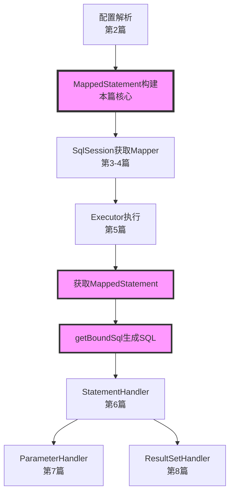
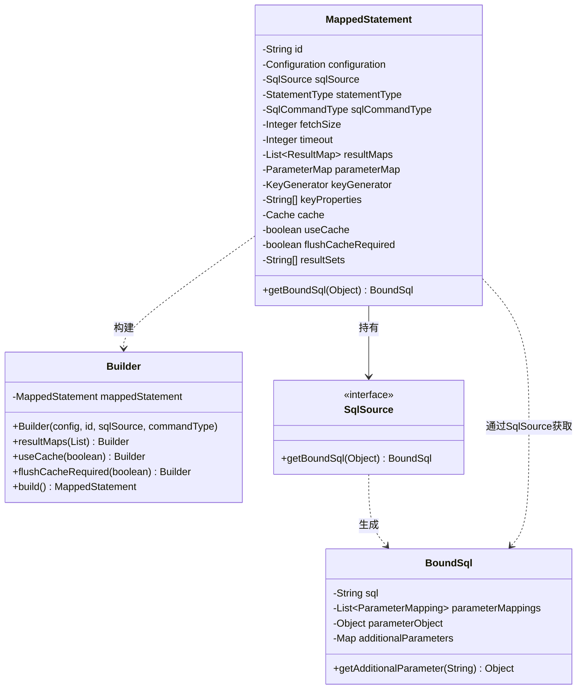
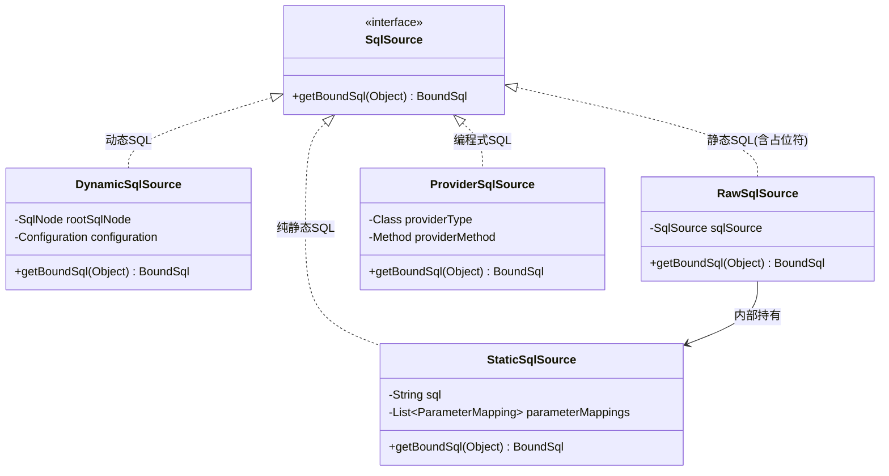
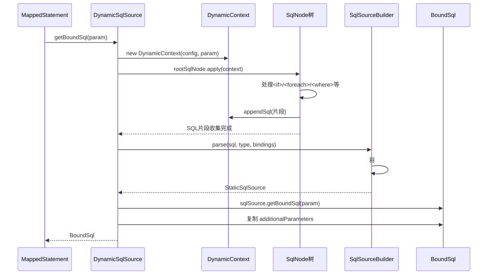

> # 第9篇：MappedStatement映射语句解析

## 前言

在前面的章节中,我们已经深入学习了 MyBatis 的核心执行组件:Executor、StatementHandler、ParameterHandler 和 ResultSetHandler。这些组件在执行过程中都需要依赖一个关键的配置对象 —— **MappedStatement**。

`MappedStatement` 是对单条 SQL 映射语句的完整描述,它像是一张"执行蓝图",包含了 SQL 来源、参数映射、结果映射、缓存策略等所有执行所需的信息。理解 `MappedStatement` 的构建和使用,是掌握 MyBatis 工作原理的关键一环。

### 本篇在整体架构中的位置



### 与前序章节的关联

- **第2篇(配置系统)**：学习了如何解析 Mapper XML,本篇将深入了解解析后如何构建 `MappedStatement`
- **第5篇(Executor)**：学习了执行器如何使用缓存,本篇将了解 `MappedStatement` 如何控制缓存策略
- **第6篇(StatementHandler)**：学习了语句处理器的工作流程,本篇将了解它如何从 `MappedStatement` 获取 SQL
- **第7篇(ParameterHandler)**：学习了参数处理,本篇将了解参数映射信息如何存储在 `MappedStatement` 中
- **第8篇(ResultSetHandler)**：学习了结果映射,本篇将了解结果映射配置如何关联到 `MappedStatement`

## 1. 学习目标确认

### 1.0 第8篇思考题回顾

> 💡 **说明**：第8篇思考题的详细解答请见文末**附录A**。

**核心要点回顾**：

- ParameterHandler 负责入参绑定（Java → JDBC），ResultSetHandler 负责出参映射（JDBC → Java）
- 嵌套查询简单但可能 N+1，嵌套结果映射高效但 SQL 复杂
- 延迟加载通过代理拦截属性访问触发查询
- 扩展 ResultSetHandler 使用装饰器/插件模式
- 性能优化关注反射、自动映射、fetchSize 等

### 1.1 本篇学习目标

1. 掌握 `MappedStatement` 的结构与构建流程（XML/注解）
2. 理解 `SqlSource` 与 `BoundSql` 的协作与 `additionalParameters`
3. 熟悉运行期 `MappedStatement.getBoundSql(...)` 的调用链与缓存键生成
4. 理解 `useCache`/`flushCacheRequired`、`resultSets` 等关键属性的行为
5. 掌握调试断点与常见问题定位方法

## 2. MappedStatement 概览与核心结构

### 2.1 核心职责与定位

`MappedStatement` 是对单条映射语句（select/insert/update/delete）的**完整描述**，它封装了：

- ✅ **SQL 来源**：通过 `SqlSource` 提供静态或动态 SQL
- ✅ **参数映射**：如何将 Java 对象映射到 SQL 参数
- ✅ **结果映射**：如何将 ResultSet 映射为 Java 对象
- ✅ **执行属性**：超时、fetchSize、statementType 等
- ✅ **缓存策略**：useCache、flushCacheRequired 等
- ✅ **主键生成**：INSERT 语句的主键回填策略

### 2.2 类结构图



### 2.3 核心属性详解

```java
/**
 * MappedStatement 核心结构
 * 
 * 源码位置: org.apache.ibatis.mapping.MappedStatement
 */
public final class MappedStatement {
  
    // ========== 标识信息 ==========
    /**
     * 唯一标识: namespace.statementId
     * 例如: "com.example.UserMapper.findById"
     */
    private String id;
  
    /**
     * 资源文件路径(调试用)
     * 例如: "mapper/UserMapper.xml"
     */
    private String resource;
  
    /**
     * 数据库厂商标识(多数据库支持)
     * 例如: "mysql", "oracle"
     */
    private String databaseId;
  
    // ========== 核心组件 ==========
    /**
     * 全局配置对象
     */
    private Configuration configuration;
  
    /**
     * SQL 来源(动态/静态)
     * 运行时调用 sqlSource.getBoundSql(param) 获取最终 SQL
     */
    private SqlSource sqlSource;
  
    // ========== 执行属性 ==========
    /**
     * 语句类型: STATEMENT(简单) / PREPARED(预编译,默认) / CALLABLE(存储过程)
     * 决定路由到哪个 StatementHandler
     */
    private StatementType statementType;
  
    /**
     * SQL 命令类型: SELECT / INSERT / UPDATE / DELETE
     */
    private SqlCommandType sqlCommandType;
  
    /**
     * JDBC fetchSize(批量获取行数)
     * 大结果集时配合游标使用
     */
    private Integer fetchSize;
  
    /**
     * 查询超时(秒)
     */
    private Integer timeout;
  
    /**
     * 结果集类型: FORWARD_ONLY / SCROLL_INSENSITIVE / SCROLL_SENSITIVE
     */
    private ResultSetType resultSetType;
  
    // ========== 映射配置 ==========
    /**
     * 结果映射列表(支持多个 resultMap)
     * 优先级: resultMap > resultType
     */
    private List<ResultMap> resultMaps;
  
    /**
     * 参数映射(已过时,不推荐使用)
     * 现代 MyBatis 使用 ParameterMapping 列表
     */
    private ParameterMap parameterMap;
  
    /**
     * 多结果集名称(存储过程)
     * 例如: resultSets="users,orders"
     */
    private String[] resultSets;
  
    // ========== 缓存策略 ==========
    /**
     * 命名空间级别的二级缓存
     */
    private Cache cache;
  
    /**
     * 是否使用二级缓存(仅对 SELECT 有效)
     * 默认: SELECT=true, 其他=false
     */
    private boolean useCache;
  
    /**
     * 执行后是否刷新缓存
     * 默认: SELECT=false, 其他=true
     */
    private boolean flushCacheRequired;
  
    // ========== 主键生成 ==========
    /**
     * 主键生成器
     * 例如: Jdbc3KeyGenerator(useGeneratedKeys=true)
     */
    private KeyGenerator keyGenerator;
  
    /**
     * 主键属性名
     * 例如: keyProperty="id"
     */
    private String[] keyProperties;
  
    /**
     * 主键列名
     * 例如: keyColumn="user_id"
     */
    private String[] keyColumn;
  
    // ========== 核心方法 ==========
    /**
     * 获取绑定 SQL
     * 
     * @param parameterObject 参数对象
     * @return BoundSql 包含最终 SQL 和参数映射
     */
    public BoundSql getBoundSql(Object parameterObject) {
        return sqlSource.getBoundSql(parameterObject);
    }
}
```

### 2.4 Builder 模式构建

```java
/**
 * MappedStatement 使用 Builder 模式构建
 * 
 * 优点:
 * 1. 参数众多,Builder 模式提升可读性
 * 2. 链式调用,流畅构建
 * 3. 构建完成后对象不可变(final class)
 */
public static class Builder {
    private MappedStatement mappedStatement = new MappedStatement();
  
    /**
     * 构造器:必需参数
     */
    public Builder(Configuration configuration, String id, 
                   SqlSource sqlSource, SqlCommandType sqlCommandType) {
        mappedStatement.configuration = configuration;
        mappedStatement.id = id;
        mappedStatement.sqlSource = sqlSource;
        mappedStatement.sqlCommandType = sqlCommandType;
      
        // 设置默认值
        mappedStatement.statementType = StatementType.PREPARED;
        mappedStatement.resultSetType = ResultSetType.DEFAULT;
        mappedStatement.timeout = configuration.getDefaultStatementTimeout();
        mappedStatement.fetchSize = configuration.getDefaultFetchSize();
    }
  
    /**
     * 可选参数:链式设置
     */
    public Builder resultMaps(List<ResultMap> resultMaps) {
        mappedStatement.resultMaps = resultMaps;
        return this;
    }
  
    public Builder useCache(boolean useCache) {
        mappedStatement.useCache = useCache;
        return this;
    }
  
    public Builder flushCacheRequired(boolean flushCacheRequired) {
        mappedStatement.flushCacheRequired = flushCacheRequired;
        return this;
    }
  
    public Builder keyGenerator(KeyGenerator keyGenerator) {
        mappedStatement.keyGenerator = keyGenerator;
        return this;
    }
  
    // ... 其他 setter 方法
  
    /**
     * 构建最终对象
     */
    public MappedStatement build() {
        assert mappedStatement.configuration != null;
        assert mappedStatement.id != null;
        assert mappedStatement.sqlSource != null;
      
        // 设置默认缓存策略
        if (mappedStatement.sqlCommandType == SqlCommandType.SELECT) {
            // SELECT 默认使用缓存,不刷新
            mappedStatement.useCache = true;
            mappedStatement.flushCacheRequired = false;
        } else {
            // INSERT/UPDATE/DELETE 默认不使用缓存,执行后刷新
            mappedStatement.useCache = false;
            mappedStatement.flushCacheRequired = true;
        }
      
        return mappedStatement;
    }
}
```

### 2.1 构建与运行流程图

```mermaid
sequenceDiagram
    participant XML as "XMLMapperBuilder"
    participant LS as "LanguageDriver/SqlSource"
    participant MS as "MappedStatement.Builder"
    participant Conf as "Configuration"
    participant Exec as "Executor"
    participant SH as "StatementHandler"
    participant PH as "ParameterHandler"
    participant RSH as "ResultSetHandler"

    XML->>LS: parse <select/insert/...> to SqlSource
    LS->>MS: new Builder(conf, id, sqlSource, commandType)
    MS->>MS: set resultMaps/parameterMap/keyGenerator/useCache/flushCache
    MS-->>Conf: build() & addMappedStatement(id, ms)

    Exec->>MS: ms.getBoundSql(parameter)
    MS->>LS: sqlSource.getBoundSql(parameter)
    LS-->>MS: BoundSql(sql + parameterMappings + additionalParameters)

    SH->>PH: setParameters(statement)
    SH->>DB: execute
    DB-->>RSH: ResultSet
    RSH-->>SH: List<E>
```



Note: `BoundSql.additionalParameters` 存放 `<foreach>` 展开、`<bind>` 计算、嵌套传参临时变量；取值优先于普通参数，保证动态生成的数据正确绑定。

### 2.2 构建期 XML 解析源码脉络

源码节选：XMLMapperBuilder.buildStatementFromContext

```java
// XMLMapperBuilder
private void buildStatementFromContext(List<XNode> list, String requiredDatabaseId) {
  for (XNode context : list) {
    final XMLStatementBuilder statementParser = new XMLStatementBuilder(configuration, builderAssistant, context,
        requiredDatabaseId);
    try {
      statementParser.parseStatementNode();
    } catch (IncompleteElementException e) {
      configuration.addIncompleteStatement(statementParser);
    }
  }
}
```

- 入口与预处理：`XMLMapperBuilder.parseStatementNode(XNode context)` 负责读取 `<select|insert|update|delete>` 元素的属性与子节点；在此之前通过 `XMLIncludeTransformer.applyIncludes` 展开 `<sql id>` 片段与 `<include refid>` 引用。
- 数据库厂商选择：当配置了 `databaseId` 时，优先选择匹配的语句定义，避免不同数据库方言互相覆盖。
- `SqlSource` 创建：根据 `<select>` 的 `lang` 或默认 `LanguageDriver`，调用 `languageDriver.createSqlSource(configuration, context, parameterType)` 生成 `SqlSource`（动态或静态）。
- 结果映射解析：优先级为 `resultMap > resultType`；若引用的 `resultMap` 暂未解析完全，可能抛出 `IncompleteElementException`，在二次解析阶段补全。
- 构建 `MappedStatement`：通过 `MapperBuilderAssistant.addMappedStatement(...)` 将解析结果落入 `Configuration`，同时设置默认策略：SELECT 默认 `useCache=true`、非 SELECT 默认 `flushCacheRequired=true`。

示例（关键调用链，简化展示）：

```java
// 关键调用链
XMLMapperBuilder.parseStatementNode(XNode context) {
  SqlSource sqlSource = languageDriver.createSqlSource(configuration, context, parameterType);
  builderAssistant.addMappedStatement(id, sqlSource, commandType, parameterMap,
    resultMap, timeout, fetchSize, statementType, useCache, flushCache, keyGenerator);
}
```

### 2.3 注解驱动 MappedStatement 构建

源码节选：MapperBuilderAssistant.addMappedStatement（Builder链）

```java
// MapperBuilderAssistant
public MappedStatement addMappedStatement(String id, SqlSource sqlSource, StatementType statementType,
    SqlCommandType sqlCommandType, Integer fetchSize, Integer timeout, String parameterMap, Class<?> parameterType,
    String resultMap, Class<?> resultType, ResultSetType resultSetType, boolean flushCache, boolean useCache,
    boolean resultOrdered, KeyGenerator keyGenerator, String keyProperty, String keyColumn, String databaseId,
    LanguageDriver lang, String resultSets, boolean dirtySelect) {

  id = applyCurrentNamespace(id, false);

  MappedStatement.Builder statementBuilder = new MappedStatement.Builder(configuration, id, sqlSource, sqlCommandType)
      .resource(resource).fetchSize(fetchSize).timeout(timeout).statementType(statementType)
      .keyGenerator(keyGenerator).keyProperty(keyProperty).keyColumn(keyColumn).databaseId(databaseId).lang(lang)
      .resultOrdered(resultOrdered).resultSets(resultSets)
      .resultMaps(getStatementResultMaps(resultMap, resultType, id)).resultSetType(resultSetType)
      .flushCacheRequired(flushCache).useCache(useCache).cache(currentCache).dirtySelect(dirtySelect);

  ParameterMap statementParameterMap = getStatementParameterMap(parameterMap, parameterType, id);
  if (statementParameterMap != null) {
    statementBuilder.parameterMap(statementParameterMap);
  }

  MappedStatement statement = statementBuilder.build();
  configuration.addMappedStatement(statement);
  return statement;
}
```

- 入口：`MapperAnnotationBuilder.parse()` 扫描 Mapper 接口方法上的注解（如 `@Select/@Insert/@Update/@Delete`、`@SelectProvider` 等），并按方法签名构建 `MappedStatement`。
- 结果映射：使用 `@Results`/`@Result`/`@One`/`@Many` 装配 `ResultMap`；未显式指定时可推断为 `resultType`。
- 执行属性：通过 `@Options` 配置 `useCache`、`flushCache`、`fetchSize`、`timeout`、`statementType`、`resultSets` 等。

示例：

```java
public interface OrderMapper {
  @Select({
    "SELECT * FROM t_order",
    "<where>",
    "  <if test=\"status != null\">status = #{status}</if>",
    "  <if test=\"userId != null\">AND user_id = #{userId}</if>",
    "</where>"
  })
  @Results(id = "orderMap", value = {
    @Result(property = "id",    column = "id",    id = true),
    @Result(property = "userId",column = "user_id"),
    @Result(property = "status",column = "status")
  })
  @Options(useCache = true, flushCache = Options.FlushCachePolicy.DEFAULT,
           statementType = StatementType.PREPARED)
  List<Order> findByStatus(@Param("status") String status, @Param("userId") Long userId);

  @SelectProvider(type = SqlProvider.class, method = "buildSql")
  List<Order> findByProvider(Map<String, Object> params);
}
```

## 3. 关键属性详解与行为

- `statementType`：决定路由到哪种 `StatementHandler`（`STATEMENT`→简单；`PREPARED`→预编译，默认；`CALLABLE`→存储过程）。
- `useCache`（仅对 SELECT）：为命名空间级 `Cache` 开关；结合 `resultHandler` 使用时会绕过二级缓存。
- `flushCacheRequired`：语句执行后是否刷新命名空间缓存；非 SELECT 默认 true，SELECT 可配置。
- `resultMaps`：结果映射规则集，支持 `association`/`collection` 嵌套、自动映射级别（由全局 `autoMappingBehavior` 控制）。
- `parameterMap`：参数映射的旧机制，通常不建议使用，现代 MyBatis 通过 `ParameterMapping` 列表（在 `BoundSql` 中）管理参数。
- `keyGenerator`/`keyProperties`：主键回填策略（如 `Jdbc3KeyGenerator`），影响 INSERT 的返回键处理。
- `resultSets`：多结果集名标识（存储过程、`statementType=CALLABLE`），与 `ResultSetHandler.handleResultSets(...)` 协作解析多个结果集。
- `fetchSize`/`timeout`：执行器与驱动的性能/超时参数；大结果集搭配游标/流式读取更佳。

## 4. SqlSource 与 BoundSql 深度解析

### 4.1 SqlSource 体系全景

`SqlSource` 是 MyBatis 中负责提供 SQL 的核心接口,它的主要职责是根据参数对象生成可执行的 `BoundSql`。

#### 4.1.1 SqlSource 继承体系



#### 4.1.2 四种实现对比

| SqlSource 类型              | 解析时机 | 运行期开销 | 适用场景                              | 示例                                  |
| --------------------------- | -------- | ---------- | ------------------------------------- | ------------------------------------- |
| **StaticSqlSource**   | 构建期   | 最低       | 纯静态SQL,无参数                      | `SELECT * FROM user`                |
| **RawSqlSource**      | 构建期   | 低         | 静态SQL+`#{}`占位符                 | `SELECT * FROM user WHERE id=#{id}` |
| **DynamicSqlSource**  | 运行期   | 高         | 包含 `<if>`/`<foreach>`等动态标签 | `<if test="name!=null">...</if>`    |
| **ProviderSqlSource** | 运行期   | 中         | 使用 `@SelectProvider`等注解        | 编程式构建SQL                         |

### 4.2 StaticSqlSource：最简单的实现

```java
/**
 * 静态 SQL 源(不含任何占位符)
 * 
 * 源码位置: org.apache.ibatis.builder.StaticSqlSource
 */
public class StaticSqlSource implements SqlSource {
  
    private final String sql;
    private final List<ParameterMapping> parameterMappings;
    private final Configuration configuration;
  
    public StaticSqlSource(Configuration configuration, String sql) {
        this(configuration, sql, null);
    }
  
    public StaticSqlSource(Configuration configuration, String sql, 
                          List<ParameterMapping> parameterMappings) {
        this.sql = sql;
        this.parameterMappings = parameterMappings;
        this.configuration = configuration;
    }
  
    /**
     * 直接返回 BoundSql,无需任何运行期解析
     */
@Override
public BoundSql getBoundSql(Object parameterObject) {
        return new BoundSql(configuration, sql, parameterMappings, parameterObject);
    }
}
```

**特点**：

- ✅ 性能最高,无运行期开销
- ✅ 线程安全,可缓存复用
- ❌ 不支持动态SQL
- ❌ 不支持参数占位符

### 4.3 RawSqlSource：静态 SQL + 占位符

```java
/**
 * 原始 SQL 源(静态SQL + #{}占位符)
 * 
 * 特点: 构建期解析 #{},运行期直接使用
 * 
 * 源码位置: org.apache.ibatis.scripting.defaults.RawSqlSource
 */
public class RawSqlSource implements SqlSource {
  
    private final SqlSource sqlSource;
  
    /**
     * 构造时立即解析
     */
    public RawSqlSource(Configuration configuration, SqlNode rootSqlNode, 
                       Class<?> parameterType) {
        // 1. 在构建期就完成 SqlNode 树的处理
        this(configuration, getSql(configuration, rootSqlNode), parameterType);
    }
  
    public RawSqlSource(Configuration configuration, String sql, 
                       Class<?> parameterType) {
        // 2. 解析 #{} 占位符,生成 StaticSqlSource
        SqlSourceBuilder sqlSourceParser = new SqlSourceBuilder(configuration);
        Class<?> clazz = parameterType == null ? Object.class : parameterType;
      
        // 3. 将 #{id} 转为 ?,并生成 ParameterMapping
        sqlSource = sqlSourceParser.parse(sql, clazz, new HashMap<>());
    }
  
    /**
     * 运行期直接委托给内部的 StaticSqlSource
     */
    @Override
    public BoundSql getBoundSql(Object parameterObject) {
        return sqlSource.getBoundSql(parameterObject);
    }
  
    /**
     * 构建期获取完整 SQL(应用 SqlNode 树)
     */
    private static String getSql(Configuration configuration, SqlNode rootSqlNode) {
        DynamicContext context = new DynamicContext(configuration, null);
        rootSqlNode.apply(context);
        return context.getSql();
    }
}
```

**关键特性**：

```xml
<!-- 示例: 这种 SQL 会被解析为 RawSqlSource -->
<select id="findById" resultType="User">
    SELECT * FROM user WHERE id = #{id}
</select>

<!-- 解析过程 -->
构建期: SELECT * FROM user WHERE id = #{id}
        ↓ SqlSourceBuilder.parse()
        SELECT * FROM user WHERE id = ?
        + ParameterMapping[property="id", javaType=Long, jdbcType=BIGINT]
      
运行期: 直接返回 BoundSql(sql="SELECT * FROM user WHERE id = ?", ...)
```

### 4.4 DynamicSqlSource：动态 SQL 的核心

```java
/**
 * 动态 SQL 源(包含 <if>/<foreach> 等标签)
 * 
 * 特点: 运行期根据参数动态生成 SQL
 * 
 * 源码位置: org.apache.ibatis.scripting.xmltags.DynamicSqlSource
 */
public class DynamicSqlSource implements SqlSource {
  
    private final Configuration configuration;
    private final SqlNode rootSqlNode;  // SqlNode 树的根节点
  
    public DynamicSqlSource(Configuration configuration, SqlNode rootSqlNode) {
        this.configuration = configuration;
        this.rootSqlNode = rootSqlNode;
    }
  
    /**
     * 运行期动态生成 SQL
     */
    @Override
    public BoundSql getBoundSql(Object parameterObject) {
        // 1. 创建动态上下文(用于收集 SQL 片段和变量)
  DynamicContext context = new DynamicContext(configuration, parameterObject);
      
        // 2. 应用 SqlNode 树(处理 <if>/<foreach> 等,生成最终 SQL)
  rootSqlNode.apply(context);
      
        // 3. 解析 #{} 占位符,生成 StaticSqlSource
  SqlSourceBuilder sqlSourceParser = new SqlSourceBuilder(configuration);
        Class<?> parameterType = parameterObject == null ? Object.class 
                                                          : parameterObject.getClass();
        SqlSource sqlSource = sqlSourceParser.parse(
            context.getSql(),           // 动态生成的 SQL
            parameterType, 
            context.getBindings()       // <foreach>/<bind> 生成的临时变量
        );
      
        // 4. 获取 BoundSql
  BoundSql boundSql = sqlSource.getBoundSql(parameterObject);
      
        // 5. 将临时变量复制到 BoundSql 的 additionalParameters
  context.getBindings().forEach(boundSql::setAdditionalParameter);
      
  return boundSql;
    }
}
```

**执行流程示意**：



**示例**：

```xml
<!-- 动态 SQL 示例 -->
<select id="findUsers" resultType="User">
    SELECT * FROM user
    <where>
        <if test="name != null">
            AND name LIKE #{name}
        </if>
        <if test="age != null">
            AND age > #{age}
        </if>
        <if test="ids != null">
            AND id IN
            <foreach collection="ids" item="id" open="(" separator="," close=")">
                #{id}
            </foreach>
        </if>
    </where>
</select>
```

```java
// 运行期行为
Map<String, Object> param = new HashMap<>();
param.put("name", "%张%");
param.put("ids", Arrays.asList(1L, 2L, 3L));

// 第一次调用
BoundSql bs1 = mappedStatement.getBoundSql(param);
// 生成的 SQL: SELECT * FROM user WHERE name LIKE ? AND id IN (?, ?, ?)
// ParameterMappings: [name, __frch_id_0, __frch_id_1, __frch_id_2]
// AdditionalParameters: {__frch_id_0=1, __frch_id_1=2, __frch_id_2=3}

// 第二次调用(参数不同)
param.put("age", 18);
param.remove("ids");
BoundSql bs2 = mappedStatement.getBoundSql(param);
// 生成的 SQL: SELECT * FROM user WHERE name LIKE ? AND age > ?
// ParameterMappings: [name, age]
// AdditionalParameters: {}
```

### 4.5 ProviderSqlSource：编程式 SQL

```java
/**
 * Provider SQL 源(通过 @SelectProvider 等注解提供)
 * 
 * 源码位置: org.apache.ibatis.builder.annotation.ProviderSqlSource
 */
public class ProviderSqlSource implements SqlSource {
  
    private final Configuration configuration;
    private final Class<?> providerType;        // Provider 类
    private final Method providerMethod;        // Provider 方法
    private final boolean providerTakesParameterObject;
  
    /**
     * 运行期调用 Provider 方法生成 SQL
     */
    @Override
    public BoundSql getBoundSql(Object parameterObject) {
        // 1. 调用 Provider 方法获取 SQL 字符串
        String sql;
        try {
            if (providerTakesParameterObject) {
                sql = (String) providerMethod.invoke(
                    providerType.newInstance(), 
                    parameterObject
                );
            } else {
                sql = (String) providerMethod.invoke(
                    providerType.newInstance()
                );
            }
        } catch (Exception e) {
            throw new BuilderException("Error invoking SqlProvider method", e);
        }
      
        // 2. 解析 SQL(可能包含 #{})
        SqlSource sqlSource = createSqlSource(sql, parameterObject);
      
        // 3. 返回 BoundSql
        return sqlSource.getBoundSql(parameterObject);
    }
  
    private SqlSource createSqlSource(String sql, Object parameterObject) {
        // 根据 SQL 内容选择 RawSqlSource 或 DynamicSqlSource
        // ...
    }
}
```

**使用示例**：

```java
/**
 * SQL Provider 类
 */
public class UserSqlProvider {
  
    /**
     * 编程式构建 SQL
     */
    public String findUsers(Map<String, Object> params) {
        StringBuilder sql = new StringBuilder("SELECT * FROM user WHERE 1=1");
      
        if (params.get("name") != null) {
            sql.append(" AND name LIKE #{name}");
        }
      
        if (params.get("age") != null) {
            sql.append(" AND age > #{age}");
        }
      
        if (params.get("orderBy") != null) {
            // 注意: ORDER BY 不能用 #{},要用 ${} 或字符串拼接
            sql.append(" ORDER BY ").append(params.get("orderBy"));
        }
      
        return sql.toString();
    }
}

/**
 * Mapper 接口
 */
public interface UserMapper {
  
    @SelectProvider(type = UserSqlProvider.class, method = "findUsers")
    List<User> findUsers(Map<String, Object> params);
}
```

### 4.6 BoundSql：最终的 SQL 载体

```java
/**
 * BoundSql 封装了可执行的 SQL 及其元数据
 * 
 * 源码位置: org.apache.ibatis.mapping.BoundSql
 */
public class BoundSql {
  
    private final String sql;  // 最终 SQL(含 ? 占位符)
    private final List<ParameterMapping> parameterMappings;  // 参数映射
    private final Object parameterObject;  // 用户传入的参数对象
    private final Map<String, Object> additionalParameters;  // 临时参数(foreach/bind)
    private final MetaObject metaParameters;  // 参数元对象
  
    public BoundSql(Configuration configuration, String sql,
                   List<ParameterMapping> parameterMappings, 
                   Object parameterObject) {
        this.sql = sql;
        this.parameterMappings = parameterMappings;
        this.parameterObject = parameterObject;
        this.additionalParameters = new HashMap<>();
        this.metaParameters = configuration.newMetaObject(additionalParameters);
    }
  
    // ========== Getter 方法 ==========
  
    public String getSql() {
        return sql;
    }
  
    public List<ParameterMapping> getParameterMappings() {
        return parameterMappings;
    }
  
    public Object getParameterObject() {
        return parameterObject;
    }
  
    // ========== AdditionalParameters 管理 ==========
  
    /**
     * 检查是否有临时参数
     */
    public boolean hasAdditionalParameter(String name) {
        return additionalParameters.containsKey(name);
    }
  
    /**
     * 设置临时参数
     * 
     * 典型场景:
     * - <foreach> 生成的 __frch_xxx_0, __frch_xxx_1
     * - <bind> 定义的变量
     */
    public void setAdditionalParameter(String name, Object value) {
        metaParameters.setValue(name, value);
    }
  
    /**
     * 获取临时参数
     */
    public Object getAdditionalParameter(String name) {
        return metaParameters.getValue(name);
    }
}
```

### 4.7 性能对比与选择建议

```java
/**
 * 性能测试示例(JMH 基准测试)
 */
@State(Scope.Thread)
public class SqlSourceBenchmark {
  
    private MappedStatement staticMs;
    private MappedStatement rawMs;
    private MappedStatement dynamicMs;
    private Map<String, Object> params;
  
    @Setup
    public void setup() {
        // 初始化三种 MappedStatement
        // staticMs    -> StaticSqlSource
        // rawMs       -> RawSqlSource
        // dynamicMs   -> DynamicSqlSource
      
        params = new HashMap<>();
        params.put("id", 1L);
        params.put("name", "test");
    }
  
    @Benchmark
    public BoundSql testStatic() {
        return staticMs.getBoundSql(params);
    }
  
    @Benchmark
    public BoundSql testRaw() {
        return rawMs.getBoundSql(params);
    }
  
    @Benchmark
    public BoundSql testDynamic() {
        return dynamicMs.getBoundSql(params);
    }
}

/**
 * 测试结果(示意,单位: ops/ms):
 * 
 * testStatic:   10,000,000  (最快)
 * testRaw:      10,000,000  (与 Static 相当)
 * testDynamic:     500,000  (慢 20 倍)
 * 
 * 结论:
 * - 能用 RawSqlSource 就不用 DynamicSqlSource
 * - 热点查询避免不必要的动态标签
 * - 复杂动态逻辑考虑用 ProviderSqlSource + 缓存
 */
```

**选择建议**：

| 场景                         | 推荐方案                        | 理由         |
| ---------------------------- | ------------------------------- | ------------ |
| 纯静态查询                   | RawSqlSource                    | 性能最优     |
| 简单条件查询(1-2个 `<if>`) | DynamicSqlSource                | 可维护性好   |
| 复杂条件查询(>5个 `<if>`)  | ProviderSqlSource               | 编程式更灵活 |
| 热点查询                     | RawSqlSource + 多个 statement   | 避免动态解析 |
| 批量操作                     | DynamicSqlSource +`<foreach>` | 简洁高效     |

### 4.1 SqlNode 树关键节点与行为

- `TrimSqlNode`/`WhereSqlNode`/`SetSqlNode`：负责处理多余的前后缀（如自动添加 `WHERE`/`SET`，去掉首尾的 `AND/OR`）。
- `ChooseSqlNode`：等价于 `<choose>/<when>/<otherwise>`，运行期按 OGNL 条件选择分支。
- `ForEachSqlNode`：遍历集合生成片段，支持 `item/index/collection`，并向上下文注入临时参数（见 4.2）。
- `BindSqlNode`：执行 OGNL 表达式并把结果绑定到上下文变量中（临时参数）。
- `IfSqlNode`：按 OGNL 条件决定是否包含片段。

示例（ForEach 展开后的占位符片段，示意）：

```xml
<foreach collection="ids" item="id" open="(" separator="," close=")">
  #{id}
</foreach>
// 运行期 → SQL: IN (?, ?, ...)
// additionalParameters:
//   __frch_id_0 = 101
//   __frch_id_1 = 102
```

### 4.2 additionalParameters 生成机制（运行期）

源码节选：ForEachSqlNode.apply / FilteredDynamicContext.appendSql

```java
public class ForEachSqlNode implements SqlNode {
  public static final String ITEM_PREFIX = "__frch_";
  // ... existing code ...
  @Override
  public boolean apply(DynamicContext context) {
    Map<String, Object> bindings = context.getBindings();
    final Iterable<?> iterable = evaluator.evaluateIterable(collectionExpression, bindings,
        Optional.ofNullable(nullable).orElseGet(configuration::isNullableOnForEach));
    if (iterable == null || !iterable.iterator().hasNext()) {
      return true;
    }
    // ... existing code ...
    int i = 0;
    for (Object o : iterable) {
      int uniqueNumber = context.getUniqueNumber();
      // 绑定 index/item 以及唯一下标后的临时变量
      applyIndex(context, i, uniqueNumber);
      applyItem(context, o, uniqueNumber);
      contents.apply(new FilteredDynamicContext(configuration, context, index, item, uniqueNumber));
      i++;
    }
    // 移除临时绑定
    context.getBindings().remove(item);
    context.getBindings().remove(index);
    return true;
  }
  private static String itemizeItem(String item, int i) {
    return ITEM_PREFIX + item + "_" + i;
  }
  // ... existing code ...
  private static class FilteredDynamicContext extends DynamicContext {
    @Override
    public void appendSql(String sql) {
      GenericTokenParser parser = new GenericTokenParser("#{", "}", content -> {
        String newContent = content.replaceFirst("^\\s*" + item + "(?![^.,:\\s])", itemizeItem(item, index));
        if (itemIndex != null && newContent.equals(content)) {
          newContent = content.replaceFirst("^\\s*" + itemIndex + "(?![^.,:\\s])", itemizeItem(itemIndex, index));
        }
        return "#{" + newContent + "}";
      });
      delegate.appendSql(parser.parse(sql));
    }
  }
}
```

- 运行容器：动态 SQL 在 `DynamicContext` 中累计 `bindings`，`SqlNode.apply(context)` 把新变量写入；最终 `SqlSourceBuilder.parse(...)` 生成 `BoundSql`，并把上下文变量拷贝为 `additionalParameters`。
- 命名约定：`ForEachSqlNode` 以 `__frch_${item}_${index}` 形式生成迭代变量；`BindSqlNode` 使用 `<bind name="var" value="...">` 的 `name` 作为键。
- 取值优先级：`ParameterHandler` 与 `Executor.createCacheKey` 均优先 `boundSql.hasAdditionalParameter(name)` 命中临时参数，再回退到主参数对象。

## 5. CacheKey 生成与缓存协作

`Executor.createCacheKey(...)` 组合多因素生成查询缓存键（一级/二级缓存共用格式）：

```java
// 要点：ID、分页、SQL文本、入参值序列、环境ID
CacheKey cacheKey = new CacheKey();
cacheKey.update(ms.getId());
cacheKey.update(rowBounds.getOffset());
cacheKey.update(rowBounds.getLimit());
cacheKey.update(boundSql.getSql());
for (ParameterMapping pm : boundSql.getParameterMappings()) {
  if (pm.getMode() != ParameterMode.OUT) {
    Object value;
    String name = pm.getProperty();
    if (boundSql.hasAdditionalParameter(name)) {
      value = boundSql.getAdditionalParameter(name);
    } else if (parameterObject == null) {
      value = null;
    } else if (typeHandlerRegistry.hasTypeHandler(parameterObject.getClass())) {
      value = parameterObject;
    } else {
      MetaObject mo = configuration.newMetaObject(parameterObject);
      value = mo.getValue(name);
    }
    cacheKey.update(value);
  }
}
if (configuration.getEnvironment() != null) {
  cacheKey.update(configuration.getEnvironment().getId());
}
```

行为提示：

- SELECT 且 `useCache=true` 时参与二级缓存；`resultHandler` 存在则绕过二级缓存。
- 非 SELECT 或 `flushCacheRequired=true` 会刷新命名空间缓存。

### 5.1 缓存未命中的常见原因与优化

- 参数不稳定：同一方法不同参数顺序/命名导致取值不同（尤其 Map/动态参数），建议固定命名并使用 `@Param`。
- 额外参数差异：动态 SQL 导致 `additionalParameters` 不一致（如 `<foreach>` 迭代次数不同），自然不会命中缓存；可在热点查询中减少不必要的动态拼装。
- 分页维度：`RowBounds` 的 offset/limit 参与缓存键，分页不同不会命中；建议把分页参数纳入业务策略缓存或使用二级缓存+结果命中。
- 环境隔离：`Environment.id` 不同（多数据源/多环境）必然不命中；确保在同一环境评估缓存。
- 结果处理器：使用 `ResultHandler` 的查询绕过二级缓存，必要时减少自定义处理或改为后置处理。

优化建议：稳定 SQL 文本（减少动态分支）、固定参数命名与类型（注册合适的 `TypeHandler`）、合理拆分查询（热点查询静态化）、评估缓存粒度与过期策略。

## 6. 与核心组件的协作关系

- 与 `StatementHandler`：通过 `getBoundSql(parameter)` 提供最终 SQL 与 `ParameterMapping`；决定路由（`statementType`）。
- 与 `ParameterHandler`：提供 `BoundSql`，其中包含参数映射与临时参数；参数侧优先取 `additionalParameters`。
- 与 `ResultSetHandler`：通过 `resultMaps/resultSets` 描述结果解析策略；影响多结果集处理。
- 与 `Executor`：控制缓存策略（`useCache/flushCacheRequired`）、主键生成（`keyGenerator`）、延迟加载（配合 `deferLoad`）。

## 7. 性能优化与常见坑位

- 静态优先：能用 `RawSqlSource` 的场景尽量避免动态标签，降低运行期解析成本。
- 精准映射：合理设计 `ResultMap`，减少 FULL 自动映射尝试；必要时关闭不需要的自动映射（`NONE/PARTIAL`）。
- 参数命名：OGNL 表达式与属性名一致，避免 `BindingException`；`<foreach item/index/collection>` 命名规范统一。
- 多结果集：设置 `resultSets` 与 `CallableStatement` 的输出参数注册一致，便于 `ResultSetHandler` 正确消费。
- 缓存策略：读多写少的查询开启 `useCache`，更新语句谨慎配置 `flushCacheRequired`；分页与环境 ID 影响缓存键命中。

## 8. 调试指导（断点与打印）

建议断点：

- `XMLMapperBuilder.parseStatementNode(...)`（XML解析）
- `MappedStatement.Builder.build()`（构建完成）
- `MappedStatement.getBoundSql(...)`（运行期取 SQL）
- `SqlSource.getBoundSql(...)` / `DynamicSqlSource.getBoundSql(...)`（动态 SQL 计算）
- `SqlNode.apply(...)` / `SqlSourceBuilder.parse(...)`（参数映射生成）
- `BaseExecutor.createCacheKey(...)`（缓存键生成）

快速打印 `BoundSql` 参数映射与临时参数：

```java
BoundSql bs = ms.getBoundSql(param);
System.out.println("SQL=" + bs.getSql());
for (ParameterMapping pm : bs.getParameterMappings()) {
    String name = pm.getProperty();
    Object val = bs.hasAdditionalParameter(name) ? bs.getAdditionalParameter(name) :
                 (bs.getParameterObject() == null ? null :
                  configuration.newMetaObject(bs.getParameterObject()).getValue(name));
    System.out.println("param=" + name + ", value=" + val);
}
// 额外参数（示例性打印）
for (String prefix : java.util.List.of("__frch_", "_parameter", "_databaseId")) {
    // foreach/bind等常见前缀，可根据业务约定补充
    // 注意：BoundSql未公开所有键名遍历接口，这里演示按约定探测
}
```

进阶：通过插件拦截 `ParameterHandler.setParameters(...)` 记录最终绑定到 JDBC 的参数和值，避免反射读取私有字段。

## 9. 完整实践案例

### 9.1 案例一：电商订单查询系统

#### 9.1.1 业务场景

实现一个灵活的订单查询功能,支持:

- ✅ 按订单状态查询
- ✅ 按用户ID查询
- ✅ 按时间范围查询
- ✅ 按订单ID列表批量查询
- ✅ 分页和排序
- ✅ 性能优化(二级缓存)

#### 9.1.2 数据库表结构

```sql
-- 订单表
CREATE TABLE t_order (
    id BIGINT PRIMARY KEY AUTO_INCREMENT COMMENT '订单ID',
    order_no VARCHAR(32) NOT NULL COMMENT '订单号',
    user_id BIGINT NOT NULL COMMENT '用户ID',
    status VARCHAR(20) NOT NULL COMMENT '状态:PENDING/PAID/SHIPPED/COMPLETED/CANCELLED',
    total_amount DECIMAL(10,2) NOT NULL COMMENT '总金额',
    create_time DATETIME NOT NULL COMMENT '创建时间',
    update_time DATETIME NOT NULL COMMENT '更新时间',
    INDEX idx_user_id (user_id),
    INDEX idx_status (status),
    INDEX idx_create_time (create_time)
) ENGINE=InnoDB DEFAULT CHARSET=utf8mb4 COMMENT='订单表';

-- 测试数据
INSERT INTO t_order (order_no, user_id, status, total_amount, create_time, update_time) VALUES
('ORD20240101001', 1, 'PAID', 299.00, '2024-01-01 10:00:00', '2024-01-01 10:05:00'),
('ORD20240101002', 1, 'SHIPPED', 599.00, '2024-01-02 11:00:00', '2024-01-02 15:00:00'),
('ORD20240101003', 2, 'PENDING', 199.00, '2024-01-03 09:00:00', '2024-01-03 09:00:00'),
('ORD20240101004', 2, 'COMPLETED', 399.00, '2024-01-04 14:00:00', '2024-01-05 10:00:00'),
('ORD20240101005', 3, 'CANCELLED', 99.00, '2024-01-05 16:00:00', '2024-01-06 09:00:00');
```

#### 9.1.3 实体类

```java
package com.example.domain;

import java.math.BigDecimal;
import java.time.LocalDateTime;

/**
 * 订单实体
 */
public class Order {
  
    private Long id;
    private String orderNo;
    private Long userId;
    private String status;
    private BigDecimal totalAmount;
    private LocalDateTime createTime;
    private LocalDateTime updateTime;
  
    // ========== Getter/Setter ==========
  
    public Long getId() {
        return id;
    }
  
    public void setId(Long id) {
        this.id = id;
    }
  
    public String getOrderNo() {
        return orderNo;
    }
  
    public void setOrderNo(String orderNo) {
        this.orderNo = orderNo;
    }
  
    public Long getUserId() {
        return userId;
    }
  
    public void setUserId(Long userId) {
        this.userId = userId;
    }
  
    public String getStatus() {
        return status;
    }
  
    public void setStatus(String status) {
        this.status = status;
    }
  
    public BigDecimal getTotalAmount() {
        return totalAmount;
    }
  
    public void setTotalAmount(BigDecimal totalAmount) {
        this.totalAmount = totalAmount;
    }
  
    public LocalDateTime getCreateTime() {
        return createTime;
    }
  
    public void setCreateTime(LocalDateTime createTime) {
        this.createTime = createTime;
    }
  
    public LocalDateTime getUpdateTime() {
        return updateTime;
    }
  
    public void setUpdateTime(LocalDateTime updateTime) {
        this.updateTime = updateTime;
    }
  
    @Override
    public String toString() {
        return "Order{" +
                "id=" + id +
                ", orderNo='" + orderNo + '\'' +
                ", userId=" + userId +
                ", status='" + status + '\'' +
                ", totalAmount=" + totalAmount +
                ", createTime=" + createTime +
                ", updateTime=" + updateTime +
                '}';
    }
}
```

#### 9.1.4 Mapper XML(展示 MappedStatement 的各种特性)

```xml
<?xml version="1.0" encoding="UTF-8" ?>
<!DOCTYPE mapper PUBLIC "-//mybatis.org//DTD Mapper 3.0//EN" 
        "http://mybatis.org/dtd/mybatis-3-mapper.dtd">

<mapper namespace="com.example.mapper.OrderMapper">
  
    <!-- ==================== ResultMap 配置 ==================== -->
  
    <resultMap id="orderMap" type="com.example.domain.Order">
        <id property="id" column="id" />
        <result property="orderNo" column="order_no" />
        <result property="userId" column="user_id" />
        <result property="status" column="status" />
        <result property="totalAmount" column="total_amount" />
        <result property="createTime" column="create_time" />
        <result property="updateTime" column="update_time" />
    </resultMap>
  
    <!-- ==================== SQL 片段复用 ==================== -->
  
    <sql id="baseColumns">
        id, order_no, user_id, status, total_amount, create_time, update_time
    </sql>
  
    <sql id="baseWhere">
        <where>
            <if test="userId != null">
                AND user_id = #{userId}
            </if>
            <if test="status != null and status != ''">
                AND status = #{status}
            </if>
            <if test="startTime != null">
                AND create_time >= #{startTime}
            </if>
            <if test="endTime != null">
                AND create_time <= #{endTime}
            </if>
            <if test="ids != null and ids.size() > 0">
                AND id IN
                <foreach collection="ids" item="id" open="(" separator="," close=")">
                    #{id}
                </foreach>
            </if>
        </where>
    </sql>
  
    <!-- ==================== 查询语句(展示不同特性) ==================== -->
  
    <!-- 
        示例1: 简单查询(RawSqlSource)
        - statementType=PREPARED(默认)
        - useCache=true(SELECT默认)
        - flushCacheRequired=false(SELECT默认)
    -->
    <select id="findById" parameterType="long" resultMap="orderMap">
        SELECT <include refid="baseColumns" />
        FROM t_order
        WHERE id = #{id}
    </select>
  
    <!-- 
        示例2: 动态查询(DynamicSqlSource)
        - 包含 <if>/<where> 标签
        - 运行期动态生成 SQL
        - 开启二级缓存
    -->
    <select id="findByCondition" parameterType="map" resultMap="orderMap" useCache="true">
        SELECT <include refid="baseColumns" />
        FROM t_order
        <include refid="baseWhere" />
        <if test="orderBy != null and orderBy != ''">
            ORDER BY ${orderBy}
        </if>
    </select>
  
    <!-- 
        示例3: 批量查询(DynamicSqlSource + foreach)
        - 展示 additionalParameters 机制
        - foreach 生成 __frch_id_0, __frch_id_1, ...
    -->
    <select id="findByIds" parameterType="list" resultMap="orderMap">
        SELECT <include refid="baseColumns" />
        FROM t_order
        WHERE id IN
        <foreach collection="list" item="id" open="(" separator="," close=")">
            #{id}
        </foreach>
    </select>
  
    <!-- 
        示例4: 分页查询(结合 RowBounds)
        - RowBounds 参数影响 CacheKey
        - 适合简单分页,复杂场景用插件
    -->
    <select id="findByPage" parameterType="map" resultMap="orderMap">
        SELECT <include refid="baseColumns" />
        FROM t_order
        <include refid="baseWhere" />
        ORDER BY create_time DESC
    </select>
  
    <!-- 
        示例5: 统计查询(不使用缓存)
        - useCache=false 禁用二级缓存
        - resultType 简化结果映射
    -->
    <select id="countByCondition" parameterType="map" resultType="long" useCache="false">
        SELECT COUNT(*)
        FROM t_order
        <include refid="baseWhere" />
    </select>
  
    <!-- ==================== 更新语句 ==================== -->
  
    <!-- 
        示例6: 更新订单状态
        - flushCacheRequired=true(默认)
        - 执行后清空命名空间缓存
    -->
    <update id="updateStatus" parameterType="map">
        UPDATE t_order
        SET status = #{status},
            update_time = NOW()
        WHERE id = #{id}
    </update>
  
    <!-- 
        示例7: 批量更新(动态 SQL)
        - 展示 <foreach> + <set> 组合
    -->
    <update id="batchUpdateStatus" parameterType="map">
        UPDATE t_order
        <set>
            status = #{status},
            update_time = NOW()
        </set>
        WHERE id IN
        <foreach collection="ids" item="id" open="(" separator="," close=")">
            #{id}
        </foreach>
    </update>
  
    <!-- ==================== 插入语句 ==================== -->
  
    <!-- 
        示例8: 插入订单(主键回填)
        - useGeneratedKeys=true
        - keyProperty="id" 自动回填主键
        - keyGenerator=Jdbc3KeyGenerator
    -->
    <insert id="insert" parameterType="com.example.domain.Order" 
            useGeneratedKeys="true" keyProperty="id">
        INSERT INTO t_order (order_no, user_id, status, total_amount, create_time, update_time)
        VALUES (#{orderNo}, #{userId}, #{status}, #{totalAmount}, NOW(), NOW())
    </insert>
  
    <!-- 
        示例9: 批量插入
        - 展示 <foreach> 生成多行 VALUES
    -->
    <insert id="batchInsert" parameterType="list">
        INSERT INTO t_order (order_no, user_id, status, total_amount, create_time, update_time)
        VALUES
        <foreach collection="list" item="order" separator=",">
            (#{order.orderNo}, #{order.userId}, #{order.status}, #{order.totalAmount}, NOW(), NOW())
        </foreach>
    </insert>
  
    <!-- ==================== 删除语句 ==================== -->
  
    <!-- 
        示例10: 删除订单
        - flushCacheRequired=true(默认)
    -->
    <delete id="deleteById" parameterType="long">
        DELETE FROM t_order WHERE id = #{id}
    </delete>

</mapper>
```

#### 9.1.5 Mapper 接口

```java
package com.example.mapper;

import com.example.domain.Order;
import org.apache.ibatis.annotations.Param;
import org.apache.ibatis.session.RowBounds;

import java.time.LocalDateTime;
import java.util.List;
import java.util.Map;

/**
 * 订单 Mapper 接口
 */
public interface OrderMapper {
  
    /**
     * 根据ID查询订单
     *
     * @param id 订单ID
     * @return 订单对象,不存在返回null
     */
    Order findById(@Param("id") Long id);
  
    /**
     * 按条件查询订单
     *
     * @param userId 用户ID(可选)
     * @param status 订单状态(可选)
     * @param startTime 开始时间(可选)
     * @param endTime 结束时间(可选)
     * @param orderBy 排序字段(可选)
     * @return 订单列表
     */
    List<Order> findByCondition(@Param("userId") Long userId,
                                @Param("status") String status,
                                @Param("startTime") LocalDateTime startTime,
                                @Param("endTime") LocalDateTime endTime,
                                @Param("orderBy") String orderBy);
  
    /**
     * 批量查询订单
     *
     * @param ids 订单ID列表
     * @return 订单列表
     */
    List<Order> findByIds(List<Long> ids);
  
    /**
     * 分页查询订单
     *
     * @param params 查询条件
     * @param rowBounds 分页参数
     * @return 订单列表
     */
    List<Order> findByPage(Map<String, Object> params, RowBounds rowBounds);
  
    /**
     * 统计订单数量
     *
     * @param params 查询条件
     * @return 订单数量
     */
    Long countByCondition(Map<String, Object> params);
  
    /**
     * 更新订单状态
     *
     * @param id 订单ID
     * @param status 新状态
     * @return 影响行数
     */
    int updateStatus(@Param("id") Long id, @Param("status") String status);
  
    /**
     * 批量更新订单状态
     *
     * @param ids 订单ID列表
     * @param status 新状态
     * @return 影响行数
     */
    int batchUpdateStatus(@Param("ids") List<Long> ids, @Param("status") String status);
  
    /**
     * 插入订单
     *
     * @param order 订单对象
     * @return 影响行数
     */
    int insert(Order order);
  
    /**
     * 批量插入订单
     *
     * @param orders 订单列表
     * @return 影响行数
     */
    int batchInsert(List<Order> orders);
  
    /**
     * 删除订单
     *
     * @param id 订单ID
     * @return 影响行数
     */
    int deleteById(@Param("id") Long id);
}
```

#### 9.1.6 调试实战：查看 MappedStatement 构建过程

```java
package com.example;

import com.example.domain.Order;
import com.example.mapper.OrderMapper;
import org.apache.ibatis.io.Resources;
import org.apache.ibatis.mapping.*;
import org.apache.ibatis.scripting.xmltags.DynamicSqlSource;
import org.apache.ibatis.scripting.defaults.RawSqlSource;
import org.apache.ibatis.session.Configuration;
import org.apache.ibatis.session.SqlSession;
import org.apache.ibatis.session.SqlSessionFactory;
import org.apache.ibatis.session.SqlSessionFactoryBuilder;

import java.io.InputStream;
import java.time.LocalDateTime;
import java.util.*;

/**
 * MappedStatement 调试示例
 */
public class MappedStatementDebugDemo {
  
    public static void main(String[] args) throws Exception {
        // 1. 初始化 MyBatis
        String resource = "mybatis-config.xml";
        InputStream inputStream = Resources.getResourceAsStream(resource);
        SqlSessionFactory sessionFactory = new SqlSessionFactoryBuilder().build(inputStream);
        Configuration configuration = sessionFactory.getConfiguration();
      
        System.out.println("========== 第一部分：查看 MappedStatement 配置信息 ==========\n");
      
        // 2. 获取 MappedStatement
        String statementId = "com.example.mapper.OrderMapper.findByCondition";
        MappedStatement ms = configuration.getMappedStatement(statementId);
      
        printMappedStatementInfo(ms);
      
        System.out.println("\n========== 第二部分：查看 SqlSource 类型 ==========\n");
      
        // 3. 对比不同 statement 的 SqlSource 类型
        compareSqlSourceTypes(configuration);
      
        System.out.println("\n========== 第三部分：动态 SQL 生成过程 ==========\n");
      
        // 4. 动态 SQL 生成演示
        demonstrateDynamicSqlGeneration(configuration);
      
        System.out.println("\n========== 第四部分：AdditionalParameters 机制 ==========\n");
      
        // 5. foreach 生成的临时参数
        demonstrateAdditionalParameters(configuration);
      
        System.out.println("\n========== 第五部分：CacheKey 生成 ==========\n");
      
        // 6. 缓存键生成演示
        demonstrateCacheKeyGeneration(sessionFactory);
      
        System.out.println("\n========== 第六部分：实际执行 ==========\n");
      
        // 7. 实际执行查询
        executeQueries(sessionFactory);
    }
  
    /**
     * 打印 MappedStatement 详细信息
     */
    private static void printMappedStatementInfo(MappedStatement ms) {
        System.out.println("MappedStatement 详细信息:");
        System.out.println("  ID: " + ms.getId());
        System.out.println("  Resource: " + ms.getResource());
        System.out.println("  SqlCommandType: " + ms.getSqlCommandType());
        System.out.println("  StatementType: " + ms.getStatementType());
        System.out.println("  SqlSource类型: " + ms.getSqlSource().getClass().getSimpleName());
        System.out.println("  UseCache: " + ms.isUseCache());
        System.out.println("  FlushCacheRequired: " + ms.isFlushCacheRequired());
        System.out.println("  Timeout: " + ms.getTimeout());
        System.out.println("  FetchSize: " + ms.getFetchSize());
      
        // ResultMap 信息
        List<ResultMap> resultMaps = ms.getResultMaps();
        if (resultMaps != null && !resultMaps.isEmpty()) {
            ResultMap resultMap = resultMaps.get(0);
            System.out.println("  ResultMap ID: " + resultMap.getId());
            System.out.println("  ResultMap Type: " + resultMap.getType().getSimpleName());
        }
      
        // Cache 信息
        Cache cache = ms.getCache();
        if (cache != null) {
            System.out.println("  Cache ID: " + cache.getId());
            System.out.println("  Cache实现: " + cache.getClass().getSimpleName());
        }
    }
  
    /**
     * 对比不同 statement 的 SqlSource 类型
     */
    private static void compareSqlSourceTypes(Configuration configuration) {
        String[] statementIds = {
            "com.example.mapper.OrderMapper.findById",           // RawSqlSource
            "com.example.mapper.OrderMapper.findByCondition",    // DynamicSqlSource
            "com.example.mapper.OrderMapper.findByIds"           // DynamicSqlSource(foreach)
        };
      
        System.out.println("不同 SQL 的 SqlSource 类型:");
        for (String statementId : statementIds) {
            MappedStatement ms = configuration.getMappedStatement(statementId);
            SqlSource sqlSource = ms.getSqlSource();
            String sqlSourceType = sqlSource.getClass().getSimpleName();
          
            System.out.println("  " + statementId.substring(statementId.lastIndexOf('.') + 1) 
                             + " -> " + sqlSourceType);
        }
    }
  
    /**
     * 演示动态 SQL 生成过程
     */
    private static void demonstrateDynamicSqlGeneration(Configuration configuration) {
        MappedStatement ms = configuration.getMappedStatement(
            "com.example.mapper.OrderMapper.findByCondition"
        );
      
        // 场景1: 只有 userId
        System.out.println("场景1: 只查询 userId=1 的订单");
        Map<String, Object> params1 = new HashMap<>();
        params1.put("userId", 1L);
        BoundSql bs1 = ms.getBoundSql(params1);
        printBoundSqlInfo(bs1);
      
        // 场景2: userId + status
        System.out.println("\n场景2: 查询 userId=1 且 status=PAID 的订单");
        Map<String, Object> params2 = new HashMap<>();
        params2.put("userId", 1L);
        params2.put("status", "PAID");
        BoundSql bs2 = ms.getBoundSql(params2);
        printBoundSqlInfo(bs2);
      
        // 场景3: 完整条件
        System.out.println("\n场景3: 完整条件查询");
        Map<String, Object> params3 = new HashMap<>();
        params3.put("userId", 1L);
        params3.put("status", "PAID");
        params3.put("startTime", LocalDateTime.of(2024, 1, 1, 0, 0));
        params3.put("endTime", LocalDateTime.of(2024, 12, 31, 23, 59));
        params3.put("orderBy", "create_time DESC");
        BoundSql bs3 = ms.getBoundSql(params3);
        printBoundSqlInfo(bs3);
    }
  
    /**
     * 演示 additionalParameters 机制
     */
    private static void demonstrateAdditionalParameters(Configuration configuration) {
        MappedStatement ms = configuration.getMappedStatement(
            "com.example.mapper.OrderMapper.findByIds"
        );
      
        List<Long> ids = Arrays.asList(1L, 2L, 3L);
        BoundSql boundSql = ms.getBoundSql(ids);
      
        System.out.println("foreach 生成的 SQL:");
        System.out.println("  " + boundSql.getSql());
      
        System.out.println("\nParameterMappings:");
        List<ParameterMapping> pms = boundSql.getParameterMappings();
        for (int i = 0; i < pms.size(); i++) {
            ParameterMapping pm = pms.get(i);
            String propName = pm.getProperty();
            Object value;
          
            if (boundSql.hasAdditionalParameter(propName)) {
                value = boundSql.getAdditionalParameter(propName);
                System.out.println("  [" + i + "] " + propName + " = " + value 
                                 + " (来自 additionalParameters)");
            } else {
                value = ids.get(i);
                System.out.println("  [" + i + "] " + propName + " = " + value 
                                 + " (来自 parameterObject)");
            }
        }
    }
  
    /**
     * 演示 CacheKey 生成
     */
    private static void demonstrateCacheKeyGeneration(SqlSessionFactory sessionFactory) {
        try (SqlSession session = sessionFactory.openSession()) {
            Configuration configuration = session.getConfiguration();
            MappedStatement ms = configuration.getMappedStatement(
                "com.example.mapper.OrderMapper.findById"
            );
          
            // 生成 CacheKey
            Map<String, Object> params = new HashMap<>();
            params.put("id", 1L);
            BoundSql boundSql = ms.getBoundSql(params);
          
            // 注意: createCacheKey 方法在 BaseExecutor 中
            // 这里仅演示 CacheKey 的组成因素
            System.out.println("CacheKey 组成因素:");
            System.out.println("  1. MappedStatement ID: " + ms.getId());
            System.out.println("  2. RowBounds: offset=0, limit=Integer.MAX_VALUE");
            System.out.println("  3. SQL: " + boundSql.getSql());
            System.out.println("  4. 参数值: id=1");
            System.out.println("  5. Environment ID: " + configuration.getEnvironment().getId());
          
            System.out.println("\n说明:");
            System.out.println("  - 相同的这5个因素会生成相同的 CacheKey");
            System.out.println("  - 任何一个因素不同都会导致缓存未命中");
        }
    }
  
    /**
     * 实际执行查询
     */
    private static void executeQueries(SqlSessionFactory sessionFactory) {
        try (SqlSession session = sessionFactory.openSession()) {
            OrderMapper mapper = session.getMapper(OrderMapper.class);
          
            // 1. 简单查询
            System.out.println("1. 查询ID=1的订单:");
            Order order = mapper.findById(1L);
            System.out.println("  " + order);
          
            // 2. 条件查询
            System.out.println("\n2. 查询userId=1的所有订单:");
            List<Order> orders = mapper.findByCondition(1L, null, null, null, null);
            orders.forEach(o -> System.out.println("  " + o));
          
            // 3. 批量查询
            System.out.println("\n3. 批量查询ID=1,2,3的订单:");
            List<Order> batchOrders = mapper.findByIds(Arrays.asList(1L, 2L, 3L));
            batchOrders.forEach(o -> System.out.println("  " + o));
          
            // 4. 统计查询
            System.out.println("\n4. 统计userId=1的订单数:");
            Long count = mapper.countByCondition(Collections.singletonMap("userId", 1L));
            System.out.println("  数量: " + count);
        }
    }
  
    /**
     * 打印 BoundSql 信息
     */
    private static void printBoundSqlInfo(BoundSql boundSql) {
        System.out.println("  SQL: " + boundSql.getSql().replaceAll("\\s+", " ").trim());
        System.out.println("  参数数量: " + boundSql.getParameterMappings().size());
        List<ParameterMapping> pms = boundSql.getParameterMappings();
        for (int i = 0; i < pms.size(); i++) {
            ParameterMapping pm = pms.get(i);
            System.out.println("    [" + i + "] " + pm.getProperty());
        }
    }
}
```

#### 9.1.7 运行结果示例

```
========== 第一部分：查看 MappedStatement 配置信息 ==========

MappedStatement 详细信息:
  ID: com.example.mapper.OrderMapper.findByCondition
  Resource: mapper/OrderMapper.xml
  SqlCommandType: SELECT
  StatementType: PREPARED
  SqlSource类型: DynamicSqlSource
  UseCache: true
  FlushCacheRequired: false
  Timeout: null
  FetchSize: null
  ResultMap ID: orderMap
  ResultMap Type: Order
  Cache ID: com.example.mapper.OrderMapper
  Cache实现: PerpetualCache

========== 第二部分：查看 SqlSource 类型 ==========

不同 SQL 的 SqlSource 类型:
  findById -> RawSqlSource
  findByCondition -> DynamicSqlSource
  findByIds -> DynamicSqlSource

========== 第三部分：动态 SQL 生成过程 ==========

场景1: 只查询 userId=1 的订单
  SQL: SELECT id, order_no, user_id, status, total_amount, create_time, update_time FROM t_order WHERE user_id = ?
  参数数量: 1
    [0] userId

场景2: 查询 userId=1 且 status=PAID 的订单
  SQL: SELECT id, order_no, user_id, status, total_amount, create_time, update_time FROM t_order WHERE user_id = ? AND status = ?
  参数数量: 2
    [0] userId
    [1] status

场景3: 完整条件查询
  SQL: SELECT id, order_no, user_id, status, total_amount, create_time, update_time FROM t_order WHERE user_id = ? AND status = ? AND create_time >= ? AND create_time <= ? ORDER BY create_time DESC
  参数数量: 4
    [0] userId
    [1] status
    [2] startTime
    [3] endTime

========== 第四部分：AdditionalParameters 机制 ==========

foreach 生成的 SQL:
  SELECT id, order_no, user_id, status, total_amount, create_time, update_time FROM t_order WHERE id IN ( ? , ? , ? )

ParameterMappings:
  [0] __frch_id_0 = 1 (来自 additionalParameters)
  [1] __frch_id_1 = 2 (来自 additionalParameters)
  [2] __frch_id_2 = 3 (来自 additionalParameters)

========== 第五部分：CacheKey 生成 ==========

CacheKey 组成因素:
  1. MappedStatement ID: com.example.mapper.OrderMapper.findById
  2. RowBounds: offset=0, limit=Integer.MAX_VALUE
  3. SQL: SELECT id, order_no, user_id, status, total_amount, create_time, update_time FROM t_order WHERE id = ?
  4. 参数值: id=1
  5. Environment ID: development

说明:
  - 相同的这5个因素会生成相同的 CacheKey
  - 任何一个因素不同都会导致缓存未命中
```

### 9.2 实践片段：XML 映射与运行期取 SQL

```xml
<select id="findByStatus" parameterType="map" resultMap="orderMap" useCache="true">
  SELECT * FROM t_order
  <where>
    <if test="status != null">status = #{status}</if>
    <if test="userId != null">AND user_id = #{userId}</if>
  </where>
</select>
```

```java
// 运行期
MappedStatement ms = configuration.getMappedStatement("OrderMapper.findByStatus");
BoundSql bs = ms.getBoundSql(Map.of("status", "PAID", "userId", 1L));
String sql = bs.getSql();                 // 带?的最终SQL
List<ParameterMapping> pms = bs.getParameterMappings();
```

### 9.2 存储过程与多结果集

```xml
<select id="callProc" statementType="CALLABLE" resultSets="users,orders">
  {call get_user_and_orders(#{userId})}
</select>
```

与 `ResultSetHandler.handleResultSets(...)` 协作，按 `resultSets` 顺序消费多个结果集。

### 9.3 注解驱动示例（Provider 与 Options）

```java
class SqlProvider {
  public String buildSql(Map<String,Object> p) {
    StringBuilder sb = new StringBuilder("SELECT * FROM t_order WHERE 1=1");
    if (p.get("status") != null) sb.append(" AND status = #{status}");
    if (p.get("userId") != null) sb.append(" AND user_id = #{userId}");
    return sb.toString();
  }
}

public interface OrderMapper {
  @SelectProvider(type = SqlProvider.class, method = "buildSql")
  @Options(useCache = true, flushCache = Options.FlushCachePolicy.DEFAULT,
           statementType = StatementType.PREPARED, fetchSize = 1000)
  List<Order> findBy(Map<String,Object> params);
}
```

## 10. 小结

- `MappedStatement` 是“单条语句的完整画像”，贯穿构建期（XML/注解解析）与运行期（取 SQL、映射与执行）。
- `SqlSource → BoundSql → ParameterMapping/additionalParameters` 构成参数绑定的核心链路。
- 缓存策略、主键生成、结果映射与语句类型共同影响执行路径与性能表现。
- 调试定位以“构建→运行→缓存键”为主线设置断点，结合打印 `BoundSql` 与参数值快速排障。

---

## 思考题

1. 在读多写少的场景下，如何组合使用 `useCache` 与 `flushCacheRequired` 达到最优的缓存收益？
2. 什么时候应该优先选择 `RawSqlSource` 而避免动态 SQL？有哪些折中方案？
3. `BoundSql.additionalParameters` 在哪些场景会出现？它们的取值优先级如何影响参数绑定？
4. 如何利用 `resultSets` 正确处理存储过程返回的多个结果集，并保证与 `ResultSetHandler` 的协作一致？
5. 如果要自定义 `LanguageDriver`，它会如何影响 `MappedStatement` 的构建与运行期行为？

---

## 💬 交流与讨论

感谢您阅读本篇文章！希望这篇深入解析能帮助您更好地理解 MyBatis 的 MappedStatement 机制。

### 🤝 期待您的参与

在学习和实践过程中，您可能会遇到各种问题或有独特的见解，**欢迎在评论区分享**：

**💡 分享您的经验**

- 在实际项目中使用 MappedStatement 的经验和技巧
- 遇到的性能优化案例
- 有趣的问题排查过程
- 对动态 SQL 的使用心得

**❓ 提出您的疑问**

- 文章中不理解的地方
- 实践中遇到的困难
- 源码分析中的疑惑
- 特殊场景的解决方案咨询

**🔧 讨论实际问题**

- 缓存未命中的疑难杂症
- 参数绑定的特殊情况
- 性能调优的实战经验
- 自定义扩展的开发经验

**📝 反馈与建议**

- 对文章内容的建议
- 希望补充的案例
- 希望深入讲解的知识点
- 对专栏的期待

### 🌟 共同进步

您的每一个问题、每一次分享都可能帮助到其他学习者！让我们一起：

- 📚 **深入学习**：通过讨论加深理解
- 🤔 **思考探索**：在交流中发现新思路
- 💪 **共同成长**：互相帮助，共同进步
- 🎯 **实战应用**：将知识应用到实际项目

> **温馨提示**：如果您觉得本文对您有帮助，欢迎点赞、收藏、转发，让更多人受益！

期待在评论区看到您的分享！👇

---

## 附录

### 附录A：第8篇思考题详细解答

> 本附录提供第8篇《ResultSetHandler结果集处理》思考题的详细解答。

#### 思考题1：ResultSetHandler与ParameterHandler有什么本质区别？它们如何协作完成完整的数据流转？

**本质区别**：

`ParameterHandler` 和 `ResultSetHandler` 是 MyBatis 中对称的两个组件，分别负责"入参绑定"和"出参映射"：

| 维度 | ParameterHandler | ResultSetHandler |
|------|------------------|------------------|
| **方向** | Java → JDBC | JDBC → Java |
| **职责** | 将 Java 参数写入 PreparedStatement | 将 ResultSet 转为 Java 对象 |
| **输入** | BoundSql + 参数对象 | ResultSet + ResultMap |
| **输出** | 绑定完成的 PreparedStatement | Java 对象/集合 |
| **类型转换** | 使用 TypeHandler 写入 | 使用 TypeHandler 读取 |

**协作流程**：

```
应用层调用
    ↓
SqlSession.select("findById", 1L)
    ↓
Executor.query(ms, params, ...)
    ↓
创建 StatementHandler
    ↓
【ParameterHandler 阶段】
    ↓
1. 创建 PreparedStatement
2. ParameterHandler.setParameters(statement)
3. 遍历 ParameterMapping
4. TypeHandler.setParameter(ps, index, value, jdbcType)
5. 参数绑定完成
    ↓
执行 SQL (数据库)
    ↓
【ResultSetHandler 阶段】
    ↓
1. 获取 ResultSet
2. ResultSetHandler.handleResultSets(statement)
3. 遍历 ResultSet 行
4. TypeHandler.getResult(rs, columnName)
5. 反射设置对象属性
6. 组装结果对象
    ↓
返回结果给应用层
```

**关键点**：

1. **共享 TypeHandler 体系**：保证入参和出参的类型转换一致性
   ```java
   // ParameterHandler 写入
   typeHandler.setParameter(ps, 1, userId, JdbcType.BIGINT);
   
   // ResultSetHandler 读取
   Long userId = typeHandler.getResult(rs, "user_id");
   ```

2. **元信息来源不同**：
   - ParameterHandler 从 `BoundSql.getParameterMappings()` 获取参数信息
   - ResultSetHandler 从 `MappedStatement.getResultMaps()` 获取结果映射信息

3. **都支持自定义扩展**：通过实现接口并注册到 Configuration 即可扩展

---

#### 思考题2：嵌套查询和嵌套结果映射各有什么优缺点？在什么场景下应该选择哪种方式？

**方式对比**：

| 维度 | 嵌套查询(N+1) | 嵌套结果映射(JOIN) |
|------|---------------|-------------------|
| **实现方式** | `<association>` + `select` | 一次 JOIN + 结果展开 |
| **SQL 次数** | 1 + N 次 | 1 次 |
| **SQL 复杂度** | ✅ 简单独立 | ⚠️ 复杂 JOIN |
| **数据传输量** | ✅ 按需加载 | ⚠️ 行列膨胀 |
| **网络开销** | ⚠️ 多次往返 | ✅ 一次往返 |
| **性能** | ⚠️ N+1 问题 | ✅ 一次取齐 |
| **延迟加载** | ✅ 支持 | ❌ 不支持 |
| **维护性** | ✅ 高 | ⚠️ 低 |
| **一致性** | ⚠️ 多次查询 | ✅ 单次快照 |

**嵌套查询示例**：

```xml
<resultMap id="orderMap" type="Order">
    <id property="id" column="id"/>
    <result property="orderNo" column="order_no"/>
    <!-- 嵌套查询：延迟加载 -->
    <association property="user" column="user_id" 
                 select="com.example.UserMapper.findById"
                 fetchType="lazy"/>
</resultMap>

<select id="findById" resultMap="orderMap">
    SELECT * FROM t_order WHERE id = #{id}
</select>
```

**嵌套结果映射示例**：

```xml
<resultMap id="orderMap" type="Order">
    <id property="id" column="order_id"/>
    <result property="orderNo" column="order_no"/>
    <!-- 嵌套结果：一次加载 -->
    <association property="user" javaType="User">
        <id property="id" column="user_id"/>
        <result property="name" column="user_name"/>
    </association>
</resultMap>

<select id="findById" resultMap="orderMap">
    SELECT o.id as order_id, o.order_no,
           u.id as user_id, u.name as user_name
    FROM t_order o
    LEFT JOIN t_user u ON o.user_id = u.id
    WHERE o.id = #{id}
</select>
```

**选择建议**：

✅ **选择嵌套查询**：
- 对象导航性强（如 `order.getUser().getDepartment()`）
- 数据量小（< 1000 条）
- 只需局部数据
- 需要延迟加载优化
- 查询逻辑独立，便于维护

✅ **选择嵌套结果映射**：
- 报表/列表展示
- 强一致性要求
- 数据量可控（< 10000 条）
- JOIN 简单（1-2 个表）
- 性能敏感场景

---

#### 思考题3：延迟加载的实现原理是什么？为什么需要使用代理对象？

**实现原理**：

延迟加载通过**代理对象**拦截属性访问，在实际访问时才触发数据库查询。

**核心流程**：

```
应用代码: order.getUser()
    ↓
代理对象拦截
    ↓
检查是否已加载？
    ↓ 否
ResultLoaderMap.load("user")
    ↓
Executor 执行嵌套查询
    ↓
SELECT * FROM t_user WHERE id = ?
    ↓
设置 user 属性
    ↓
标记已加载
    ↓
返回 User 对象
```

**代理实现（JAVASSIST/CGLIB）**：

```java
// 代理对象会拦截 getter 方法
public class OrderProxy extends Order {
    private ResultLoaderMap loaderMap;
    
    @Override
    public User getUser() {
        // 触发延迟加载
        if (!loaded) {
            loaderMap.load("user");
        }
        return super.getUser();
    }
}
```

**为什么需要代理对象？**

✅ **1. 无侵入性**
- 不需要修改实体类
- 对业务代码透明

✅ **2. 精细控制**
- 按属性粒度加载
- 支持配置触发策略

✅ **3. 事务一致性**
- 在同一 SqlSession 中执行
- 保证数据一致性

✅ **4. 性能优化**
- 避免加载不需要的数据
- 减少内存占用

✅ **5. 配置灵活**

```xml
<settings>
    <setting name="lazyLoadingEnabled" value="true"/>
    <setting name="aggressiveLazyLoading" value="false"/>
    <setting name="proxyFactory" value="JAVASSIST"/>
</settings>
```

**注意事项**：

⚠️ **SqlSession 关闭后无法延迟加载**
```java
Order order;
try (SqlSession session = sessionFactory.openSession()) {
    order = mapper.findById(1L);
}  // SqlSession 已关闭

order.getUser();  // 错误！无法触发查询
```

⚠️ **序列化问题**
- 代理对象无法直接序列化
- 需要在序列化前触发加载或使用 DTO

---

#### 思考题4：如何设计一个通用的ResultSetHandler来支持多种扩展功能（如脱敏、审计、缓存等）？

**设计思路**：

使用**装饰器模式**，在不修改核心逻辑的前提下，通过管道化的扩展点实现多种功能。

**架构设计**：

```
DefaultResultSetHandler (核心)
    ↓ 装饰
DesensitizeResultSetHandler (脱敏层)
    ↓ 装饰
AuditResultSetHandler (审计层)
    ↓ 装饰
CacheResultSetHandler (缓存层)
    ↓
返回最终结果
```

**装饰器实现**：

```java
public abstract class ResultSetHandlerDecorator implements ResultSetHandler {
    protected final ResultSetHandler delegate;
    
    @Override
    public List<Object> handleResultSets(Statement stmt) throws SQLException {
        // 1. 调用原始逻辑
        List<Object> results = delegate.handleResultSets(stmt);
        
        // 2. 执行扩展逻辑
        return processResults(results);
    }
    
    protected abstract List<Object> processResults(List<Object> results);
}

// 脱敏扩展
public class DesensitizeResultSetHandler extends ResultSetHandlerDecorator {
    @Override
    protected List<Object> processResults(List<Object> results) {
        for (Object obj : results) {
            desensitize(obj);  // 手机号、身份证等脱敏
        }
        return results;
    }
}
```

**关键设计要点**：

1. ✅ **单一职责**：每个装饰器只负责一种功能
2. ✅ **职责不变**：不改变核心映射逻辑
3. ✅ **易于扩展**：新增功能只需实现新装饰器
4. ✅ **灵活组合**：可自由组合多个装饰器
5. ✅ **透明插拔**：通过配置启用/禁用

**通过插件启用**：

```java
@Intercepts({
    @Signature(type = ResultSetHandler.class, 
               method = "handleResultSets", 
               args = {Statement.class})
})
public class ResultSetHandlerDecoratorPlugin implements Interceptor {
    @Override
    public Object intercept(Invocation invocation) throws Throwable {
        ResultSetHandler target = (ResultSetHandler) invocation.getTarget();
        
        // 构建装饰器链
        ResultSetHandler decorated = target;
        decorated = new DesensitizeResultSetHandler(decorated, fields);
        decorated = new AuditResultSetHandler(decorated, logger);
        
        return decorated.handleResultSets((Statement) invocation.getArgs()[0]);
    }
}
```

---

#### 思考题5：在高并发场景下，ResultSetHandler的哪些设计可能成为性能瓶颈？如何优化？

**主要瓶颈**：

**1. 反射访问属性**
```java
// 每次都要反射查找 setter
metaObject.setValue(property, value);
```

**优化**：
- 缓存反射信息（Method/Field）
- 使用 MethodHandle 代替反射
- 字节码生成访问器

**2. 自动映射列扫描**
```java
// 遍历所有列匹配属性名
for (String column : columns) {
    for (String property : properties) {
        if (match(column, property)) { ... }
    }
}
```

**优化**：
- 使用 PARTIAL 自动映射
- 预构建映射表并缓存
- 显式定义 ResultMap

**3. 嵌套结果去重**
```java
// 频繁创建对象和去重
for (Row row : resultSet) {
    Order order = createOrder(row);  // 可能重复
}
```

**优化**：
- 使用高效去重结构（ConcurrentHashMap）
- 减少不必要的对象创建

**4. 过度 FULL 自动映射**
```xml
<setting name="autoMappingBehavior" value="FULL"/>
```

**优化**：
```xml
<setting name="autoMappingBehavior" value="PARTIAL"/>
```

**5. 大结果集一次性加载**
```java
List<Order> orders = mapper.findAll();  // 10万条 = OOM!
```

**优化**：
```java
// 使用游标
try (Cursor<Order> cursor = mapper.findAllCursor()) {
    for (Order order : cursor) {
        process(order);
    }
}

// 或 ResultHandler
mapper.findAll(new ResultHandler<Order>() {
    public void handleResult(ResultContext<Order> ctx) {
        process(ctx.getResultObject());
    }
});
```

**性能优化清单**：

✅ **反射优化**
- [ ] 缓存反射信息
- [ ] 使用 MethodHandle
- [ ] 考虑字节码生成

✅ **映射优化**
- [ ] 使用 PARTIAL 模式
- [ ] 预构建映射表
- [ ] 显式定义 ResultMap

✅ **大数据优化**
- [ ] 使用游标/流式处理
- [ ] 设置合理的 fetchSize
- [ ] 使用 ResultHandler

✅ **配置优化**
- [ ] 避免 FULL 自动映射
- [ ] 生产环境关闭 SQL 日志
- [ ] 合理设置连接池参数

---

**说明**：以上解答提供了第8篇思考题的核心要点和关键代码示例。更详细的源码分析和完整实现，请参考主文档相关章节或独立源码分析文档。
