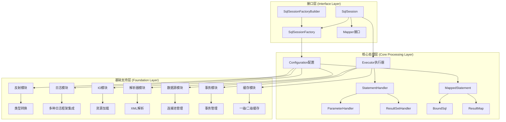
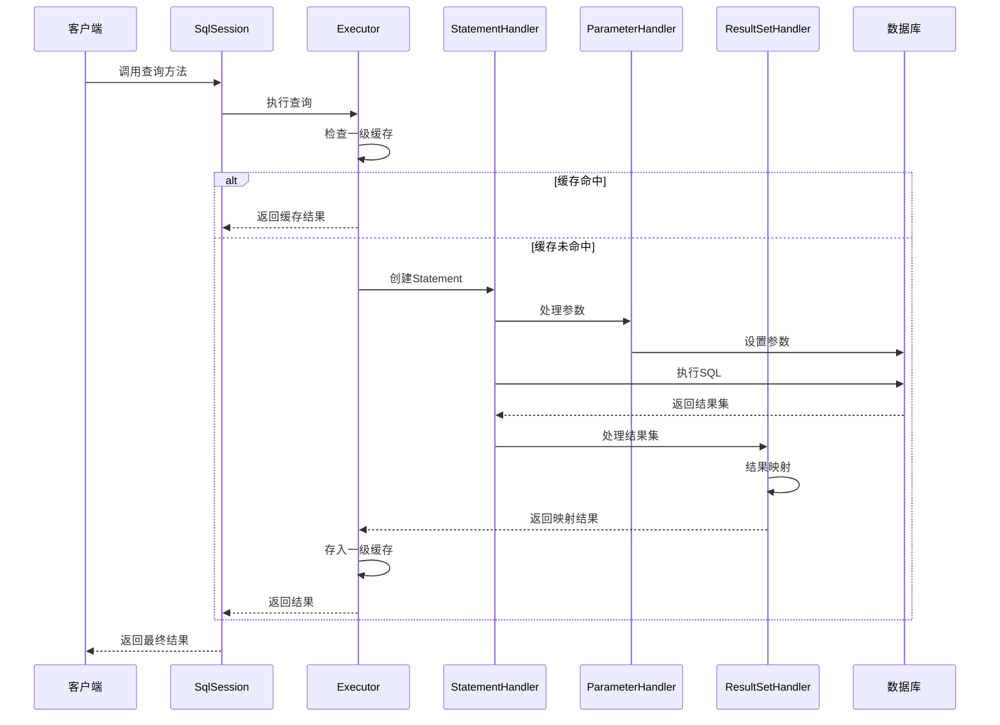
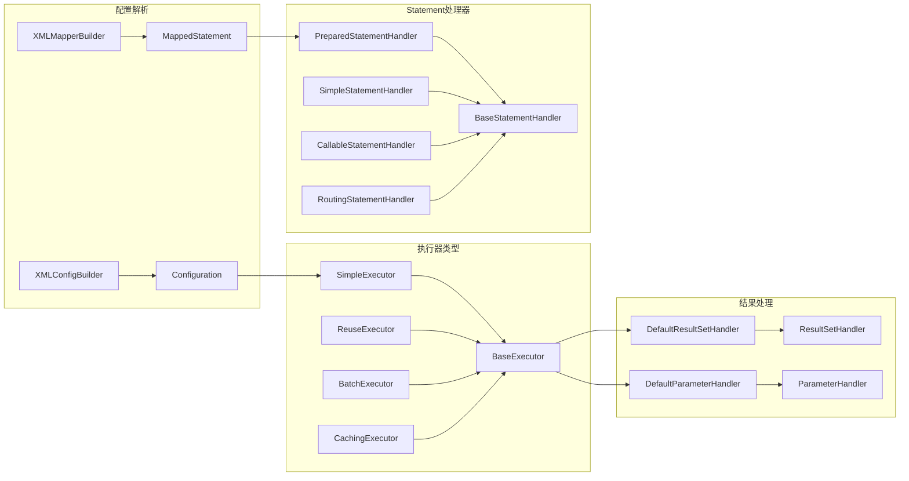
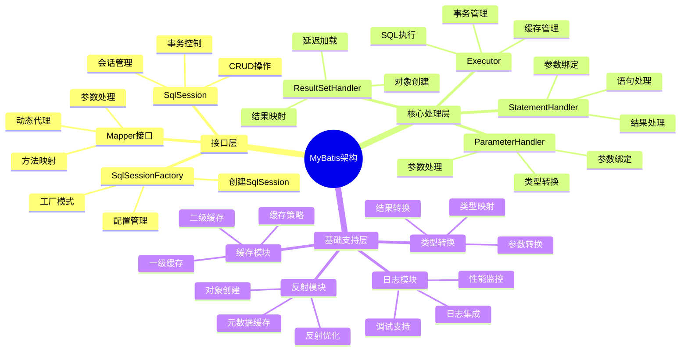
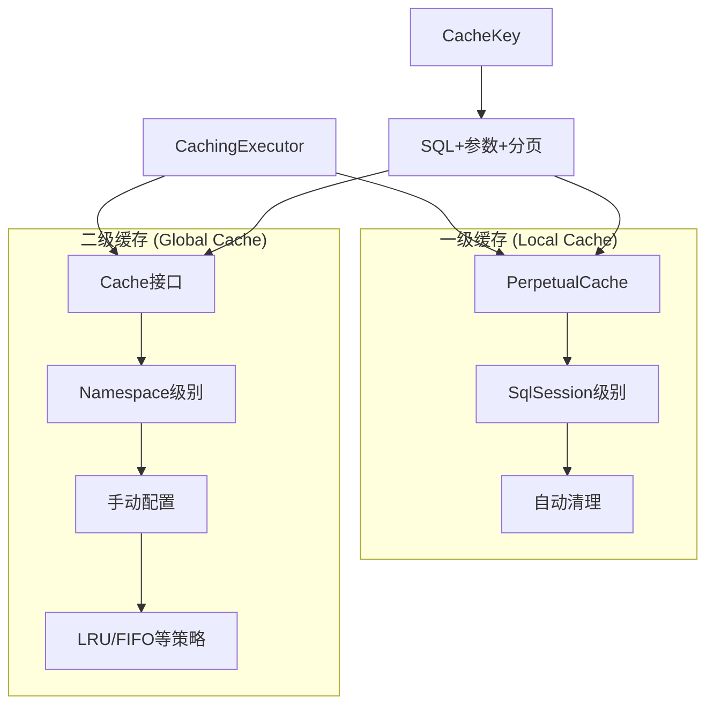
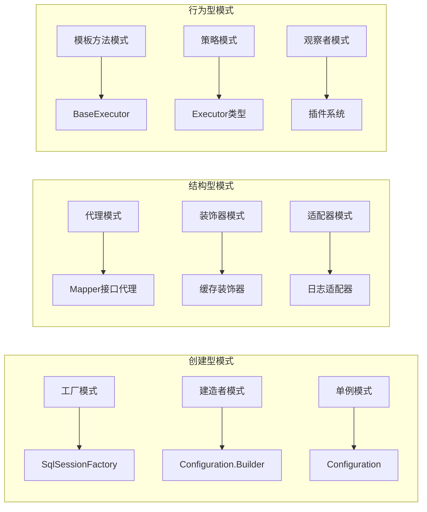
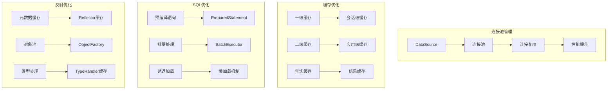

# 第1篇：MyBatis 整体架构图

## 🏗️ 三层架构图



## 🔄 SQL执行流程图



## 🧩 核心组件关系图



## 🎯 组件职责分工图



## 🔧 插件系统架构图

```mermaid
graph TD
    A[Interceptor接口] --> B[plugin方法]
    B --> C[Plugin.wrap]
    C --> D[动态代理]
    D --> E[InvocationHandler]
    E --> F[intercept方法]
    F --> G[invocation.proceed]
    G --> H[原始方法执行]
    
    I[@Intercepts注解] --> J[Signature签名]
    J --> K[指定拦截目标]
    K --> A
    
    L[InterceptorChain] --> M[pluginAll方法]
    M --> N[遍历所有拦截器]
    N --> B
```

## 💾 缓存机制架构图



## 🎨 设计模式应用图



## 📊 性能优化架构图



## 🎯 学习重点标注

### 1. 核心理解点
- **三层架构**：接口层、核心处理层、基础支持层
- **组件职责**：每个组件都有明确的职责分工
- **协作关系**：组件之间通过接口进行协作
- **生命周期**：不同组件有不同的生命周期管理

### 2. 设计模式应用
- **工厂模式**：SqlSessionFactory 创建 SqlSession
- **代理模式**：Mapper 接口动态代理
- **建造者模式**：Configuration 构建
- **装饰器模式**：缓存装饰器、日志装饰器

### 3. 性能优化点
- **连接池管理**：复用数据库连接
- **缓存机制**：多级缓存提升性能
- **预编译语句**：提升 SQL 执行效率
- **反射优化**：缓存反射元数据

## 📝 学习建议

1. **从整体到局部**：先理解整体架构，再深入具体组件
2. **理论与实践结合**：结合源码和实际使用
3. **绘制架构图**：通过绘图加深理解
4. **跟踪执行流程**：使用调试器跟踪执行流程
5. **编写示例代码**：通过编写代码验证理解

