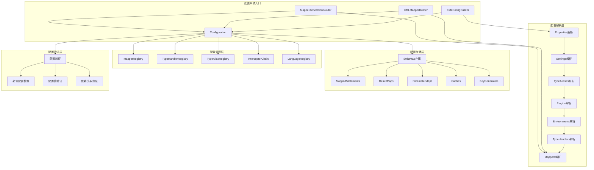
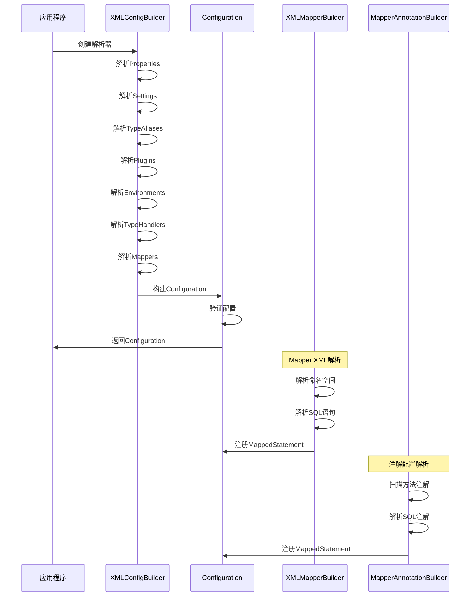
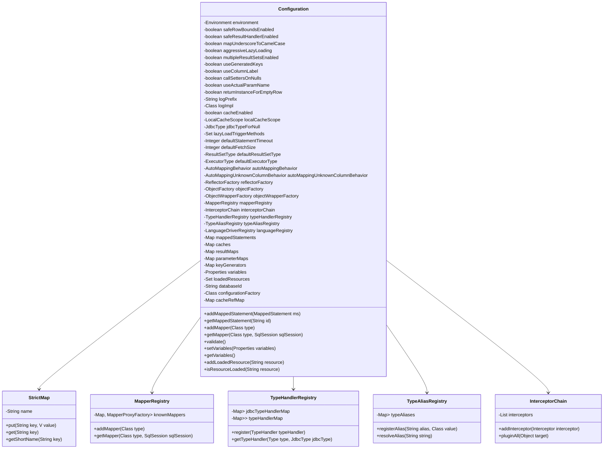
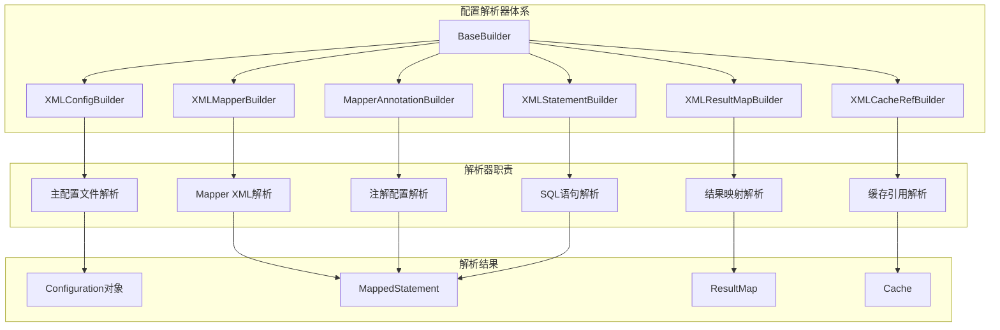
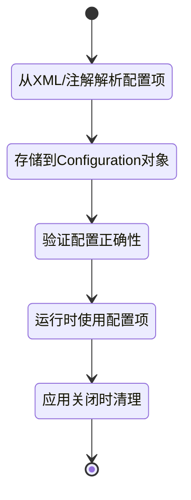
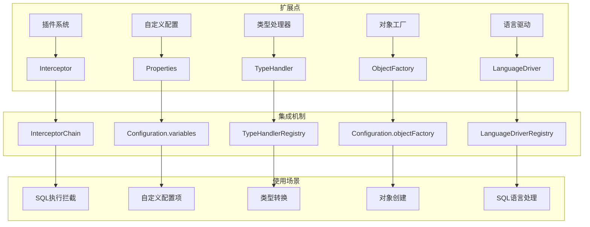
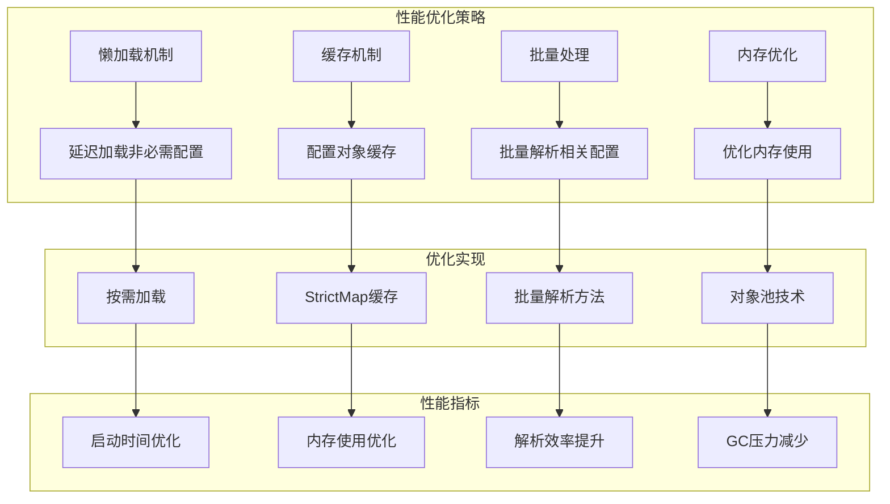

# 第2篇：MyBatis 配置系统架构图

## 🎯 架构图说明

本架构图展示了 MyBatis 配置系统的核心组件和交互关系，帮助理解配置系统的整体设计。

## 📊 配置系统整体架构

## 🔧 配置解析流程架构

## 📋 Configuration 类结构图

## 🔄 配置解析器关系图

## 🎯 配置项生命周期图

## 🔧 配置扩展机制图

## 📊 性能优化架构图

## 🎯 学习重点提示

### 1. 核心组件理解

- **Configuration 类**：配置系统的核心，统一管理所有配置项
- **XMLConfigBuilder**：主配置文件解析器
- **XMLMapperBuilder**：Mapper XML 解析器
- **MapperAnnotationBuilder**：注解配置解析器

### 2. 关键流程掌握

- **配置解析流程**：从 XML 到 Configuration 对象的完整过程
- **配置验证流程**：配置项验证和错误处理机制
- **配置使用流程**：配置项在运行时如何使用

### 3. 设计模式应用

- **Builder 模式**：用于构建复杂的配置对象
- **Factory 模式**：用于创建各种对象实例
- **Registry 模式**：用于管理各种注册表
- **Strategy 模式**：用于选择不同的处理策略

### 4. 扩展机制理解

- **插件系统**：如何通过插件扩展功能
- **自定义配置**：如何添加自定义配置项
- **类型处理**：如何自定义类型转换

---

**通过架构图理解配置系统的整体设计，为深入源码分析奠定基础！** 🚀

